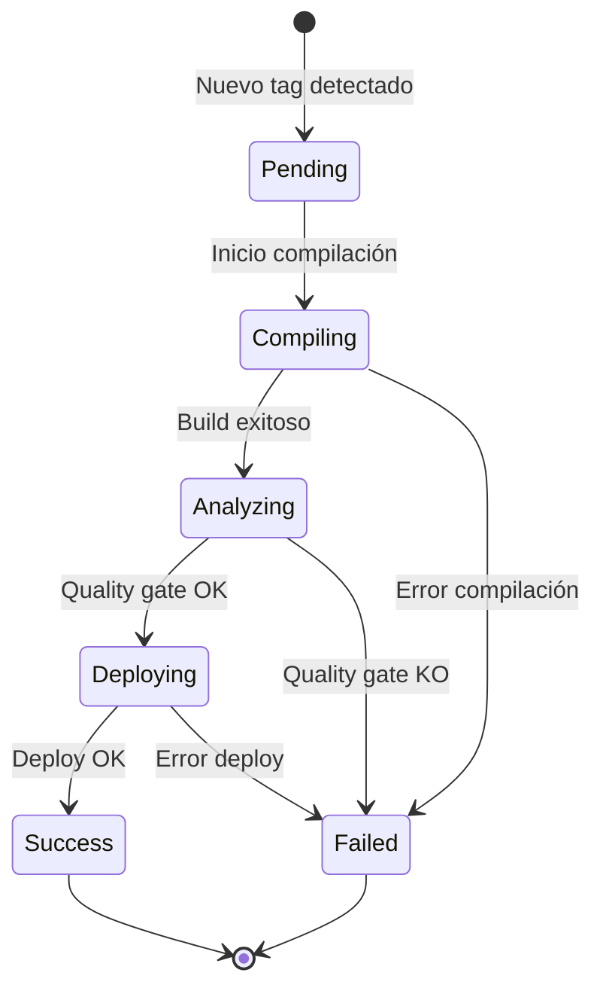

# 🎯 Visión General - GALTTCMC CI/CD

## ¿Qué es este sistema?

**GALTTCMC CI/CD** es un pipeline automatizado de integración y despliegue continuo que monitoriza repositorios Git, compila instaladores, valida calidad de código y despliega versiones en VMs de forma completamente automatizada.

## Componentes Principales

El sistema se divide en **dos grandes subsistemas**:

### 1️⃣ Pipeline de Ejecución (Core)
Sistema daemon que ejecuta el flujo CI/CD completo.

- **Tecnología**: Bash + Python 3.6
- **Deployment**: Servicio systemd `cicd`
- **Ubicación**: `/home/YOUR_USER/cicd/`
- **Documentación**: [[Arquitectura del Pipeline]]

### 2️⃣ Web UI (Monitorización)
Interfaz web para visualizar el estado del pipeline en tiempo real.

- **Tecnología**: Flask + Alpine.js + Tailwind CSS
- **Deployment**: Servicio systemd `cicd-web` en puerto 8080
- **Acceso**: http://YOUR_PIPELINE_HOST_IP:8080
- **Documentación**: [[Arquitectura Web UI]]

---

## Flujo del Pipeline


**Ver detalles**: [[Diagrama - Flujo Completo]]

---

## Ciclo de Vida de un Deployment



**Ver detalles**: [[Diagrama - Estados]]

---

## Infraestructura

| Componente | Dirección | Función | Referencia |
|------------|-----------|---------|------------|
| **Dev Machine** | YOUR_PIPELINE_HOST_IP | Host del pipeline (SUSE 15) | [[Operación - Instalación]] |
| **Git Repo** | YOUR_GIT_SERVER | Fuentes GALTTCMC | [[Referencia - APIs Externas#Git]] |
| **SonarQube** | YOUR_SONARQUBE_SERVER | Análisis de calidad | [[Referencia - APIs Externas#SonarQube]] |
| **vCenter** | (config) | Gestión VMs | [[Referencia - APIs Externas#vCenter]] |
| **Target VM** | YOUR_TARGET_VM_IP | Destino despliegue | [[Pipeline - SSH Deploy]] |
| **Web UI** | :8080 | Monitorización | [[Web - Arquitectura]] |

---

## Tecnologías Clave

### Backend Pipeline
- **Bash** con `set -euo pipefail` (POSIX compliance)
- **Python 3.6** (compatibilidad SUSE 15, sin f-strings)
- **SQLite** para auditoría
- **systemd** para daemonización

### Web UI
- **Flask 2.0.3** + **Gunicorn 20.1.0** (WSGI)
- **Alpine.js 3.x** (reactividad frontend)
- **Tailwind CSS** (estilos)
- **Chart.js** (gráficos)

### Integraciones
- **Git** REST API (basic auth)
- **SonarQube** REST API (token auth)
- **vCenter** REST API (session-based, sin pyvmomi)

**Referencia completa**: [[Referencia - Configuración]]

---

## Repositorios y Archivos Clave

```
cicd/
├── ci_cd.sh                    # 🎯 Orquestador principal
├── scripts/
│   ├── common.sh               # 📚 Librería compartida
│   ├── git_monitor.sh          # 📡 Fase 1
│   ├── compile.sh              # ⚙️ Fase 2
│   └── deploy.sh               # 🚀 Fase 5
├── python/
│   ├── sonar_check.py          # 🔍 Fase 3
│   └── vcenter_api.py          # ☁️ Fase 4
├── config/
│   ├── ci_cd_config.yaml       # ⚙️ Configuración maestra
│   └── .env                    # 🔐 Credenciales (no commitear)
├── db/
│   ├── init_db.sql             # 🗄️ Schema SQLite
│   └── pipeline.db             # 📊 Base de datos
└── web/
    ├── app.py                  # 🌐 Flask backend
    └── templates/              # 🎨 Jinja2 + Alpine.js
```

**Ver detalles**: [[Diagrama - Dependencias]]

---

## Casos de Uso Principales

### 👨‍💻 Desarrollador
1. Hace push de código a branch `YOUR_GIT_BRANCH`
2. Crea tag con formato `MAC_1_VXX_XX_XX_XX`
3. Pipeline detecta el tag automáticamente
4. Monitoriza progreso en Web UI
5. Recibe notificación de resultado

**Guía**: [[01 - Quick Start#Como Desarrollador]]

### 🔧 Operador
1. Supervisa dashboard en Web UI
2. Investiga logs de deployments fallidos
3. Ejecuta despliegues manuales con `--tag`
4. Gestiona servicios systemd

**Guía**: [[Operación - Monitorización]]

### 🏗️ Administrador
1. Configura credenciales en `.env`
2. Ajusta umbrales de calidad en YAML
3. Mantiene base de datos SQLite
4. Gestiona logs y rotación

**Guía**: [[Operación - Mantenimiento]]

---

## Siguientes Pasos

### Si eres nuevo:
1. Lee [[01 - Quick Start]] para comandos básicos
2. Revisa [[Arquitectura del Pipeline]] para entender el flujo
3. Consulta [[Operación - Instalación]] para setup

### Si eres desarrollador:
1. Estudia [[Pipeline - Common Functions]] para extender funcionalidad
2. Revisa [[Referencia - Configuración]] para opciones disponibles
3. Consulta [[Modelo de Datos]] para queries SQL

### Si eres operador:
1. Familiarízate con [[Operación - Monitorización]]
2. Ten a mano [[Operación - Troubleshooting]]
3. Revisa [[Referencia - Logs]] para debugging

---

## Enlaces Rápidos

- [[Arquitectura del Pipeline]] - Diseño del sistema de ejecución
- [[Arquitectura Web UI]] - Diseño del sistema web
- [[Diagrama - Flujo Completo]] - Pipeline visual end-to-end
- [[01 - Quick Start]] - Comandos esenciales
- [[Operación - Troubleshooting]] - Problemas comunes
