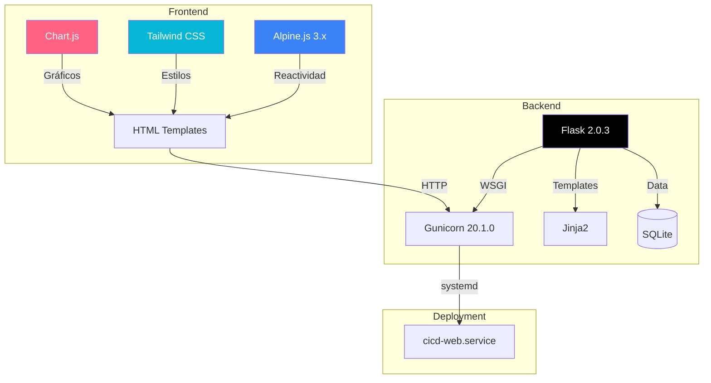
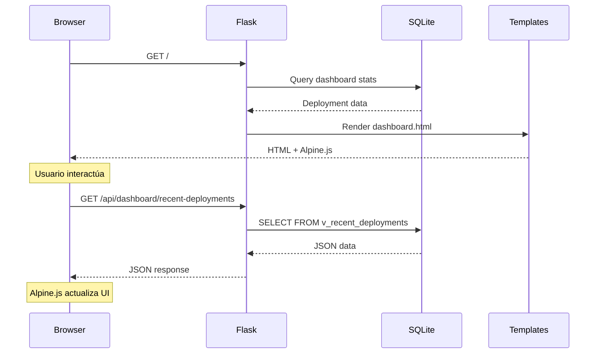
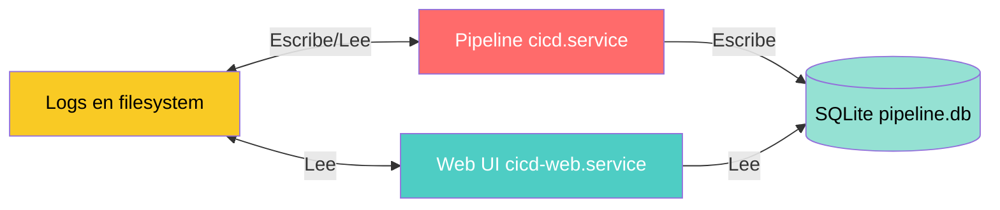

# 🌐 Arquitectura Web UI - Sistema de Monitorización

## Visión General

La **Web UI** es una aplicación Flask que consume la base de datos SQLite del pipeline y expone métricas en tiempo real a través de una interfaz web moderna.

**Separada del pipeline de ejecución**:
- Servicio systemd independiente (`cicd-web`)
- No afecta la ejecución del pipeline si se cae
- Solo lectura de la base de datos (no modifica deployments)

**Relacionado con**:
- [[Arquitectura del Pipeline]] - Sistema que genera los datos
- [[Modelo de Datos]] - Esquema de la base de datos consumida
- [[Web - API Endpoints]] - Especificación de la REST API

---

## Stack Tecnológico



**Características clave**:
- **Sin framework JS pesado**: Alpine.js para reactividad ligera
- **Utility-first CSS**: Tailwind para estilos rápidos y consistentes
- **Server-side rendering**: Jinja2 + Alpine.js (sin SPA complexity)
- **Production-ready**: Gunicorn con workers configurables

---

## Arquitectura de Componentes

### Estructura de Archivos

```
web/
├── app.py                  # 🎯 Flask app principal
├── config.py               # ⚙️ Configuración Flask
├── requirements.txt        # 📦 Dependencias Python
├── templates/              # 📄 Jinja2 templates
│   ├── base.html          # Layout base (navbar, sidebar, dark mode)
│   ├── dashboard.html     # Dashboard principal
│   ├── pipeline_runs.html # Historial de deployments
│   ├── logs.html          # Visor de logs
│   └── sonar_results.html # Resultados SonarQube
└── static/                 # 📦 Assets estáticos
    ├── css/
    │   └── style.css      # Custom CSS (scrollbar, badges, etc.)
    └── js/
        └── app.js         # Utilidades JS (toast, formatters)
```

### Flujo de Datos



---

## Backend - Flask Application

### `app.py` - Estructura Principal

**Responsabilidades**:
1. **Rutas HTML** - Renderizado de templates
2. **API REST** - Endpoints JSON para AJAX
3. **Queries SQLite** - Acceso a base de datos
4. **Formateo de datos** - Preparación para frontend

**Ejemplo de ruta HTML**:
```python
@app.route('/')
def dashboard():
    """Render main dashboard page"""
    return render_template('dashboard.html')
```

**Ejemplo de API endpoint**:
```python
@app.route('/api/dashboard/stats')
def api_dashboard_stats():
    """Get dashboard statistics (JSON)"""
    conn = get_db_connection()
    
    total = conn.execute('SELECT COUNT(*) FROM deployments').fetchone()[0]
    success = conn.execute("SELECT COUNT(*) FROM deployments WHERE status='success'").fetchone()[0]
    
    conn.close()
    
    return jsonify({
        'total_deployments': total,
        'success_rate': (success / total * 100) if total > 0 else 0,
        'last_24h': get_last_24h_count(),
        'avg_duration': get_avg_duration()
    })
```

**Ver API completa**: [[Web - API Endpoints]]

### Configuración (`config.py`)

```python
import os

class Config:
    """Flask configuration"""
    HOST = os.getenv('WEB_HOST', '0.0.0.0')
    PORT = int(os.getenv('WEB_PORT', 8080))
    DEBUG = os.getenv('WEB_DEBUG', 'false').lower() == 'true'
    
    # Paths (absolute)
    BASE_DIR = os.path.dirname(os.path.abspath(__file__))
    PROJECT_ROOT = os.path.dirname(BASE_DIR)
    DB_PATH = os.path.join(PROJECT_ROOT, 'db', 'pipeline.db')
    LOGS_DIR = os.path.join(PROJECT_ROOT, 'logs')
```

### Conexión a SQLite

**Pattern de factory con `sqlite3.Row`**:
```python
def get_db_connection():
    """Create SQLite connection with Row factory"""
    conn = sqlite3.connect(DB_PATH)
    conn.row_factory = sqlite3.Row  # Permite acceso dict-like: row['column']
    return conn
```

**Ventajas**:
- Acceso por nombre de columna: `row['tag_name']`
- Fácil conversión a dict: `dict(row)`
- Compatible con JSON serialization

---

## Frontend - Templates & Alpine.js

### Base Template (`base.html`)

**Estructura**:
```html
<!DOCTYPE html>
<html lang="es" x-data="{ darkMode: false }" :class="{ 'dark': darkMode }">
<head>
    <meta charset="UTF-8">
    <title>CI/CD Pipeline</title>
    
    <!-- Tailwind CSS via CDN -->
    <script src="https://cdn.tailwindcss.com"></script>
    
    <!-- Alpine.js -->
    <script defer src="https://cdn.jsdelivr.net/npm/alpinejs@3.x.x/dist/cdn.min.js"></script>
    
    <!-- Chart.js -->
    <script src="https://cdn.jsdelivr.net/npm/chart.js@4.x.x"></script>
    
    <!-- Custom CSS -->
    <link rel="stylesheet" href="{{ url_for('static', filename='css/style.css') }}">
</head>
<body class="bg-gray-100 dark:bg-gray-900">
    
    <!-- Navbar -->
    <nav class="bg-white dark:bg-gray-800 shadow">
        <!-- ... navbar content ... -->
    </nav>
    
    <!-- Sidebar + Main Content -->
    <div class="flex">
        <aside class="w-64 bg-white dark:bg-gray-800 min-h-screen">
            <!-- ... sidebar menu ... -->
        </aside>
        
        <main class="flex-1 p-6">
            
        </main>
    </div>
    
    <!-- Custom JS -->
    <script src="{{ url_for('static', filename='js/app.js') }}"></script>
</body>
</html>
```

**Características**:
- **Dark mode** con Alpine.js + localStorage persistence
- **Responsive** con Tailwind breakpoints
- **CDN dependencies** (no npm/webpack needed)

### Dashboard (`dashboard.html`)

**Componente Alpine.js**:
```html



<div x-data="dashboardData()" x-init="init()">
    
    <!-- Stats Cards -->
    <div class="grid grid-cols-1 md:grid-cols-4 gap-6 mb-8">
        <div class="bg-white dark:bg-gray-800 p-6 rounded-lg shadow">
            <h3 class="text-gray-500 text-sm">Total Deployments</h3>
            <p class="text-3xl font-bold" x-text="stats.total_deployments">-</p>
        </div>
        
        <div class="bg-white dark:bg-gray-800 p-6 rounded-lg shadow">
            <h3 class="text-gray-500 text-sm">Success Rate</h3>
            <p class="text-3xl font-bold" x-text="stats.success_rate + '%'">-</p>
        </div>
        
        <!-- ... más cards ... -->
    </div>
    
    <!-- Recent Deployments -->
    <div class="bg-white dark:bg-gray-800 rounded-lg shadow p-6">
        <h2 class="text-xl font-bold mb-4">Recent Deployments</h2>
        <table class="w-full">
            <thead>
                <tr>
                    <th>Tag</th>
                    <th>Status</th>
                    <th>Started At</th>
                    <th>Duration</th>
                </tr>
            </thead>
            <tbody>
                <template x-for="deployment in recentDeployments" :key="deployment.id">
                    <tr>
                        <td x-text="deployment.tag_name"></td>
                        <td>
                            <span class="badge" :class="getBadgeClass(deployment.status)" x-text="deployment.status"></span>
                        </td>
                        <td x-text="formatDate(deployment.started_at)"></td>
                        <td x-text="formatDuration(deployment.duration_seconds)"></td>
                    </tr>
                </template>
            </tbody>
        </table>
    </div>
    
    <!-- Chart -->
    <div class="mt-8">
        <canvas id="deploymentChart"></canvas>
    </div>
    
</div>

<script>
function dashboardData() {
    return {
        stats: {},
        recentDeployments: [],
        chart: null,
        
        init() {
            this.loadStats();
            this.loadRecentDeployments();
            this.loadChartData();
            
            // Auto-refresh cada 30 segundos
            setInterval(() => this.refresh(), 30000);
        },
        
        async loadStats() {
            const response = await fetch('/api/dashboard/stats');
            this.stats = await response.json();
        },
        
        async loadRecentDeployments() {
            const response = await fetch('/api/dashboard/recent-deployments');
            this.recentDeployments = await response.json();
        },
        
        async loadChartData() {
            const response = await fetch('/api/dashboard/chart-data');
            const data = await response.json();
            this.renderChart(data);
        },
        
        renderChart(data) {
            const ctx = document.getElementById('deploymentChart').getContext('2d');
            this.chart = new Chart(ctx, {
                type: 'line',
                data: {
                    labels: data.labels,
                    datasets: [{
                        label: 'Deployments',
                        data: data.values,
                        borderColor: 'rgb(75, 192, 192)',
                        tension: 0.1
                    }]
                }
            });
        },
        
        getBadgeClass(status) {
            return {
                'success': 'badge-success',
                'failed': 'badge-danger',
                'pending': 'badge-warning',
                'compiling': 'badge-info',
                'analyzing': 'badge-info',
                'deploying': 'badge-info'
            }[status] || 'badge-secondary';
        },
        
        formatDate(dateString) {
            // Implementado en static/js/app.js
            return window.formatDate(dateString);
        },
        
        formatDuration(seconds) {
            return window.formatDuration(seconds);
        },
        
        refresh() {
            this.loadStats();
            this.loadRecentDeployments();
        }
    }
}
</script>


```

**Ver componentes**: [[Web - Frontend Components]]

---

## API REST Endpoints

### Dashboard APIs

| Endpoint | Método | Descripción | Response |
|----------|--------|-------------|----------|
| `/api/dashboard/stats` | GET | Estadísticas generales | `{total_deployments, success_rate, last_24h, avg_duration}` |
| `/api/dashboard/recent-deployments` | GET | Últimos 10 deployments | Array de objetos deployment |
| `/api/dashboard/chart-data` | GET | Datos para gráfico últimos 7 días | `{labels: [], values: []}` |

### Deployments APIs

| Endpoint | Método | Descripción | Query Params |
|----------|--------|-------------|--------------|
| `/api/deployments` | GET | Lista paginada | `page`, `per_page`, `status` |
| `/api/deployment/<id>` | GET | Detalles completos | - |

**Ejemplo de response detallado**:
```json
{
  "id": 42,
  "tag_name": "MAC_1_V24_02_15_01",
  "status": "success",
  "started_at": "2026-03-20T08:30:00",
  "finished_at": "2026-03-20T09:25:00",
  "duration_seconds": 3300,
  "build_logs": [
    {
      "phase": "compilation",
      "log_content": "...",
      "duration_seconds": 2700
    }
  ],
  "sonar_results": {
    "coverage": 85.2,
    "bugs": 0,
    "vulnerabilities": 0,
    "code_smells": 5,
    "quality_gate_status": "PASSED"
  }
}
```

### Logs APIs

| Endpoint | Método | Descripción | Query Params |
|----------|--------|-------------|--------------|
| `/api/logs/list` | GET | Lista de archivos log disponibles | - |
| `/api/logs/view/<filename>` | GET | Contenido de log | `lines` (default 500), `search` (filtro) |

**Ejemplo**:
```bash
# Ver últimas 1000 líneas de log con filtro "error"
curl "http://YOUR_PIPELINE_HOST_IP:8080/api/logs/view/pipeline_20260320.log?lines=1000&search=error" | jq
```

### SonarQube APIs

| Endpoint | Método | Descripción | Response |
|----------|--------|-------------|----------|
| `/api/sonar/results` | GET | Últimos 50 análisis | Array de resultados SonarQube |
| `/api/sonar/trends` | GET | Tendencias de métricas (últimos 10 deployments exitosos) | Datos para Chart.js |

**Ver especificación completa**: [[Web - API Endpoints]]

---

## Visualización de Datos

### Chart.js - Gráficos

**Tipos de gráficos usados**:

1. **Line Chart** - Deployments over time
2. **Bar Chart** - Success/failure distribution
3. **Doughnut Chart** - Status distribution
4. **Line Chart** - SonarQube metrics trends

**Ejemplo de configuración**:
```javascript
const chartConfig = {
    type: 'line',
    data: {
        labels: ['Day 1', 'Day 2', ...],
        datasets: [{
            label: 'Coverage %',
            data: [82, 85, 83, 87, 86, 88, 85],
            borderColor: 'rgb(75, 192, 192)',
            backgroundColor: 'rgba(75, 192, 192, 0.2)',
            tension: 0.4
        }]
    },
    options: {
        responsive: true,
        plugins: {
            legend: { position: 'top' },
            title: { display: true, text: 'Code Coverage Trend' }
        },
        scales: {
            y: {
                beginAtZero: true,
                max: 100
            }
        }
    }
};
```

**Ver detalles**: [[Web - Visualización de Datos]]

### Badges de Estado

**Custom CSS para badges**:
```css
.badge {
    padding: 0.25rem 0.75rem;
    border-radius: 9999px;
    font-size: 0.75rem;
    font-weight: 600;
}

.badge-success { background-color: #10B981; color: white; }
.badge-danger { background-color: #EF4444; color: white; }
.badge-warning { background-color: #F59E0B; color: white; }
.badge-info { background-color: #3B82F6; color: white; }
.badge-secondary { background-color: #6B7280; color: white; }
```

### Dark Mode

**Implementación con Alpine.js + Tailwind**:
```html
<!-- Toggle button -->
<button @click="darkMode = !darkMode; saveDarkMode()">
    <span x-show="!darkMode">🌙</span>
    <span x-show="darkMode">☀️</span>
</button>

<script>
function saveDarkMode() {
    localStorage.setItem('darkMode', this.darkMode);
}

// On init
this.darkMode = localStorage.getItem('darkMode') === 'true';
</script>
```

**Clases Tailwind**:
- Light mode: `bg-gray-100`, `text-gray-900`
- Dark mode: `dark:bg-gray-900`, `dark:text-gray-100`

---

## Deployment - systemd Service

### Servicio: `cicd-web.service`

**Ubicación**: `/etc/systemd/system/cicd-web.service`

```ini
[Unit]
Description=GALTTCMC CI/CD Web UI
After=network.target

[Service]
Type=notify
User=agent
Group=agent
WorkingDirectory=/home/YOUR_USER/cicd/web
Environment="PATH=/usr/local/bin:/usr/bin:/bin"
Environment="WEB_PORT=8080"
Environment="WEB_HOST=0.0.0.0"

ExecStart=/usr/bin/gunicorn \
    --bind 0.0.0.0:8080 \
    --workers 4 \
    --timeout 120 \
    --access-logfile /home/YOUR_USER/cicd/logs/web_access.log \
    --error-logfile /home/YOUR_USER/cicd/logs/web_error.log \
    app:app

Restart=on-failure
RestartSec=10

# Security
NoNewPrivileges=true
PrivateTmp=true
ProtectSystem=strict
ProtectHome=true
ReadWritePaths=/home/YOUR_USER/cicd/logs

[Install]
WantedBy=multi-user.target
```

**Características**:
- **Gunicorn**: WSGI production server
- **4 workers**: Maneja ~40-80 peticiones concurrentes
- **Security hardening**: Restricciones systemd
- **Logs separados**: access + error logs

### Instalación

```bash
# Script de instalación
sudo /home/YOUR_USER/cicd/install_web.sh install

# El script hace:
# 1. Instalar dependencias Python (requirements.txt)
# 2. Copiar cicd-web.service a /etc/systemd/system/
# 3. Abrir puerto 8080 en firewall
# 4. systemctl daemon-reload
# 5. systemctl enable --now cicd-web
```

**Ver instalación completa**: [[Operación - Instalación#Web UI]]

---

## Interacción con el Pipeline

### Modelo de Comunicación



**Importante**:
- **Web UI es SOLO LECTURA** de la base de datos
- **No modifica deployments** ni ejecuta pipelines
- **Desacoplamiento total**: Si Web UI cae, pipeline sigue funcionando
- **Comunicación unidireccional**: Pipeline → DB → Web UI

### Actualización en Tiempo Real

**Polling desde frontend**:
```javascript
// Auto-refresh cada 30 segundos
setInterval(() => {
    fetch('/api/dashboard/stats').then(r => r.json()).then(data => {
        this.stats = data;
    });
}, 30000);
```

**Alternativa futura** (no implementada):
- WebSockets para push notifications
- Server-Sent Events (SSE)

---

## Seguridad

### Consideraciones

**✅ Implementado**:
- systemd security hardening (`NoNewPrivileges`, `ProtectSystem`)
- Solo lectura de base de datos (no `INSERT`/`UPDATE`)
- Bind a `0.0.0.0` (accesible solo en red local)
- Logs separados de ejecución

**⚠️ No implementado** (asumido red confiable):
- Autenticación de usuarios
- HTTPS (tráfico en texto plano)
- CSRF protection
- Rate limiting

**Recomendación**:
- Usar detrás de reverse proxy con autenticación (nginx + basic auth)
- Configurar HTTPS si se expone fuera de red local

---

## Performance

### Optimizaciones

**Backend**:
- SQLite con `journal_mode=WAL` para lecturas concurrentes
- Queries con índices (ver [[Modelo de Datos#Índices]])
- Views pre-calculadas (`v_recent_deployments`, `v_deployment_stats`)
- Paginación en API endpoints

**Frontend**:
- CDN para librerías (Tailwind, Alpine.js, Chart.js)
- Lazy loading de gráficos (solo al scroll)
- Debounce en búsqueda de logs (300ms)
- Cache de datos en Alpine.js (evita re-fetch)

### Métricas de Performance

**Target**:
- Primera carga: <2 segundos
- API response time: <200ms (promedio)
- Auto-refresh overhead: <50ms

**Monitoring**:
```bash
# Ver logs de acceso con tiempos
tail -f logs/web_access.log

# Formato: IP - - [timestamp] "GET /api/..." status size "duration"
# Ejemplo: 10.0.0.1 - - [20/Mar/2026:10:05:33] "GET /api/dashboard/stats" 200 345 "0.045"
```

---

## Extensión de la Web UI

### Añadir Nueva Página

**1. Crear template**:
```html
<!-- templates/new_page.html -->

New Feature


<div x-data="newPageData()" x-init="init()">
    <!-- Tu contenido aquí -->
</div>

<script>
function newPageData() {
    return {
        init() {
            this.loadData();
        },
        async loadData() {
            // Fetch de API
        }
    }
}
</script>


```

**2. Añadir ruta en `app.py`**:
```python
@app.route('/new-page')
def new_page():
    return render_template('new_page.html')
```

**3. Añadir API endpoint**:
```python
@app.route('/api/new-page/data')
def api_new_page_data():
    conn = get_db_connection()
    data = conn.execute('SELECT ...').fetchall()
    conn.close()
    return jsonify([dict(row) for row in data])
```

**4. Añadir al sidebar en `base.html`**:
```html
<a href="/new-page" class="sidebar-link">
    <span>🆕</span> New Feature
</a>
```

### Añadir Nuevo API Endpoint

**Template**:
```python
@app.route('/api/custom/endpoint')
def api_custom_endpoint():
    try:
        # Query params
        param = request.args.get('param', 'default')
        
        # Database query
        conn = get_db_connection()
        result = conn.execute('SELECT ... WHERE ...', [param]).fetchall()
        conn.close()
        
        # Format response
        return jsonify({
            'status': 'success',
            'data': [dict(row) for row in result]
        })
    except Exception as e:
        return jsonify({
            'status': 'error',
            'message': str(e)
        }), 500
```

---

## Testing

### Desarrollo Local

**Ejecutar sin Gunicorn**:
```bash
cd /home/YOUR_USER/cicd/web
export WEB_DEBUG=true
python3.6 app.py

# Flask dev server inicia en http://0.0.0.0:8080
# Con auto-reload en cambios de código
```

### Test de API Endpoints

```bash
# Test todas las APIs
curl http://localhost:8080/api/dashboard/stats | jq
curl http://localhost:8080/api/dashboard/recent-deployments | jq
curl http://localhost:8080/api/deployments?page=1 | jq
curl http://localhost:8080/api/logs/list | jq
curl http://localhost:8080/api/sonar/results | jq
```

### Verificar Logs

```bash
# Access log (muestra todas las requests)
tail -f logs/web_access.log

# Error log (solo errores de aplicación)
tail -f logs/web_error.log

# Systemd journal (errores de Gunicorn)
sudo journalctl -u cicd-web -f
```

---

## Troubleshooting

### Web UI no responde

```bash
# 1. Verificar servicio
sudo systemctl status cicd-web

# 2. Ver logs de error
sudo journalctl -u cicd-web -n 50

# 3. Verificar puerto
sudo lsof -i :8080

# 4. Reiniciar servicio
sudo systemctl restart cicd-web
```

### Datos no se actualizan

```bash
# 1. Verificar base de datos
ls -lh /home/YOUR_USER/cicd/db/pipeline.db

# 2. Test query directa
sqlite3 /home/YOUR_USER/cicd/db/pipeline.db "SELECT COUNT(*) FROM deployments"

# 3. Verificar permisos
ls -la /home/YOUR_USER/cicd/db/

# Debe ser: drwxr-xr-x agent agent
```

### Charts no renderizan

- Verificar CDN de Chart.js (firewall puede bloquear)
- Inspeccionar consola del navegador (F12)
- Validar formato JSON de `/api/dashboard/chart-data`

**Ver troubleshooting completo**: [[Operación - Troubleshooting#Web UI]]

---

## Enlaces Relacionados

### Documentación Web UI
- [[Web - API Endpoints]] - Especificación completa de APIs
- [[Web - Frontend Components]] - Componentes Alpine.js
- [[Web - Visualización de Datos]] - Gráficos y charts

### Relacionado con Pipeline
- [[Arquitectura del Pipeline]] - Sistema que genera los datos
- [[Modelo de Datos]] - Esquema de base de datos
- [[Referencia - Logs]] - Sistema de logging

### Operación
- [[Operación - Instalación#Web UI]] - Setup inicial
- [[Operación - Monitorización#Web UI]] - Supervisión
- [[Operación - Troubleshooting#Web UI]] - Problemas comunes

### Diagramas
- [[Diagrama - Flujo Completo]] - Pipeline + Web UI
- [[Diagrama - Dependencias]] - Relaciones entre módulos
