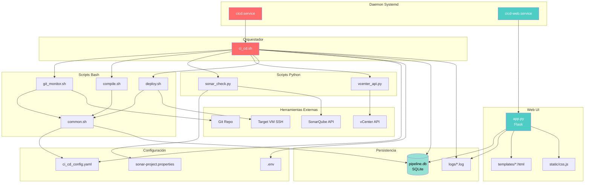
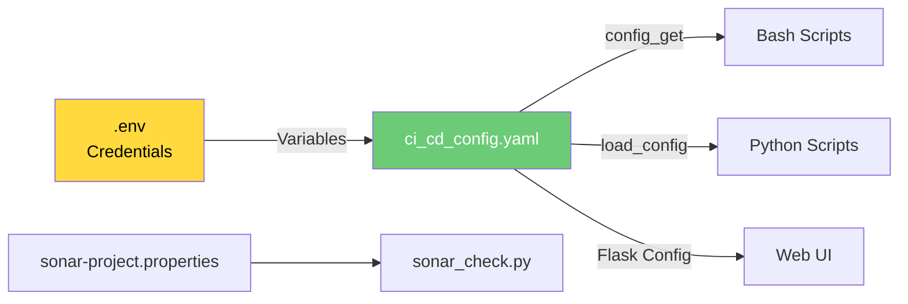
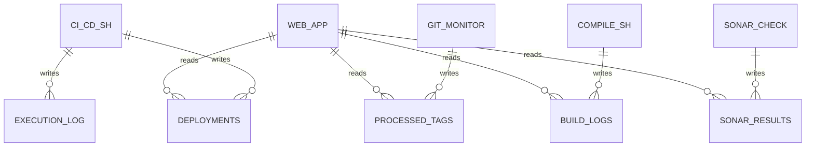
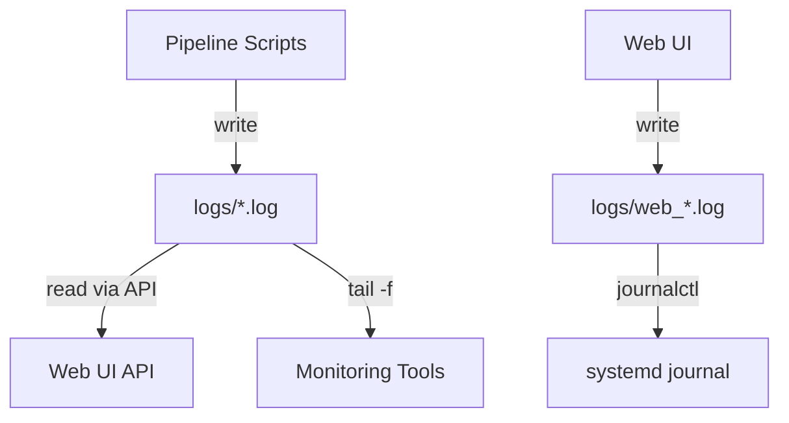
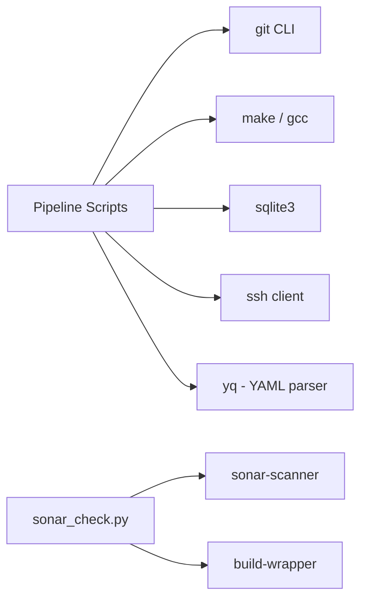
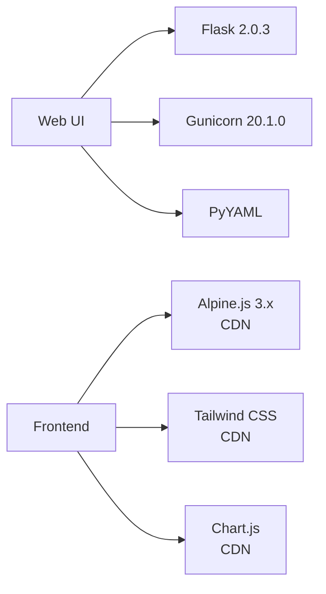
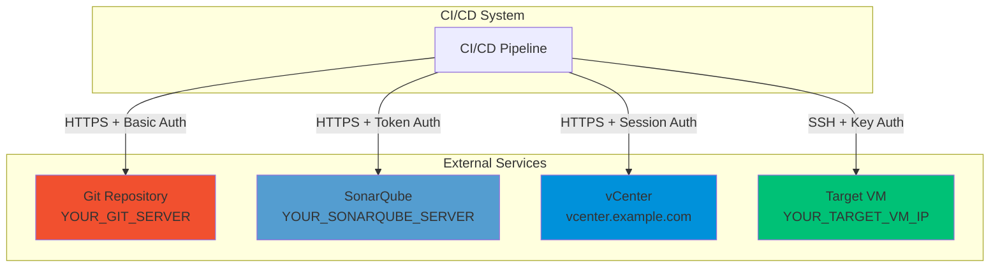
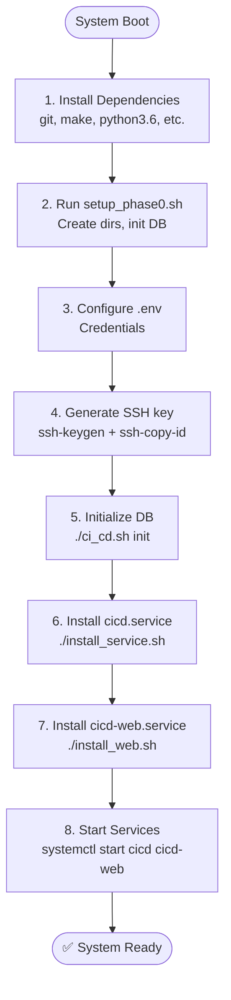
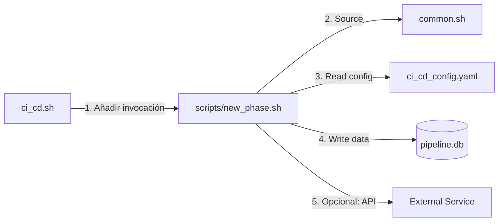

# 🔗 Diagrama - Dependencias

## Visión General

Mapa completo de módulos, scripts, archivos de configuración y sus relaciones en el sistema CI/CD.

**Relacionado con**:
- [[Arquitectura del Pipeline]] - Sistema de ejecución
- [[Arquitectura Web UI]] - Sistema web
- [[Diagrama - Flujo Completo]] - Flujo del pipeline

---

## Módulos del Sistema



---

## Dependencias por Módulo

### `ci_cd.sh` (Orquestador)

**Depende de**:
- `scripts/common.sh` (functions)
- `config/ci_cd_config.yaml` (config)
- `config/.env` (credentials)
- `db/pipeline.db` (state)
- `logs/*.log` (logging)

**Invoca**:
- `scripts/git_monitor.sh`
- `scripts/compile.sh`
- `python/sonar_check.py`
- `python/vcenter_api.py`
- `scripts/deploy.sh`

**Ver**: [[Arquitectura del Pipeline#Orquestador Principal]]

---

### `scripts/git_monitor.sh`

**Depende de**:
- `scripts/common.sh`
- Git CLI tool
- `config/ci_cd_config.yaml` (git.url, git.tag_pattern)
- `db/pipeline.db` (processed_tags table)

**APIs externas**:
- `git ls-remote` → Git repository

**Ver**: [[Pipeline - Git Monitor]]

---

### `scripts/compile.sh`

**Depende de**:
- `scripts/common.sh`
- Make, gcc/g++ (build tools)
- `config/ci_cd_config.yaml` (compilation.compile_dir, timeout)
- `db/pipeline.db` (build_logs table)

**Invoca**:
- `build_DVDs.sh` (del código fuente)

**Ver**: [[Pipeline - Compilación]]

---

### `python/sonar_check.py`

**Depende de**:
- Python 3.6+
- Libraries: `requests`, `PyYAML`, `urllib3`
- `config/ci_cd_config.yaml` (sonarqube.*)
- `config/sonar-project.properties`
- `utils/sonar-scanner/`
- `utils/build-wrapper/`
- `db/pipeline.db` (sonar_results table)

**APIs externas**:
- SonarQube REST API (https://YOUR_SONARQUBE_SERVER)

**Ver**: [[Pipeline - SonarQube]]

---

### `python/vcenter_api.py`

**Depende de**:
- Python 3.6+
- Libraries: `requests`, `PyYAML`, `urllib3`
- `config/ci_cd_config.yaml` (vcenter.*)
- `config/.env` (VCENTER_USER, VCENTER_PASSWORD)

**APIs externas**:
- vCenter REST API

**Ver**: [[Pipeline - vCenter]]

---

### `scripts/deploy.sh`

**Depende de**:
- `scripts/common.sh`
- SSH client + key authentication
- `config/ci_cd_config.yaml` (target_vm.*)
- `~/.ssh/id_rsa` (SSH key)

**APIs externas**:
- SSH a YOUR_TARGET_VM_IP (target VM)

**Ver**: [[Pipeline - SSH Deploy]]

---

### `web/app.py` (Flask Web UI)

**Depende de**:
- Python 3.6+
- Libraries: `Flask`, `Gunicorn`, `PyYAML`
- `web/config.py` (Flask config)
- `db/pipeline.db` (read-only queries)
- `logs/*.log` (read-only)
- `web/templates/*.html`
- `web/static/css/*.css`
- `web/static/js/*.js`

**No invoca nada del pipeline** (solo lectura)

**Ver**: [[Arquitectura Web UI]]

---

## Dependencias de Configuración



**Flujo**:
1. `.env` define credenciales (GIT_PASSWORD, SONAR_TOKEN, etc.)
2. `ci_cd_config.yaml` referencia con `${VAR_NAME}`
3. Scripts usan `config_get` (bash) o `load_config()` (Python) para expandir

**Ver**: [[Referencia - Configuración]]

---

## Dependencias de Base de Datos



**Escritura** (Pipeline):
- `ci_cd.sh` → `deployments`, `execution_log`
- `git_monitor.sh` → `processed_tags`
- `compile.sh` → `build_logs`
- `sonar_check.py` → `sonar_results`

**Lectura** (Web UI):
- `app.py` → Todas las tablas (read-only)

**Ver**: [[Modelo de Datos]]

---

## Dependencias de Logs



**Archivos de log**:
- `logs/pipeline_YYYYMMDD.log` - Pipeline general
- `logs/compile_YYYYMMDD_HHMMSS.log` - Compilación
- `logs/deploy_YYYYMMDD_HHMMSS.log` - Deployment
- `logs/web_access.log` - Web UI access
- `logs/web_error.log` - Web UI errors

**Ver**: [[Referencia - Logs]]

---

## Dependencias de Herramientas

### Pipeline



**Herramientas bundled**:
- `utils/sonar-scanner/` - SonarQube scanner CLI
- `utils/build-wrapper/` - Build wrapper para C/C++

**Herramientas del sistema** (deben instalarse):
- `git`
- `make`, `gcc`, `g++`
- `sqlite3`
- `ssh`
- `yq` (YAML query tool)
- `python3.6+`

---

### Web UI



**Python packages** (en `web/requirements.txt`):
- Flask==2.0.3
- Gunicorn==20.1.0
- PyYAML==6.0.1

**Frontend libraries** (CDN):
- Alpine.js 3.x
- Tailwind CSS
- Chart.js 4.x

---

## Dependencias de Servicios Externos



**Autenticación**:
- **Git**: Basic auth con usuario/password (HTTPS)
- **SonarQube**: Token auth (token como username, password vacío)
- **vCenter**: Session-based (POST /session, luego header `vmware-api-session-id`)
- **Target VM**: SSH key-based (sin password)

**Ver**: [[Referencia - APIs Externas]]

---

## Orden de Inicialización



**Ver guía completa**: [[Operación - Instalación]]

---

## Comunicación entre Módulos

### Pipeline → Base de Datos

```bash
# common.sh provee:
db_query "INSERT INTO deployments ..."

# Usado por:
- ci_cd.sh (deployments, execution_log)
- git_monitor.sh (processed_tags)
- compile.sh (build_logs)
- sonar_check.py (sonar_results)
```

### Pipeline → Configuración

```bash
# common.sh provee:
value=$(config_get "path.to.key")

# Usado por todos los scripts para leer config
```

### Web UI → Base de Datos

```python
# app.py usa sqlite3 directamente:
conn = sqlite3.connect(DB_PATH)
conn.row_factory = sqlite3.Row
result = conn.execute("SELECT ...").fetchall()
```

### Pipeline → Logs

```bash
# common.sh provee:
log_info "message" >&2

# Todos los logs van a stderr, redirigidos a archivos por systemd
```

---

## Puntos de Extensión

### Añadir Nueva Fase al Pipeline



**Pasos**:
1. Crear `scripts/new_phase.sh`
2. Source `common.sh`
3. Integrar en `ci_cd.sh` (función `run_pipeline()`)
4. Añadir config en YAML si necesario
5. Crear tabla en DB si necesario

### Añadir Nuevo Endpoint Web UI

```mermaid
graph LR
    ROUTE[app.py<br/>@app.route] -->|Query| DB[(pipeline.db)]
    ROUTE -->|Render| TEMPLATE[templates/new_page.html]
    TEMPLATE -->|Use| ALPINE[Alpine.js components]
    TEMPLATE -->|Fetch| API[/api/new-endpoint]
```

**Ver**: [[Arquitectura Web UI#Extensión de la Web UI]]

---

## Enlaces Relacionados

- [[Arquitectura del Pipeline]] - Sistema de ejecución
- [[Arquitectura Web UI]] - Sistema web
- [[Diagrama - Flujo Completo]] - Flujo del pipeline
- [[Diagrama - Estados]] - Estados de deployments
- [[Modelo de Datos]] - Esquema de base de datos
- [[Referencia - Configuración]] - Configuración YAML y .env
