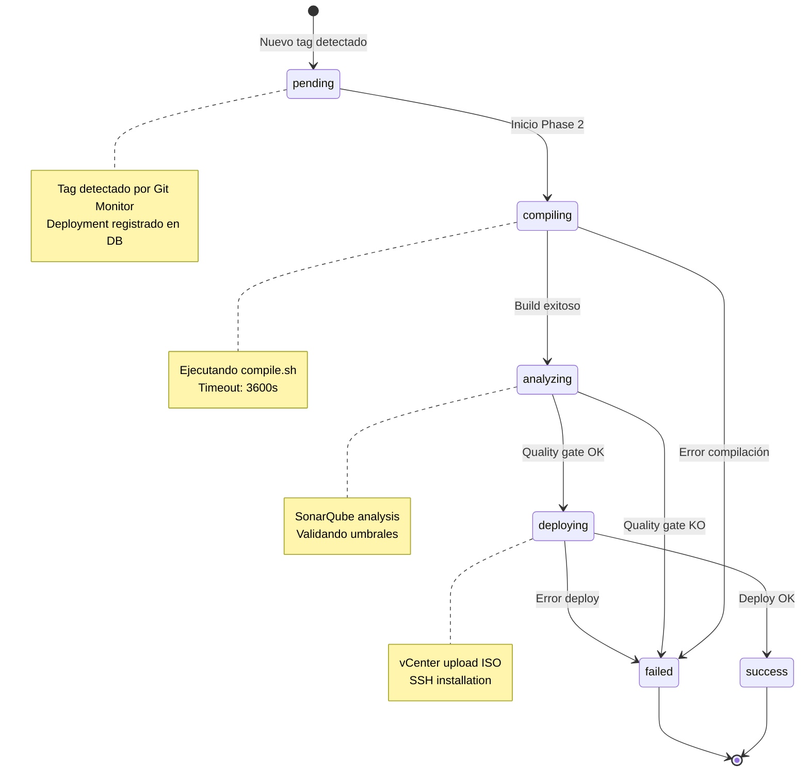

# 🔄 Diagrama - Estados del Pipeline

## Visión General

Este diagrama muestra todos los estados posibles de un deployment en el pipeline CI/CD y las transiciones entre ellos.

**Relacionado con**:
- [[Arquitectura del Pipeline#Gestión de Errores]]
- [[Modelo de Datos#deployments]] - Campo `status`
- [[Diagrama - Flujo Completo]] - Flujo temporal del pipeline

---

## Estado del Deployment

### Diagrama de Estados



---

## Estados Detallados

### 1. **pending** (Pendiente)

**Descripción**: Tag detectado, esperando inicio de compilación.

**Duración típica**: < 1 minuto

**Transiciones**:
- ✅ → `compiling` (normal)
- ❌ → `failed` (error crítico antes de iniciar)

**Registro en DB**:
```sql
INSERT INTO deployments (tag_name, status, started_at)
VALUES ('MAC_1_V24_02_15_01', 'pending', CURRENT_TIMESTAMP);
```

---

### 2. **compiling** (Compilando)

**Descripción**: Fase 2 en ejecución, compilando fuentes.

**Duración típica**: 40-50 minutos

**Ver detalles**: [[Pipeline - Compilación#Gestión de Errores]]

---

### 3. **analyzing** (Analizando)

**Descripción**: Fase 3 en ejecución, análisis SonarQube.

**Duración típica**: 10-15 minutos

**Ver umbrales**: [[Pipeline - SonarQube#Quality Gates]]

---

### 4. **deploying** (Desplegando)

**Descripción**: Fases 4 y 5, upload vCenter + SSH deploy.

**Duración típica**: 5-10 minutos

---

### 5. **success** (Exitoso)

**Descripción**: Pipeline completado exitosamente.

**Estado final**: ✅ Terminal

---

### 6. **failed** (Fallido)

**Descripción**: Pipeline falló en alguna fase.

**Estado final**: ❌ Terminal

**Ver troubleshooting**: [[Operación - Troubleshooting]]

---

## Enlaces Relacionados

- [[Diagrama - Flujo Completo]]
- [[Arquitectura del Pipeline]]
- [[Modelo de Datos#deployments]]
