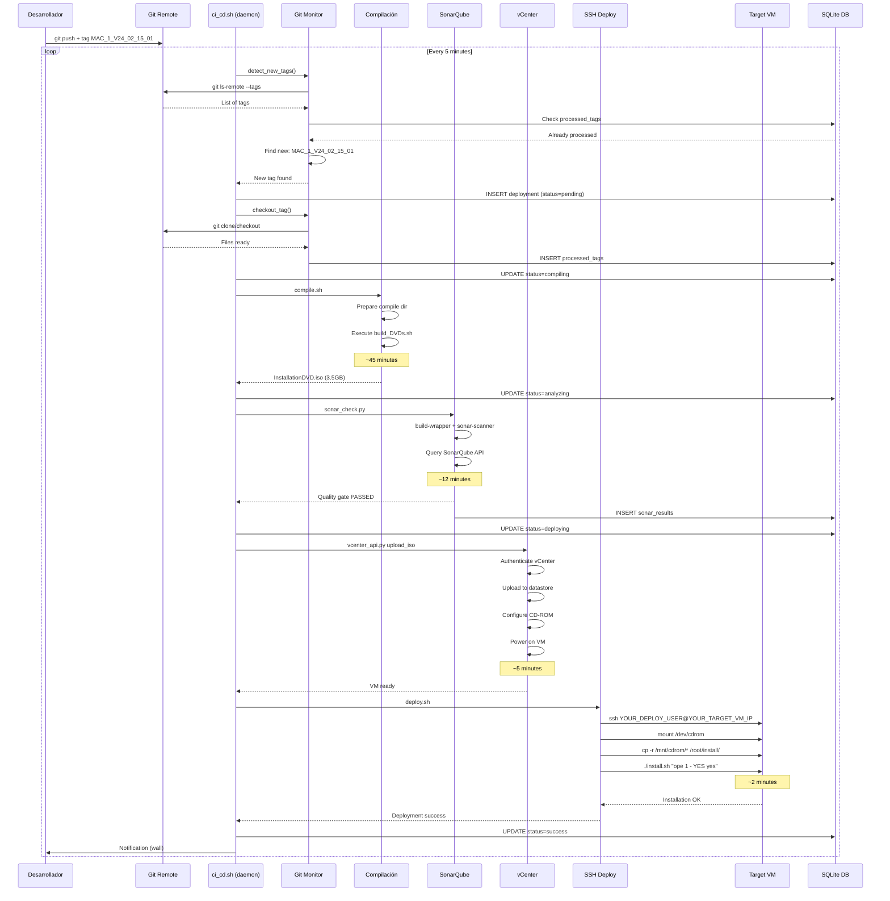

# 🌊 Diagrama - Flujo Completo del Pipeline

## Visión General

Visualización end-to-end del pipeline CI/CD desde detección de tag hasta despliegue final.

**Relacionado con**:
- [[Arquitectura del Pipeline]] - Documentación detallada
- [[Diagrama - Estados]] - Estados del deployment
- [[Diagrama - Dependencias]] - Módulos y dependencias

---

## Flujo Secuencial Completo

---

## Fases del Pipeline

### Phase 1: Git Monitor
- **Duración**: ~30 segundos
- **Script**: `git_monitor.sh`
- **Output**: Tag checked out en `/home/YOUR_USER/compile`

### Phase 2: Compilación
- **Duración**: ~45 minutos
- **Script**: `compile.sh`
- **Output**: `InstallationDVD.iso` (3-4 GB)

### Phase 3: SonarQube
- **Duración**: ~12 minutos
- **Script**: `sonar_check.py`
- **Output**: Quality metrics en DB

### Phase 4: vCenter
- **Duración**: ~5 minutos
- **Script**: `vcenter_api.py`
- **Output**: ISO en datastore, VM encendida

### Phase 5: SSH Deploy
- **Duración**: ~3 minutos
- **Script**: `deploy.sh`
- **Output**: Software instalado en VM

**Duración Total**: ~65 minutos end-to-end

---

## Enlaces Relacionados

- [[Arquitectura del Pipeline]]
- [[Diagrama - Estados]]
- [[01 - Quick Start]]
