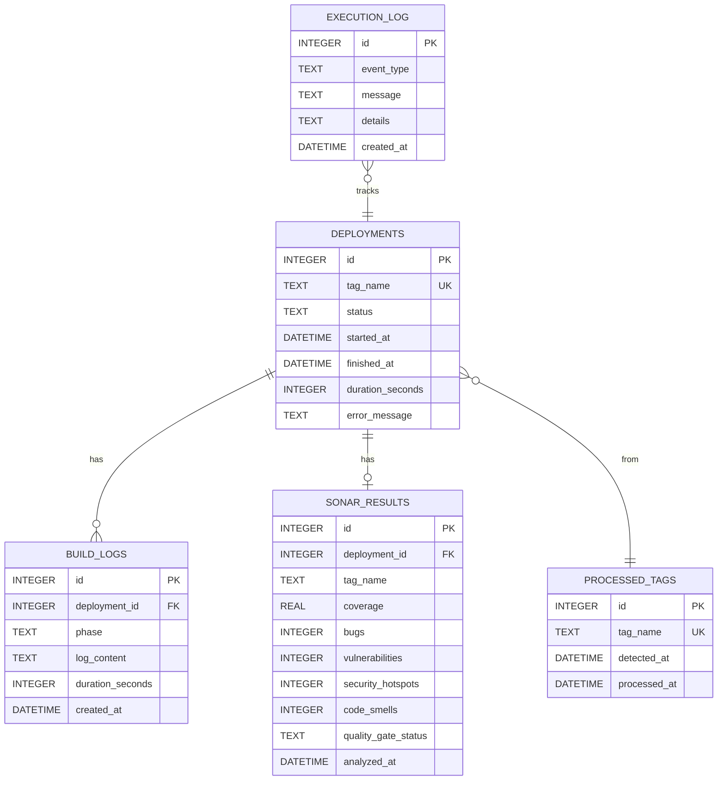

# 📊 Modelo de Datos - Esquema SQLite

## Visión General

Base de datos SQLite que persiste todo el estado del pipeline CI/CD: deployments, logs de compilación, resultados de SonarQube y auditoría de ejecución.

**Ubicación**: `/home/YOUR_USER/cicd/db/pipeline.db`

**Relacionado con**:
- [[Arquitectura del Pipeline]] - Sistema que escribe datos
- [[Arquitectura Web UI]] - Sistema que lee datos
- [[Referencia - Base de Datos]] - Queries útiles

---

## Diagrama ER



---

## Tablas

### 1. `deployments` - Tracking de Pipeline Runs

**Propósito**: Registro central de cada ejecución del pipeline.

**Schema**:
```sql
CREATE TABLE IF NOT EXISTS deployments (
    id INTEGER PRIMARY KEY AUTOINCREMENT,
    tag_name TEXT NOT NULL UNIQUE,
    status TEXT NOT NULL DEFAULT 'pending',
    started_at DATETIME DEFAULT CURRENT_TIMESTAMP,
    finished_at DATETIME,
    duration_seconds INTEGER,
    error_message TEXT,
    
    CHECK (status IN ('pending', 'compiling', 'analyzing', 'deploying', 'success', 'failed'))
);

CREATE INDEX idx_deployments_status ON deployments(status);
CREATE INDEX idx_deployments_started_at ON deployments(started_at DESC);
```

**Campos**:
- `id`: PK autoincremental
- `tag_name`: Tag Git procesado (ej: `MAC_1_V24_02_15_01`) - **UNIQUE**
- `status`: Estado actual del pipeline
- `started_at`: Timestamp de inicio
- `finished_at`: Timestamp de finalización (NULL si en progreso)
- `duration_seconds`: Duración total (calculado: finished_at - started_at)
- `error_message`: Mensaje de error si status='failed'

**Estados del Pipeline**:
```
pending → compiling → analyzing → deploying → success/failed
                  ↓         ↓          ↓
                failed    failed     failed
```

**Ver diagrama**: [[Diagrama - Estados]]

**Queries comunes**:
```sql
-- Deployments recientes
SELECT * FROM deployments ORDER BY started_at DESC LIMIT 10;

-- Solo exitosos
SELECT * FROM deployments WHERE status = 'success' ORDER BY started_at DESC;

-- Success rate
SELECT 
    ROUND(CAST(SUM(CASE WHEN status='success' THEN 1 ELSE 0 END) AS FLOAT) / COUNT(*) * 100, 2) AS success_rate
FROM deployments;

-- Duración promedio de deployments exitosos
SELECT AVG(duration_seconds) / 60.0 AS avg_minutes
FROM deployments
WHERE status = 'success' AND duration_seconds IS NOT NULL;
```

---

### 2. `build_logs` - Logs de Compilación

**Propósito**: Almacenar logs detallados de cada fase de compilación.

**Schema**:
```sql
CREATE TABLE IF NOT EXISTS build_logs (
    id INTEGER PRIMARY KEY AUTOINCREMENT,
    deployment_id INTEGER NOT NULL,
    phase TEXT NOT NULL,
    log_content TEXT,
    duration_seconds INTEGER,
    created_at DATETIME DEFAULT CURRENT_TIMESTAMP,
    
    FOREIGN KEY (deployment_id) REFERENCES deployments(id) ON DELETE CASCADE
);

CREATE INDEX idx_build_logs_deployment ON build_logs(deployment_id);
```

**Campos**:
- `deployment_id`: FK a `deployments.id`
- `phase`: Fase de compilación (ej: "preparation", "build_dvd", "validation")
- `log_content`: Stdout/stderr de la fase
- `duration_seconds`: Tiempo de ejecución de la fase
- `created_at`: Timestamp de creación del log

**Ejemplo de uso**:
```sql
-- Logs de un deployment específico
SELECT phase, duration_seconds, created_at
FROM build_logs
WHERE deployment_id = 42
ORDER BY created_at;

-- Fase más lenta en promedio
SELECT phase, AVG(duration_seconds) AS avg_seconds
FROM build_logs
GROUP BY phase
ORDER BY avg_seconds DESC;
```

---

### 3. `sonar_results` - Resultados de SonarQube

**Propósito**: Cache de análisis de calidad de código.

**Schema**:
```sql
CREATE TABLE IF NOT EXISTS sonar_results (
    id INTEGER PRIMARY KEY AUTOINCREMENT,
    deployment_id INTEGER,
    tag_name TEXT NOT NULL,
    coverage REAL,
    bugs INTEGER,
    vulnerabilities INTEGER,
    security_hotspots INTEGER,
    code_smells INTEGER,
    duplications REAL,
    lines_of_code INTEGER,
    quality_gate_status TEXT,
    analyzed_at DATETIME DEFAULT CURRENT_TIMESTAMP,
    
    FOREIGN KEY (deployment_id) REFERENCES deployments(id) ON DELETE CASCADE
);

CREATE INDEX idx_sonar_tag ON sonar_results(tag_name);
CREATE INDEX idx_sonar_analyzed_at ON sonar_results(analyzed_at DESC);
```

**Campos principales**:
- `deployment_id`: FK a `deployments.id` (puede ser NULL si análisis independiente)
- `tag_name`: Tag analizado
- `coverage`: Porcentaje de cobertura de tests (0-100)
- `bugs`: Número de bugs detectados
- `vulnerabilities`: Vulnerabilidades de seguridad
- `security_hotspots`: Hotspots de seguridad a revisar
- `code_smells`: Code smells (problemas de mantenibilidad)
- `duplications`: Porcentaje de código duplicado
- `lines_of_code`: Líneas de código (LOC)
- `quality_gate_status`: `PASSED` / `FAILED`

**Quality Gates Umbrales** (configurables en [[Referencia - Configuración]]):
```yaml
sonarqube:
  thresholds:
    coverage: 80          # ≥ 80%
    bugs: 0               # = 0
    vulnerabilities: 0    # = 0
    security_hotspots: 0  # = 0
    code_smells: 10       # ≤ 10
```

**Queries útiles**:
```sql
-- Tendencia de coverage en últimos 10 deployments exitosos
SELECT d.tag_name, s.coverage, s.analyzed_at
FROM sonar_results s
JOIN deployments d ON s.deployment_id = d.id
WHERE d.status = 'success'
ORDER BY s.analyzed_at DESC
LIMIT 10;

-- Promedio de métricas
SELECT 
    AVG(coverage) AS avg_coverage,
    AVG(bugs) AS avg_bugs,
    AVG(code_smells) AS avg_code_smells
FROM sonar_results
WHERE quality_gate_status = 'PASSED';

-- Quality gate failures
SELECT tag_name, coverage, bugs, vulnerabilities, code_smells
FROM sonar_results
WHERE quality_gate_status = 'FAILED'
ORDER BY analyzed_at DESC;
```

---

### 4. `processed_tags` - Tags Procesados

**Propósito**: Evitar reprocesar tags que ya fueron desplegados.

**Schema**:
```sql
CREATE TABLE IF NOT EXISTS processed_tags (
    id INTEGER PRIMARY KEY AUTOINCREMENT,
    tag_name TEXT NOT NULL UNIQUE,
    detected_at DATETIME DEFAULT CURRENT_TIMESTAMP,
    processed_at DATETIME
);

CREATE UNIQUE INDEX idx_processed_tag_name ON processed_tags(tag_name);
```

**Campos**:
- `tag_name`: Tag Git procesado (UNIQUE)
- `detected_at`: Cuándo se detectó el tag
- `processed_at`: Cuándo se completó el procesamiento (puede ser NULL si en progreso)

**Flujo de uso**:
```sql
-- 1. Git monitor detecta tag nuevo
INSERT INTO processed_tags (tag_name, detected_at)
VALUES ('MAC_1_V24_02_15_01', CURRENT_TIMESTAMP);

-- 2. Pipeline completa procesamiento
UPDATE processed_tags 
SET processed_at = CURRENT_TIMESTAMP
WHERE tag_name = 'MAC_1_V24_02_15_01';

-- 3. Verificar si tag ya fue procesado
SELECT COUNT(*) 
FROM processed_tags 
WHERE tag_name = 'MAC_1_V24_02_15_01';
-- Si > 0, skip
```

**Prevención de reprocessing**:
```bash
# En git_monitor.sh
TAG_NAME="MAC_1_V24_02_15_01"
ALREADY_PROCESSED=$(db_query "SELECT COUNT(*) FROM processed_tags WHERE tag_name='$TAG_NAME'")
if [ "$ALREADY_PROCESSED" -gt 0 ]; then
    log_info "Tag $TAG_NAME already processed, skipping"
    exit 0
fi
```

---

### 5. `execution_log` - Log de Auditoría

**Propósito**: Log estructurado de eventos del sistema para debugging y auditoría.

**Schema**:
```sql
CREATE TABLE IF NOT EXISTS execution_log (
    id INTEGER PRIMARY KEY AUTOINCREMENT,
    event_type TEXT NOT NULL,
    message TEXT NOT NULL,
    details TEXT,
    created_at DATETIME DEFAULT CURRENT_TIMESTAMP
);

CREATE INDEX idx_execution_log_type ON execution_log(event_type);
CREATE INDEX idx_execution_log_created_at ON execution_log(created_at DESC);
```

**Campos**:
- `event_type`: Tipo de evento (ej: "git_monitor", "compilation", "deployment", "error")
- `message`: Mensaje breve del evento
- `details`: JSON u otro formato con detalles adicionales
- `created_at`: Timestamp del evento

**Tipos de eventos**:
- `git_monitor` - Detección de tags
- `compilation` - Inicio/fin de compilación
- `sonarqube` - Análisis de calidad
- `vcenter` - Operaciones vCenter
- `deployment` - Despliegues SSH
- `error` - Errores del sistema

**Ejemplo de uso**:
```sql
-- Log de evento
INSERT INTO execution_log (event_type, message, details)
VALUES (
    'git_monitor',
    'New tag detected',
    '{"tag":"MAC_1_V24_02_15_01","branch":"YOUR_GIT_BRANCH"}'
);

-- Eventos recientes
SELECT event_type, message, created_at
FROM execution_log
ORDER BY created_at DESC
LIMIT 50;

-- Errores en últimas 24h
SELECT *
FROM execution_log
WHERE event_type = 'error'
  AND created_at >= datetime('now', '-1 day')
ORDER BY created_at DESC;
```

---

## Views (Vistas)

### `v_recent_deployments` - Deployments Recientes con Métricas

**Propósito**: Vista consolidada para dashboard y API.

**Definición**:
```sql
CREATE VIEW v_recent_deployments AS
SELECT 
    d.id,
    d.tag_name,
    d.status,
    d.started_at,
    d.finished_at,
    d.duration_seconds,
    d.error_message,
    s.coverage,
    s.bugs,
    s.vulnerabilities,
    s.code_smells,
    s.quality_gate_status
FROM deployments d
LEFT JOIN sonar_results s ON d.id = s.deployment_id
ORDER BY d.started_at DESC
LIMIT 50;
```

**Uso**:
```sql
-- API /api/dashboard/recent-deployments
SELECT * FROM v_recent_deployments LIMIT 10;
```

---

### `v_deployment_stats` - Estadísticas Agregadas

**Propósito**: Métricas generales del pipeline.

**Definición**:
```sql
CREATE VIEW v_deployment_stats AS
SELECT 
    COUNT(*) AS total_deployments,
    SUM(CASE WHEN status = 'success' THEN 1 ELSE 0 END) AS successful,
    SUM(CASE WHEN status = 'failed' THEN 1 ELSE 0 END) AS failed,
    SUM(CASE WHEN status IN ('pending', 'compiling', 'analyzing', 'deploying') THEN 1 ELSE 0 END) AS in_progress,
    ROUND(
        CAST(SUM(CASE WHEN status = 'success' THEN 1 ELSE 0 END) AS FLOAT) / COUNT(*) * 100,
        2
    ) AS success_rate,
    AVG(CASE WHEN status = 'success' THEN duration_seconds END) AS avg_duration_seconds,
    MAX(started_at) AS last_deployment_at
FROM deployments;
```

**Uso**:
```sql
-- API /api/dashboard/stats
SELECT * FROM v_deployment_stats;
```

---

## Índices

**Implementados para optimizar queries frecuentes**:

```sql
-- Deployments
CREATE INDEX idx_deployments_status ON deployments(status);
CREATE INDEX idx_deployments_started_at ON deployments(started_at DESC);

-- Build Logs
CREATE INDEX idx_build_logs_deployment ON build_logs(deployment_id);

-- SonarQube Results
CREATE INDEX idx_sonar_tag ON sonar_results(tag_name);
CREATE INDEX idx_sonar_analyzed_at ON sonar_results(analyzed_at DESC);

-- Processed Tags
CREATE UNIQUE INDEX idx_processed_tag_name ON processed_tags(tag_name);

-- Execution Log
CREATE INDEX idx_execution_log_type ON execution_log(event_type);
CREATE INDEX idx_execution_log_created_at ON execution_log(created_at DESC);
```

**Rationale**:
- `started_at DESC`: Dashboard y listados ordenados por fecha
- `status`: Filtros por estado (success, failed, etc.)
- `deployment_id`: JOINs entre deployments y build_logs/sonar_results
- `tag_name`: Búsquedas por tag específico

---

## Configuración SQLite

**Journal Mode**: WAL (Write-Ahead Logging)
```sql
PRAGMA journal_mode = WAL;
```

**Ventajas**:
- Lecturas concurrentes sin bloquear escrituras
- Web UI puede leer mientras pipeline escribe
- Mejor performance en lecturas

**Foreign Keys**: Habilitadas
```sql
PRAGMA foreign_keys = ON;
```

**Timeout**: 5000ms para locks
```sql
PRAGMA busy_timeout = 5000;
```

---

## Inicialización de Base de Datos

**Script**: `db/init_db.sql`

**Ejecutar**:
```bash
cd /home/YOUR_USER/cicd
./ci_cd.sh init

# O manualmente:
sqlite3 db/pipeline.db < db/init_db.sql
```

**Verificar schema**:
```bash
sqlite3 db/pipeline.db ".schema"
```

---

## Queries Útiles

### Deployment Analytics

```sql
-- Success rate por día (últimos 30 días)
SELECT 
    DATE(started_at) AS day,
    COUNT(*) AS total,
    SUM(CASE WHEN status = 'success' THEN 1 ELSE 0 END) AS success,
    ROUND(CAST(SUM(CASE WHEN status = 'success' THEN 1 ELSE 0 END) AS FLOAT) / COUNT(*) * 100, 2) AS success_rate
FROM deployments
WHERE started_at >= datetime('now', '-30 days')
GROUP BY DATE(started_at)
ORDER BY day DESC;

-- Deployments más lentos
SELECT tag_name, duration_seconds / 60.0 AS duration_minutes, started_at
FROM deployments
WHERE status = 'success' AND duration_seconds IS NOT NULL
ORDER BY duration_seconds DESC
LIMIT 10;

-- Tasa de fallo por día de la semana
SELECT 
    CASE CAST(strftime('%w', started_at) AS INTEGER)
        WHEN 0 THEN 'Sunday'
        WHEN 1 THEN 'Monday'
        WHEN 2 THEN 'Tuesday'
        WHEN 3 THEN 'Wednesday'
        WHEN 4 THEN 'Thursday'
        WHEN 5 THEN 'Friday'
        WHEN 6 THEN 'Saturday'
    END AS day_of_week,
    COUNT(*) AS total,
    SUM(CASE WHEN status = 'failed' THEN 1 ELSE 0 END) AS failures
FROM deployments
GROUP BY day_of_week
ORDER BY CAST(strftime('%w', started_at) AS INTEGER);
```

### SonarQube Analytics

```sql
-- Evolución de coverage en últimas 20 versiones
SELECT 
    d.tag_name,
    s.coverage,
    s.bugs,
    s.code_smells,
    s.analyzed_at
FROM sonar_results s
JOIN deployments d ON s.deployment_id = d.id
WHERE d.status = 'success'
ORDER BY s.analyzed_at DESC
LIMIT 20;

-- Comparar calidad entre versiones
SELECT 
    tag_name,
    coverage,
    bugs + vulnerabilities + security_hotspots AS total_issues,
    quality_gate_status
FROM sonar_results
WHERE tag_name IN ('MAC_1_V24_02_15_01', 'MAC_1_V24_03_01_01')
ORDER BY analyzed_at;
```

### Build Performance

```sql
-- Fase de compilación más lenta en promedio
SELECT 
    phase,
    COUNT(*) AS executions,
    AVG(duration_seconds) AS avg_seconds,
    MIN(duration_seconds) AS min_seconds,
    MAX(duration_seconds) AS max_seconds
FROM build_logs
GROUP BY phase
ORDER BY avg_seconds DESC;

-- Tiempo total de compilación vs tiempo total pipeline
SELECT 
    d.tag_name,
    d.duration_seconds AS total_pipeline_seconds,
    SUM(bl.duration_seconds) AS total_build_seconds,
    (d.duration_seconds - SUM(bl.duration_seconds)) AS overhead_seconds
FROM deployments d
JOIN build_logs bl ON d.id = bl.deployment_id
WHERE d.status = 'success'
GROUP BY d.id, d.tag_name
ORDER BY d.started_at DESC
LIMIT 10;
```

### Auditoría

```sql
-- Timeline de un deployment específico
SELECT 
    'Deployment' AS source,
    status AS event,
    started_at AS timestamp
FROM deployments
WHERE tag_name = 'MAC_1_V24_02_15_01'

UNION ALL

SELECT 
    'Build Log' AS source,
    phase AS event,
    created_at AS timestamp
FROM build_logs
WHERE deployment_id = (SELECT id FROM deployments WHERE tag_name = 'MAC_1_V24_02_15_01')

UNION ALL

SELECT 
    'SonarQube' AS source,
    'Analysis: ' || quality_gate_status AS event,
    analyzed_at AS timestamp
FROM sonar_results
WHERE tag_name = 'MAC_1_V24_02_15_01'

ORDER BY timestamp;

-- Eventos de error en última semana
SELECT event_type, message, created_at
FROM execution_log
WHERE event_type = 'error'
  AND created_at >= datetime('now', '-7 days')
ORDER BY created_at DESC;
```

---

## Backup y Mantenimiento

### Backup Manual

```bash
# Backup con timestamp
DATE=$(date +%Y%m%d_%H%M%S)
cp db/pipeline.db "db/backups/pipeline_${DATE}.db"

# Comprimir
gzip "db/backups/pipeline_${DATE}.db"
```

### Vacuum (Compactar DB)

```bash
# Recuperar espacio de registros eliminados
sqlite3 db/pipeline.db "VACUUM;"

# Reoptimizar índices
sqlite3 db/pipeline.db "ANALYZE;"
```

### Limpieza de Datos Antiguos

```sql
-- Eliminar deployments mayores a 6 meses (CASCADE elimina logs relacionados)
DELETE FROM deployments
WHERE started_at < datetime('now', '-6 months');

-- Limpieza de execution_log antiguo
DELETE FROM execution_log
WHERE created_at < datetime('now', '-3 months');

-- Después de limpiar, vacuum
VACUUM;
```

**Automatización**: Ver [[Operación - Mantenimiento#Database Cleanup]]

---

## Troubleshooting

### Database Locked

**Síntoma**: `Error: database is locked`

**Causa**: Escritura/lectura simultánea sin WAL mode

**Solución**:
```bash
sqlite3 db/pipeline.db "PRAGMA journal_mode = WAL;"
```

### Corrupción de DB

**Síntoma**: Errores al hacer queries

**Diagnóstico**:
```bash
sqlite3 db/pipeline.db "PRAGMA integrity_check;"
```

**Recuperación**:
```bash
# Backup corrupto
mv db/pipeline.db db/pipeline_corrupted.db

# Dump y recrear
sqlite3 db/pipeline_corrupted.db ".dump" | sqlite3 db/pipeline.db

# Si falla, restaurar desde backup
cp db/backups/pipeline_20260320.db db/pipeline.db
```

### Performance Lenta

**Diagnóstico**:
```bash
# Analizar query plan
sqlite3 db/pipeline.db "EXPLAIN QUERY PLAN SELECT * FROM deployments WHERE status='success';"

# Verificar índices
sqlite3 db/pipeline.db "SELECT name FROM sqlite_master WHERE type='index';"
```

**Solución**:
- Verificar que índices estén creados
- Ejecutar `ANALYZE` para actualizar estadísticas
- Considerar crear índices adicionales para queries frecuentes

---

## Enlaces Relacionados

### Documentación Relacionada
- [[Arquitectura del Pipeline]] - Sistema que escribe datos
- [[Arquitectura Web UI]] - Sistema que lee datos
- [[Referencia - Base de Datos]] - Queries útiles y ejemplos

### Queries Útiles
- [[01 - Quick Start#Consultas a la Base de Datos]]
- [[Operación - Monitorización#Métricas SQL]]

### Diagramas
- [[Diagrama - Estados]] - Estados de deployments
- [[Diagrama - Flujo Completo]] - Flujo pipeline + persistencia

### Operación
- [[Operación - Mantenimiento#Database]] - Backup y limpieza
- [[Operación - Troubleshooting#Base de Datos]]
