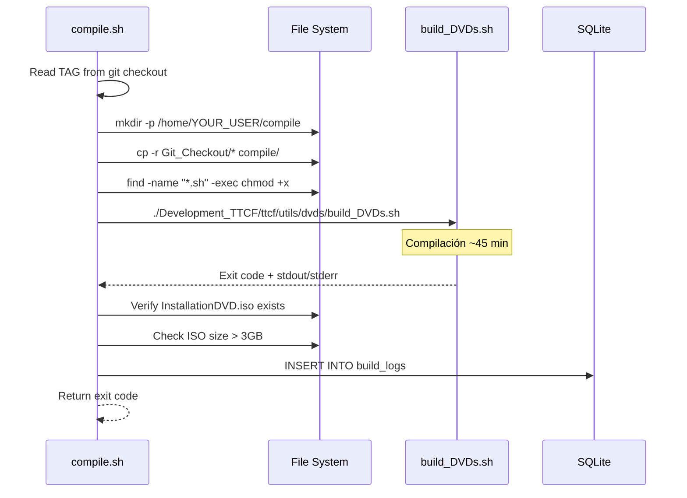
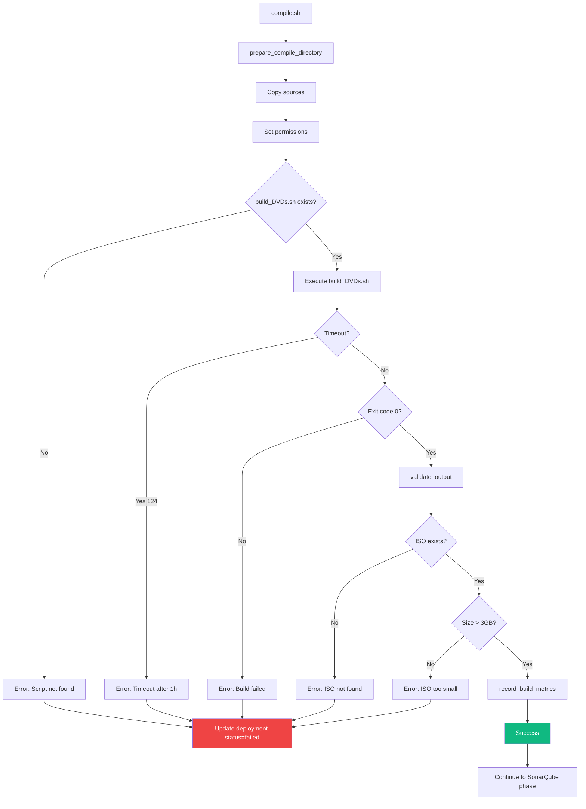

# ⚙️ Pipeline - Compilación (Fase 2)

## Visión General

**Compilación** es la segunda fase del pipeline. Prepara el entorno, copia fuentes, ejecuta el script de build y valida que el ISO resultante sea correcto.

**Relacionado con**:
- [[Pipeline - Git Monitor]] - Fase anterior (checkout de tag)
- [[Pipeline - SonarQube]] - Siguiente fase (análisis de calidad)
- [[Arquitectura del Pipeline#Fase 2]] - Contexto arquitectónico
- [[Modelo de Datos#build_logs]] - Logs de compilación

---

## Responsabilidades

1. **Preparación** - Crear directorio de compilación limpio
2. **Copia de fuentes** - Copiar código desde Git checkout
3. **Permisos** - Dar permisos de ejecución a scripts
4. **Build** - Ejecutar `build_DVDs.sh` con timeout
5. **Validación** - Verificar existencia y tamaño de `InstallationDVD.iso`
6. **Logging** - Guardar logs de compilación en DB

---

## Ubicación y Ejecución

**Script**: `scripts/compile.sh`

**Invocación**:
```bash
# Desde ci_cd.sh
./scripts/compile.sh

# Manual (requiere tag ya checked out)
cd /home/YOUR_USER/cicd
./scripts/compile.sh
```

**Output esperado**:
- `/home/YOUR_USER/compile/InstallationDVD.iso` (~3-4 GB)

**Timeout**: 3600 segundos (1 hora)

---

## Arquitectura



---

## Funciones Principales

### 1. `prepare_compile_directory()`

**Propósito**: Preparar directorio limpio para compilación.

**Implementación**:
```bash
prepare_compile_directory() {
    local COMPILE_DIR=$(config_get "compilation.compile_dir")
    local SOURCE_DIR=$(config_get "compilation.source_dir")
    
    log_info "Preparing compile directory: $COMPILE_DIR"
    
    # Limpiar directorio anterior si existe
    if [ -d "$COMPILE_DIR" ]; then
        log_warn "Compile directory exists, cleaning..."
        rm -rf "$COMPILE_DIR"/*
    fi
    
    # Crear directorio
    mkdir -p "$COMPILE_DIR"
    
    # Copiar fuentes desde Git checkout
    log_info "Copying sources from $SOURCE_DIR to $COMPILE_DIR"
    cp -r "$SOURCE_DIR"/* "$COMPILE_DIR"/
    
    # Dar permisos de ejecución a scripts
    log_info "Setting execute permissions on scripts..."
    find "$COMPILE_DIR" -type f -name "*.sh" -exec chmod +x {} \;
    
    log_ok "Compile directory ready"
}
```

**Validaciones**:
- Directorio de compilación es escribible
- Fuentes copiadas correctamente
- No errores de permisos

### 2. `execute_build_script()`

**Propósito**: Ejecutar script de build con timeout y captura de logs.

**Implementación**:
```bash
execute_build_script() {
    local COMPILE_DIR=$(config_get "compilation.compile_dir")
    local BUILD_SCRIPT="$COMPILE_DIR/Development_TTCF/ttcf/utils/dvds/build_DVDs.sh"
    local TIMEOUT=$(config_get "compilation.timeout")  # 3600 segundos
    local LOG_FILE="logs/compile_$(date +%Y%m%d_%H%M%S).log"
    
    log_info "Starting compilation (timeout: ${TIMEOUT}s)..."
    log_info "Build script: $BUILD_SCRIPT"
    log_info "Log file: $LOG_FILE"
    
    # Verificar que script existe
    if [ ! -f "$BUILD_SCRIPT" ]; then
        log_error "Build script not found: $BUILD_SCRIPT"
        return 1
    fi
    
    # Ejecutar con timeout y captura de output
    cd "$COMPILE_DIR"
    
    if timeout "$TIMEOUT" "$BUILD_SCRIPT" > "$LOG_FILE" 2>&1; then
        log_ok "Compilation completed successfully"
        return 0
    else
        local exit_code=$?
        
        if [ $exit_code -eq 124 ]; then
            log_error "Compilation timed out after ${TIMEOUT}s"
        else
            log_error "Compilation failed with exit code: $exit_code"
        fi
        
        # Mostrar últimas líneas del log
        log_error "Last 20 lines of build log:"
        tail -20 "$LOG_FILE" >&2
        
        return $exit_code
    fi
}
```

**Timeout handling**:
- Exit code 124 = timeout
- Otros códigos = error de compilación

### 3. `validate_output()`

**Propósito**: Verificar que el ISO fue generado correctamente.

**Implementación**:
```bash
validate_output() {
    local COMPILE_DIR=$(config_get "compilation.compile_dir")
    local ISO_PATH="$COMPILE_DIR/InstallationDVD.iso"
    local MIN_SIZE=$((3 * 1024 * 1024 * 1024))  # 3 GB en bytes
    
    log_info "Validating compilation output..."
    
    # Verificar existencia
    if [ ! -f "$ISO_PATH" ]; then
        log_error "ISO file not found: $ISO_PATH"
        return 1
    fi
    
    # Verificar tamaño
    local actual_size=$(stat -c%s "$ISO_PATH" 2>/dev/null || stat -f%z "$ISO_PATH")
    log_info "ISO size: $(numfmt --to=iec-i --suffix=B $actual_size)"
    
    if [ "$actual_size" -lt "$MIN_SIZE" ]; then
        log_error "ISO too small: $actual_size bytes (expected > $MIN_SIZE)"
        return 1
    fi
    
    # Verificar integridad (opcional, puede tardar)
    if command -v isoinfo >/dev/null 2>&1; then
        if isoinfo -d -i "$ISO_PATH" >/dev/null 2>&1; then
            log_ok "ISO integrity check passed"
        else
            log_warn "ISO integrity check failed (non-blocking)"
        fi
    fi
    
    log_ok "Compilation output validated: $ISO_PATH"
    return 0
}
```

**Criterios de validación**:
- Archivo existe
- Tamaño >= 3 GB
- (Opcional) Formato ISO válido

### 4. `record_build_metrics()`

**Propósito**: Guardar métricas de compilación en base de datos.

**Implementación**:
```bash
record_build_metrics() {
    local TAG_NAME="$1"
    local DURATION="$2"
    local LOG_CONTENT="$3"
    local DEPLOYMENT_ID=$(db_query "SELECT id FROM deployments WHERE tag_name='$TAG_NAME'")
    
    log_info "Recording build metrics to database..."
    
    # Insertar en build_logs
    db_query "
    INSERT INTO build_logs (deployment_id, phase, log_content, duration_seconds)
    VALUES (
        $DEPLOYMENT_ID,
        'compilation',
        '$(echo "$LOG_CONTENT" | sed "s/'/''/g")',  # Escape single quotes
        $DURATION
    )
    "
    
    if [ $? -eq 0 ]; then
        log_ok "Build metrics recorded"
    else
        log_warn "Failed to record build metrics (non-blocking)"
    fi
}
```

**Ver tabla**: [[Modelo de Datos#build_logs]]

---

## Configuración

### YAML (`config/ci_cd_config.yaml`)

```yaml
compilation:
  compile_dir: "/home/YOUR_USER/compile"
  source_dir: "/home/YOUR_USER/compile"  # Same as checkout dir
  timeout: 3600  # 1 hour
  min_iso_size: 3221225472  # 3 GB in bytes
  
  build_script_path: "Development_TTCF/ttcf/utils/dvds/build_DVDs.sh"
```

**Ver detalles**: [[Referencia - Configuración#Compilation]]

---

## Script de Build: `build_DVDs.sh`

### Ubicación

**Path relativo**: `Development_TTCF/ttcf/utils/dvds/build_DVDs.sh`

**Path absoluto**: `/home/YOUR_USER/compile/Development_TTCF/ttcf/utils/dvds/build_DVDs.sh`

### ¿Qué hace?

**El script NO es parte del pipeline**, sino del código fuente de GALTTCMC. Responsabilidades:

1. Compilar binarios C/C++
2. Generar archivos de configuración
3. Empaquetar en estructura ISO
4. Crear `InstallationDVD.iso` usando `mkisofs` o `genisoimage`

**Ejemplo simplificado**:
```bash
#!/bin/bash
# build_DVDs.sh (parte del código GALTTCMC)

# 1. Compilar
make clean
make all

# 2. Crear estructura ISO
mkdir -p iso_root/bin
cp build/binaries/* iso_root/bin/
cp -r config/ iso_root/

# 3. Generar ISO
genisoimage -o InstallationDVD.iso -R -J -V "GALTTCMC_INSTALL" iso_root/

echo "ISO created: InstallationDVD.iso"
```

**Nota**: Pipeline solo EJECUTA este script, no lo modifica.

---

## Flujo de Ejecución



---

## Logging y Métricas

### Logs de Compilación

**Ubicación**: `logs/compile_YYYYMMDD_HHMMSS.log`

**Contenido típico**:
```
[2026-03-20 10:10:00] Starting compilation for MAC_1_V24_02_15_01
[2026-03-20 10:10:01] Cleaning build directory...
[2026-03-20 10:10:05] Compiling module: ttcf_core
[2026-03-20 10:15:30] Compiling module: ttcf_network
[2026-03-20 10:20:45] Linking binaries...
[2026-03-20 10:25:00] Creating ISO structure...
[2026-03-20 10:50:00] Generating InstallationDVD.iso...
[2026-03-20 10:55:00] ISO created successfully
Total time: 45 minutes
```

**Tamaño**: ~5-10 MB por compilación

**Rotación**: Ver [[Operación - Mantenimiento#Log Rotation]]

### Métricas en DB

**Tabla `build_logs`**:
```sql
SELECT 
    d.tag_name,
    bl.duration_seconds / 60.0 AS duration_minutes,
    LENGTH(bl.log_content) AS log_size_bytes,
    bl.created_at
FROM build_logs bl
JOIN deployments d ON bl.deployment_id = d.id
WHERE bl.phase = 'compilation'
ORDER BY bl.created_at DESC
LIMIT 10;
```

**Ver queries**: [[Modelo de Datos#Build Performance]]

---

## Gestión de Errores

### 1. Script de Build No Encontrado

**Síntoma**:
```
[ERROR] Build script not found: /home/YOUR_USER/compile/Development_TTCF/ttcf/utils/dvds/build_DVDs.sh
```

**Causa**: Estructura del repo cambió o checkout incompleto

**Solución**:
```bash
# Verificar estructura
cd /home/YOUR_USER/compile
find . -name "build_DVDs.sh"

# Si está en otra ubicación, actualizar config
nano config/ci_cd_config.yaml
# Cambiar: build_script_path
```

### 2. Timeout de Compilación

**Síntoma**:
```
[ERROR] Compilation timed out after 3600s
```

**Causa**: Build excede 1 hora (código muy grande o hardware lento)

**Solución**:
```yaml
# Aumentar timeout en config/ci_cd_config.yaml
compilation:
  timeout: 7200  # 2 horas
```

**Alternativa**: Optimizar script de build (compilación paralela con `make -j4`)

### 3. ISO No Generado

**Síntoma**:
```
[ERROR] ISO file not found: /home/YOUR_USER/compile/InstallationDVD.iso
```

**Causa**: Error en `build_DVDs.sh` (no crea ISO)

**Diagnóstico**:
```bash
# Ver últimas líneas del log
tail -50 logs/compile_*.log | grep -i error

# Ejecutar build manualmente para debug
cd /home/YOUR_USER/compile
./Development_TTCF/ttcf/utils/dvds/build_DVDs.sh
```

**Ver troubleshooting**: [[Operación - Troubleshooting#Compilación]]

### 4. ISO Demasiado Pequeño

**Síntoma**:
```
[ERROR] ISO too small: 524288000 bytes (expected > 3221225472)
```

**Causa**: Build incompleto (faltan archivos)

**Solución**:
```bash
# Comparar con ISO anterior
ls -lh /home/YOUR_USER/compile/InstallationDVD.iso
ls -lh /path/to/previous/V24_02_14_01.iso

# Verificar contenido del ISO
isoinfo -l -i /home/YOUR_USER/compile/InstallationDVD.iso | less
```

---

## Performance

### Tiempos de Ejecución

| Fase | Tiempo Típico | Notas |
|------|---------------|-------|
| Preparación (copy sources) | 30-60 segundos | Depende de tamaño repo |
| Permisos (chmod) | 5-10 segundos | ~500 archivos .sh |
| Build (make + ISO) | 40-50 minutos | CPU-intensive |
| Validación | 5-10 segundos | Solo stat + isoinfo |
| Record metrics | <1 segundo | Insert DB |
| **TOTAL** | **~45-50 minutos** | Puede variar ±15 min |

### Optimizaciones Posibles

#### 1. Compilación Paralela

**Actual**: `make` (single-threaded)

**Mejora**:
```bash
# En build_DVDs.sh
make -j$(nproc)  # Usa todos los cores
```

**Ganancia**: ~50% reducción de tiempo (si CPU tiene 4+ cores)

#### 2. Ccache (Compiler Cache)

**Concepto**: Cachear objetos compilados para evitar recompilación

**Setup**:
```bash
# Instalar ccache
sudo zypper install ccache

# Configurar
export CC="ccache gcc"
export CXX="ccache g++"

# En builds subsecuentes
ccache -s  # Ver estadísticas
```

**Ganancia**: ~80% en builds incrementales (solo archivos modificados)

#### 3. RAM Disk para Compilación

**Concepto**: Compilar en memoria RAM en lugar de disco

**Setup**:
```bash
# Crear tmpfs
sudo mkdir -p /mnt/ramdisk
sudo mount -t tmpfs -o size=8G tmpfs /mnt/ramdisk

# Cambiar compile_dir
compilation:
  compile_dir: "/mnt/ramdisk/compile"
```

**Ganancia**: ~20-30% reducción I/O (requiere RAM suficiente)

---

## Integración con Pipeline

### Invocación desde `ci_cd.sh`

```bash
run_pipeline() {
    local TAG_NAME="$1"
    
    # Update status
    db_query "UPDATE deployments SET status='compiling' WHERE tag_name='$TAG_NAME'"
    
    # Execute compilation
    local start_time=$(date +%s)
    
    if ! "$SCRIPT_DIR/scripts/compile.sh"; then
        log_error "Compilation failed for tag: $TAG_NAME"
        mark_deployment_failed "$TAG_NAME" "Compilation phase failed"
        return 1
    fi
    
    local end_time=$(date +%s)
    local duration=$((end_time - start_time))
    
    log_ok "Compilation completed in $duration seconds"
    
    # Continue to next phase
    proceed_to_sonarqube "$TAG_NAME"
}
```

---

## Casos de Uso Especiales

### Build Incremental (No Implementado)

**Concepto**: Solo recompilar archivos modificados desde último tag.

**Implementación potencial**:
```bash
# En prepare_compile_directory()
if [ -d "$COMPILE_DIR" ]; then
    # No limpiar, solo hacer git pull del nuevo tag
    cd "$COMPILE_DIR"
    git fetch --all
    git checkout "$TAG_NAME"
    
    # Make detecta automáticamente qué recompilar
else
    # First time: full clone
    git clone ...
fi
```

**Trade-off**:
- ✅ Más rápido en builds incrementales
- ❌ Riesgo de estado inconsistente (archivos .o viejos)

### Build Multi-Target (No Implementado)

**Concepto**: Compilar para múltiples plataformas (x86, ARM, etc.)

**Ejemplo**:
```bash
# build_DVDs.sh modificado
for arch in x86_64 aarch64; do
    make ARCH=$arch
    genisoimage -o "InstallationDVD_${arch}.iso" ...
done
```

---

## Monitorización

### Verificar Compilaciones Recientes

```bash
# Ver builds en DB
sqlite3 db/pipeline.db "
SELECT 
    d.tag_name,
    d.status,
    bl.duration_seconds / 60.0 AS duration_minutes
FROM deployments d
JOIN build_logs bl ON d.id = bl.deployment_id
WHERE bl.phase = 'compilation'
ORDER BY d.started_at DESC
LIMIT 10
"
```

### Logs en Tiempo Real

```bash
# Seguir log de compilación actual
tail -f logs/compile_$(date +%Y%m%d)_*.log

# Buscar errores
grep -i error logs/compile_*.log | tail -20
```

### Web UI

**Ver compilaciones**: http://YOUR_PIPELINE_HOST_IP:8080/pipeline_runs

**Filtrar por status**: `?status=failed`

**Ver logs inline**: Click en deployment → "View Build Logs"

---

## Testing Manual

### Test Completo

```bash
cd /home/YOUR_USER/cicd

# 1. Asegurar que hay código checked out
cd /home/YOUR_USER/compile
git describe --tags

# 2. Ejecutar compilación
cd /home/YOUR_USER/cicd
./scripts/compile.sh

# 3. Verificar resultado
ls -lh /home/YOUR_USER/compile/InstallationDVD.iso

# 4. Verificar logs
tail -50 logs/compile_*.log
```

### Test de Validación Únicamente

```bash
# Simular ISO existente
touch /home/YOUR_USER/compile/InstallationDVD.iso
truncate -s 3500M /home/YOUR_USER/compile/InstallationDVD.iso

# Ejecutar solo validación
source scripts/common.sh
validate_output
```

---

## Enlaces Relacionados

### Documentación del Pipeline
- [[Arquitectura del Pipeline#Fase 2]] - Contexto arquitectónico
- [[Pipeline - Git Monitor]] - Fase anterior
- [[Pipeline - SonarQube]] - Siguiente fase
- [[Pipeline - Common Functions]] - Funciones compartidas
- [[Diagrama - Flujo Completo]] - Flujo end-to-end

### Datos y Configuración
- [[Modelo de Datos#build_logs]] - Tabla de logs
- [[Referencia - Configuración#Compilation]] - Opciones YAML
- [[Referencia - Logs#Compilation Logs]] - Sistema de logging

### Operación
- [[Operación - Troubleshooting#Compilación]] - Problemas comunes
- [[Operación - Mantenimiento#Build Artifacts]] - Limpieza de ISOs
- [[01 - Quick Start#Testing de Fases Individuales]] - Comandos rápidos
