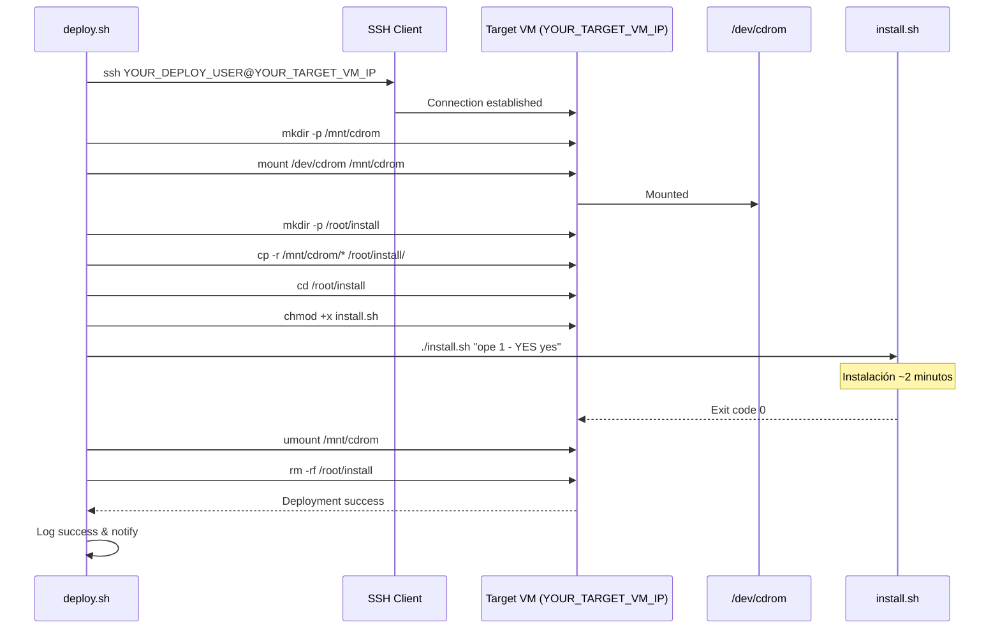
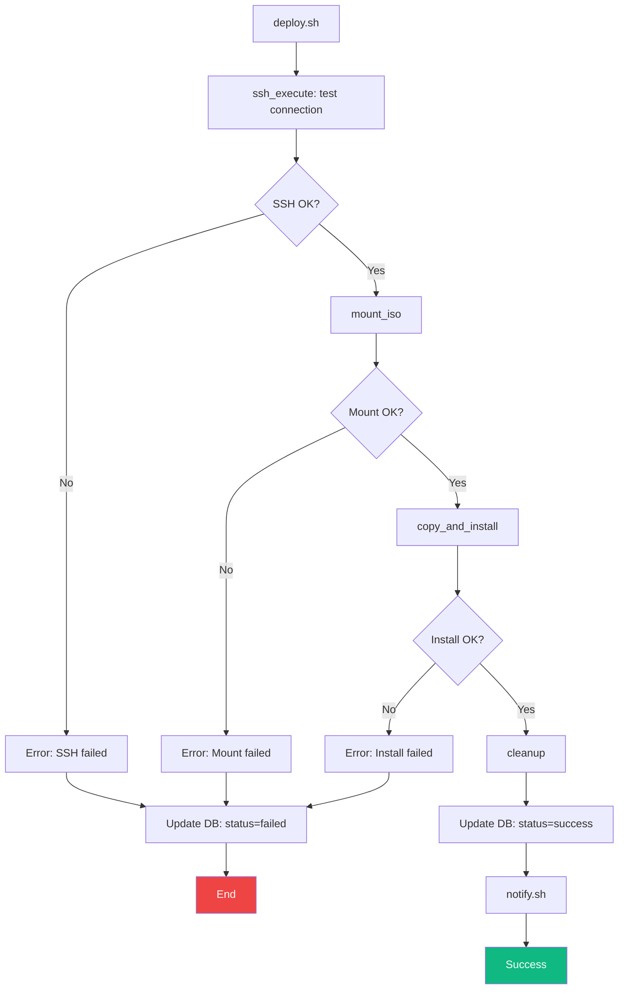

# 🚀 Pipeline - SSH Deploy (Fase 5)

## Visión General

**SSH Deploy** es la quinta y última fase del pipeline. Conecta por SSH a la VM objetivo, monta el ISO, copia el contenido y ejecuta el instalador.

**Relacionado con**:
- [[Pipeline - vCenter]] - Fase anterior (ISO ya montado en VM)
- [[Arquitectura del Pipeline#Fase 5]] - Contexto arquitectónico
- [[Operación - Troubleshooting#SSH Deploy]] - Problemas comunes

---

## Responsabilidades

1. **Conexión SSH** - Conectar a VM destino con key authentication
2. **Montaje ISO** - Montar `/dev/cdrom` en `/mnt/cdrom`
3. **Copia** - Copiar archivos de ISO a `/root/install`
4. **Instalación** - Ejecutar `install.sh` con parámetros
5. **Limpieza** - Desmontar ISO y eliminar temporales
6. **Notificación** - Actualizar estado y notificar usuarios

---

## Script y Ejecución

**Script**: `scripts/deploy.sh`

**Invocación**:
```bash
# Desde ci_cd.sh
./scripts/deploy.sh

# Manual (requiere ISO ya en VM)
cd /home/YOUR_USER/cicd
./scripts/deploy.sh
```

**Prerequisites**:
- ISO montado en VM (fase vCenter completada)
- SSH key configurada en `~/.ssh/id_rsa`
- Public key en `/root/.ssh/authorized_keys` de target VM

---

## Arquitectura



---

## Funciones Principales

### 1. `ssh_execute()`

**Propósito**: Ejecutar comando remoto por SSH.

**Implementación**:
```bash
ssh_execute() {
    local CMD="$1"
    local TARGET_HOST=$(config_get "target_vm.host")
    local TARGET_USER=$(config_get "target_vm.user")
    local SSH_KEY=$(config_get "target_vm.ssh_key")
    
    log_info "Executing remote command: $CMD"
    
    ssh -i "$SSH_KEY" \
        -o StrictHostKeyChecking=no \
        -o ConnectTimeout=30 \
        "$TARGET_USER@$TARGET_HOST" \
        "$CMD"
    
    local exit_code=$?
    
    if [ $exit_code -eq 0 ]; then
        log_ok "Remote command successful"
        return 0
    else
        log_error "Remote command failed with exit code: $exit_code"
        return $exit_code
    fi
}
```

### 2. `mount_iso()`

**Propósito**: Montar ISO en target VM.

**Implementación**:
```bash
mount_iso() {
    log_info "Mounting ISO on target VM..."
    
    # Crear punto de montaje
    ssh_execute "mkdir -p /mnt/cdrom"
    
    # Montar ISO
    if ssh_execute "mount /dev/cdrom /mnt/cdrom"; then
        log_ok "ISO mounted at /mnt/cdrom"
        return 0
    else
        log_error "Failed to mount ISO"
        return 1
    fi
}
```

### 3. `copy_and_install()`

**Propósito**: Copiar archivos y ejecutar instalador.

**Implementación**:
```bash
copy_and_install() {
    local TAG_NAME="$1"
    local INSTALL_ARGS=$(config_get "target_vm.install_args")
    
    log_info "Copying files from ISO..."
    
    # Preparar directorio
    ssh_execute "mkdir -p /root/install && rm -rf /root/install/*"
    
    # Copiar archivos
    if ! ssh_execute "cp -r /mnt/cdrom/* /root/install/"; then
        log_error "Failed to copy files"
        return 1
    fi
    
    log_ok "Files copied successfully"
    
    # Dar permisos ejecutables
    ssh_execute "chmod +x /root/install/install.sh"
    
    # Ejecutar instalador
    log_info "Running installation script with args: $INSTALL_ARGS"
    
    if ssh_execute "cd /root/install && ./install.sh \"$INSTALL_ARGS\""; then
        log_ok "Installation completed successfully"
        return 0
    else
        log_error "Installation failed"
        return 1
    fi
}
```

### 4. `cleanup()`

**Propósito**: Limpiar archivos temporales.

**Implementación**:
```bash
cleanup() {
    log_info "Cleaning up..."
    
    # Desmontar ISO
    ssh_execute "umount /mnt/cdrom || true"
    
    # Eliminar temporales
    ssh_execute "rm -rf /root/install"
    
    log_ok "Cleanup completed"
}
```

---

## Configuración

### YAML (`config/ci_cd_config.yaml`)

```yaml
target_vm:
  host: "YOUR_TARGET_VM_IP"
  user: "root"
  ssh_key: "/home/YOUR_USER/.ssh/id_rsa"
  install_args: "ope 1 - YES yes"
  connection_timeout: 30
```

**Ver detalles**: [[Referencia - Configuración#Target VM]]

---

## Flujo de Ejecución



---

## Parámetros de Instalación

### `install_args`

**Formato**: `"ope 1 - YES yes"`

**Componentes**:
- `ope` - Modo operativo
- `1` - Tipo de instalación
- `-` - Separador
- `YES` - Confirmación automática
- `yes` - Aceptar licencia

**Otros modos**:
```bash
# Instalación completa
install_args: "full 1 - YES yes"

# Instalación mínima
install_args: "minimal 1 - YES yes"

# Upgrade (sin reinstalar)
install_args: "upgrade 1 - YES yes"
```

---

## Gestión de Errores

### 1. SSH Connection Failed

**Síntoma**:
```
[ERROR] SSH connection failed: Connection refused
```

**Causas**:
- Target VM apagada
- SSH key no configurada
- Firewall bloqueando puerto 22

**Solución**:
```bash
# Test SSH manual
ssh YOUR_DEPLOY_USER@YOUR_TARGET_VM_IP 'echo OK'

# Verificar key
ls -la ~/.ssh/id_rsa
ssh-add -l

# Copiar key nuevamente
ssh-copy-id YOUR_DEPLOY_USER@YOUR_TARGET_VM_IP
```

**Ver troubleshooting**: [[Operación - Troubleshooting#SSH Deploy]]

### 2. ISO Not Mounted

**Síntoma**:
```
[ERROR] Failed to mount ISO
mount: /dev/cdrom: no medium found
```

**Causas**:
- vCenter no configuró CD-ROM
- ISO no subido al datastore
- VM no tiene device CD-ROM

**Solución**:
```bash
# Verificar en VM
ssh YOUR_DEPLOY_USER@YOUR_TARGET_VM_IP 'ls -la /dev/cdrom'

# Verificar en vCenter
python3.6 python/vcenter_api.py config/ci_cd_config.yaml get_vm_status

# Reconectar ISO manualmente en vCenter UI
```

### 3. Installation Script Failed

**Síntoma**:
```
[ERROR] Installation failed with exit code 1
```

**Diagnóstico**:
```bash
# Ver logs de deployment
tail -100 logs/deploy_*.log

# Conectar a VM y ejecutar manualmente
ssh YOUR_DEPLOY_USER@YOUR_TARGET_VM_IP
cd /root/install
./install.sh "ope 1 - YES yes"  # Ver error directo
```

**Causas comunes**:
- Dependencias faltantes en VM
- Permisos incorrectos
- Espacio en disco insuficiente

### 4. Cleanup Failed (No Bloqueante)

**Síntoma**:
```
[WARN] Failed to cleanup (non-blocking)
```

**Impacto**: No crítico, no bloquea deployment

**Solución manual**:
```bash
ssh YOUR_DEPLOY_USER@YOUR_TARGET_VM_IP 'umount /mnt/cdrom && rm -rf /root/install'
```

---

## Logging

### Logs de Deployment

**Ubicación**: `logs/deploy_YYYYMMDD_HHMMSS.log`

**Contenido típico**:
```
[2026-03-20 11:00:00] [INFO] Starting SSH deployment for MAC_1_V24_02_15_01
[2026-03-20 11:00:01] [INFO] Testing SSH connection to YOUR_TARGET_VM_IP...
[2026-03-20 11:00:02] [OK] SSH connection successful
[2026-03-20 11:00:03] [INFO] Mounting ISO on target VM...
[2026-03-20 11:00:05] [OK] ISO mounted at /mnt/cdrom
[2026-03-20 11:00:06] [INFO] Copying files from ISO...
[2026-03-20 11:00:30] [OK] Files copied successfully
[2026-03-20 11:00:31] [INFO] Running installation script...
[2026-03-20 11:02:45] [OK] Installation completed successfully
[2026-03-20 11:02:46] [INFO] Cleaning up...
[2026-03-20 11:02:48] [OK] Cleanup completed
[2026-03-20 11:02:49] [OK] Deployment successful for MAC_1_V24_02_15_01
Total time: 2 minutes 49 seconds
```

---

## Performance

### Tiempos de Ejecución

| Operación | Tiempo Típico | Notas |
|-----------|---------------|-------|
| SSH connection | 1-2 segundos | Depende de latencia red |
| Mount ISO | 2-3 segundos | Device enumeration |
| Copy files | 20-30 segundos | ~3.5 GB de datos |
| Install script | 90-120 segundos | Variable según HW |
| Cleanup | 2-3 segundos | umount + rm |
| **TOTAL** | **~3 minutos** | Rango: 2-5 minutos |

---

## Testing Manual

### Test Completo

```bash
cd /home/YOUR_USER/cicd

# Prerequisito: ISO ya montado en VM (vCenter phase)
# Test deployment
./scripts/deploy.sh

# Verificar resultado
tail -50 logs/deploy_*.log
```

### Test SSH Connection

```bash
# Test básico
ssh YOUR_DEPLOY_USER@YOUR_TARGET_VM_IP 'echo OK'

# Test con key específica
ssh -i ~/.ssh/id_rsa YOUR_DEPLOY_USER@YOUR_TARGET_VM_IP 'echo OK'

# Test timeout
ssh -o ConnectTimeout=10 YOUR_DEPLOY_USER@YOUR_TARGET_VM_IP 'echo OK'
```

### Test Instalación Manual

```bash
# Conectar a VM
ssh YOUR_DEPLOY_USER@YOUR_TARGET_VM_IP

# Verificar ISO montado
ls -la /dev/cdrom
mount | grep cdrom

# Copiar y ejecutar manualmente
mkdir -p /root/install
mount /dev/cdrom /mnt/cdrom
cp -r /mnt/cdrom/* /root/install/
cd /root/install
./install.sh "ope 1 - YES yes"
```

---

## Integración con Pipeline

### Invocación desde `ci_cd.sh`

```bash
run_pipeline() {
    local TAG_NAME="$1"
    
    # ... fases anteriores ...
    
    # Update status
    db_query "UPDATE deployments SET status='deploying' WHERE tag_name='$TAG_NAME'"
    
    # Execute SSH deployment
    if ! "$SCRIPT_DIR/scripts/deploy.sh"; then
        log_error "SSH deployment failed for tag: $TAG_NAME"
        mark_deployment_failed "$TAG_NAME" "SSH deployment phase failed"
        return 1
    fi
    
    # Mark as success
    db_query "UPDATE deployments SET status='success', finished_at=CURRENT_TIMESTAMP WHERE tag_name='$TAG_NAME'"
    
    log_ok "Pipeline completed successfully for tag: $TAG_NAME"
    
    # Notify users
    "$SCRIPT_DIR/scripts/notify.sh" "$TAG_NAME" "success"
}
```

---

## Seguridad

### SSH Key Management

**Generación**:
```bash
ssh-keygen -t rsa -b 4096 -f ~/.ssh/id_rsa -N ""
```

**Permisos correctos**:
```bash
chmod 600 ~/.ssh/id_rsa
chmod 644 ~/.ssh/id_rsa.pub
chmod 700 ~/.ssh
```

**Distribución**:
```bash
# Copiar public key a target VM
ssh-copy-id YOUR_DEPLOY_USER@YOUR_TARGET_VM_IP

# O manualmente
cat ~/.ssh/id_rsa.pub | ssh YOUR_DEPLOY_USER@YOUR_TARGET_VM_IP 'mkdir -p ~/.ssh && cat >> ~/.ssh/authorized_keys'
```

### SSH Options

**Options usadas**:
- `-o StrictHostKeyChecking=no` - No verificar host key (red interna)
- `-o ConnectTimeout=30` - Timeout de conexión
- `-i ~/.ssh/id_rsa` - Key específica

**⚠️ Nota**: En producción considerar usar `StrictHostKeyChecking=yes` con known_hosts.

---

## Notificaciones

### Script `notify.sh`

**Invocación post-deployment**:
```bash
./scripts/notify.sh "MAC_1_V24_02_15_01" "success"
./scripts/notify.sh "MAC_1_V24_02_15_01" "failed"
```

**Acciones**:
1. **wall** - Mensaje broadcast a usuarios conectados
2. **profile update** - Actualizar `/etc/profile.d/informacion.sh` con última versión
3. **Log** - Registrar notificación en `execution_log`

**Ejemplo de mensaje**:
```
━━━━━━━━━━━━━━━━━━━━━━━━━━━━━━━━━━━━━━━━
  ✅ CI/CD Pipeline - Deployment Success
━━━━━━━━━━━━━━━━━━━━━━━━━━━━━━━━━━━━━━━━
  Tag: MAC_1_V24_02_15_01
  Status: SUCCESS
  Duration: 65 minutes
  Deployed to: YOUR_TARGET_VM_IP
━━━━━━━━━━━━━━━━━━━━━━━━━━━━━━━━━━━━━━━━
```

---

## Enlaces Relacionados

### Documentación del Pipeline
- [[Arquitectura del Pipeline#Fase 5]]
- [[Pipeline - vCenter]] - Fase anterior
- [[Pipeline - Common Functions]] - Funciones compartidas
- [[Diagrama - Flujo Completo]] - Flujo end-to-end

### Operación
- [[Operación - Troubleshooting#SSH Deploy]]
- [[01 - Quick Start#Testing de Fases Individuales]]
- [[Referencia - Configuración#Target VM]]
