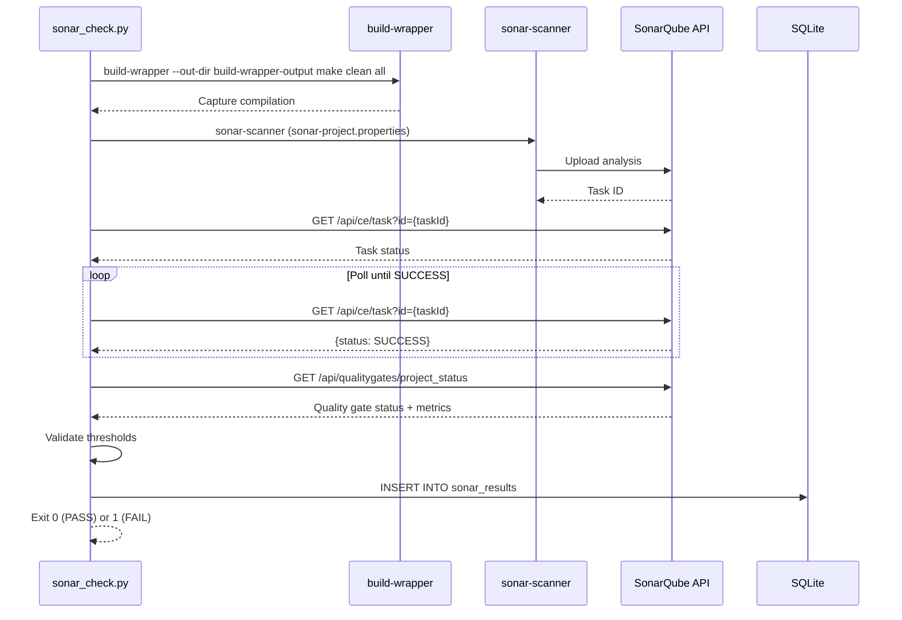
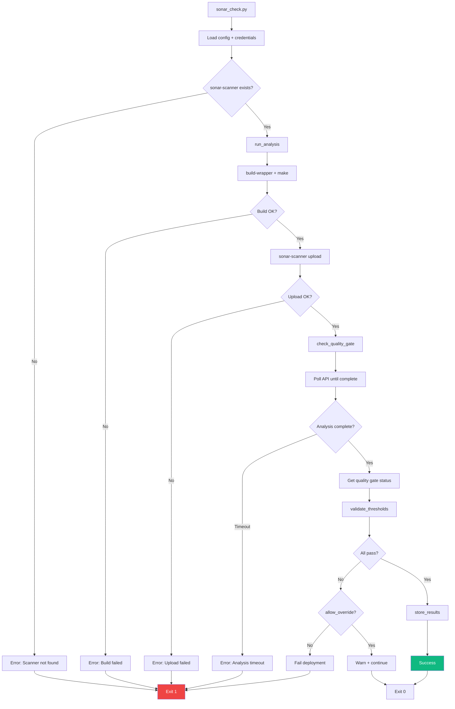

# 🔍 Pipeline - SonarQube (Fase 3)

## Visión General

**SonarQube Analysis** es la tercera fase del pipeline. Ejecuta análisis estático de código, consulta la API de SonarQube para obtener métricas de calidad y valida contra umbrales configurados.

**Relacionado con**:
- [[Pipeline - Compilación]] - Fase anterior (build exitoso)
- [[Pipeline - vCenter]] - Siguiente fase (si quality gate pasa)
- [[Arquitectura del Pipeline#Fase 3]] - Contexto arquitectónico
- [[Modelo de Datos#sonar_results]] - Resultados SonarQube
- [[Referencia - APIs Externas#SonarQube]] - Integración API

---

## Responsabilidades

1. **Análisis de código** - Ejecutar build-wrapper + sonar-scanner
2. **Consulta de resultados** - Llamar a SonarQube API
3. **Validación de umbrales** - Comparar métricas vs thresholds configurados
4. **Quality gate** - Bloquear deployment si no pasa criterios
5. **Persistencia** - Guardar resultados en DB para trending

---

## Ubicación y Ejecución

**Script**: `python/sonar_check.py`

**Invocación**:
```bash
# Desde ci_cd.sh
python3.6 python/sonar_check.py config/ci_cd_config.yaml MAC_1_V24_02_15_01

# Manual con parámetros
python3.6 python/sonar_check.py config/ci_cd_config.yaml V24_02_15_01 --skip-scan  # Solo query
```

**Dependencias**:
- Python 3.6+
- `requests` library
- `PyYAML` library
- sonar-scanner (bundled en `utils/sonar-scanner/`)
- build-wrapper (bundled en `utils/build-wrapper/`)

---

## Arquitectura



---

## Funciones Principales

### 1. `run_analysis()`

**Propósito**: Ejecutar build-wrapper y sonar-scanner.

**Implementación** (Python 3.6):
```python
def run_analysis(config, tag_name):
    """Execute SonarQube analysis"""
    compile_dir = config['compilation']['compile_dir']
    sonar_scanner = config['sonarqube']['scanner_path']
    build_wrapper = config['sonarqube']['build_wrapper_path']
    
    logging.info("Running SonarQube analysis for tag: {}".format(tag_name))
    
    # 1. Build-wrapper (captura compilación para análisis C/C++)
    logging.info("Executing build-wrapper...")
    bw_cmd = [
        build_wrapper,
        '--out-dir', os.path.join(compile_dir, 'build-wrapper-output'),
        'make', 'clean', 'all'
    ]
    
    result = subprocess.run(bw_cmd, cwd=compile_dir, capture_output=True, text=True)
    if result.returncode != 0:
        logging.error("Build-wrapper failed: {}".format(result.stderr))
        return False
    
    # 2. Sonar-scanner (análisis + upload)
    logging.info("Executing sonar-scanner...")
    ss_cmd = [
        sonar_scanner,
        '-Dsonar.projectKey=GALTTCMC',
        '-Dsonar.projectVersion={}'.format(tag_name),
        '-Dsonar.sources=.',
        '-Dsonar.cfamily.build-wrapper-output=build-wrapper-output'
    ]
    
    result = subprocess.run(ss_cmd, cwd=compile_dir, capture_output=True, text=True)
    if result.returncode != 0:
        logging.error("Sonar-scanner failed: {}".format(result.stderr))
        return False
    
    logging.info("Analysis submitted to SonarQube")
    return True
```

**Nota**: **No usar f-strings** (Python 3.6 compatibility), usar `.format()`

### 2. `check_quality_gate()`

**Propósito**: Consultar estado del quality gate en SonarQube.

**Implementación**:
```python
import requests
import urllib3
import time

# Disable SSL warnings
urllib3.disable_warnings(urllib3.exceptions.InsecureRequestWarning)

def check_quality_gate(config, tag_name):
    """Query SonarQube API for quality gate status"""
    base_url = config['sonarqube']['api_url']
    token = config['sonarqube']['token']
    project_key = config['sonarqube']['project_key']
    
    # Auth: token as username, empty password (basic auth)
    auth = (token, '')
    
    # 1. Wait for analysis to complete
    logging.info("Waiting for analysis to complete...")
    task_url = "{}/api/ce/component?component={}".format(base_url, project_key)
    
    for i in range(60):  # Max 5 minutos
        response = requests.get(task_url, auth=auth, verify=False)
        response.raise_for_status()
        data = response.json()
        
        if data.get('queue', []):
            logging.info("Analysis in queue, waiting...")
            time.sleep(5)
        elif data.get('current', {}).get('status') == 'SUCCESS':
            logging.info("Analysis completed")
            break
        else:
            logging.warning("Unknown status, retrying...")
            time.sleep(5)
    else:
        logging.error("Timeout waiting for analysis")
        return None
    
    # 2. Get quality gate status
    qg_url = "{}/api/qualitygates/project_status?projectKey={}".format(base_url, project_key)
    response = requests.get(qg_url, auth=auth, verify=False)
    response.raise_for_status()
    
    qg_data = response.json()
    return qg_data.get('projectStatus', {})
```

### 3. `validate_thresholds()`

**Propósito**: Validar métricas contra umbrales configurados.

**Implementación**:
```python
def validate_thresholds(metrics, thresholds):
    """Validate metrics against configured thresholds"""
    errors = []
    
    # Coverage
    if 'coverage' in thresholds:
        coverage_threshold = float(thresholds['coverage'])
        coverage_actual = float(metrics.get('coverage', 0))
        if coverage_actual < coverage_threshold:
            errors.append("Coverage: {:.1f}% < {:.1f}%".format(
                coverage_actual, coverage_threshold
            ))
    
    # Bugs (must be 0)
    if 'bugs' in thresholds:
        bugs_threshold = int(thresholds['bugs'])
        bugs_actual = int(metrics.get('bugs', 0))
        if bugs_actual > bugs_threshold:
            errors.append("Bugs: {} > {}".format(bugs_actual, bugs_threshold))
    
    # Vulnerabilities (must be 0)
    if 'vulnerabilities' in thresholds:
        vuln_threshold = int(thresholds['vulnerabilities'])
        vuln_actual = int(metrics.get('vulnerabilities', 0))
        if vuln_actual > vuln_threshold:
            errors.append("Vulnerabilities: {} > {}".format(vuln_actual, vuln_threshold))
    
    # Security Hotspots (must be 0)
    if 'security_hotspots' in thresholds:
        sh_threshold = int(thresholds['security_hotspots'])
        sh_actual = int(metrics.get('security_hotspots', 0))
        if sh_actual > sh_threshold:
            errors.append("Security Hotspots: {} > {}".format(sh_actual, sh_threshold))
    
    # Code Smells (max 10)
    if 'code_smells' in thresholds:
        cs_threshold = int(thresholds['code_smells'])
        cs_actual = int(metrics.get('code_smells', 0))
        if cs_actual > cs_threshold:
            errors.append("Code Smells: {} > {}".format(cs_actual, cs_threshold))
    
    if errors:
        logging.error("Quality gate failed:")
        for error in errors:
            logging.error("  - {}".format(error))
        return False
    else:
        logging.info("All thresholds passed")
        return True
```

### 4. `store_results()`

**Propósito**: Guardar resultados en base de datos.

**Implementación**:
```python
import sqlite3

def store_results(db_path, tag_name, deployment_id, metrics, qg_status):
    """Store SonarQube results in database"""
    conn = sqlite3.connect(db_path)
    cursor = conn.cursor()
    
    cursor.execute("""
    INSERT INTO sonar_results (
        deployment_id, tag_name, coverage, bugs, vulnerabilities,
        security_hotspots, code_smells, duplications, lines_of_code,
        quality_gate_status, analyzed_at
    ) VALUES (?, ?, ?, ?, ?, ?, ?, ?, ?, ?, CURRENT_TIMESTAMP)
    """, (
        deployment_id,
        tag_name,
        metrics.get('coverage', 0.0),
        metrics.get('bugs', 0),
        metrics.get('vulnerabilities', 0),
        metrics.get('security_hotspots', 0),
        metrics.get('code_smells', 0),
        metrics.get('duplications', 0.0),
        metrics.get('lines_of_code', 0),
        qg_status
    ))
    
    conn.commit()
    conn.close()
    
    logging.info("Results stored in database")
```

**Ver tabla**: [[Modelo de Datos#sonar_results]]

---

## Configuración

### YAML (`config/ci_cd_config.yaml`)

```yaml
sonarqube:
  api_url: "https://YOUR_SONARQUBE_SERVER"
  project_key: "GALTTCMC"
  token: "${SONAR_TOKEN}"
  
  scanner_path: "/home/YOUR_USER/cicd/utils/sonar-scanner/bin/sonar-scanner"
  build_wrapper_path: "/home/YOUR_USER/cicd/utils/build-wrapper/build-wrapper-linux-x86-64"
  
  thresholds:
    coverage: 80           # ≥ 80%
    bugs: 0                # = 0
    vulnerabilities: 0     # = 0
    security_hotspots: 0   # = 0
    code_smells: 10        # ≤ 10
  
  allow_override: false    # Bloquea deployment si falla
```

**Ver detalles**: [[Referencia - Configuración#SonarQube]]

### `.env`

```bash
SONAR_TOKEN=squ_xxxxxxxxxxxxxxxxxxxxxxxxxxxxxxxxxxxxxxxx
```

**Generar token**:
1. Login a https://YOUR_SONARQUBE_SERVER
2. My Account → Security → Generate Tokens
3. Name: `cicd-pipeline`, Type: Project Analysis
4. Copiar token a `.env`

---

## Configuración de Proyecto: `sonar-project.properties`

**Ubicación**: `config/sonar-project.properties`

**Contenido típico**:
```properties
sonar.projectKey=GALTTCMC
sonar.projectName=GALTTCMC CI/CD Pipeline
sonar.projectVersion=1.0

# Paths
sonar.sources=Development_TTCF/ttcf/src
sonar.tests=Development_TTCF/ttcf/tests
sonar.exclusions=**/*_test.c,**/*.o,**/*.a

# Language
sonar.language=c,cpp
sonar.c.file.suffixes=.c
sonar.cpp.file.suffixes=.cpp,.cc,.cxx

# C/C++ specific
sonar.cfamily.build-wrapper-output=build-wrapper-output
sonar.cfamily.cache.enabled=true

# Coverage (si hay gcov reports)
sonar.cfamily.gcov.reportsPath=coverage
```

**Copiar a compile dir** antes de ejecutar sonar-scanner:
```bash
cp config/sonar-project.properties /home/YOUR_USER/compile/
```

---

## Quality Gates y Umbrales

### Umbrales Configurados

| Métrica | Umbral | Tipo | Descripción |
|---------|--------|------|-------------|
| **Coverage** | ≥ 80% | Porcentaje | Cobertura de tests unitarios |
| **Bugs** | = 0 | Contador | Bugs detectados (serios) |
| **Vulnerabilities** | = 0 | Contador | Vulnerabilidades seguridad |
| **Security Hotspots** | = 0 | Contador | Puntos a revisar manualmente |
| **Code Smells** | ≤ 10 | Contador | Problemas de mantenibilidad |

### Severidad de Fallos

**Si `allow_override: false`** (default):
- Cualquier métrica fuera de umbral → **BLOQUEA deployment**
- Status de deployment → `failed`
- No continúa a fases 4 y 5

**Si `allow_override: true`**:
- Quality gate falla → **WARNING** en logs
- Deployment **continúa** (responsabilidad del equipo)

### Ejemplo de Fallo

```
[ERROR] Quality gate failed:
  - Coverage: 75.2% < 80.0%
  - Bugs: 2 > 0
  - Code Smells: 15 > 10
```

---

## Flujo de Ejecución



---

## APIs de SonarQube

### 1. Component Analysis Task

**Endpoint**: `GET /api/ce/component`

**Propósito**: Obtener estado de análisis en cola.

**Request**:
```bash
curl -u "$SONAR_TOKEN:" \
  "https://YOUR_SONARQUBE_SERVER/api/ce/component?component=GALTTCMC"
```

**Response**:
```json
{
  "queue": [],
  "current": {
    "id": "AYxxxxx",
    "type": "REPORT",
    "status": "SUCCESS",
    "submittedAt": "2026-03-20T10:30:00+0000",
    "startedAt": "2026-03-20T10:30:05+0000",
    "executionTimeMs": 45000
  }
}
```

### 2. Quality Gate Status

**Endpoint**: `GET /api/qualitygates/project_status`

**Propósito**: Obtener resultado del quality gate.

**Request**:
```bash
curl -u "$SONAR_TOKEN:" \
  "https://YOUR_SONARQUBE_SERVER/api/qualitygates/project_status?projectKey=GALTTCMC"
```

**Response**:
```json
{
  "projectStatus": {
    "status": "OK",
    "conditions": [
      {
        "status": "OK",
        "metricKey": "new_coverage",
        "comparator": "LT",
        "errorThreshold": "80",
        "actualValue": "85.3"
      },
      {
        "status": "OK",
        "metricKey": "new_bugs",
        "comparator": "GT",
        "errorThreshold": "0",
        "actualValue": "0"
      }
    ],
    "periods": [],
    "ignoredConditions": false
  }
}
```

### 3. Project Measures

**Endpoint**: `GET /api/measures/component`

**Propósito**: Obtener métricas detalladas.

**Request**:
```bash
curl -u "$SONAR_TOKEN:" \
  "https://YOUR_SONARQUBE_SERVER/api/measures/component?component=GALTTCMC&metricKeys=coverage,bugs,vulnerabilities,code_smells,security_hotspots,duplicated_lines_density,ncloc"
```

**Response**:
```json
{
  "component": {
    "key": "GALTTCMC",
    "name": "GALTTCMC",
    "measures": [
      {"metric": "coverage", "value": "85.3"},
      {"metric": "bugs", "value": "0"},
      {"metric": "vulnerabilities", "value": "0"},
      {"metric": "code_smells", "value": "8"},
      {"metric": "security_hotspots", "value": "0"},
      {"metric": "duplicated_lines_density", "value": "2.1"},
      {"metric": "ncloc", "value": "125340"}
    ]
  }
}
```

**Ver API completa**: [[Referencia - APIs Externas#SonarQube]]

---

## Herramientas Bundled

### sonar-scanner

**Ubicación**: `utils/sonar-scanner/`

**Versión**: sonar-scanner-cli-4.6.2

**Instalación** (ya hecho en setup):
```bash
cd /home/YOUR_USER/cicd/utils
wget https://binaries.sonarsource.com/Distribution/sonar-scanner-cli/sonar-scanner-cli-4.6.2-linux.zip
unzip sonar-scanner-cli-4.6.2-linux.zip
mv sonar-scanner-4.6.2-linux sonar-scanner
chmod +x sonar-scanner/bin/sonar-scanner
```

### build-wrapper

**Ubicación**: `utils/build-wrapper/`

**Propósito**: Capturar comandos de compilación para análisis C/C++.

**Instalación**:
```bash
cd /home/YOUR_USER/cicd/utils
wget https://YOUR_SONARQUBE_SERVER/static/cpp/build-wrapper-linux-x86.zip
unzip build-wrapper-linux-x86.zip
chmod +x build-wrapper-linux-x86/build-wrapper-linux-x86-64
```

**Uso**:
```bash
build-wrapper-linux-x86-64 --out-dir bw-output make clean all
```

---

## Gestión de Errores

### 1. Token Inválido o Expirado

**Síntoma**:
```
[ERROR] SonarQube API call failed: 401 Unauthorized
```

**Solución**:
```bash
# Regenerar token en SonarQube UI
# Actualizar .env
nano config/.env
# SONAR_TOKEN=squ_newtoken...

# Verificar token
curl -u "$SONAR_TOKEN:" https://YOUR_SONARQUBE_SERVER/api/authentication/validate | jq
```

### 2. Proyecto No Existe en SonarQube

**Síntoma**:
```
[ERROR] Project 'GALTTCMC' not found
```

**Solución**:
```bash
# Crear proyecto en SonarQube UI
# O via API
curl -u "$SONAR_TOKEN:" -X POST \
  "https://YOUR_SONARQUBE_SERVER/api/projects/create?name=GALTTCMC&project=GALTTCMC"
```

### 3. Analysis Timeout

**Síntoma**:
```
[ERROR] Timeout waiting for analysis (300 seconds)
```

**Causa**: Proyecto muy grande o SonarQube sobrecargado

**Solución**:
```python
# Aumentar timeout en sonar_check.py
for i in range(120):  # De 60 a 120 iteraciones (10 minutos)
    ...
```

### 4. Coverage < 80%

**Síntoma**:
```
[ERROR] Quality gate failed:
  - Coverage: 72.5% < 80.0%
```

**Solución temporal**:
```yaml
# Reducir umbral temporalmente (no recomendado)
sonarqube:
  thresholds:
    coverage: 70

# O permitir override
sonarqube:
  allow_override: true
```

**Solución permanente**: Añadir tests unitarios al código

**Ver troubleshooting**: [[Operación - Troubleshooting#SonarQube]]

---

## Testing y Validación

### Test Manual Completo

```bash
cd /home/YOUR_USER/cicd

# 1. Asegurar código compilado
cd /home/YOUR_USER/compile
make clean all

# 2. Ejecutar análisis
cd /home/YOUR_USER/cicd
python3.6 python/sonar_check.py config/ci_cd_config.yaml V24_02_15_01

# 3. Ver resultado en SonarQube UI
# https://YOUR_SONARQUBE_SERVER/dashboard?id=GALTTCMC
```

### Test Solo Query (Sin Análisis)

```bash
# Skip análisis, solo consultar resultado previo
python3.6 python/sonar_check.py config/ci_cd_config.yaml V24_02_15_01 --skip-scan
```

### Verificar Resultados en DB

```sql
SELECT 
    tag_name,
    coverage,
    bugs,
    vulnerabilities,
    code_smells,
    quality_gate_status,
    analyzed_at
FROM sonar_results
ORDER BY analyzed_at DESC
LIMIT 10;
```

---

## Monitorización

### Web UI - SonarQube Results

**URL**: http://YOUR_PIPELINE_HOST_IP:8080/sonar_results

**Features**:
- Tabla de últimos 50 análisis
- Gráficos de tendencia de coverage
- Filtros por quality gate status

### API Endpoint

```bash
# Últimos resultados
curl http://YOUR_PIPELINE_HOST_IP:8080/api/sonar/results | jq

# Tendencias (para gráficos)
curl http://YOUR_PIPELINE_HOST_IP:8080/api/sonar/trends | jq
```

**Ver Web UI**: [[Web - Visualización de Datos#SonarQube Charts]]

---

## Performance

| Operación | Tiempo Típico |
|-----------|---------------|
| build-wrapper + make | 2-3 minutos |
| sonar-scanner (análisis + upload) | 5-8 minutos |
| Polling API (hasta análisis completo) | 1-2 minutos |
| Validación + store results | <5 segundos |
| **TOTAL** | **~8-13 minutos** |

---

## Enlaces Relacionados

### Pipeline
- [[Arquitectura del Pipeline#Fase 3]] - Contexto
- [[Pipeline - Compilación]] - Fase anterior
- [[Pipeline - vCenter]] - Siguiente fase
- [[Diagrama - Flujo Completo]] - Flujo end-to-end

### Configuración y APIs
- [[Referencia - Configuración#SonarQube]] - Opciones YAML
- [[Referencia - APIs Externas#SonarQube]] - Documentación API
- [[Modelo de Datos#sonar_results]] - Tabla de resultados

### Operación
- [[Operación - Troubleshooting#SonarQube]] - Problemas comunes
- [[Web - Visualización de Datos#SonarQube Charts]] - Gráficos Web UI
- [[01 - Quick Start#Testing de Fases Individuales]] - Comandos rápidos
