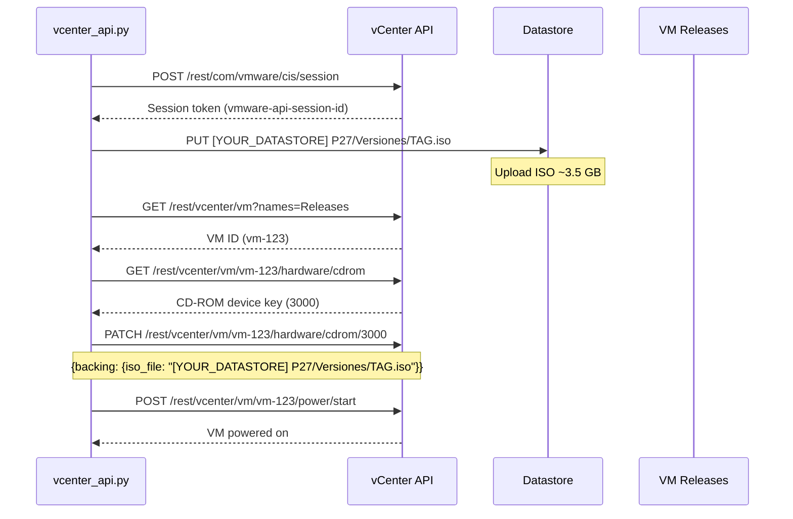

# ☁️ Pipeline - vCenter (Fase 4)

## Visión General

**vCenter Integration** es la cuarta fase. Sube el ISO compilado al datastore de vCenter, configura el CD-ROM de la VM objetivo y enciende la VM.

**Relacionado con**:
- [[Pipeline - SonarQube]] - Fase anterior
- [[Pipeline - SSH Deploy]] - Siguiente fase
- [[Referencia - APIs Externas#vCenter]] - API REST

---

## Responsabilidades

1. **Autenticación** - Login a vCenter REST API (session-based)
2. **Upload ISO** - Subir ISO al datastore YOUR_DATASTORE
3. **Configurar CD-ROM** - Montar ISO en VM "Releases"
4. **Power On** - Encender la VM

---

## Script

**Ubicación**: `python/vcenter_api.py`

**Invocación**:
```bash
# Desde pipeline
python3.6 python/vcenter_api.py config/ci_cd_config.yaml upload_iso /home/YOUR_USER/compile/InstallationDVD.iso

# Operaciones individuales
python3.6 python/vcenter_api.py config/ci_cd_config.yaml get_vm_status
python3.6 python/vcenter_api.py config/ci_cd_config.yaml configure_cdrom V24_02_15_01.iso
python3.6 python/vcenter_api.py config/ci_cd_config.yaml power_on_vm
```

---

## Arquitectura



---

## Funciones Principales

### 1. `authenticate()`

```python
def authenticate(base_url, username, password):
    """Login to vCenter and get session token"""
    import requests
    import urllib3
    
    urllib3.disable_warnings(urllib3.exceptions.InsecureRequestWarning)
    
    url = "{}/rest/com/vmware/cis/session".format(base_url)
    response = requests.post(url, auth=(username, password), verify=False)
    
    if response.status_code == 200:
        token = response.json()['value']
        logging.info("Authenticated to vCenter")
        return token
    else:
        logging.error("Authentication failed: {}".format(response.status_code))
        return None
```

### 2. `upload_iso()`

```python
def upload_iso(session, base_url, iso_path, tag_name):
    """Upload ISO to datastore"""
    datastore = "YOUR_DATASTORE"
    ds_path = "P27/Versiones/{}.iso".format(tag_name)
    
    # vCenter datastore upload endpoint
    upload_url = "{}/folder/{}?dsName={}".format(
        base_url.replace('/rest', ''),
        ds_path,
        datastore
    )
    
    headers = {'vmware-api-session-id': session}
    
    with open(iso_path, 'rb') as f:
        response = requests.put(
            upload_url,
            headers=headers,
            data=f,
            verify=False
        )
    
    if response.status_code in [200, 201]:
        logging.info("ISO uploaded: [{}] {}".format(datastore, ds_path))
        return True
    else:
        logging.error("Upload failed: {}".format(response.status_code))
        return False
```

### 3. `configure_cdrom()`

```python
def configure_cdrom(session, base_url, vm_id, iso_path):
    """Configure VM CD-ROM to use uploaded ISO"""
    headers = {
        'vmware-api-session-id': session,
        'Content-Type': 'application/json'
    }
    
    # Get CD-ROM device
    cdrom_url = "{}/rest/vcenter/vm/{}/hardware/cdrom".format(base_url, vm_id)
    response = requests.get(cdrom_url, headers=headers, verify=False)
    cdroms = response.json()['value']
    
    if not cdroms:
        logging.error("No CD-ROM devices found")
        return False
    
    cdrom_key = cdroms[0]['cdrom']
    
    # Update CD-ROM backing
    update_url = "{}/rest/vcenter/vm/{}/hardware/cdrom/{}".format(
        base_url, vm_id, cdrom_key
    )
    
    payload = {
        'spec': {
            'backing': {
                'type': 'ISO_FILE',
                'iso_file': iso_path
            },
            'start_connected': True,
            'allow_guest_control': True
        }
    }
    
    response = requests.patch(update_url, headers=headers, json=payload, verify=False)
    
    if response.status_code == 200:
        logging.info("CD-ROM configured with ISO")
        return True
    else:
        logging.error("CD-ROM config failed: {}".format(response.text))
        return False
```

### 4. `power_on_vm()`

```python
def power_on_vm(session, base_url, vm_id):
    """Power on VM"""
    headers = {'vmware-api-session-id': session}
    power_url = "{}/rest/vcenter/vm/{}/power/start".format(base_url, vm_id)
    
    response = requests.post(power_url, headers=headers, verify=False)
    
    if response.status_code in [200, 204]:
        logging.info("VM powered on")
        return True
    elif response.status_code == 400 and 'already powered on' in response.text:
        logging.info("VM already powered on")
        return True
    else:
        logging.error("Power on failed: {}".format(response.text))
        return False
```

---

## Configuración

```yaml
vcenter:
  api_url: "https://vcenter.example.com/rest"
  datacenter: "YOUR_DATACENTER"
  vm_name: "Releases"
  username: "${VCENTER_USER}"
  password: "${VCENTER_PASSWORD}"
  
  datastore: "YOUR_DATASTORE"
  datastore_path: "P27/Versiones/"
```

**.env**:
```bash
VCENTER_USER=administrator@vsphere.local
VCENTER_PASSWORD=vCenter_P@ssw0rd!
```

---

## Gestión de Errores

### Session Timeout (401)

**Síntoma**: `HTTP 401 Unauthorized` después de 30 min

**Solución**: Reconectar automáticamente
```python
def api_call_with_retry(func, *args, **kwargs):
    try:
        return func(*args, **kwargs)
    except requests.exceptions.HTTPError as e:
        if e.response.status_code == 401:
            logging.warning("Session expired, re-authenticating...")
            session = authenticate(...)
            kwargs['session'] = session
            return func(*args, **kwargs)
        raise
```

### ISO Upload Timeout

**Síntoma**: Upload de 3.5GB tarda mucho o falla

**Solución**:
```python
# Aumentar timeout
response = requests.put(url, data=f, verify=False, timeout=3600)

# Progress bar (opcional)
from tqdm import tqdm
with tqdm(total=os.path.getsize(iso_path)) as pbar:
    response = requests.put(url, data=ChunkedUpload(f, pbar))
```

**Ver troubleshooting**: [[Operación - Troubleshooting#vCenter]]

---

## Performance

| Operación | Tiempo Típico |
|-----------|---------------|
| Autenticación | 1-2 segundos |
| Upload ISO (3.5 GB) | 5-10 minutos (depende red) |
| Get VM ID | 1 segundo |
| Configure CD-ROM | 2-3 segundos |
| Power On VM | 2-3 segundos |
| **TOTAL** | **~5-15 minutos** |

---

## Enlaces Relacionados

- [[Arquitectura del Pipeline#Fase 4]]
- [[Pipeline - SSH Deploy]] - Siguiente fase
- [[Referencia - APIs Externas#vCenter]] - Documentación API
- [[Operación - Troubleshooting#vCenter]]
