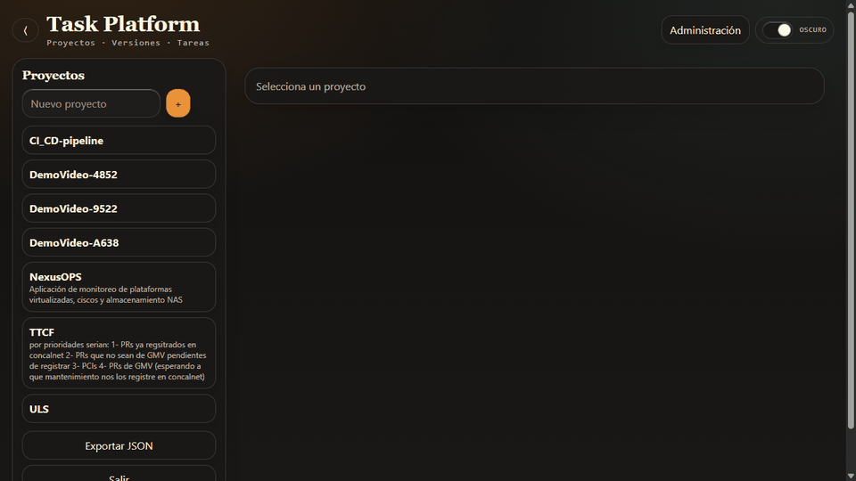

# Task Platform (MVP)

MVP auto-alojado (LAN) para gestión de tareas por **Proyecto + Versión/Release**.

## Requisitos
- Docker + Docker Compose

## Arranque rápido
```powershell
cd task-platform
Copy-Item .env.example .env
# (opcional) edita .env

docker compose up --build -d
```

- Web: http://localhost:8080
- Admin UI (solo admin): http://localhost:8080/admin/users
- API (docs): http://localhost:8000/docs

## Demo
Recorrido rápido de la app (generado con Playwright):

### GIF (sin login)


- GIF: [artifacts/demo/task-platform-demo-no-login.gif](artifacts/demo/task-platform-demo-no-login.gif)
- MP4: [artifacts/demo/task-platform-demo-no-login.mp4](artifacts/demo/task-platform-demo-no-login.mp4)

### GIF (incluye login)
- GIF: [artifacts/demo/task-platform-demo.gif](artifacts/demo/task-platform-demo.gif)
- MP4: [artifacts/demo/task-platform-demo.mp4](artifacts/demo/task-platform-demo.mp4)

Frames individuales: `artifacts/demo/frames/*.png`

## Licencia
Este proyecto está disponible bajo **GNU AGPL v3.0 o posterior** (ver [`LICENSE`](LICENSE)).

Para uso comercial con términos alternativos (licencia propietaria / sin obligaciones AGPL), consulta [`COMMERCIAL_LICENSE.md`](COMMERCIAL_LICENSE.md) y contacta en el email indicado allí (recuerda reemplazar el placeholder).

> Nota: las dependencias de terceros (p. ej. frontend) mantienen sus **propias licencias**; ver sus ficheros `LICENSE*` correspondientes.

## Qué incluye el MVP
- Login local (multiusuario) con distinción **Admin** vs **Usuario**.
  - Access token (en memoria) + refresh token via cookie httpOnly.
- **Panel de administración** (solo admin):
  - Usuarios (crear/activar/desactivar, reset password, promover a admin).
  - Proyectos (crear/editar/borrar) + asignación de accesos ("quién ve qué proyecto").
  - Versiones/Releases (crear/renombrar/borrar) por proyecto.
  - Estadísticas (overview global y por proyecto) con gráficos (estado/prioridad, audit, adjuntos).
- **Acceso por proyecto**: un usuario no-admin solo ve los proyectos que le asigne un admin.
- Permisos:
  - Admin: gestiona proyectos y releases.
  - Usuario: puede trabajar con tareas dentro de proyectos asignados pero **no crea** proyectos ni releases.
- **Gestión de tareas** por proyecto + versión/release:
  - Vistas: **Kanban** y **Lista**.
  - Filtros: estado, prioridad y tag + búsqueda.
  - Presets (vistas guardadas) por proyecto.
  - Campos: título, descripción (Markdown), prioridad, estado, vencimiento, estimación (horas), tags.
  - Auditoría/Historial de eventos (creación/edición, etc.) visible en el detalle.
- Adjuntos: subir/descargar/borrar (límite 100MB por archivo).
- Export JSON: **solo admin** (UI y endpoint `/export`).

## Credenciales iniciales
Se crea un usuario admin al arrancar si no existe (variables en `.env`):
- `ADMIN_EMAIL` (ej: `admin@example.com`)
- `ADMIN_PASSWORD`

Después, entra en el panel admin (`/admin/users`) para **crear usuarios** y **asignarles proyectos**.

## Persistencia (tareas no deberían “perderse”)
Las tareas/proyectos y adjuntos se guardan en **volúmenes Docker** (`db_data` y `uploads`).

- `docker compose up --build` / rebuild de contenedores **NO borra** los datos.
- Se perderán si ejecutas **`docker compose down -v`** o si eliminas volúmenes (`docker volume rm ...`).
- También puede parecer que “faltan tareas” si estás viendo **Backlog** pero esas tareas están asignadas a una **Versión/Release** (usa el selector **Versión**).

Para que los volúmenes sean estables aunque cambie el nombre de la carpeta/proyecto, los nombres están fijados en `docker-compose.yml` (`task-platform_db_data` y `task-platform_uploads`). Si prefieres, también puedes usar `COMPOSE_PROJECT_NAME=task-platform` en `.env` (ya viene en `.env.example`).

## Migraciones (Alembic)
El backend (api/) ahora incluye configuración de **Alembic** en `api/alembic.ini` + `api/alembic/`.

- **BD existente** (creada históricamente vía `create_all` en startup):
  ```powershell
  docker compose exec api alembic stamp 0001_initial
  ```
  Esto crea/actualiza `alembic_version` sin tocar tablas (baseline).

- **BD vacía/nueva** (opcional):
  ```powershell
  docker compose exec api alembic upgrade head
  ```

- Ver estado:
  ```powershell
  docker compose exec api alembic current
  docker compose exec api alembic history
  ```

A futuro, las evoluciones del esquema deberían hacerse con:
```powershell
docker compose exec api alembic revision --autogenerate -m "..."
docker compose exec api alembic upgrade head
```

## Migraciones (Alembic)
El contenedor `api` ejecuta `alembic upgrade head` al arrancar.

- Si vienes de una DB creada antes de Alembic (sin `alembic_version`), el arranque hace `alembic stamp 0001_initial` automáticamente y luego aplica migraciones.
- Para ejecutar manualmente:
  ```powershell
  docker compose exec api alembic current
  docker compose exec api alembic upgrade head
  ```

## Backups / Restore
### Export lógico (JSON)
- En la UI (solo admin): botón **Exportar JSON**.
- Endpoint (solo admin): `GET http://localhost:8000/export` (requiere auth).

### Backup de Postgres (SQL)
```powershell
# genera un dump en el host
cd task-platform
docker compose exec -T db pg_dump -U $env:POSTGRES_USER -d $env:POSTGRES_DB > backup.sql
```

Restore:
```powershell
cd task-platform
Get-Content -Raw .\backup.sql | docker compose exec -T db psql -U $env:POSTGRES_USER -d $env:POSTGRES_DB
```

### Backup de uploads (adjuntos)
```powershell
cd task-platform
# copia el volumen de uploads desde el contenedor api
docker compose cp api:/data/uploads .\uploads-backup
```

Restore (sobrescribe):
```powershell
cd task-platform
docker compose cp .\uploads-backup\. api:/data/uploads
```
