# Documentación Técnica — Agentes de Fondo (Background Agents)

> **Sistema de Monitorización y Reporting Automático**
> Versión: 1.0 | Última actualización: 2026-03-12

---

## Índice

1. [Visión General](#1-visión-general)
2. [Arquitectura del Subsistema](#2-arquitectura-del-subsistema)
3. [Agente: Report Scheduler](#3-agente-report-scheduler)
4. [Agente: Performance Report Agent](#4-agente-performance-report-agent)
   - 4.1 [Pipeline de generación del informe](#41-pipeline-de-generación-del-informe)
   - 4.2 [Recolección vCenter](#42-recolección-vcenter)
   - 4.3 [Análisis de logs](#43-análisis-de-logs)
   - 4.4 [Métricas históricas](#44-métricas-históricas)
   - 4.5 [Análisis LLM](#45-análisis-llm)
   - 4.6 [Generación PDF](#46-generación-pdf)
5. [Colector: TrueNAS SNMP](#5-colector-truenas-snmp)
   - 5.1 [Arquitectura SNMP](#51-arquitectura-snmp)
   - 5.2 [Secciones de recolección](#52-secciones-de-recolección)
   - 5.3 [OIDs por sección](#53-oids-por-sección)
   - 5.4 [Configuración](#54-configuración)
6. [Colector: Cisco Catalyst SNMP](#6-colector-cisco-catalyst-snmp)
   - 6.1 [Arquitectura SNMP](#61-arquitectura-snmp)
   - 6.2 [Secciones de recolección](#62-secciones-de-recolección)
   - 6.3 [Cálculo de tráfico VLAN (delta de contadores)](#63-cálculo-de-tráfico-vlan-delta-de-contadores)
   - 6.4 [Correlación VLAN → Usuario](#64-correlación-vlan--usuario)
   - 6.5 [OIDs por sección](#65-oids-por-sección)
   - 6.6 [Configuración](#66-configuración)
7. [Integración de colectores en el informe](#7-integración-de-colectores-en-el-informe)
8. [Tolerancia a fallos](#8-tolerancia-a-fallos)
9. [Observabilidad y logs](#9-observabilidad-y-logs)
10. [Parámetros de configuración](#10-parámetros-de-configuración)
11. [Referencia de archivos](#11-referencia-de-archivos)

---

## 1. Visión General

El subsistema de Background Agents ejecuta tareas autónomas en segundo plano:

| Agente / Colector | Tipo | Frecuencia | Propósito |
|-------------------|------|------------|-----------|
| `report_scheduler.py` | Scheduler APScheduler | — | Dispara el informe diario a las 07:00 |
| `performance_report_agent.py` | Orquestador | Diario 07:00 | Genera PDF con estado completo del entorno |
| `truenas_snmp_collector.py` | Colector SNMP v3 | En cada informe | Métricas sistema/CPU/memoria/ZFS/red/temp TrueNAS |
| `cisco_catalyst_snmp_collector.py` | Colector SNMP v2c | En cada informe | Métricas switch Cisco Catalyst 3850 |
| `historical_data_collector.py` | Colector histórico | Cada 10 min | Serie temporal CPU/RAM ESXi para tendencias |
| `advanced_esxi_collector.py` | Colector ESXi | En cada informe | Métricas avanzadas por host ESXi |

---

## 2. Arquitectura del Subsistema

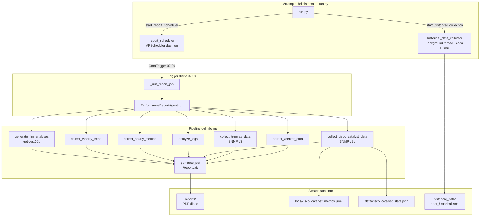

---

## 3. Agente: Report Scheduler

`background_agents/report_scheduler.py`

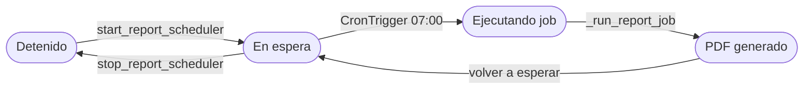

### API pública

| Función | Descripción |
|---------|-------------|
| `start_report_scheduler()` | Arranca el scheduler daemon (idempotente) |
| `stop_report_scheduler()` | Detiene el scheduler limpiamente |
| `generate_report_now()` | Genera un informe inmediato (botón admin) |
| `list_reports(n=30)` | Lista los últimos N PDF en `reports/` |

### Parámetros del job

| Parámetro | Valor | Descripción |
|-----------|-------|-------------|
| `trigger` | `CronTrigger(hour=7, minute=0)` | Ejecución diaria a las 07:00 |
| `misfire_grace_time` | 3600 s | Tolerancia si el sistema estaba apagado |
| `daemon` | `True` | No bloquea el shutdown de Flask |
| `id` | `daily_performance_report` | Identificador único del job |

---

## 4. Agente: Performance Report Agent

`background_agents/performance_report_agent.py`

### 4.1 Pipeline de generación del informe

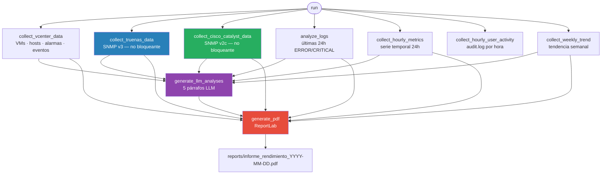

### 4.2 Recolección vCenter

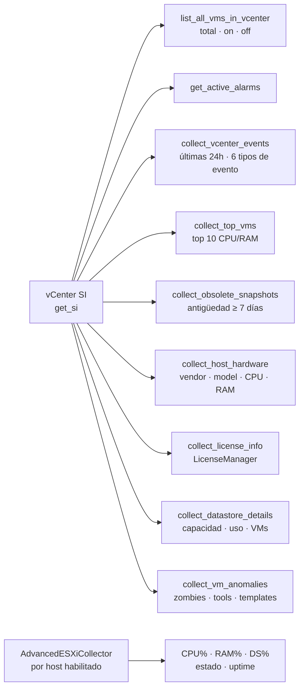

**Eventos vCenter capturados (últimas 24h):**
- `HostConnectionLostEvent`
- `GeneralHostErrorEvent`
- `GeneralVmErrorEvent`
- `AlarmStatusChangedEvent`
- `VmPoweredOnEvent`
- `VmPoweredOffEvent`

**Anomalías de VMs detectadas:**

| Tipo | Criterio |
|------|----------|
| Zombie VMs | `poweredOn` + `overallCpuUsage == 0 MHz` |
| VMware Tools no instaladas | `toolsStatus == toolsNotInstalled` |
| VMware Tools no ejecutando | `toolsNotRunning` + `poweredOn` |
| VMware Tools desactualizadas | `toolsStatus == toolsOld` |
| Plantillas | `config.template == True` |

### 4.3 Análisis de logs

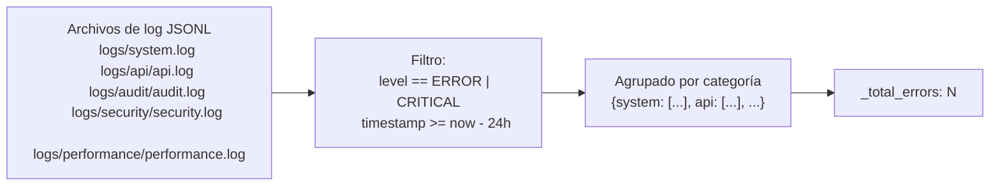

### 4.4 Métricas históricas

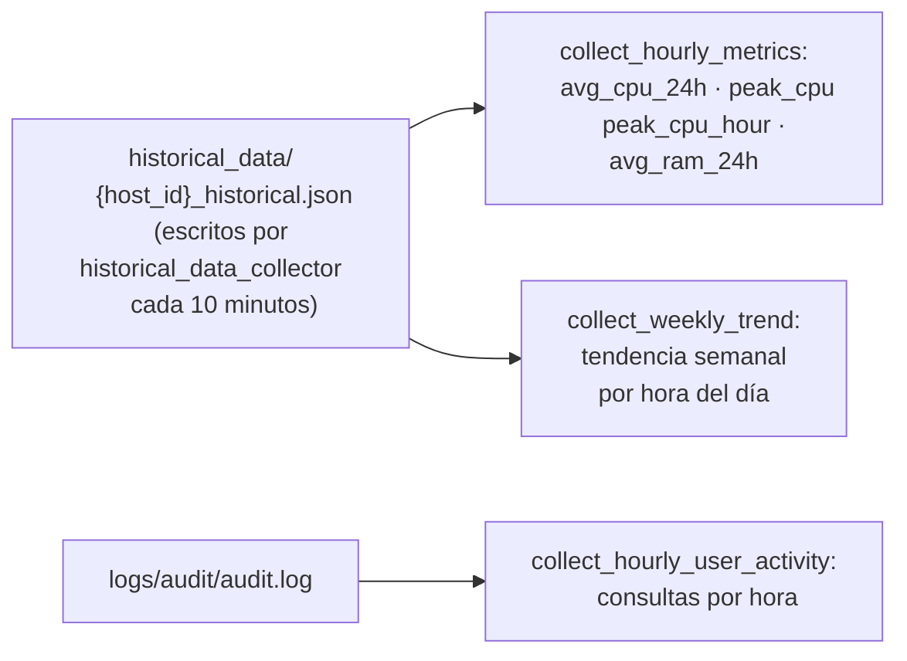

### 4.5 Análisis LLM

El agente genera **5 párrafos de análisis narrativo** usando el LLM local (`gpt-oss:20b`):

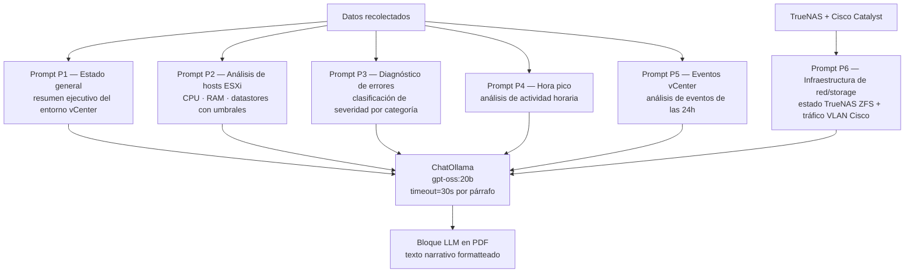

**Comportamiento ante timeout:** Si el LLM no responde en 30s, el bloque correspondiente aparece como `None` y el PDF omite ese análisis sin abortar la generación.

### 4.6 Generación PDF

El PDF se genera con **ReportLab** y se guarda en `reports/informe_rendimiento_YYYY-MM-DD.pdf`.

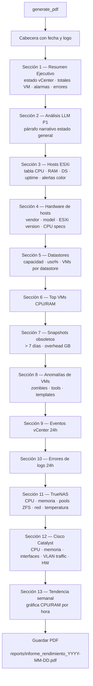

---

## 5. Colector: TrueNAS SNMP

`background_agents/truenas_snmp_collector.py`

### 5.1 Arquitectura SNMP

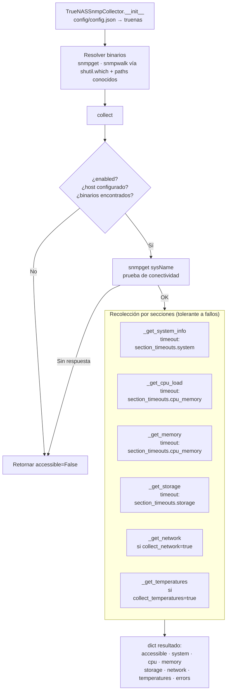

**Principios de diseño:**
- **Sin dependencias Python para SNMP**: usa `subprocess` + binarios del SO (`snmpget`/`snmpwalk`)
- **Sin estado entre llamadas**: cada `collect()` es independiente
- **Tolerante a fallos**: un OID no disponible no detiene la recolección — se añade a `errors[]`
- **Timeouts por sección**: cada sección tiene su propio timeout configurable

### 5.2 Secciones de recolección

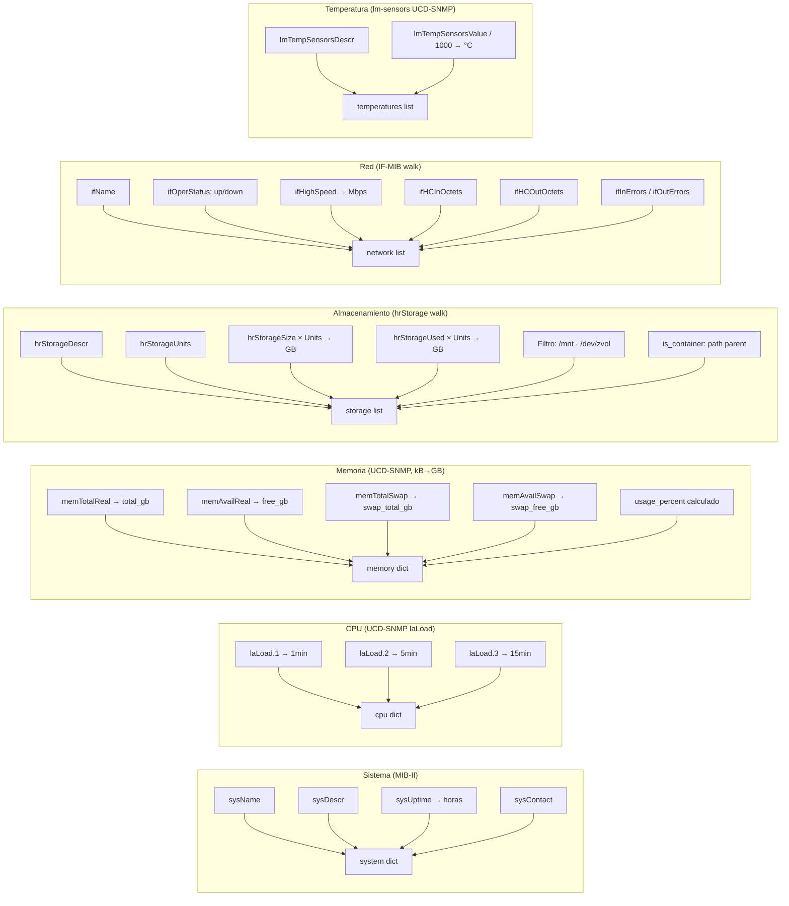

### 5.3 OIDs por sección

| Sección | OID | Descripción |
|---------|-----|-------------|
| **Sistema** | `1.3.6.1.2.1.1.5.0` | sysName |
| | `1.3.6.1.2.1.1.1.0` | sysDescr |
| | `1.3.6.1.2.1.1.3.0` | sysUpTime |
| | `1.3.6.1.2.1.1.4.0` | sysContact |
| **CPU** | `1.3.6.1.4.1.2021.10.1.3.1` | laLoad 1 min |
| | `1.3.6.1.4.1.2021.10.1.3.2` | laLoad 5 min |
| | `1.3.6.1.4.1.2021.10.1.3.3` | laLoad 15 min |
| **Memoria** | `1.3.6.1.4.1.2021.4.5.0` | memTotalReal (kB) |
| | `1.3.6.1.4.1.2021.4.6.0` | memAvailReal (kB) |
| | `1.3.6.1.4.1.2021.4.3.0` | memTotalSwap (kB) |
| | `1.3.6.1.4.1.2021.4.4.0` | memAvailSwap (kB) |
| **Almacenamiento** | `1.3.6.1.2.1.25.2.3.1.3` | hrStorageDescr (walk) |
| | `1.3.6.1.2.1.25.2.3.1.4` | hrStorageAllocationUnits |
| | `1.3.6.1.2.1.25.2.3.1.5` | hrStorageSize |
| | `1.3.6.1.2.1.25.2.3.1.6` | hrStorageUsed |
| **Red** | `1.3.6.1.2.1.31.1.1.1.1` | ifName (walk) |
| | `1.3.6.1.2.1.2.2.1.8` | ifOperStatus |
| | `1.3.6.1.2.1.31.1.1.1.15` | ifHighSpeed (Mbps) |
| | `1.3.6.1.2.1.31.1.1.1.6` | ifHCInOctets (64-bit) |
| | `1.3.6.1.2.1.31.1.1.1.10` | ifHCOutOctets (64-bit) |
| | `1.3.6.1.2.1.2.2.1.14` | ifInErrors |
| | `1.3.6.1.2.1.2.2.1.20` | ifOutErrors |
| **Temperatura** | `1.3.6.1.4.1.2021.13.16.2.1.2` | lmTempSensorsDescr (walk) |
| | `1.3.6.1.4.1.2021.13.16.2.1.3` | lmTempSensorsValue (milli°C) |

### 5.4 Configuración

Sección `truenas` en `config/config.json`:

```json
{
  "truenas": {
    "enabled": true,
    "host": "192.168.1.X",
    "port": 161,
    "timeout_seconds": 10,
    "retries": 2,
    "snmp_user": "agent",
    "snmp_auth_protocol": "SHA",
    "snmp_auth_password": "YOUR_AUTH_PASS",
    "snmp_priv_protocol": "AES",
    "snmp_priv_password": "YOUR_PRIV_PASS",
    "collect_temperatures": true,
    "collect_network": true,
    "storage_filter_prefixes": ["/mnt", "/dev/zvol"],
    "section_timeouts": {
      "system": 5,
      "cpu_memory": 8,
      "storage": 15,
      "network": 10,
      "temperatures": 8
    }
  }
}
```

**Requisito:** Binarios SNMP del SO instalados:
```bash
sudo apt-get install snmp
```

---

## 6. Colector: Cisco Catalyst SNMP

`background_agents/cisco_catalyst_snmp_collector.py`

### 6.1 Arquitectura SNMP

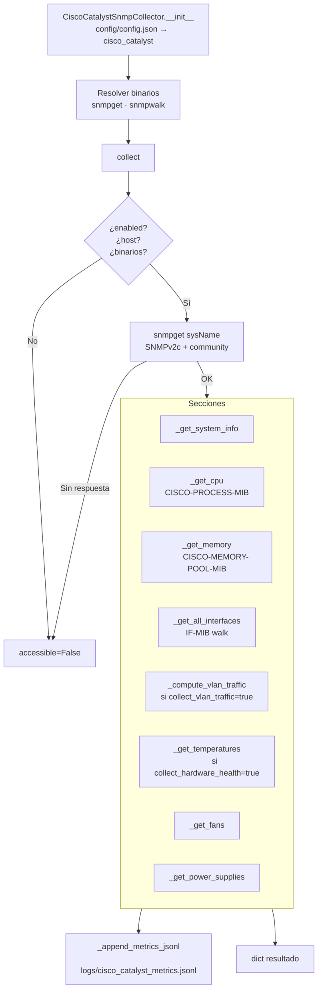

**Diferencia clave vs TrueNAS:** usa **SNMPv2c** (community string) en lugar de SNMPv3 (usuario + auth + priv).

### 6.2 Secciones de recolección

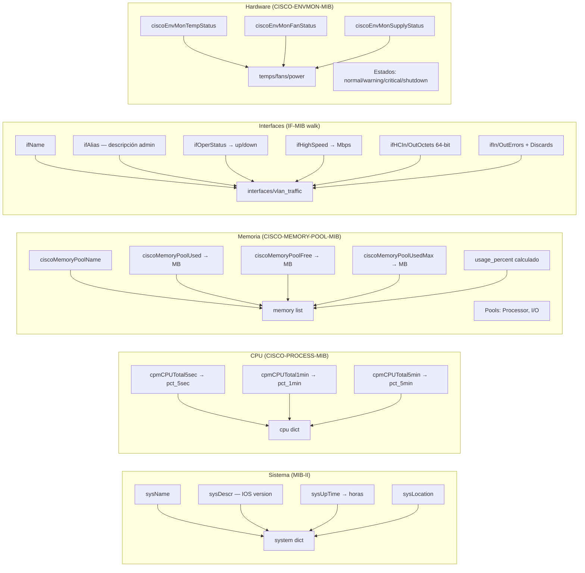

### 6.3 Cálculo de tráfico VLAN (delta de contadores)

El tráfico por VLAN se calcula mediante **deltas de contadores HC de 64 bits** entre polls consecutivos. Los contadores se persisten entre ejecuciones.

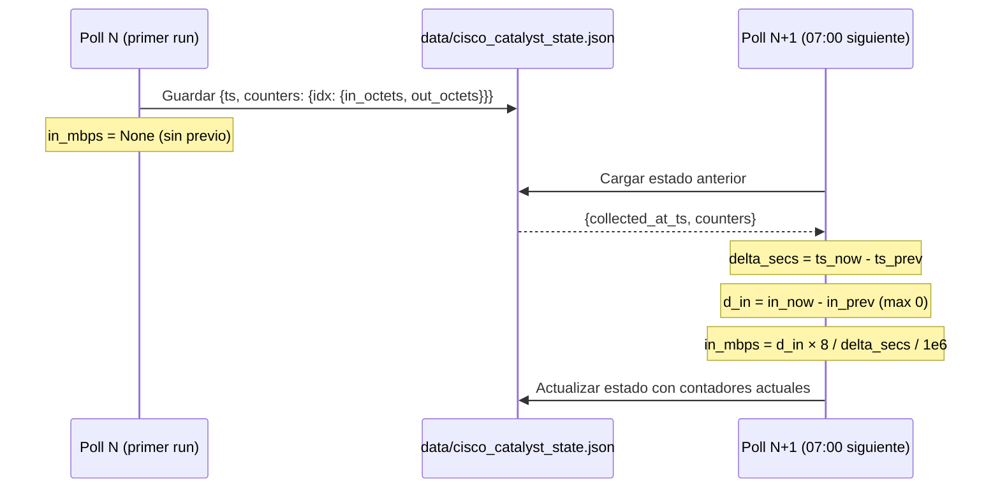

**Fórmula de conversión:**

```
in_mbps  = (in_octets_now  - in_octets_prev)  × 8 / delta_seconds / 1_000_000
out_mbps = (out_octets_now - out_octets_prev) × 8 / delta_seconds / 1_000_000
```

> Los contadores son 64-bit (HC — High Capacity). No deberían hacer wrap en intervalos de ~24h pero el código aplica `max(0, delta)` como salvaguarda.

### 6.4 Correlación VLAN → Usuario

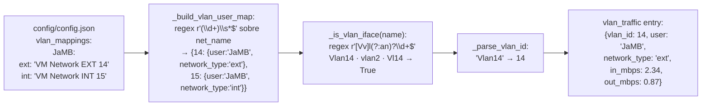

### 6.5 OIDs por sección

| Sección | OID | Descripción |
|---------|-----|-------------|
| **Sistema** | `1.3.6.1.2.1.1.5.0` | sysName |
| | `1.3.6.1.2.1.1.1.0` | sysDescr (versión IOS) |
| | `1.3.6.1.2.1.1.3.0` | sysUpTime |
| | `1.3.6.1.2.1.1.6.0` | sysLocation |
| **CPU** | `1.3.6.1.4.1.9.9.109.1.1.1.1.6.1` | cpmCPUTotal5sec (%) |
| | `1.3.6.1.4.1.9.9.109.1.1.1.1.7.1` | cpmCPUTotal1min (%) |
| | `1.3.6.1.4.1.9.9.109.1.1.1.1.8.1` | cpmCPUTotal5min (%) |
| **Memoria** | `1.3.6.1.4.1.9.9.48.1.1.1.2` | ciscoMemoryPoolName (walk) |
| | `1.3.6.1.4.1.9.9.48.1.1.1.5` | ciscoMemoryPoolUsed (bytes) |
| | `1.3.6.1.4.1.9.9.48.1.1.1.6` | ciscoMemoryPoolFree (bytes) |
| | `1.3.6.1.4.1.9.9.48.1.1.1.7` | ciscoMemoryPoolUsedMax (bytes) |
| **Interfaces** | `1.3.6.1.2.1.31.1.1.1.1` | ifName (walk) |
| | `1.3.6.1.2.1.31.1.1.1.18` | ifAlias (descripción admin) |
| | `1.3.6.1.2.1.2.2.1.8` | ifOperStatus |
| | `1.3.6.1.2.1.31.1.1.1.15` | ifHighSpeed (Mbps) |
| | `1.3.6.1.2.1.31.1.1.1.6` | ifHCInOctets (64-bit) |
| | `1.3.6.1.2.1.31.1.1.1.10` | ifHCOutOctets (64-bit) |
| | `1.3.6.1.2.1.2.2.1.14` | ifInErrors |
| | `1.3.6.1.2.1.2.2.1.20` | ifOutErrors |
| | `1.3.6.1.2.1.2.2.1.13` | ifInDiscards |
| | `1.3.6.1.2.1.2.2.1.19` | ifOutDiscards |
| **VLANs** | `1.3.6.1.4.1.9.9.46.1.3.1.1.2.1` | vtpVlanState (walk) |
| | `1.3.6.1.4.1.9.9.46.1.3.1.1.4.1` | vtpVlanName (walk) |
| **Temperatura** | `1.3.6.1.4.1.9.9.13.1.3.1.2` | ciscoEnvMonTempStatusDescr |
| | `1.3.6.1.4.1.9.9.13.1.3.1.3` | ciscoEnvMonTempStatusValue (°C) |
| | `1.3.6.1.4.1.9.9.13.1.3.1.6` | ciscoEnvMonTempState |
| **Fans** | `1.3.6.1.4.1.9.9.13.1.4.1.2` | ciscoEnvMonFanStatusDescr |
| | `1.3.6.1.4.1.9.9.13.1.4.1.3` | ciscoEnvMonFanState |
| **Fuentes alim.** | `1.3.6.1.4.1.9.9.13.1.5.1.2` | ciscoEnvMonSupplyStatusDescr |
| | `1.3.6.1.4.1.9.9.13.1.5.1.3` | ciscoEnvMonSupplyState |

**Códigos de estado ENVMON:**

| Código | Estado |
|--------|--------|
| 1 | `normal` |
| 2 | `warning` |
| 3 | `critical` |
| 4 | `shutdown` |
| 5 | `notPresent` |
| 6 | `notFunctioning` |

### 6.6 Configuración

Sección `cisco_catalyst` en `config/config.json`:

```json
{
  "cisco_catalyst": {
    "enabled": true,
    "host": "192.168.X.X",
    "port": 161,
    "timeout_seconds": 10,
    "retries": 2,
    "snmp_community": "TTCF",
    "collect_hardware_health": true,
    "collect_vlan_traffic": true,
    "state_file": "data/cisco_catalyst_state.json",
    "metrics_file": "logs/cisco_catalyst_metrics.jsonl",
    "section_timeouts": {
      "system": 5,
      "cpu_memory": 8,
      "interfaces": 15,
      "vlans": 10,
      "hardware": 10
    }
  },
  "vlan_mappings": {
    "JaMB": {
      "ext": "VM Network EXT 14",
      "int": "VM Network INT 15"
    }
  }
}
```

---

## 7. Integración de colectores en el informe

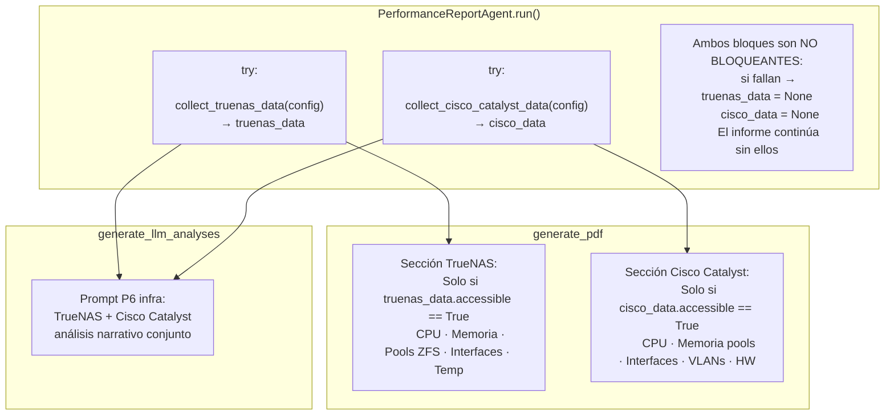

---

## 8. Tolerancia a fallos

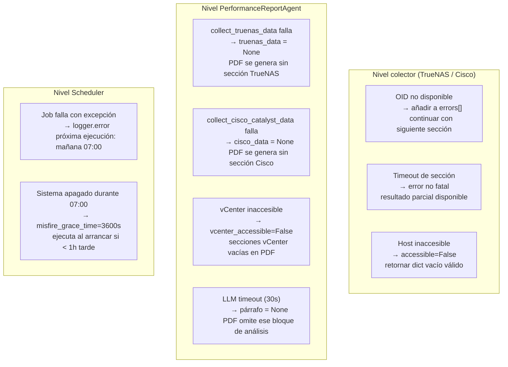

**Principio**: ningún fallo individual interrumpe la generación del PDF. El informe puede ser parcial pero siempre se genera.

---

## 9. Observabilidad y logs

### Archivos de log

| Log | Ruta | Contenido |
|-----|------|-----------|
| Performance Report Agent | `logs/system.log` | Errores + info del agente |
| Report Scheduler | `logs/system.log` | Start/stop scheduler, job completado |
| Cisco métricas históricas | `logs/cisco_catalyst_metrics.jsonl` | Una línea JSONL por poll |
| Estado VLAN counters | `data/cisco_catalyst_state.json` | Contadores del último poll |

### Diagnóstico rápido

```powershell
# Ver último informe generado
ls reports/ | sort -Property LastWriteTime -Descending | head -1

# Verificar que el scheduler está activo
Get-Content logs/system.log -Tail 50 | Select-String "Scheduler de informes"

# Ver último poll Cisco Catalyst
Get-Content logs/cisco_catalyst_metrics.jsonl -Tail 1 | ConvertFrom-Json

# Forzar generación manual (consola Python)
# from background_agents.report_scheduler import generate_report_now
# generate_report_now()

# Ver errores de los colectores SNMP en el último informe
Get-Content logs/system.log -Tail 100 | Select-String "truenas|cisco_catalyst"
```

### Formato JSONL Cisco Catalyst

```json
{
  "accessible": true,
  "collected_at": "2026-03-12T07:00:05+00:00",
  "host": "192.168.X.X",
  "system": {"name": "SW-TTCF", "uptime_hours": 2160.5},
  "cpu": {"available": true, "pct_5sec": 4.0, "pct_1min": 3.0, "pct_5min": 3.0},
  "memory": [{"pool": "Processor", "total_mb": 870.6, "used_mb": 540.1, "usage_percent": 62.0}],
  "interfaces": [...],
  "vlan_traffic": [
    {"vlan_id": 14, "user": "JaMB", "network_type": "ext", "in_mbps": 2.34, "out_mbps": 0.87}
  ],
  "temperatures": [{"sensor": "Switch 1 - Inlet Temp Sensor", "temp_celsius": 28, "status": "normal"}],
  "fans": [{"fan": "Switch 1 - FAN 1", "status": "normal"}],
  "power": [{"psu": "Switch 1 - Power Supply A", "status": "normal"}],
  "errors": []
}
```

---

## 10. Parámetros de configuración

### Resumen global

| Parámetro | Archivo | Valor por defecto | Descripción |
|-----------|---------|-------------------|-------------|
| Scheduler hora | `report_scheduler.py` | `hour=7, minute=0` | Hora de ejecución diaria |
| `misfire_grace_time` | `report_scheduler.py` | `3600` s | Tolerancia por sistema apagado |
| `threshold_days` snapshots | `performance_report_agent.py` | `7` días | Snapshots considerados obsoletos |
| LLM timeout | `performance_report_agent.py` | `30` s por párrafo | Tiempo máximo por análisis LLM |
| Eventos vCenter max | `performance_report_agent.py` | `50` | Top N eventos en el informe |
| TrueNAS timeout global | `config.json → truenas` | `10` s | Fallback por sección |
| Cisco timeout global | `config.json → cisco_catalyst` | `10` s | Fallback por sección |
| Storage filter prefixes | `config.json → truenas` | `["/mnt", "/dev/zvol"]` | Filtrar pools ZFS relevantes |
| SNMP retries | ambos colectores | `2` | Reintentos antes de error |
| Cisco state file | `config.json → cisco_catalyst` | `data/cisco_catalyst_state.json` | Persistencia counters VLAN |
| Cisco metrics JSONL | `config.json → cisco_catalyst` | `logs/cisco_catalyst_metrics.jsonl` | Histórico de polls |

---

## 11. Referencia de archivos

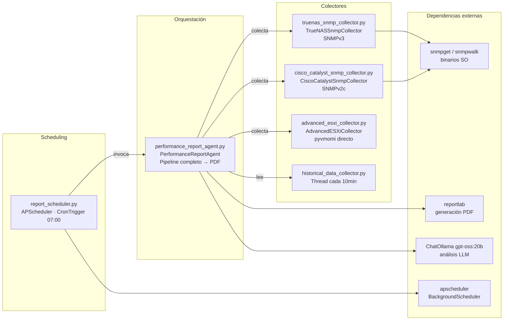

### Tabla de archivos

| Archivo | Clase / Función principal | Propósito |
|---------|--------------------------|-----------|
| `background_agents/report_scheduler.py` | `start_report_scheduler()` | Scheduler APScheduler diario 07:00 |
| `background_agents/performance_report_agent.py` | `PerformanceReportAgent` | Orquestación completa + PDF ReportLab |
| `background_agents/truenas_snmp_collector.py` | `TrueNASSnmpCollector` | Métricas TrueNAS via SNMPv3 |
| `background_agents/cisco_catalyst_snmp_collector.py` | `CiscoCatalystSnmpCollector` | Métricas Cisco Catalyst 3850 via SNMPv2c |
| `advanced_esxi_collector.py` | `AdvancedESXiCollector` | Métricas avanzadas ESXi via pyvmomi |
| `historical_data_collector.py` | `start_historical_collection()` | Serie temporal CPU/RAM ESXi (10 min) |
| `data/cisco_catalyst_state.json` | — | Persistencia de contadores VLAN entre polls |
| `logs/cisco_catalyst_metrics.jsonl` | — | Histórico de polls Cisco en formato JSONL |
| `reports/` | — | PDFs generados (`informe_rendimiento_YYYY-MM-DD.pdf`) |
| `historical_data/` | — | Series temporales `{host_id}_historical.json` |

---

*Documentación generada a partir del código fuente de `vcenter_agent_system/background_agents/`.*
*Para detalles de la arquitectura general del sistema ver `README.md` y `.github/copilot-instructions.md`.*
