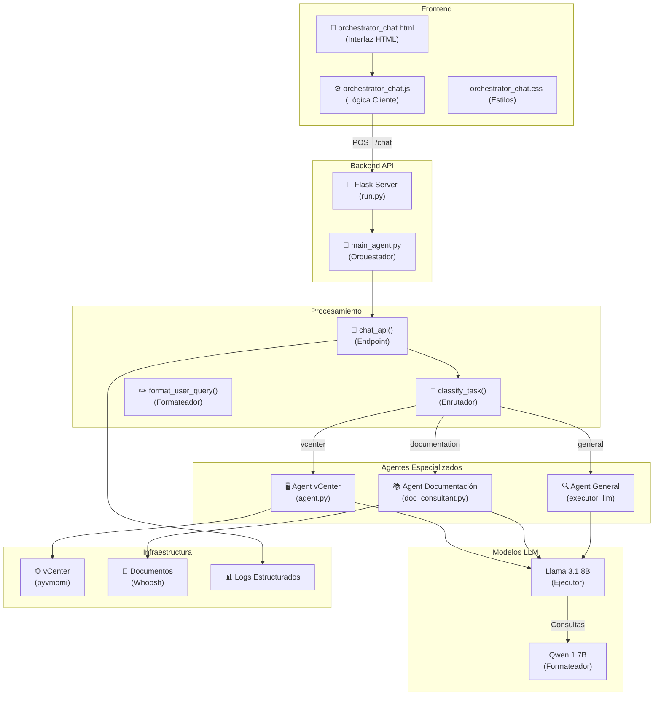
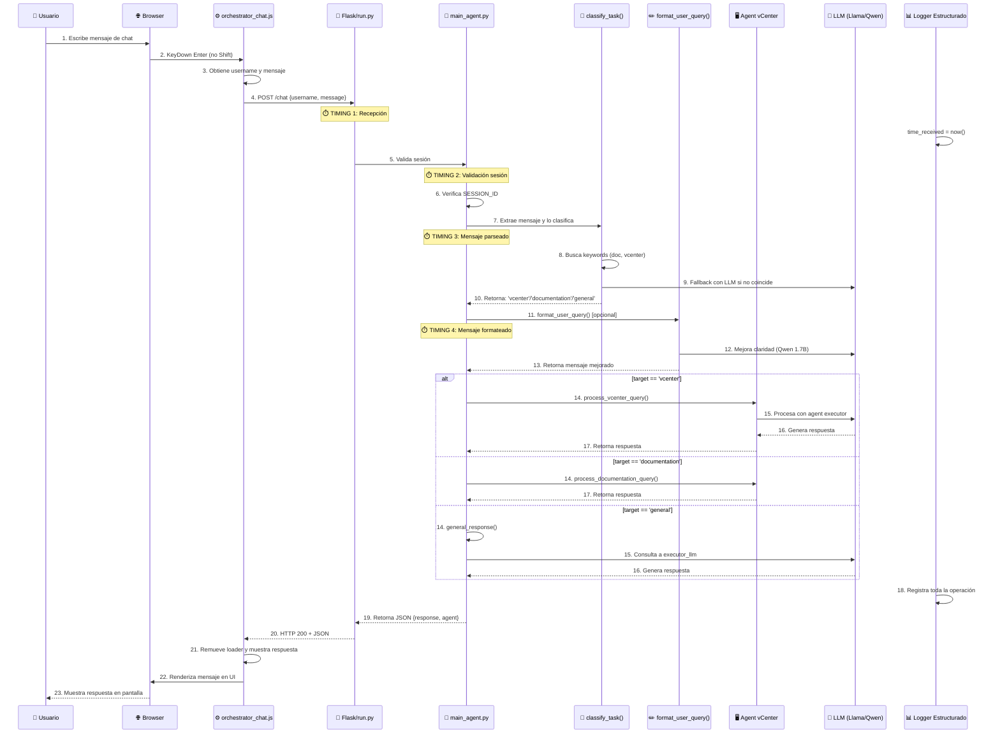

# Arquitectura del Sistema de Chat - Orquestador de Agentes

**Versión:** 1.0  
**Última actualización:** Enero 2026  
**Autor:** jmartinb  
**Descripción:** Documentación técnica y de funcionamiento de la página de chat del sistema vCenter & Documentation Consultant.

---

## 📋 Resumen Ejecutivo

El sistema de Chat del Orquestador es una interfaz web conversacional que actúa como **punto de entrada unificado** para múltiples agentes especializados:

- **Agente vCenter**: Operaciones de infraestructura (VM, hosts, datastores, snapshots)
- **Agente Documentación**: Búsqueda y consulta de archivos documentales
- **Agente General**: Respuestas a consultas generales

El sistema implementa:
- ✅ Enrutamiento inteligente de tareas basado en palabras clave y LLM
- ✅ Autenticación y gestión de sesiones persistentes
- ✅ Formateo opcional de consultas pre-procesadas
- ✅ Logging estructurado para auditoría y debugging
- ✅ Interfaz responsiva con soporte light/dark theme
- ✅ Medición de latencia en cada fase de procesamiento

---

## 🏗️ Arquitectura General



---

## 🔄 Flujo de Ejecución Detallado



---

## 📊 Componentes Principales

### 1. **Frontend (Cliente)**

#### Archivo: `templates/chat/orchestrator_chat.html`

**Responsabilidad**: Interfaz HTML para la interacción del usuario.

**Características**:
- Formulario de entrada de texto (textarea)
- Log de conversación (div#log)
- Indicador de usuario activo
- Botón toggle tema (light/dark)
- Indicador del último agente que respondió

**Estructura HTML**:
```html
<div class="container">
  <h1>Orquestador de Agentes <span id="last-agent">-</span></h1>
  <div id="log" aria-live="polite"></div>
  <form id="chat-form">
    <textarea id="message"></textarea>
    <button type="submit" id="send-btn">Enviar</button>
  </form>
</div>
```

---

### 2. **JavaScript Cliente (Lógica Interactiva)**

#### Archivo: `static/js/orchestrator_chat.js`

**Responsabilidades**:
- Gestión de eventos del formulario
- Comunicación WebAPI con el servidor
- Renderización de mensajes en el log
- Gestión de tema (light/dark)
- Control de loading y errores

**Flujo Principal**:

```javascript
// Event: Envío de mensaje
form.addEventListener('submit', async (e) => {
  1. Valida entrada no vacía
  2. Obtiene username y mensaje
  3. Renderiza mensaje del usuario
  4. Muestra loader ("Pensando...")
  5. POST a /chat con {username, message}
  6. Recibe JSON {response, agent}
  7. Renderiza respuesta con timestamp
  8. Actualiza "last agent" badge
})
```

**Funciones Clave**:

| Función | Propósito | Parámetros |
|---------|----------|-----------|
| `appendMessage(role, html, agentName)` | Añade mensaje al log de chat | role, html, agentName |
| `timestamp()` | Genera timestamp formateado | - |
| `setLoading(p)` | Muestra spinner de carga | elemento padre |

---

### 3. **Backend API (Servidor Flask)**

#### Archivo: `src/api/main_agent.py` (Líneas 588-650)

**Endpoint**: `POST /chat`

**Responsabilidad**: Orquestar el flujo de procesamiento de mensajes.

**Request JSON**:
```json
{
  "username": "jmartinb",
  "message": "¿Cuántas VMs tenemos en vCenter?"
}
```

**Response JSON**:
```json
{
  "response": "Respuesta del agente...",
  "agent": "vcenter"
}
```

**Proceso**:

```python
@app.route('/chat', methods=['POST'])
def chat_api():
    # 1. Validar sesión
    session_id = session.get('session_id')
    validate_session(session_id)
    
    # 2. Extraer mensaje
    message = request.get_json().get('message').strip()
    
    # 3. Clasificar tarea
    target = classify_task(message)  # Usa mensaje ORIGINAL
    
    # 4. Formatear (opcional, post-routing)
    formatted_message = format_user_query(message, username) if ENABLE_FORMATTING
    
    # 5. Procesar según target
    if target == 'vcenter':
        answer = process_vcenter_query(username, formatted_message)
    elif target == 'documentation':
        answer = process_documentation_query(username, formatted_message)
    else:
        answer = general_response(username, formatted_message)
    
    # 6. Retornar respuesta
    return jsonify({'response': answer, 'agent': target})
```

---

## 🧠 Sistema de Enrutamiento (Routing)

### Función: `classify_task(message: str) -> str`

**Ubicación**: `src/api/main_agent.py` (Líneas 228-293)

**Prioridad de Clasificación**:

```
PRIORIDAD 1: Keywords de Documentación
  ├─ Detecta: "instalar", "configurar", "documentación", "manual", etc.
  └─ Retorna: 'documentation'

PRIORIDAD 2: Keywords de vCenter
  ├─ Detecta: "vm", "datastore", "snapshot", "host", "cpu", "memoria", etc.
  └─ Retorna: 'vcenter'

PRIORIDAD 3: Fallback LLM (Llama 3.1 8B)
  ├─ Usa executor_llm para clasificación inteligente
  ├─ Busca en respuesta: 'documentation', 'vcenter'
  └─ Retorna: 'general' (si no coincide)
```

**Ejemplo de Decisión**:

| Mensaje del Usuario | Palabras Clave | Target | Razón |
|-------------------|-----------------|--------|-------|
| "¿Cuántas VMs hay?" | vm | vcenter | Keyword match prioritario |
| "Cómo instalar DNS" | instalar, documentación | documentation | Prioridad 1 (doc keywords) |
| "Hola, ¿quién eres?" | - | general | No coincide keywords, fallback LLM |
| "Necesito snapshots de producción" | snapshots | vcenter | Keyword vCenter |

---

## ✏️ Sistema de Formateo de Consultas

### Función: `format_user_query(message: str, username: str) -> str`

**Ubicación**: `src/api/main_agent.py` (Líneas 159-227)

**Activación**: 
- Variable de entorno: `ENABLE_QUERY_FORMATTING=true` (default)
- Modelo: `gpt-oss:20b` (formateador dedicado)
- Timeout: 5 segundos

**Propósito**:
- Mejorar claridad y estructura de la consulta
- NO modificar la intención original
- Normalizar formato para mejor procesamiento
- Mantener términos técnicos específicos

**Ejemplo**:

```
Input:  "me listao las vms que estan en el cluster prod sin ningun filtro"
Output: "Listar las máquinas virtuales que están en el clúster de producción sin aplicar filtros"
```

**Validación**:
- Rechaza respuestas < 3 caracteres
- Rechaza respuestas > 3x longitud original
- Fallback a original si error en formateo

**Logging de Performance**:
```
[TIMING] Mensaje formateado post-routing (234ms)
Metadata:
  - original_length: 45
  - formatted_length: 67
  - model: gpt-oss:20b
```

---

## 🔐 Sistema de Autenticación y Sesiones

### Variables Globales en `main_agent.py`:

```python
ACTIVE_SESSIONS = {}          # Dict de sesiones activas en memoria
SESSION_TIMEOUT = 3600        # 1 hora
app.secret_key = secrets.token_hex(16)  # Clave secreta aleatoria
```

### Funciones de Sesión:

#### `generate_session_id() -> str`
- Genera ID único y seguro para cada sesión
- Usa `secrets.token_hex(16)` del módulo auth

#### `validate_session(session_id: str) -> bool`
- Valida que la sesión exista y no haya expirado
- Actualiza `last_activity` timestamp
- Limpia sesiones expiradas

#### `cleanup_sessions()`
- Ejecutada en cada request
- Elimina sesiones con más de 3600 segundos de inactividad

### Middleware: `@app.before_request`

```python
@app.before_request
def session_middleware():
    # Rutas públicas (sin autenticación)
    if request.endpoint in ['health', 'login', 'static', 'ui_login']:
        return
    
    # Redirige a login si sesión inválida
    if not validate_session(session.get('session_id')):
        return redirect(url_for('ui_login'))
```

---

## 📊 Sistema de Logging Estructurado

### Loggers Configurados:

```python
logger = get_structured_logger('main_orchestrator')      # Logs generales
api_logger = get_structured_logger('api')                # Logs API
audit_logger = get_structured_logger('audit')            # Auditoría
security_logger = get_structured_logger('security')      # Seguridad
performance_logger = get_structured_logger('performance') # Performance
```

### Línea de Tiempo de Métricas (TIMING):

```
┌─────────────────────────────────────────────────────────────┐
│ FLUJO DE TIMING EN /chat ENDPOINT                            │
├─────────────────────────────────────────────────────────────┤
│ TIMING 1: POST /chat recibido                               │
│ TIMING 2: Sesión validada (delta: validation_ms)            │
│ TIMING 3: Mensaje parseado (delta: parse_ms)                │
│ TIMING 4: Mensaje formateado post-routing (delta: format_ms) │
│ TOTAL: tiempo_total_ms                                       │
└─────────────────────────────────────────────────────────────┘
```

### Ejemplo de Logs:

```json
{
  "timestamp": "2026-01-15T14:32:45.123Z",
  "level": "INFO",
  "category": "API",
  "message": "[TIMING] Petición /chat RECIBIDA en servidor",
  "user": "jmartinb",
  "duration_ms": 0
}
```

```json
{
  "timestamp": "2026-01-15T14:32:45.850Z",
  "level": "INFO",
  "category": "AUDIT",
  "message": "message_routing",
  "user": "jmartinb",
  "target": "vcenter",
  "message": "¿Cuántas VMs hay en producción?"
}
```

---

## 🎨 Sistema de Estilos (Frontend)

### Archivo: `static/css/orchestrator_chat.css`

#### Temas Soportados:

```css
/* Tema Oscuro (Default) */
body.dark {
  background: linear-gradient(-45deg,#0f2027,#203a43,#2c5364,#1e3c72);
  color: #eee;
}

/* Tema Claro */
body.light {
  background: linear-gradient(-45deg,#007bff,#00d4ff,#6a11cb,#2575fc);
  color: #222;
}
```

#### Componentes Estilizados:

| Componente | Selector | Descripción |
|-----------|----------|------------|
| Container | `.container` | Contenedor principal con blur |
| Panel Chat | `.panel` | Panel con mensajes |
| Mensaje Usuario | `p.user` | Burbuja de mensaje |
| Mensaje Agente | `p.agent` | Respuesta del agente |
| Timestamp | `.timestamp` | Hora del mensaje |
| Loader | `.loader` | Spinner de carga |
| Toggle Tema | `.toggle-btn` | Botón intercambiar tema |

#### Animaciones:

```css
@keyframes grad {
  /* Animación de gradiente 15s infinita */
}

@keyframes spin {
  /* Rotación infinita del loader */
}

@keyframes flashEffect {
  /* Flash al cambiar tema */
}
```

---

## 🚀 Modelos LLM Utilizados

### 1. **Formateador: Qwen 3 1.7B**

- **Propósito**: Mejorar claridad de consultas
- **Variable de Entorno**: `ORCH_FORMATTER_MODEL`
- **Timeout**: 5 segundos (configurable via `FORMATTER_TIMEOUT`)
- **Tarea**: Normalizar texto sin cambiar intención

### 2. **Ejecutor: Llama 3.1 8B**

- **Propósito**: Procesar consultas y generación de respuestas
- **Variable de Entorno**: `ORCH_EXECUTOR_MODEL`
- **Tarea**: Invocación de agentes, clasificación, respuestas generales

### Inicialización:

```python
from langchain_ollama import ChatOllama

FORMATTER_MODEL = os.getenv("ORCH_FORMATTER_MODEL", "gpt-oss:20b")
EXECUTOR_MODEL = os.getenv("ORCH_EXECUTOR_MODEL", "gpt-oss:20b")

formatter_llm = ChatOllama(model=FORMATTER_MODEL) if ENABLE_FORMATTING else None
executor_llm = ChatOllama(model=EXECUTOR_MODEL)
```

---

## 📈 Monitorización y Métricas

### Variables Rastreadas:

1. **Latencia por Fase**
   - Validación de sesión
   - Parsing de mensaje
   - Formateo
   - Procesamiento del agente

2. **Auditoría**
   - Usuario
   - Mensaje (primeros 120 caracteres)
   - Target clasificado
   - Timestamp

3. **Performance**
   - Duración de cada operación
   - Tamaño de entrada/salida
   - Modelo utilizado

### Rutas de Logs:

```
logs/
├── api/              # Logs de API calls
├── audit/            # Auditoría de operaciones
├── performance/      # Métricas de performance
└── security/         # Eventos de seguridad
```

---

## 🔗 Integración con Agentes

### `process_vcenter_query(username: str, message: str) -> str`

**Ubicación**: `src/core/agent.py`

```python
def process_vcenter_query(username: str, message: str) -> str:
    """
    Invoca el agente de vCenter
    """
    agent_executor = get_user_context(username)
    session_abbr = user_mapping.get(username.lower(), username)
    input_with_username = f"El usuario {session_abbr} dice: {message}"
    result = agent_executor.invoke({"input": input_with_username})
    return result.get('output', str(result))
```

**Manejo de Errores**: Retorna mensaje de error formateado si hay excepción.

---

## 🛠️ Variables de Entorno Clave

```bash
# Modelos LLM
ORCH_FORMATTER_MODEL=gpt-oss:20b         # Modelo formateador
ORCH_EXECUTOR_MODEL=gpt-oss:20b         # Modelo ejecutor
ENABLE_QUERY_FORMATTING=true            # Activar formateo
FORMATTER_TIMEOUT=5                     # Timeout en segundos

# Seguridad
ORCH_SECRET=<random-hex-16>             # Clave secreta Flask

# Logging
LOG_LEVEL=INFO                          # Nivel de log
BASE_LOG_DIR=./logs                     # Directorio de logs
```

---

## ✅ Flujo Completo: Ejemplo Práctico

### Escenario: Usuario pregunta sobre VMs en producción

```
1. Usuario escribe: "me list as las vms de producción"

2. JavaScript captura Enter + envía POST /chat

3. main_agent.py recibe petición
   - TIMING 1: time_received = now()

4. Valida sesión
   - TIMING 2: time_after_session (123ms)

5. Extrae mensaje: "me list as las vms de producción"
   - TIMING 3: time_after_parse (5ms)

6. classify_task() analiza:
   - Detecta "vm" en keywords vCenter
   - Retorna 'vcenter'

7. format_user_query() mejora:
   - Input: "me list as las vms de producción"
   - Output: "Listar las máquinas virtuales de producción"
   - TIMING 4: time_after_format (245ms)

8. process_vcenter_query() procesa:
   - Invoca agent executor con mensaje mejorado
   - Agent consulta vCenter via pyvmomi
   - Genera respuesta: "Hay 12 VMs en producción..."

9. Retorna JSON:
   {
     "response": "Hay 12 VMs en producción...",
     "agent": "vcenter"
   }

10. JS renderiza en UI:
    - Burbuja de usuario: "me list as las vms de producción"
    - Burbuja de agente: "Hay 12 VMs en producción..."
    - Badge: "vcenter"
```

---

## 📝 Resumen Técnico

| Aspecto | Implementación |
|--------|----------------|
| **Framework** | Flask 3.1.2 |
| **Frontend** | HTML5 + Vanilla JavaScript |
| **Estilos** | CSS3 con gradientes y animaciones |
| **Autenticación** | Session-based con timeout |
| **Routing** | Keywords + LLM fallback |
| **Logging** | Estructurado en JSON |
| **LLMs** | Qwen 3 (formateo) + Llama 3.1 (ejecución) |
| **Performance** | Tracking completo de latencias |
| **Escalabilidad** | Soporta múltiples usuarios simultáneos |

---

## 📚 Referencias

- [Flask Documentation](https://flask.palletsprojects.com/)
- [LangChain Ollama Integration](https://python.langchain.com/docs/integrations/chat/ollama)
- [pyvmomi vCenter API](https://github.com/vmware/pyvmomi)
- [Structured Logging Patterns](https://www.kartar.net/2015/12/structured-logging/)
