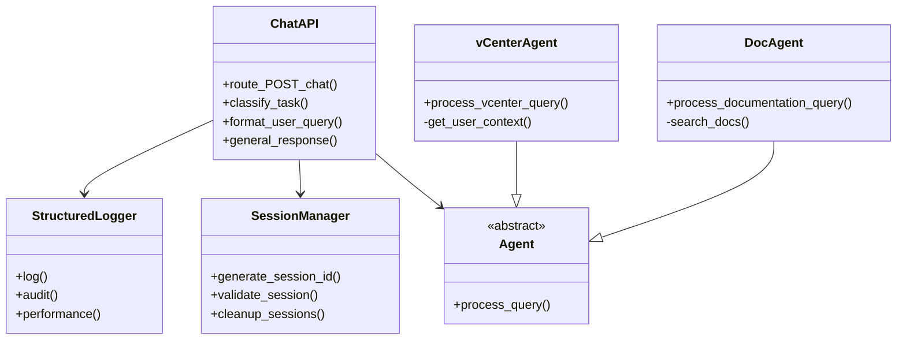

# Guía Técnica de Implementación - Chat

**Versión:** 1.0  
**Última actualización:** Enero 2026  
**Audiencia:** Desarrolladores, Arquitectos

---

## 📋 Contenido

1. [Estructura de Archivos](#estructura-de-archivos)
2. [Stack Tecnológico](#stack-tecnológico)
3. [Flujo de Datos](#flujo-de-datos)
4. [Patrones de Implementación](#patrones-de-implementación)
5. [Guía de Extensión](#guía-de-extensión)
6. [Testing](#testing)

---

## 📁 Estructura de Archivos

```
vcenter_agent_system/
├── src/
│   ├── api/
│   │   ├── main_agent.py          # 🔌 Orquestador principal (1430 líneas)
│   │   └── __init__.py
│   ├── core/
│   │   ├── agent.py               # 🤖 Agent vCenter
│   │   ├── doc_consultant.py      # 📚 Agent Documentación
│   │   └── __init__.py
│   ├── auth/
│   │   ├── __init__.py            # 🔐 Funciones autenticación
│   │   └── ...
│   ├── utils/
│   │   ├── structured_logger.py   # 📊 Logging estructurado
│   │   ├── logging_config.py
│   │   ├── context_middleware.py  # 🔗 Middleware de contexto
│   │   ├── vcenter_tools.py       # 🛠️ Herramientas vCenter
│   │   └── ...
│   └── __init__.py
│
├── templates/
│   └── chat/
│       ├── orchestrator_chat.html       # 📄 Interfaz principal
│       ├── orchestrator_chat_auth.html  # 🔐 Versión autenticada
│       └── orchestrator_index.html      # 📑 Índice
│
├── static/
│   ├── js/
│   │   ├── orchestrator_chat.js         # ⚙️ Lógica cliente (200+ líneas)
│   │   ├── orchestrator_chat_auth.js
│   │   └── orchestrator_index.js
│   └── css/
│       ├── orchestrator_chat.css        # 🎨 Estilos (308 líneas)
│       └── ...
│
├── config/
│   ├── agents.yaml                # ⚙️ Configuración de agentes
│   ├── config.json                # ⚙️ Configuración general
│   └── logging_config.json        # 📊 Configuración de logging
│
├── run.py                         # 🚀 Entry point
├── requirements_oficial.txt       # 📦 Dependencias
└── ...
```

---

## 🛠️ Stack Tecnológico

### Backend

```
┌─────────────────────────────────────────┐
│ Python 3.9+                             │
├─────────────────────────────────────────┤
│ Flask 3.1.2                             │ Web Framework
│ LangChain 0.3.27                        │ Orchestration
│ Ollama (Local)                          │ LLM Inference
│ pyvmomi                                 │ vCenter API
│ Whoosh                                  │ Full-text search
│ SQLite3                                 │ Persistence
└─────────────────────────────────────────┘
```

### Frontend

```
┌─────────────────────────────────────────┐
│ HTML5 + Vanilla JavaScript              │
├─────────────────────────────────────────┤
│ No frameworks (Vanilla JS)              │ Ligero
│ CSS3 (Gradients, Animations)            │ Moderno
│ Fetch API                               │ Comunicación
│ LocalStorage                            │ Persistencia cliente
└─────────────────────────────────────────┘
```

### LLMs

```
┌─────────────────────────────────────────┐
│ Qwen 3 1.7B                             │ Formateador
│ Llama 3.1 8B                            │ Ejecutor
│ Ejecutados via Ollama                   │ Local deployment
└─────────────────────────────────────────┘
```

---

## 🔄 Flujo de Datos Detallado

### 1. Capa de Presentación (Frontend)

**Archivo**: `orchestrator_chat.js`

```javascript
// Event Loop
addEventListener('submit') 
  → messageInput.value.trim()
  → fetch('/chat', POST)
  → response.json()
  → appendMessage(role, html, agentName)
  → DOM Update
```

**Datos en Tránsito**:
```javascript
// Request
{
  username: "jmartinb",
  message: "¿Cuántas VMs?"
}

// Response
{
  response: "Hay 12 VMs...",
  agent: "vcenter"
}
```

---

### 2. Capa de Aplicación (API)

**Archivo**: `main_agent.py`

**Funciones Principales**:

#### `@app.route('/chat', methods=['POST'])`
Líneas 588-650

```python
def chat_api():
    # 1. Validación de sesión
    session_id = session.get('session_id')
    if not validate_session(session_id):
        return jsonify({'error': 'Sesión expirada'}), 401
    
    # 2. Extracción de datos
    data = request.get_json(force=True, silent=True) or {}
    message = data.get('message', '').strip()
    if not message:
        return jsonify({"error": "Mensaje vacío"}), 400
    
    # 3. Clasificación (usa mensaje ORIGINAL)
    target = classify_task(message)
    
    # 4. Formateo (opcional, post-routing)
    formatted_message = format_user_query(message, username) if ENABLE_FORMATTING
    
    # 5. Procesamiento
    if target == 'vcenter':
        answer = process_vcenter_query(username, formatted_message)
    elif target == 'documentation':
        answer = process_documentation_query(username, formatted_message)
    else:
        answer = general_response(username, formatted_message)
    
    # 6. Respuesta
    return jsonify({'response': answer, 'agent': target}), 200
```

---

#### `classify_task(message: str) -> str`
Líneas 228-293

**Lógica de Prioridad**:

```python
def classify_task(message: str) -> str:
    msg_l = message.lower()
    
    # PRIORIDAD 1: Documentation keywords
    if any(kw in msg_l for kw in doc_keywords):
        return 'documentation'
    
    # PRIORIDAD 2: vCenter keywords
    if any(kw in msg_l for kw in vcenter_keywords):
        return 'vcenter'
    
    # PRIORIDAD 3: LLM fallback
    resp = executor_llm.invoke(prompt)
    if 'documentation' in resp:
        return 'documentation'
    elif 'vcenter' in resp:
        return 'vcenter'
    
    return 'general'
```

**Matriz de Decisión**:

```
┌────────────────────────────────────────────┐
│ CLASIFICACIÓN DE TAREAS                    │
├────────────────────────────────────────────┤
│ Entrada                  │ Keywords         │ Output
├──────────────────────────┼─────────────────┼──────────────
│ "listar vms"             │ vm              │ vcenter
│ "cómo instalar dns"      │ instalar        │ documentation
│ "qué es una vm"          │ -               │ general (LLM)
│ "snapshot del cluster"   │ snapshot        │ vcenter
│ "documentación de dns"   │ documentación   │ documentation
│ "hola"                   │ -               │ general (LLM)
└────────────────────────────────────────────┘
```

---

#### `format_user_query(message: str, username: str) -> str`
Líneas 159-227

**Flujo de Formateo**:

```python
def format_user_query(message: str, username: str) -> str:
    if not ENABLE_FORMATTING or not formatter_llm:
        return message  # Fallback rápido
    
    format_prompt = f"""
Eres un asistente especializado en mejorar consultas técnicas.

INSTRUCCIONES:
1. Mejora gramática y estructura
2. NO modifiques intención original
3. NO agregues información nueva
4. Normaliza formato
5. Mantén términos técnicos
6. Si está clara, devuelve sin cambios
    """
    
    try:
        response = formatter_llm.invoke(format_prompt, config={"timeout": FORMATTER_TIMEOUT})
        formatted_query = getattr(response, 'content', message).strip()
        
        # Validación
        if len(formatted_query) < 3 or len(formatted_query) > len(message) * 3:
            return message
        
        return formatted_query
    except Exception as e:
        return message  # Fallback a original
```

**Ejemplos de Transformación**:

| Input | Output | Razón |
|-------|--------|-------|
| "me listao las vms" | "Listar las máquinas virtuales" | Mejora gramática |
| "vms prod" | "Máquinas virtuales de producción" | Expande contexto |
| "cpu mem" | "Recursos de CPU y memoria" | Clarifica acrónimos |
| "¿Cuántas VMs?" | "¿Cuántas VMs?" | Ya está clara |

---

### 3. Capa de Agentes

**Archivo**: `src/core/agent.py`

#### `process_vcenter_query(username: str, message: str) -> str`

```python
def process_vcenter_query(username: str, message: str) -> str:
    # 1. Obtener contexto del usuario
    agent_executor = get_user_context(username)
    
    # 2. Preparar input con contexto
    session_abbr = user_mapping.get(username.lower(), username)
    input_with_username = f"El usuario {session_abbr} dice: {message}"
    
    # 3. Invocar agente
    result = agent_executor.invoke({"input": input_with_username})
    
    # 4. Extraer respuesta
    if isinstance(result, dict) and 'output' in result:
        return result['output']
    return str(result)
```

**Flujo Interno**:
```
Agent Executor (LangChain)
  ↓
Tool Selection (LLM decide qué herramienta usar)
  ↓
Tool Execution (pyvmomi, SQLite, etc.)
  ↓
Response Generation
  ↓
Output Formatting
```

---

### 4. Capa de Logging

**Archivo**: `src/utils/structured_logger.py`

**Categorías de Log**:

```
┌─────────────────────────────────────────┐
│ LOG CATEGORIES                          │
├─────────────────────────────────────────┤
│ API        → Llamadas a endpoints       │
│ AUDIT      → Operaciones de usuarios    │
│ SECURITY   → Eventos de seguridad       │
│ BUSINESS   → Lógica de negocio          │
│ PERFORMANCE→ Métricas de rendimiento    │
│ SYSTEM     → Eventos del sistema        │
└─────────────────────────────────────────┘
```

**Estructura de Log**:

```json
{
  "timestamp": "2026-01-15T14:32:45.890Z",
  "level": "INFO|WARNING|ERROR|DEBUG",
  "category": "API|AUDIT|SECURITY|BUSINESS|PERFORMANCE|SYSTEM",
  "message": "Descripción del evento",
  "user": "jmartinb",
  "context": {
    "session_id": "abc123...",
    "request_id": "req-456..."
  },
  "metadata": {
    "duration_ms": 234,
    "original_length": 45,
    "formatted_length": 67
  }
}
```

---

## 🏛️ Patrones de Implementación

### Patrón 1: Middleware de Contexto

**Propósito**: Mantener contexto del usuario a través de la solicitud

```python
@app.before_request
def session_middleware():
    if request.endpoint in ['health', 'login', 'static', 'ui_login']:
        return  # Rutas públicas
    
    session_id = session.get('session_id')
    if not session_id or not validate_session(session_id):
        session.clear()
        return redirect(url_for('ui_login'))
```

---

### Patrón 2: Manejo de Errores Graceful

```python
try:
    response = formatter_llm.invoke(format_prompt, config={"timeout": FORMATTER_TIMEOUT})
    formatted_query = getattr(response, 'content', message).strip()
except Exception as e:
    logger.warning(f"Error en formateo: {e}", LogCategory.SYSTEM)
    return message  # Fallback a original
```

---

### Patrón 3: Timing Instrumentado

```python
time_received = time.time()
# ... proceso ...
time_after_session = time.time()
delta = (time_after_session - time_received) * 1000

api_logger.info(
    f"[TIMING] Sesión validada ({delta:.0f}ms)", 
    LogCategory.API, 
    user=username
)
```

---

### Patrón 4: Enumeraciones de Configuración

```yaml
# config/agents.yaml
vcenter:
  type: tool-calling
  route_keywords:
    - vm
    - datastore
    - snapshot
    - host
  description: "Operaciones sobre infraestructura vCenter"

documentation:
  type: rag
  route_keywords:
    - instalar
    - configurar
    - documentación
    - guía
  description: "Búsqueda en documentación"
```

---

## 🔧 Guía de Extensión

### Agregar Nuevo Agente

**Paso 1**: Definir en `config/agents.yaml`

```yaml
new_agent:
  type: custom
  route_keywords:
    - keyword1
    - keyword2
  description: "Descripción del nuevo agente"
```

**Paso 2**: Crear módulo en `src/core/new_agent.py`

```python
def process_new_agent_query(username: str, message: str) -> str:
    """Procesa consultas para el nuevo agente"""
    try:
        # Implementación
        result = custom_logic(message)
        return result
    except Exception as e:
        logger.error(f"Error en new_agent: {e}")
        return f"Error procesando consulta: {e}"
```

**Paso 3**: Registrar en `main_agent.py`

```python
from src.core.new_agent import process_new_agent_query

# En chat_api()
elif target == 'new_agent':
    answer = process_new_agent_query(username, formatted_message)
```

**Paso 4**: Actualizar `classify_task()` (opcional)

```python
new_agent_spec = AGENTS_REGISTRY.get('new_agent', {})
new_agent_keywords = new_agent_spec.get('route_keywords', [])
if any(kw in msg_l for kw in new_agent_keywords):
    return 'new_agent'
```

---

### Personalizar Enrutamiento

**Ejemplo: Prioridad por Usuario**

```python
def classify_task_advanced(message: str, username: str) -> str:
    msg_l = message.lower()
    
    # Prioridad especial para ciertos usuarios
    if username in ['admin', 'devops']:
        # Vía rápida a vCenter
        if any(kw in msg_l for kw in vcenter_keywords):
            return 'vcenter'
    
    # Flujo normal
    return classify_task(message)
```

---

### Modificar Modelos LLM

```bash
# En variables de entorno
export ORCH_FORMATTER_MODEL=mistral:7b
export ORCH_EXECUTOR_MODEL=neural-chat:7b
```

---

## 🧪 Testing

### Test Unitario: Función `classify_task()`

```python
import pytest
from src.api.main_agent import classify_task

class TestClassifyTask:
    def test_vcenter_keyword(self):
        result = classify_task("¿Cuántas VMs hay?")
        assert result == "vcenter"
    
    def test_documentation_keyword(self):
        result = classify_task("Cómo instalar DNS")
        assert result == "documentation"
    
    def test_general_fallback(self):
        result = classify_task("Hola, ¿quién eres?")
        assert result == "general"

# Ejecutar
pytest tests/test_classify_task.py -v
```

---

### Test de Integración: Endpoint /chat

```python
def test_chat_endpoint_vcenter(client, auth_session):
    """Test endpoint /chat con consulta vCenter"""
    response = client.post('/chat',
        json={
            "username": "jmartinb",
            "message": "Listar VMs en producción"
        }
    )
    
    assert response.status_code == 200
    data = response.get_json()
    assert 'response' in data
    assert data['agent'] == 'vcenter'
    assert len(data['response']) > 0

def test_chat_endpoint_no_message(client, auth_session):
    """Test con mensaje vacío"""
    response = client.post('/chat',
        json={"username": "jmartinb", "message": ""}
    )
    
    assert response.status_code == 400
    assert 'error' in response.get_json()
```

---

### Test de Performance

```python
import time

def test_format_query_performance():
    """Formateo debe completarse en < 1000ms"""
    message = "me list as las vms de production"
    
    start = time.time()
    result = format_user_query(message, "test_user")
    elapsed = (time.time() - start) * 1000
    
    assert elapsed < 1000, f"Formateo tardó {elapsed}ms"
    assert result != ""
```

---

### Script de Testing Manual

```bash
#!/bin/bash
# test_chat_manual.sh

BASE_URL="http://localhost:5000"
USERNAME="jmartinb"

echo "Test 1: vCenter Query"
curl -X POST "$BASE_URL/chat" \
  -H "Content-Type: application/json" \
  -d '{"username":"'$USERNAME'","message":"¿Cuántas VMs?"}'
echo "\n"

echo "Test 2: Documentation Query"
curl -X POST "$BASE_URL/chat" \
  -H "Content-Type: application/json" \
  -d '{"username":"'$USERNAME'","message":"Cómo instalar DNS?"}'
echo "\n"

echo "Test 3: General Query"
curl -X POST "$BASE_URL/chat" \
  -H "Content-Type: application/json" \
  -d '{"username":"'$USERNAME'","message":"Hola"}'
echo "\n"

echo "Test 4: Empty Message"
curl -X POST "$BASE_URL/chat" \
  -H "Content-Type: application/json" \
  -d '{"username":"'$USERNAME'","message":""}'
echo "\n"
```

---

## 📊 Diagrama de Clases



---

## 🔑 Puntos Críticos de Implementación

### 1. Enrutamiento ANTES de Formateo

```python
# ✅ CORRECTO
target = classify_task(message)           # Usa mensaje ORIGINAL
formatted_message = format_user_query(message)  # Luego formatea

# ❌ INCORRECTO
formatted_message = format_user_query(message)
target = classify_task(formatted_message)  # Puede cambiar intención
```

### 2. Validación de Sesión Siempre

```python
# ✅ CRÍTICO: Validar en middleware
@app.before_request
def session_middleware():
    if not validate_session(session.get('session_id')):
        return redirect(url_for('ui_login'))
```

### 3. Timeout en Llamadas LLM

```python
# ✅ SIEMPRE definir timeout
response = formatter_llm.invoke(
    prompt,
    config={"timeout": FORMATTER_TIMEOUT}
)

# ❌ Sin timeout puede colgar
response = formatter_llm.invoke(prompt)
```

### 4. Fallbacks Defensivos

```python
# ✅ Siempre tener fallback
try:
    result = formatter_llm.invoke(prompt)
    return result.get('content', message)
except:
    return message  # Fallback a original

# ❌ Sin fallback causa error
result = formatter_llm.invoke(prompt)
return result['content']  # KeyError posible
```

---

## 🚀 Deployment

### Dockerfile

```dockerfile
FROM python:3.11-slim

WORKDIR /app
COPY requirements_oficial.txt .
RUN pip install -r requirements_oficial.txt

COPY . .

EXPOSE 5000
CMD ["python", "run.py"]
```

### docker-compose.yml

```yaml
version: '3.8'
services:
  chat-api:
    build: .
    ports:
      - "5000:5000"
    environment:
      - ORCH_FORMATTER_MODEL=gpt-oss:20b
      - ORCH_EXECUTOR_MODEL=gpt-oss:20b
      - ENABLE_QUERY_FORMATTING=true
    volumes:
      - ./logs:/app/logs
  
  ollama:
    image: ollama/ollama:latest
    ports:
      - "11434:11434"
```

---

## 📚 Conclusión

La implementación del Chat del Orquestador sigue patrones robustos de:
- ✅ Separación de capas (Frontend, API, Core)
- ✅ Manejo defensivo de errores
- ✅ Logging exhaustivo
- ✅ Validación en cada punto crítico
- ✅ Extensibilidad mediante configuración

Este documento proporciona la base para mantener, extender y depurar el sistema.
