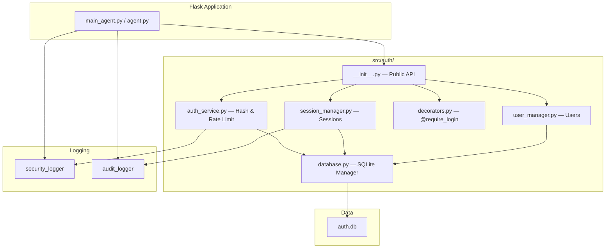
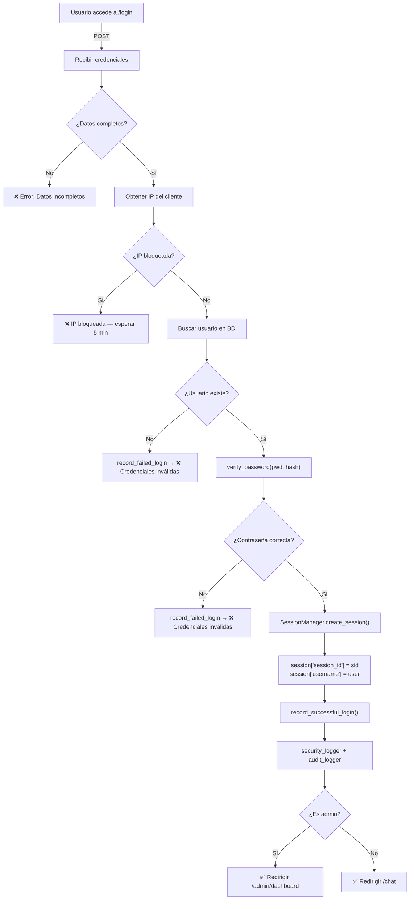
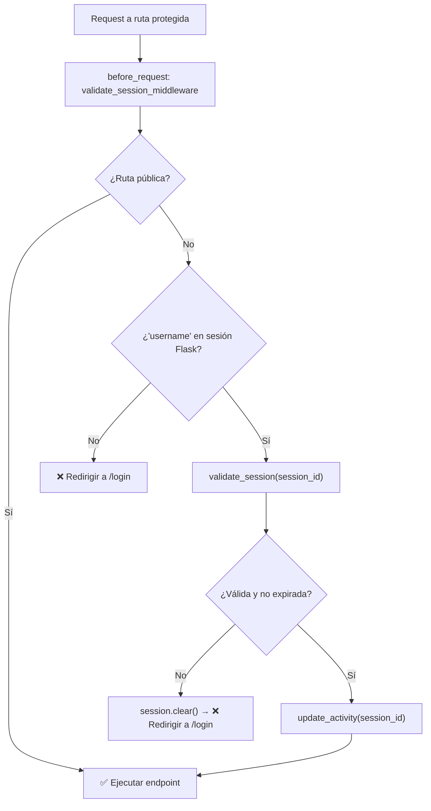
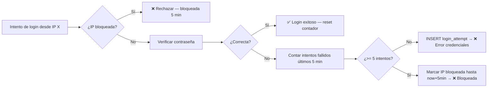
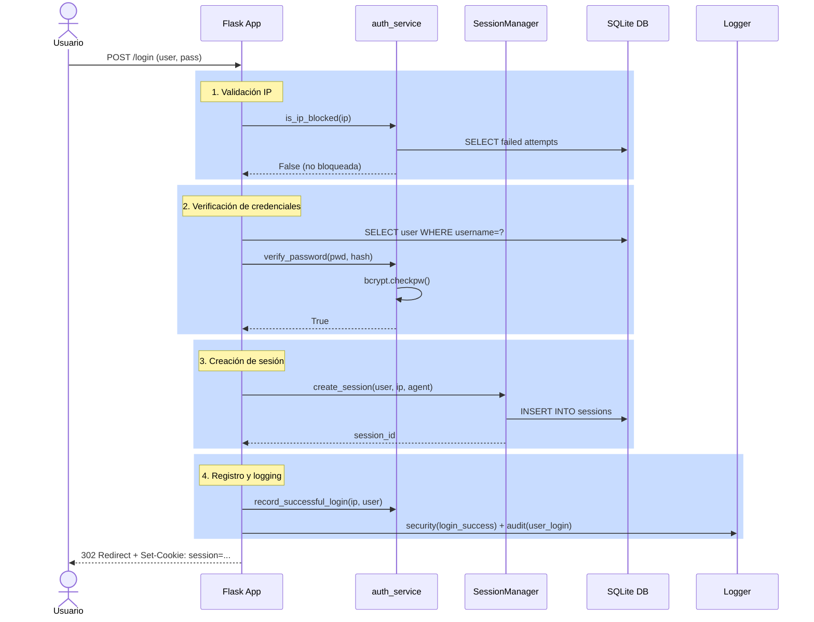
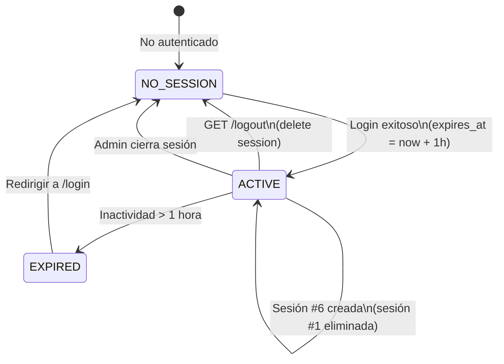

# Sistema de Autenticación — vCenter Agent

**Versión:** 2.0 | **Actualización:** Enero 2026 | **Estado:** Producción

---

## Tabla de Contenidos

1. [Visión General](#1-visión-general)
2. [Arquitectura y Componentes](#2-arquitectura-y-componentes)
3. [Flujo de Autenticación](#3-flujo-de-autenticación)
4. [Implementación Técnica](#4-implementación-técnica)
5. [Características de Seguridad](#5-características-de-seguridad)
6. [Base de Datos](#6-base-de-datos)
7. [Gestión de Sesiones](#7-gestión-de-sesiones)
8. [APIs y Decoradores](#8-apis-y-decoradores)
9. [Logging y Auditoría](#9-logging-y-auditoría)
10. [Guía de Usuario](#10-guía-de-usuario)
11. [Administración del Sistema](#11-administración-del-sistema)
12. [Mantenimiento y Backup](#12-mantenimiento-y-backup)
13. [Troubleshooting](#13-troubleshooting)

---

## 1. Visión General

El sistema de autenticación del vCenter Agent gestiona el acceso seguro a la consola de administración. Está implementado como un módulo Python modular (`src/auth/`) integrado en Flask.

### Características clave

| Aspecto | Valor |
|---------|-------|
| Framework | Flask 3.1.2 con sesiones seguras |
| Hashing | Bcrypt (nuevo) + SHA256 (legacy) |
| Timeout de sesión | 1 hora de inactividad |
| Rate limiting | 5 intentos fallidos → bloqueo 5 min |
| Persistencia | SQLite (`auth.db`) |
| Roles | `admin` y `user` |
| Logging | Security + Audit con contexto estructurado |

---

## 2. Arquitectura y Componentes

### Estructura de directorios

```
src/auth/
├── __init__.py          # Exports públicos del módulo
├── auth_service.py      # Hashing de contraseñas y rate limiting
├── session_manager.py   # Ciclo de vida de sesiones
├── decorators.py        # Decoradores @require_login_api / _ui
├── database.py          # Gestor SQLite
├── user_manager.py      # Gestión de usuarios
└── config.py            # Configuración
```

### Diagrama de componentes



### Componentes principales

#### auth_service.py — Seguridad de contraseñas y rate limiting

| Función | Propósito |
|---------|-----------|
| `hash_password_bcrypt(pwd)` | Genera hash bcrypt con salt |
| `verify_password(pwd, hash)` | Verifica contraseña contra hash |
| `is_ip_blocked(ip)` | Comprueba si IP está bloqueada |
| `record_failed_login(ip, user)` | Registra intento fallido |
| `record_successful_login(ip, user)` | Resetea contador de intentos |

Constantes: `MAX_LOGIN_ATTEMPTS = 5`, `LOGIN_BLOCK_TIME = 300` segundos.

#### session_manager.py — Ciclo de vida de sesiones

```python
class SessionManager:
    create_session(username, client_ip, user_agent) -> str
    get_session(session_id) -> Optional[Dict]
    validate_session(session_id) -> bool
    update_activity(session_id) -> bool
    delete_session(session_id) -> bool
    cleanup_old_sessions() -> int
```

Constantes: `SESSION_TIMEOUT = 3600` s, `MAX_SESSIONS_PER_USER = 5`.

#### decorators.py — Protección de rutas

- `@require_login_api` — protege endpoints REST, devuelve JSON 401 si no autenticado.
- `@require_login_ui` — protege rutas UI, redirige a `/login` si no autenticado.

#### user_manager.py — Gestión de usuarios

| Función | Propósito |
|---------|-----------|
| `create_user(user, pwd, is_admin)` | Crea usuario |
| `get_user(username)` | Obtiene datos |
| `update_password(user, pwd)` | Actualiza contraseña |
| `delete_user(username)` | Elimina usuario |
| `is_admin(username)` | Verifica rol admin |

---

## 3. Flujo de Autenticación

### Flujo de login completo



### Validación de sesión (cada request)



### Flujo de rate limiting



### Secuencia detallada de login



---

## 4. Implementación Técnica

### Inicialización en la aplicación

```python
from src.auth import (
    hash_password_bcrypt, verify_password,
    SessionManager, validate_session,
    require_login_api, require_login_ui,
)
from src.auth.database import init_database
from src.auth.user_manager import UserManager

# Inicializar BD
init_database()

# Crear usuario admin por defecto si no existe
user_mgr = get_user_manager()
if not user_mgr.get_user('admin'):
    user_mgr.create_user('admin', 'AdminTemporalSegura123!', is_admin=True)
```

### Ruta de login — implementación completa

```python
@app.route('/login', methods=['POST'])
@limiter.limit("10 per minute")
@security_sensitive("user_login", "info")
def login():
    username = request.form.get('username', '').lower().strip()
    password = request.form.get('password', '')
    client_ip = request.remote_addr

    if not username or not password:
        return render_template('...', error='Usuario y contraseña requeridos')

    if is_ip_blocked(client_ip):
        security_logger.security(event="login_blocked", user=username, ip=client_ip, severity="warning")
        return render_template('...', error='IP bloqueada por demasiados intentos')

    user_record = user_db.get(username)

    if not user_record or not verify_password(password, user_record['password_hash']):
        record_failed_login(client_ip, username)
        security_logger.security(event="login_failed", user=username, ip=client_ip, severity="warning")
        return render_template('...', error='Usuario o contraseña incorrectos')

    session_id = SessionManager.create_session(
        username=username, client_ip=client_ip,
        user_agent=request.headers.get('User-Agent', '')[:100]
    )
    session['session_id'] = session_id
    session['username'] = username
    session['logged_in'] = True
    session.permanent = True

    record_successful_login(client_ip, username)
    security_logger.security(event="login_success", user=username, ip=client_ip, session_id=session_id)
    audit_logger.audit(action="user_login", user=username, result="success", ip=client_ip)

    return redirect(url_for('admin_dashboard') if user_record.get('is_admin') else url_for('chat'))
```

### Middleware de validación de sesión

```python
@app.before_request
def validate_session_middleware():
    public_routes = ['login', 'static']
    if request.endpoint in public_routes or request.path.startswith('/static/'):
        return None

    if 'username' in session:
        session_id = session.get('session_id')
        if not session_id or not validate_session(session_id):
            session.clear()
            return redirect(url_for('login'))
        SessionManager.update_activity(session_id)
    return None
```

### Instalación

```bash
# Crear entorno virtual e instalar dependencias
python -m venv venv
source venv/bin/activate  # Windows: venv\Scripts\activate
pip install -r requirements_oficial.txt

# Inicializar base de datos y usuario admin
python -c "
from src.auth import init_database, get_user_manager
init_database()
get_user_manager().create_user('admin', 'AdminTemporalSegura123!', True)
print('Instalación completada')
"

# Verificar tablas creadas
sqlite3 auth.db ".tables"
# sessions  login_attempts  users
```

### Deployment (producción con Gunicorn)

```bash
pip install gunicorn
gunicorn -w 4 -b 0.0.0.0:5000 src.api.main_agent:app

# Con SSL (recomendado)
gunicorn -w 4 -b 0.0.0.0:5000 \
  --certfile=/path/cert.pem --keyfile=/path/key.pem \
  src.api.main_agent:app
```

Variables de entorno relevantes:
```bash
FLASK_ENV=production
FLASK_SECRET_KEY=clave_secreta_32_caracteres_minimo
FLASK_SESSION_TIMEOUT=1800
MAX_LOGIN_ATTEMPTS=3
LOGIN_BLOCK_TIME=900
```

---

## 5. Características de Seguridad

### Hashing de contraseñas

Las nuevas contraseñas usan **Bcrypt** (salt aleatorio incluido, resistente a fuerza bruta):

```python
hashed = hash_password_bcrypt("mi_contraseña")  # $2b$12$...
if verify_password("mi_contraseña", hashed):
    print("Correcta")
```

Las contraseñas antiguas en SHA256 se mantienen por compatibilidad; las nuevas siempre usan bcrypt.

### Rate limiting

- 5 intentos fallidos desde la misma IP en 5 minutos → bloqueo automático por 5 minutos.
- El contador se resetea con un login exitoso.
- Consulta SQL para verificar bloqueo:

```sql
SELECT COUNT(*) FROM login_attempts
WHERE ip_address = ? AND attempt_time > datetime('now', '-5 minutes') AND success = 0
```

### Timeout de sesión

- 1 hora de inactividad (3600 s). Se reinicia con cada request autenticado.
- Limpieza automática de sesiones expiradas al crear nuevas sesiones y en el middleware.

### Sesiones concurrentes

Máximo 5 sesiones activas por usuario. Al crear la sesión número 6, la más antigua se elimina automáticamente.

### Protección adicional

- CSRF: manejado automáticamente por Flask con `session.permanent = True` y cookie `SameSite=Lax`.
- HTTPS: obligatorio en producción (`SECURE_COOKIES: true`, `COOKIE_SECURE: true`).
- Cookies con `HttpOnly: true` — no accesibles desde JavaScript.

---

## 6. Base de Datos

**Ubicación:** `vcenter_agent_system/auth.db`

### Esquema

```sql
CREATE TABLE sessions (
    id INTEGER PRIMARY KEY AUTOINCREMENT,
    session_id TEXT UNIQUE NOT NULL,
    username TEXT NOT NULL,
    ip_address TEXT,
    user_agent TEXT,
    created_at DATETIME DEFAULT CURRENT_TIMESTAMP,
    last_activity DATETIME DEFAULT CURRENT_TIMESTAMP,
    expires_at DATETIME NOT NULL,
    FOREIGN KEY (username) REFERENCES users(username)
);
CREATE INDEX idx_session_id ON sessions(session_id);
CREATE INDEX idx_expires_at ON sessions(expires_at);

CREATE TABLE login_attempts (
    id INTEGER PRIMARY KEY AUTOINCREMENT,
    ip_address TEXT NOT NULL,
    username TEXT,
    attempt_time DATETIME DEFAULT CURRENT_TIMESTAMP,
    success BOOLEAN DEFAULT 0,
    reason TEXT
);
CREATE INDEX idx_ip_attempts ON login_attempts(ip_address, attempt_time);

CREATE TABLE users (
    username TEXT PRIMARY KEY,
    password_hash TEXT NOT NULL,
    is_admin BOOLEAN DEFAULT 0,
    created_at DATETIME DEFAULT CURRENT_TIMESTAMP,
    last_login DATETIME,
    active BOOLEAN DEFAULT 1
);
```

### Consultas frecuentes

```python
# Sesión activa
cursor.execute("SELECT * FROM sessions WHERE session_id = ? AND expires_at > datetime('now')", (sid,))

# Limpiar sesiones expiradas
cursor.execute("DELETE FROM sessions WHERE expires_at <= datetime('now')")

# Intentos fallidos recientes por IP
cursor.execute("""
    SELECT COUNT(*) FROM login_attempts
    WHERE ip_address = ? AND attempt_time > datetime('now', '-5 minutes') AND success = 0
""", (ip,))
```

---

## 7. Gestión de Sesiones

### Ciclo de vida



### Uso programático

```python
from src.auth import SessionManager, generate_secure_session_id

# Crear sesión
sid = SessionManager.create_session(username="admin", client_ip="192.168.1.100", user_agent="Mozilla/5.0")

# Validar y obtener datos
if SessionManager.validate_session(sid):
    data = SessionManager.get_session(sid)
    # {'session_id': '...', 'username': 'admin', 'created_at': '...', 'expires_at': '...'}

# Actualizar actividad (extiende timeout)
SessionManager.update_activity(sid)

# Cerrar sesión
SessionManager.delete_session(sid)
```

---

## 8. APIs y Decoradores

### Endpoints HTTP

#### POST /login

```
Body: username=<str>&password=<str>  (form-urlencoded)

Respuestas:
  302  → /chat o /admin/dashboard (login exitoso)
  400  → "Usuario y contraseña requeridos"
  401  → "Usuario o contraseña incorrectos"
  429  → "IP bloqueada por demasiados intentos"
```

```bash
curl -X POST http://localhost:5000/login -d "username=admin&password=..." -c cookies.txt -L
```

#### GET /logout

```
Respuesta: 302 → /  (sesión eliminada)
```

### Decoradores

```python
# Proteger endpoint API (devuelve JSON 401 si no autenticado)
@app.route('/api/vms')
@require_login_api
def get_vms():
    return jsonify({"vms": list_vms(), "user": session.get('username')})

# Proteger ruta UI (redirige a /login si no autenticado)
@app.route('/admin/settings')
@require_login_ui
def admin_settings():
    return render_template('admin/settings.html')

# Combinación con otros decoradores (orden: último → primero en ejecución)
@app.route('/api/action', methods=['POST'])
@limiter.limit("100 per hour")
@require_login_api
@security_sensitive("action", "info")
def protected_action():
    return jsonify({"result": "ok"})
```

---

## 9. Logging y Auditoría

### Archivos de log

```
logs/
├── security/security.log   # Eventos de seguridad (login, bloqueos)
└── audit/audit.log         # Auditoría de acciones de usuario
```

### Eventos registrados

```python
# Login exitoso
security_logger.security(event="login_success", user=username, ip=ip, severity="info", session_id=sid)
audit_logger.audit(action="user_login", user=username, resource="authentication", result="success", ip=ip)

# Login fallido
security_logger.security(event="login_failed", user=username, ip=ip, severity="warning", reason="invalid_credentials")

# IP bloqueada
security_logger.security(event="login_blocked", user=username, ip=ip, severity="warning", reason="ip_blocked")
```

---

## 10. Guía de Usuario

### Acceso al sistema

URL de acceso:
```
http://localhost:5000/       (desarrollo)
https://vcenter-agent.empresa.com/  (producción)
```

Al acceder sin autenticación se muestra la pantalla de login con campos **Usuario** y **Contraseña**.

### Proceso de login

1. Introduce tu usuario (no distingue mayúsculas/minúsculas, se eliminan espacios).
2. Introduce tu contraseña (distingue mayúsculas/minúsculas, mínimo 8 caracteres).
3. Haz clic en **Acceder**.

Tras el login, serás redirigido automáticamente según tu rol:
- **Administrador** → Panel de administración
- **Usuario** → Área de chat/consultas

### Mensajes de error

| Mensaje | Causa | Solución |
|---------|-------|----------|
| "Usuario o contraseña incorrectos" | Credenciales inválidas | Verifica Bloq Mayús, intenta de nuevo |
| "IP bloqueada por demasiados intentos" | 5+ intentos fallidos en 5 min | Espera 5 minutos o contacta al admin |
| "Usuario y contraseña requeridos" | Campos vacíos | Completa ambos campos |
| "Su sesión ha expirado" | Inactividad > 1 hora | Vuelve a iniciar sesión |

### Gestión de sesión

- La sesión dura **1 hora de inactividad**. Cualquier acción reinicia el contador.
- Puedes tener hasta **5 sesiones concurrentes** (diferentes dispositivos/navegadores).
- Si cierras el navegador sin hacer logout, la sesión sigue activa en el servidor hasta que expire.

Para cerrar sesión: usa el menú de usuario → **Cerrar Sesión**, o accede a `/logout`.

### Roles y permisos

| Funcionalidad | Administrador | Usuario |
|---------------|:---:|:---:|
| Chat / consultas | ✅ | ✅ |
| Cambiar contraseña propia | ✅ | ✅ |
| Panel de administración | ✅ | ❌ |
| Gestión de usuarios | ✅ | ❌ |
| Logs de seguridad y auditoría | ✅ | ❌ |

### Buenas prácticas de seguridad

**Haz:**
- Contraseña de mínimo 12 caracteres con mayúsculas, minúsculas, números y símbolos.
- Cambia contraseña cada 3 meses.
- Cierra sesión antes de dejar el equipo desatendido.

**No hagas:**
- Compartir tu contraseña.
- Usar contraseñas del diccionario o información personal.
- Acceder desde redes Wi-Fi públicas sin VPN.

### FAQ

**¿Olvidé mi contraseña?**
Contacta al administrador. No hay recuperación automática.

**¿Qué pasa si cierro el navegador?**
La sesión sigue activa en el servidor. Si vuelves antes de 1 hora, se restablece automáticamente.

**¿Por qué me bloquean la IP si otros están intentando entrar?**
El bloqueo es por IP. En redes corporativas, otros usuarios desde la misma IP pueden verse afectados. Contacta al admin para desbloquearlo.

**¿Existe autenticación de dos factores?**
No está implementada actualmente.

**¿Puedo automatizar el login?**
Contacta al administrador para obtener una cuenta de servicio o token de API.

---

## 11. Administración del Sistema

### Requisitos previos

```
Python 3.8+ | Flask 3.1.2+ | bcrypt 4.0+ | SQLite3
```

```bash
pip install bcrypt==4.0.1 flask==3.1.2 requests
```

### Configuración

**Archivo:** `config/auth_config.yaml`

```yaml
AUTH:
  MAX_LOGIN_ATTEMPTS: 5
  LOGIN_BLOCK_TIME: 300        # segundos
  SESSION_TIMEOUT: 3600        # 1 hora
  MAX_SESSIONS_PER_USER: 5
  MIN_PASSWORD_LENGTH: 8
  BCRYPT_ROUNDS: 12

SECURITY:
  FORCE_HTTPS: false           # true en producción
  SECURE_COOKIES: false        # true en producción
  COOKIE_HTTPONLY: true
  COOKIE_SAMESITE: Lax

DATABASE:
  PATH: ./auth.db
  TIMEOUT: 30
```

**Producción** — valores recomendados:
```yaml
AUTH:
  MAX_LOGIN_ATTEMPTS: 3
  LOGIN_BLOCK_TIME: 900        # 15 min
  SESSION_TIMEOUT: 1800        # 30 min
SECURITY:
  FORCE_HTTPS: true
  SECURE_COOKIES: true
  COOKIE_SECURE: true
```

### Gestión de usuarios

#### Crear usuario

```python
from src.auth import get_user_manager
user_mgr = get_user_manager()

user_mgr.create_user('jgarcia', 'ContraseñaSegura123!', is_admin=False)
user_mgr.create_user('admin2', 'AdminContraseña123!', is_admin=True)
```

#### Cambiar contraseña

```python
user_mgr.update_password('jgarcia', 'NuevaContraseña123!')
```

#### Cambiar rol

```python
from src.auth.database import get_db_manager
db = get_db_manager()
with db.get_cursor() as cursor:
    cursor.execute('UPDATE users SET is_admin = ? WHERE username = ?', (True, 'jgarcia'))
```

#### Desactivar / reactivar usuario

```python
with db.get_cursor() as cursor:
    cursor.execute('UPDATE users SET active = 0 WHERE username = ?', ('jgarcia',))  # desactivar
    cursor.execute('UPDATE users SET active = 1 WHERE username = ?', ('jgarcia',))  # reactivar
```

#### Eliminar usuario (permanente)

```python
user_mgr.delete_user('jgarcia')  # también cierra sus sesiones activas
```

#### Crear usuarios en lote desde CSV

```python
import csv
def bulk_create_users(csv_file):
    user_mgr = get_user_manager()
    with open(csv_file, 'r', encoding='utf-8') as f:
        for row in csv.DictReader(f):
            user_mgr.create_user(row['username'], row['password'], row['is_admin'] == 'true')
# CSV: username,password,is_admin
```

### Monitoreo y auditoría

#### Dashboard de seguridad

```python
from src.auth.database import get_db_manager
db = get_db_manager()

with db.get_cursor() as cursor:
    # Intentos fallidos en la última hora
    cursor.execute("SELECT COUNT(*) as c FROM login_attempts WHERE success=0 AND attempt_time > datetime('now','-1 hour')")
    failed = cursor.fetchone()['c']

    # IPs bloqueadas actualmente
    cursor.execute("""
        SELECT ip_address, COUNT(*) as attempts FROM login_attempts
        WHERE success=0 AND attempt_time > datetime('now','-5 minutes')
        GROUP BY ip_address HAVING COUNT(*) >= 5
    """)
    blocked_ips = cursor.fetchall()

    # Sesiones activas
    cursor.execute("SELECT COUNT(*) as c FROM sessions WHERE expires_at > datetime('now')")
    active = cursor.fetchone()['c']

    print(f"Intentos fallidos (1h): {failed}")
    print(f"IPs bloqueadas: {len(blocked_ips)}")
    print(f"Sesiones activas: {active}")
```

#### Detectar actividad sospechosa

```python
with db.get_cursor() as cursor:
    # IPs con intentos sobre múltiples usuarios (posible ataque de diccionario)
    cursor.execute("""
        SELECT ip_address, COUNT(DISTINCT username) as users, COUNT(*) as attempts
        FROM login_attempts WHERE success=0 AND attempt_time > datetime('now','-24 hours')
        GROUP BY ip_address HAVING COUNT(DISTINCT username) > 3
    """)

    # Logins fuera de horario (22:00–06:00)
    cursor.execute("""
        SELECT username, ip_address, attempt_time FROM login_attempts
        WHERE success=1 AND (strftime('%H', attempt_time) >= '22' OR strftime('%H', attempt_time) < '06')
        AND attempt_time > datetime('now','-7 days')
    """)
```

### Bloqueo y desbloqueo de IPs

```python
# Desbloquear IP manualmente (limpiar intentos fallidos)
with db.get_cursor() as cursor:
    cursor.execute('DELETE FROM login_attempts WHERE ip_address = ?', ('192.168.1.100',))

# Bloquear IP manualmente
from datetime import datetime, timedelta
blocked_until = datetime.now() + timedelta(minutes=60)
with db.get_cursor() as cursor:
    cursor.execute("""
        INSERT INTO ip_blocks (ip_address, blocked_until, reason) VALUES (?, ?, 'Manual block')
        ON CONFLICT(ip_address) DO UPDATE SET blocked_until = ?
    """, ('192.168.1.100', blocked_until, blocked_until))
```

### Cerrar sesiones de un usuario

```python
from src.auth import SessionManager
with db.get_cursor() as cursor:
    cursor.execute('SELECT session_id FROM sessions WHERE username = ?', ('jgarcia',))
    for row in cursor.fetchall():
        SessionManager.delete_session(row['session_id'])
```

---

## 12. Mantenimiento y Backup

### Limpieza periódica

```python
def full_maintenance():
    with db.get_cursor() as cursor:
        # 1. Sesiones expiradas
        cursor.execute("DELETE FROM sessions WHERE expires_at < datetime('now')")

        # 2. Intentos fallidos con más de 30 días
        cursor.execute("DELETE FROM login_attempts WHERE attempt_time < datetime('now', '-30 days')")

        # 3. Optimizar BD
        cursor.execute('VACUUM')
```

**Cron (Linux):**
```bash
0 2 * * * python -c "from src.auth import cleanup_old_sessions; cleanup_old_sessions()"
```

**Task Scheduler (Windows PowerShell):**
```powershell
$trigger = New-ScheduledTaskTrigger -Daily -At 02:00
$action = New-ScheduledTaskAction -Execute "python" `
    -Argument "-c `"from src.auth import cleanup_old_sessions; cleanup_old_sessions()`"" `
    -WorkingDirectory "C:\vcenter-agent"
Register-ScheduledTask -TaskName "Auth-Maintenance" -Trigger $trigger -Action $action -RunLevel Highest
```

### Backup de base de datos

**Script bash (diario a las 3:00 AM):**
```bash
#!/bin/bash
BACKUP_DIR="/backups/vcenter-agent"
TIMESTAMP=$(date +%Y%m%d_%H%M%S)
mkdir -p $BACKUP_DIR
cp auth.db $BACKUP_DIR/auth_$TIMESTAMP.db
gzip $BACKUP_DIR/auth_$TIMESTAMP.db
find $BACKUP_DIR -name "auth_*.db.gz" -mtime +30 -delete
```

```bash
# Cron
0 3 * * * /opt/vcenter-agent/backup_auth.sh >> /var/log/vcenter-agent/backup.log 2>&1
```

**Backup bajo demanda (Python):**
```python
import shutil
from datetime import datetime

def backup_database(backup_dir='/backups'):
    ts = datetime.now().strftime('%Y%m%d_%H%M%S')
    dest = f"{backup_dir}/auth_manual_{ts}.db"
    shutil.copy2('auth.db', dest)
    print(f"Backup creado: {dest}")
```

### Restauración

```bash
# Restauración completa
cp auth.db auth.db.backup_$(date +%Y%m%d)
gunzip -c /backups/auth_20260115_030000.db.gz > auth.db
```

**Restauración selectiva (solo usuarios):**
```python
import sqlite3

def restore_users_only(backup_file):
    bk = sqlite3.connect(backup_file)
    main = sqlite3.connect('auth.db')
    users = bk.execute('SELECT * FROM users').fetchall()
    main.execute('DELETE FROM users')
    main.executemany('INSERT INTO users VALUES (?,?,?,?,?,?)', users)
    main.commit()
    print(f"{len(users)} usuarios restaurados")
```

### Verificación de integridad

```python
with db.get_cursor() as cursor:
    cursor.execute("PRAGMA integrity_check")
    result = cursor.fetchone()
    print("OK" if result['integrity_check'] == 'ok' else f"ERROR: {result['integrity_check']}")

    for table in ['sessions', 'login_attempts', 'users']:
        cursor.execute(f"SELECT COUNT(*) as c FROM {table}")
        print(f"{table}: {cursor.fetchone()['c']} registros")
```

---

## 13. Troubleshooting

| Síntoma | Causa | Solución |
|---------|-------|----------|
| `no such table: sessions` | BD no inicializada | `from src.auth import init_database; init_database()` |
| `database is locked` | Acceso concurrente | Aumentar `TIMEOUT: 60` en config o habilitar WAL mode |
| IP bloqueada permanentemente | Registro corrupto | `DELETE FROM login_attempts WHERE ip_address = '...'` |
| Sesión expira muy rápido | `SESSION_TIMEOUT` bajo o servidor reiniciado | Aumentar timeout; verificar `expires_at` en BD |
| "Authentication required" 401 en API | Sesión inválida o expirada | `session.clear()` → redirigir a login |
| Usuario no puede cambiar contraseña | Permisos BD o columna faltante | `PRAGMA table_info(users)` para verificar esquema |

### Diagnóstico de sesión

```python
# Verificar sesión en BD directamente
session_id = session.get('session_id')
data = SessionManager.get_session(session_id)
print(data)  # None si expirada o no existe
```

### Habilitar WAL mode para concurrencia

```python
import sqlite3
conn = sqlite3.connect('auth.db')
conn.execute('PRAGMA journal_mode=WAL')
conn.close()
```

---

## Documentación relacionada

- `src/auth/` — código fuente del módulo
- `implementation/IMPLEMENTACION_AUTH_MODULE.md` — histórico de implementación
- `tests/test_auth_module.py` — tests del módulo
- `tests/test_superuser_basic.py` — verificación de rol superuser

---

**Versión:** 2.0 | **Autor:** jmartinb | **Última actualización:** Enero 2026
