# Documentación Técnica — Sistema MCP (Model Context Protocol)

> **Capa de Seguridad y Herramientas para el Agente vCenter**
> Versión: 3.0 | Última actualización: 2026-03-12

---

## Índice

1. [Visión General](#1-visión-general)
2. [Arquitectura del Sistema MCP](#2-arquitectura-del-sistema-mcp)
3. [Flujo de una petición de herramienta](#3-flujo-de-una-petición-de-herramienta)
4. [Componentes](#4-componentes)
   - 4.1 [mcp_vcenter_server.py — Servidor FastMCP](#41-mcp_vcenter_serverpy--servidor-fastmcp)
   - 4.2 [mcp_tool_registry.py — Registro centralizado](#42-mcp_tool_registrypy--registro-centralizado)
   - 4.3 [mcp_tool_wrappers.py — Adaptadores LangChain](#43-mcp_tool_wrapperspy--adaptadores-langchain)
   - 4.4 [mcp_client.py — Cliente inactivo](#44-mcp_clientpy--cliente-inactivo)
5. [Catálogo de herramientas (32 tools)](#5-catálogo-de-herramientas-32-tools)
6. [Connection Pool y aislamiento por usuario](#6-connection-pool-y-aislamiento-por-usuario)
7. [Patrón de seguridad MCP-Only](#7-patrón-de-seguridad-mcp-only)
8. [Integración con el Agente vCenter](#8-integración-con-el-agente-vcenter)
9. [Añadir una nueva herramienta](#9-añadir-una-nueva-herramienta)
10. [Referencia de archivos](#10-referencia-de-archivos)

---

## 1. Visión General

El sistema MCP es la **capa de herramientas** del agente vCenter. Actúa como intermediario obligatorio entre el LLM (que razona sobre qué acción ejecutar) y pyvmomi (que ejecuta las operaciones en VMware).

```
LLM → MCPToolRegistry → pyvmomi → vCenter
```

**Por qué existe esta capa:**

| Sin MCP | Con MCP |
|---------|---------|
| Herramientas sueltas por archivo, difíciles de auditar | Todas las 32 herramientas en un único registro |
| Conexiones a vCenter creadas ad-hoc | Pool de conexiones centralizado con límite y timeout |
| Sin trazabilidad por usuario | Cada operación lleva `username` en el log |
| El LLM podría llamar funciones internas directamente | Todas las operaciones pasan por closures controlados |

---

## 2. Arquitectura del Sistema MCP

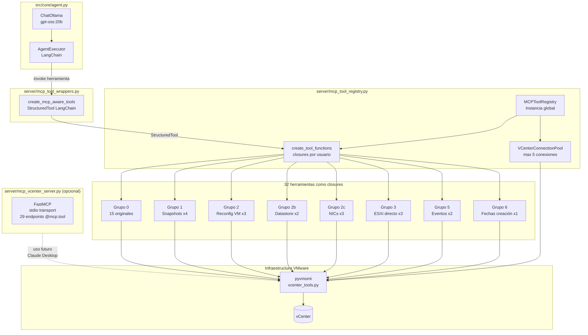

---

## 3. Flujo de una petición de herramienta

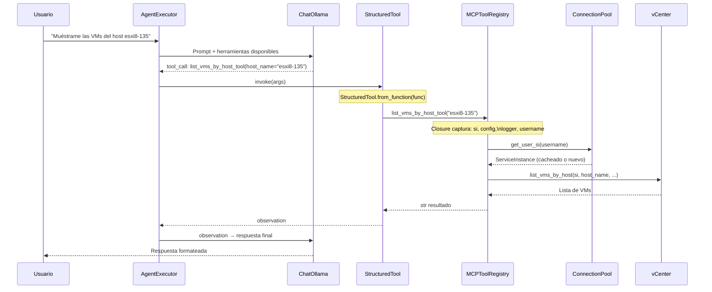

---

## 4. Componentes

### 4.1 `mcp_vcenter_server.py` — Servidor FastMCP

Expone las **29 herramientas originales** como endpoints MCP estándar con `@mcp.tool()`.

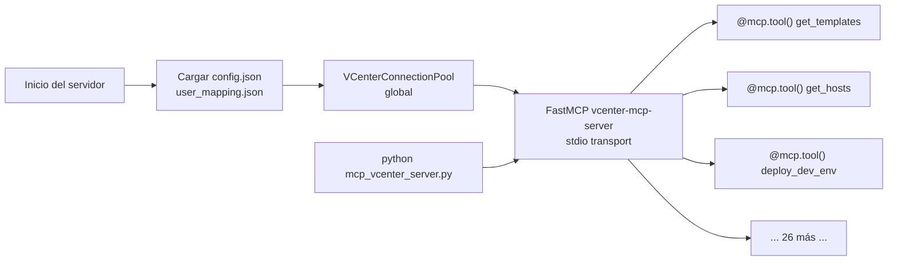

**Propósito actual:** Disponible para integración con clientes MCP estándar (Claude Desktop, etc.) y para tests. **No se usa en producción directamente** — el agente usa `MCPToolRegistry` directamente.

**Diferencia con el Registry:**

| `mcp_vcenter_server.py` | `mcp_tool_registry.py` |
|-------------------------|------------------------|
| Herramientas con `@mcp.tool()` | Closures Python (dict) |
| Transporte stdio JSON-RPC | Llamada directa en proceso |
| 29 herramientas | 32 herramientas |
| Para clientes MCP externos | Para el AgentExecutor LangChain |

### 4.2 `mcp_tool_registry.py` — Registro centralizado

Es el **núcleo del sistema**. Instancia global única en `agent.py` que gestiona:

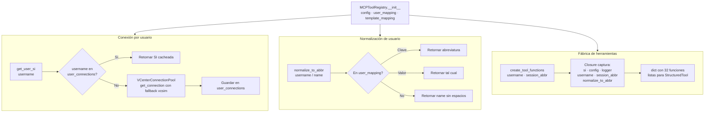

**Patrón closure — por qué es importante:**

```python
# create_tool_functions crea closures que capturan el contexto del usuario
def create_tool_functions(self, username: str, session_abbr: str):
    si = self.get_user_si(username)      # Conexión específica del usuario
    config = self.config                  # Config compartida (solo lectura)

    def power_operations_tool(vm_names, operation: str) -> str:
        """..."""
        return power_operations_vm(si, vm_names, operation, config, logger, session_abbr)
        #                          ^^ capturado del scope externo

    return {'power_operations_tool': power_operations_tool, ...}
```

Esto garantiza que **cada usuario opera con su propia conexión** sin riesgo de mezcla de sesiones.

### 4.3 `mcp_tool_wrappers.py` — Adaptadores LangChain

Convierte el dict de funciones del Registry en herramientas `StructuredTool` que LangChain puede invocar.

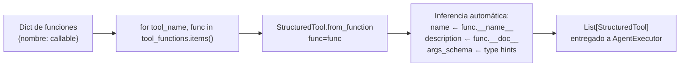

**Fuente única de verdad:** El nombre y la descripción de cada herramienta vienen directamente de `__name__` y `__doc__` de las funciones del Registry. No hay duplicación.

### 4.4 `mcp_client.py` — Cliente inactivo

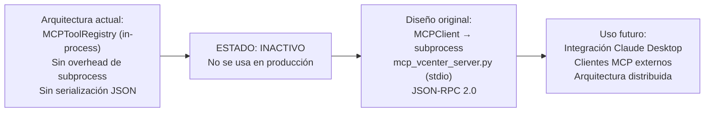

---

## 5. Catálogo de herramientas (32 tools)

### Mapa visual por grupo

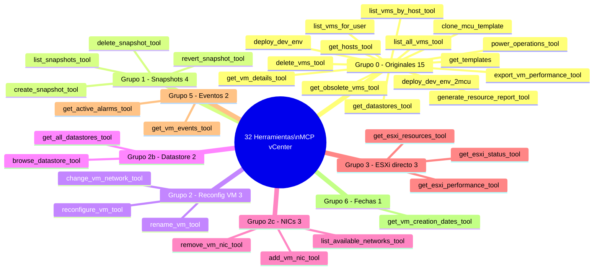

### Tabla completa

| Herramienta | Grupo | Operación crítica | Parámetros principales |
|-------------|-------|:-----------------:|------------------------|
| `get_templates` | 0 | — | — |
| `get_hosts_tool` | 0 | — | — |
| `get_datastores_tool` | 0 | — | — |
| `deploy_dev_env` | 0 | — | `username`, `mcu_template`, `eqsim_template` |
| `deploy_dev_env_2mcu` | 0 | — | `username`, `mcu_template`, `eqsim_template` |
| `list_vms_for_user` | 0 | — | `username_` (opcional) |
| `delete_vms_tool` | 0 | **SÍ** | `vm_names: list[str]` |
| `clone_mcu_template` | 0 | — | `username_`, `template_name`, `count`, `host_name`, `datastore_name` |
| `list_vms_by_host_tool` | 0 | — | `host_name` |
| `list_all_vms_tool` | 0 | — | — |
| `generate_resource_report_tool` | 0 | — | `vm_name` (opcional) |
| `get_obsolete_vms_tool` | 0 | — | `days_threshold` (default 30) |
| `export_vm_performance_tool` | 0 | — | `vm_name` |
| `power_operations_tool` | 0 | **SÍ** | `vm_names`, `operation` (poweron/poweroff/suspend/reset) |
| `get_vm_details_tool` | 0 | — | `vm_names` |
| `create_snapshot_tool` | 1 | — | `vm_name`, `snapshot_name`, `description` |
| `list_snapshots_tool` | 1 | — | `vm_name` |
| `revert_snapshot_tool` | 1 | **SÍ** | `vm_name`, `snapshot_name` |
| `delete_snapshot_tool` | 1 | **SÍ** | `vm_name`, `snapshot_name` |
| `reconfigure_vm_tool` | 2 | **SÍ** | `vm_name`, `cpu_count`, `memory_mb`, `cores_per_socket` |
| `rename_vm_tool` | 2 | — | `vm_name`, `new_name` |
| `change_vm_network_tool` | 2 | **SÍ** | `vm_name`, `interface_index`, `network_name` |
| `browse_datastore_tool` | 2b | — | `datastore_name`, `path` |
| `get_all_datastores_tool` | 2b | — | — |
| `add_vm_nic_tool` | 2c | — | `vm_name`, `network_name`, `adapter_type` |
| `remove_vm_nic_tool` | 2c | **SÍ** | `vm_name`, `interface_index` |
| `list_available_networks_tool` | 2c | — | — |
| `get_esxi_status_tool` | 3 | — | `host_id` |
| `get_esxi_resources_tool` | 3 | — | `host_id` |
| `get_esxi_performance_tool` | 3 | — | `host_id` |
| `get_vm_events_tool` | 5 | — | `vm_name`, `max_events` (default 20) |
| `get_active_alarms_tool` | 5 | — | — |
| `get_vm_creation_dates_tool` | 6 | — | `vm_names` (separados por coma) |

> **Operación crítica**: La herramienta ejecuta inmediatamente sin confirmación adicional. El LLM debe advertir al usuario antes de invocarla.

---

## 6. Connection Pool y aislamiento por usuario

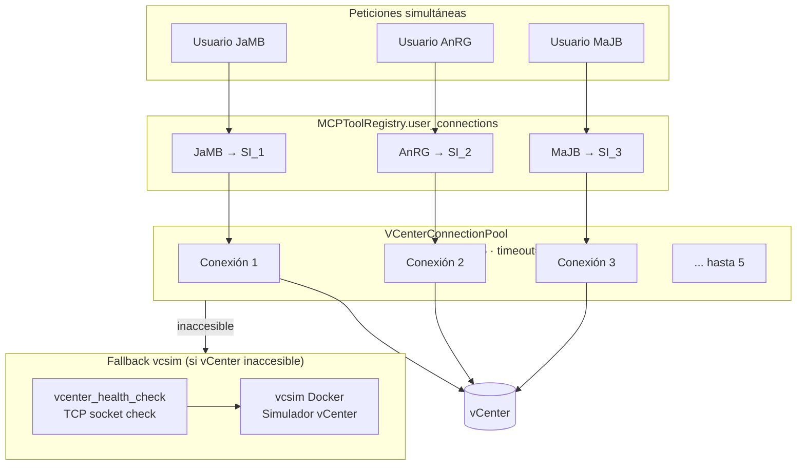

**Reglas del pool:**
- Máximo 5 conexiones simultáneas
- Timeout de conexión: 30 s
- `get_connection(config=self.config)` activa el fallback a vcsim si vCenter no responde
- Las conexiones se cachean en `user_connections` — una por usuario, reutilizada entre peticiones

---

## 7. Patrón de seguridad MCP-Only

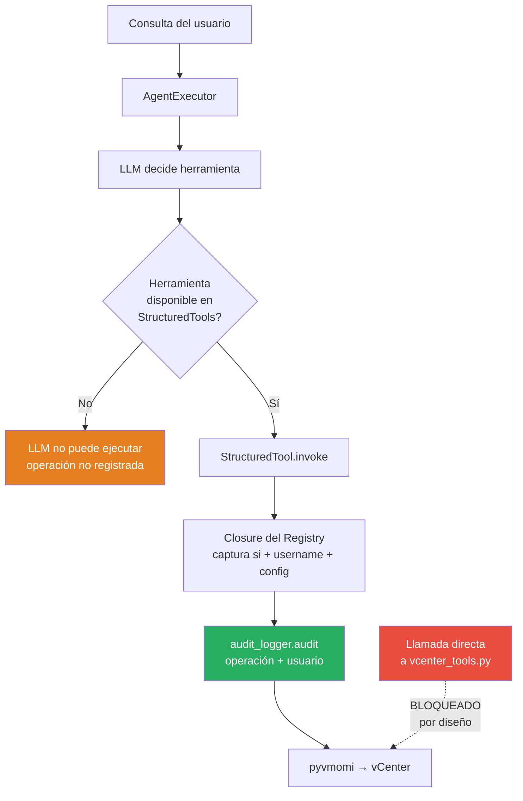

**¿Por qué no llamar directamente a `vcenter_tools.py`?**

Si el agente pudiera llamar las funciones de `vcenter_tools.py` directamente:
- No habría trazabilidad de quién ejecutó qué operación
- Una conexión `si` podría reutilizarse entre usuarios sin control
- No se aplicaría la normalización de usuario (`normalize_to_abbr`)
- Las operaciones críticas no quedarían en el log de auditoría

**El Registry garantiza que:**
1. Toda operación lleva `username` en el contexto de logging
2. Toda conexión viene del pool centralizado con límite
3. Las operaciones críticas se registran en `audit.log`
4. No es posible ejecutar una operación sin pasar por un closure controlado

---

## 8. Integración con el Agente vCenter

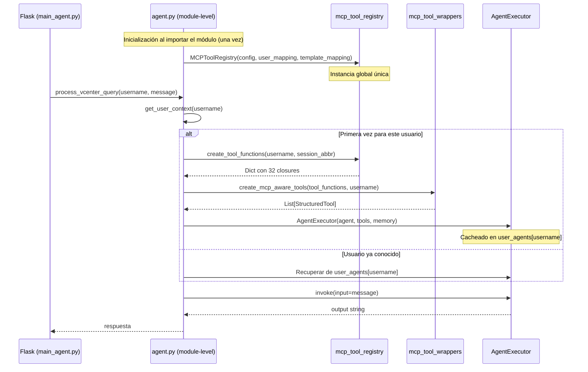

**Ciclo de vida de los objetos:**

| Objeto | Creación | Vida útil |
|--------|----------|-----------|
| `MCPToolRegistry` | Al importar `agent.py` | Toda la vida del proceso Flask |
| `VCenterConnectionPool` | Al importar | Toda la vida del proceso Flask |
| Closures (dict de funciones) | Primera petición de cada usuario | Hasta que se crea el `AgentExecutor` |
| `StructuredTool` | Primera petición de cada usuario | Toda la sesión del usuario |
| `AgentExecutor` | Primera petición de cada usuario | Hasta que `user_agents[username]` se limpia |
| `ConversationBufferMemory` | Primera petición de cada usuario | Hasta que la sesión expira (3600s) |

---

## 9. Añadir una nueva herramienta

Para añadir una herramienta al sistema MCP se siguen **3 pasos obligatorios**:

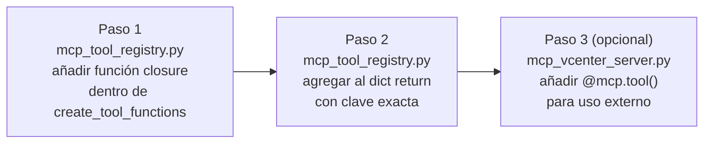

### Paso 1 — Función closure en el Registry

```python
# Dentro de MCPToolRegistry.create_tool_functions(username, session_abbr):

def mi_nueva_herramienta(vm_name: str, parametro: int = 10) -> str:
    """Descripción clara para el LLM — se usa como doc de la herramienta.
    USA esta herramienta cuando el usuario pida [casos de uso].
    Parámetros: vm_name (nombre de la VM), parametro (descripción)."""
    return mi_funcion_vcenter(si, vm_name, parametro, config, logger, username)
```

**Reglas:**
- `si`, `config`, `logger`, `username` siempre vienen del scope closure
- `__doc__` es la descripción que ve el LLM — hacerla explícita y con ejemplos de uso
- Type hints son obligatorios — `StructuredTool.from_function` los usa para el JSON Schema

### Paso 2 — Registrar en el dict de retorno

```python
return {
    # ... herramientas existentes ...
    'mi_nueva_herramienta': mi_nueva_herramienta,   # ← añadir aquí
}
```

### Paso 3 — Servidor FastMCP (opcional, para clientes externos)

```python
# En mcp_vcenter_server.py:
@mcp.tool()
def mi_nueva_herramienta(username: str, vm_name: str, parametro: int = 10) -> str:
    """Descripción para el servidor MCP externo."""
    si = get_user_si(username)
    return str(mi_funcion_vcenter(si, vm_name, parametro, config, logger, username))
```

### Resumen del patrón

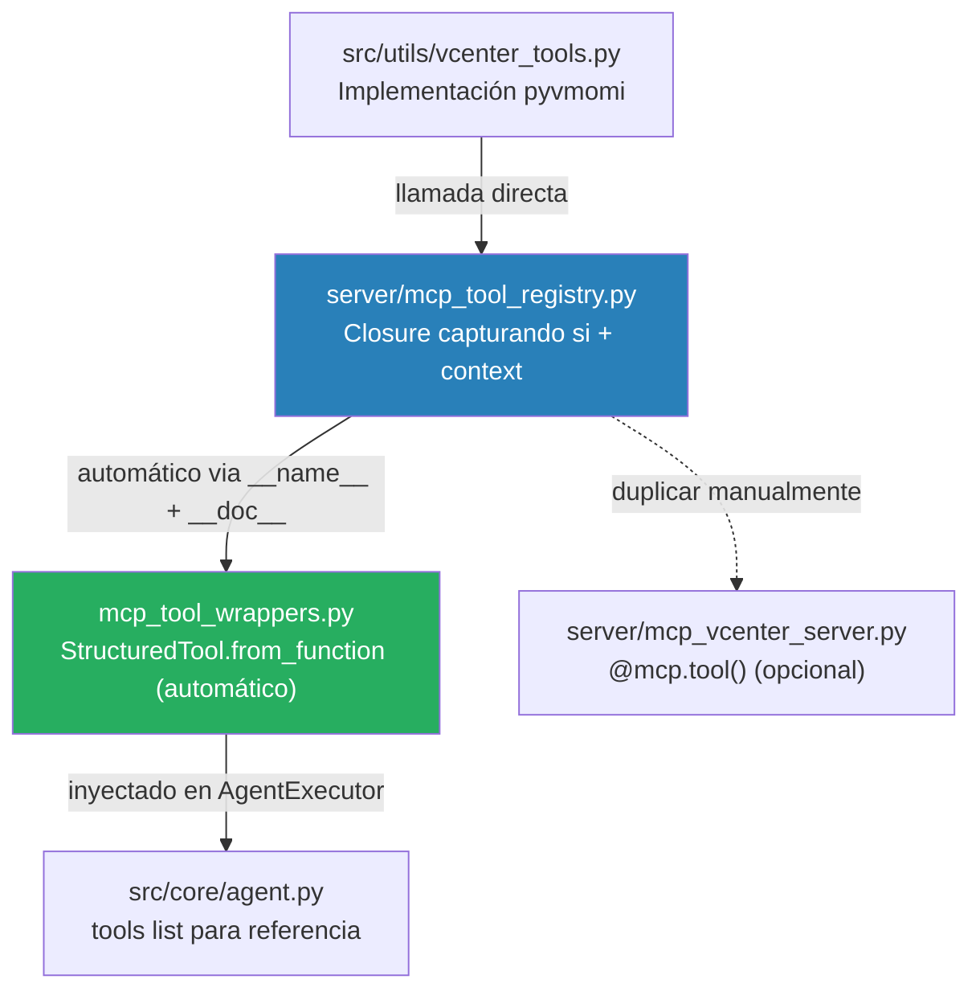

---

## 10. Referencia de archivos

| Archivo | Clase / Función | Propósito |
|---------|----------------|-----------|
| `server/mcp_tool_registry.py` | `MCPToolRegistry` | Registro central — 32 closures por usuario |
| `server/mcp_tool_wrappers.py` | `create_mcp_aware_tools()` | Convierte dict a `List[StructuredTool]` LangChain |
| `server/mcp_vcenter_server.py` | `FastMCP` + `@mcp.tool()` | Servidor MCP estándar para clientes externos |
| `server/mcp_client.py` | `MCPClient` | **INACTIVO** — cliente JSON-RPC para uso futuro |
| `src/core/agent.py` | `mcp_tool_registry` (global) | Punto de integración con el agente LangChain |
| `src/utils/vcenter_tools.py` | funciones pyvmomi | Implementación real de las operaciones vCenter |
| `src/utils/vcenter_tools.py` | `VCenterConnectionPool` | Pool de conexiones (max 5, timeout 30s) |
| `src/utils/vcenter_health_check.py` | `check_vcenter_health()` | TCP check para activar fallback vcsim |
| `src/utils/vcsim_manager.py` | `VcsimManager` | Gestión del simulador Docker vcsim |
| `config/config.json` | — | Credenciales vCenter, hosts ESXi |
| `config/user_mapping.json` | — | Mapeo `username → abreviatura` (ej. `jamb → JaMB`) |

---

*Documentación generada a partir del código fuente de `vcenter_agent_system/server/`.*
*Para detalles de la arquitectura general ver `CLAUDE.md` y `.github/copilot-instructions.md`.*
*Para seguridad de sesiones ver `DOCS_proyect/Login_Autentificación/`.*
