# Documentación Técnica — Sistema RAG v2.4

> **Agente de Documentación** | Sistema Híbrido ChromaDB + BM25
> Versión: 2.4.3 | Última actualización: 2026-03-12

---

## Índice

1. [Visión General](#1-visión-general)
2. [Arquitectura del Sistema](#2-arquitectura-del-sistema)
3. [Pipeline de Procesamiento — 8 Etapas](#3-pipeline-de-procesamiento--8-etapas)
4. [Componentes Técnicos](#4-componentes-técnicos)
   - 4.1 [Carga de Documentos](#41-carga-de-documentos-document_loaderpy)
   - 4.2 [Chunking Adaptativo](#42-chunking-adaptativo-chunkerpy)
   - 4.3 [Vector Store Manager](#43-vector-store-manager-vector_store_managerpy)
   - 4.4 [Embedding Cache](#44-embedding-cache-embedding_cachepy)
   - 4.5 [BM25 Retriever](#45-bm25-retriever-bm25_retrieverpy)
   - 4.6 [Hybrid Retriever](#46-hybrid-retriever-hybrid_retrieverpy)
   - 4.7 [Query Expander](#47-query-expander-query_expanderpy)
   - 4.8 [Search Modes](#48-search-modes-search_modespy)
   - 4.9 [Fast Reranker](#49-fast-reranker-rerankerpy)
   - 4.10 [Retrieval Metrics](#410-retrieval-metrics-retrieval_metricspy)
5. [Alpha Adaptativo](#5-alpha-adaptativo)
6. [Modos de Búsqueda por Carpeta](#6-modos-de-búsqueda-por-carpeta)
7. [Sistema de Abstención](#7-sistema-de-abstención)
8. [Flujo Conversacional y Memoria](#8-flujo-conversacional-y-memoria)
9. [Parámetros de Configuración](#9-parámetros-de-configuración)
10. [Métricas y Observabilidad](#10-métricas-y-observabilidad)
11. [Decisiones de Diseño](#11-decisiones-de-diseño)
12. [Referencia de Archivos](#12-referencia-de-archivos)

---

## 1. Visión General

El sistema RAG v2.4 es el motor de recuperación de información del **Agente de Documentación** (`doc_consultant.py`). Combina búsqueda vectorial semántica (ChromaDB + `nomic-embed-text`) con búsqueda léxica basada en frecuencia de términos (BM25) para responder consultas en lenguaje natural exclusivamente desde la documentación indexada.

### Principios de Diseño

| Principio | Implementación |
|-----------|----------------|
| **RAG Estricto** | El retrieval es **obligatorio** antes de cualquier respuesta LLM |
| **Sin alucinaciones** | Si no hay contexto recuperado, el sistema se abstiene |
| **Eficiencia** | Caché LRU para embeddings (~30% menos latencia en repeticiones) |
| **Explicabilidad** | Toda respuesta incluye citas de fuente obligatorias |
| **Adaptabilidad** | Alpha dinámico según longitud de query |

---

## 2. Arquitectura del Sistema

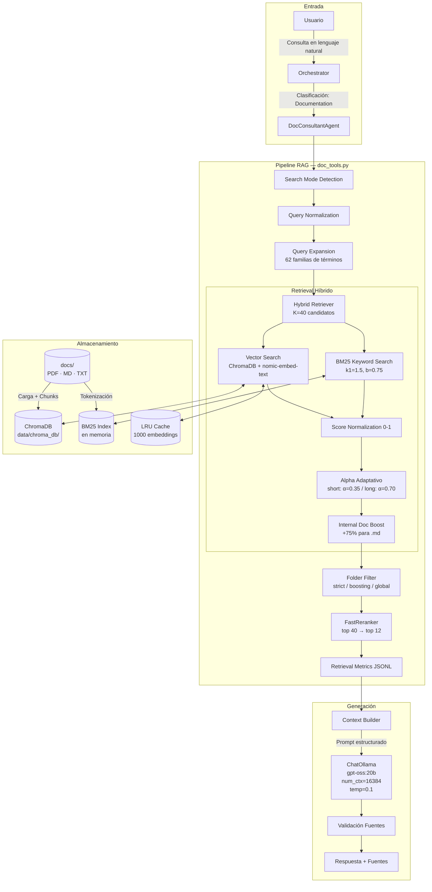

---

## 3. Pipeline de Procesamiento — 8 Etapas

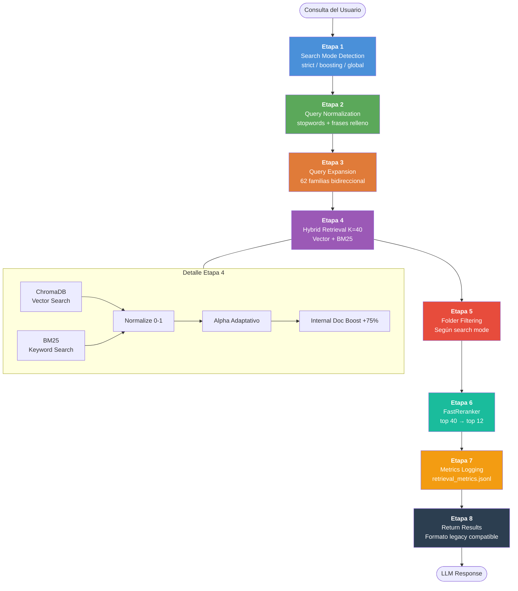

### Descripción por Etapa

| # | Etapa | Archivo | Función Principal |
|---|-------|---------|-------------------|
| 1 | Search Mode Detection | `search_modes.py` | `detect_search_mode(query)` |
| 2 | Query Normalization | `rag_retriever.py` | `normalize_query(query)` |
| 3 | Query Expansion | `query_expander.py` | `SimpleQueryExpander.expand(query)` |
| 4 | Hybrid Retrieval | `hybrid_retriever.py` | `ImprovedHybridRetriever.retrieve(query, k=40)` |
| 5 | Folder Filtering | `search_modes.py` | `filter_results_by_folder(results, folder, mode)` |
| 6 | Reranking | `reranker.py` | `FastReranker.rerank(query, docs, top_k=12)` |
| 7 | Metrics Logging | `retrieval_metrics.py` | `log_retrieval_metrics(metrics, logs_dir)` |
| 8 | Format Conversion | `doc_tools.py` | `_convert_hybrid_to_legacy_format(hybrid_results)` |

---

## 4. Componentes Técnicos

### 4.1 Carga de Documentos (`document_loader.py`)

Carga documentos en múltiples formatos preservando metadatos estructurales.

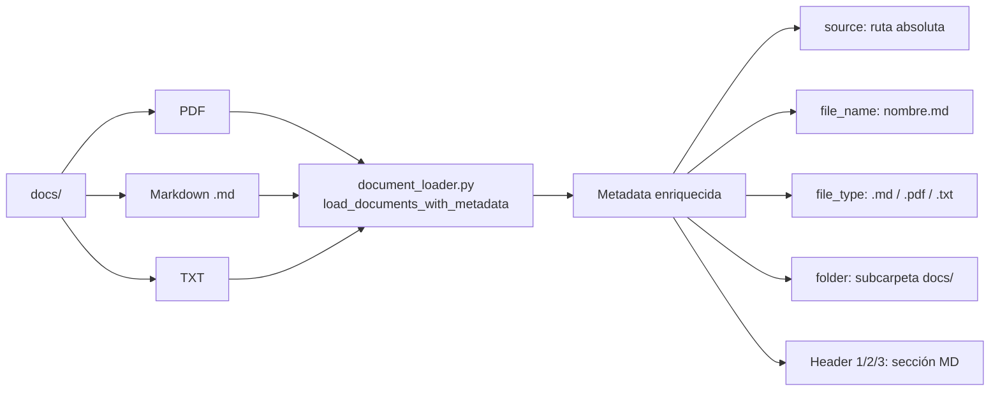

**Metadatos clave preservados:**

| Campo | Descripción | Uso |
|-------|-------------|-----|
| `source` | Ruta absoluta del archivo | Identificación única en BM25 |
| `file_name` | Nombre del archivo | Boost por herramienta en BM25 |
| `file_type` | `.md`, `.pdf`, `.txt` | Identificación de docs internos |
| `folder` | Subcarpeta bajo `docs/` | Filtrado por folder mode |
| `Header 1/2/3` | Secciones MD | Contexto en BM25 + citación |

---

### 4.2 Chunking Adaptativo (`chunker.py`)

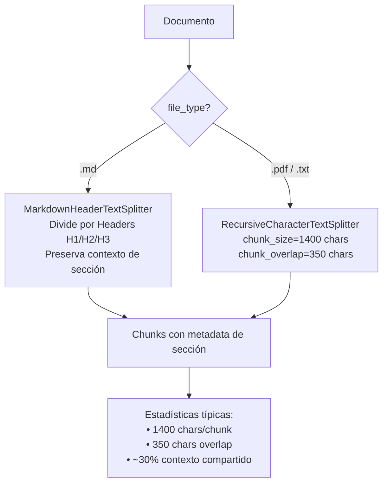

**Parámetros:**

```python
AdaptiveSemanticChunker(chunk_size=1400, chunk_overlap=350)
```

El overlap del 25% (`350/1400`) asegura que conceptos que cruzan límites de chunk no se pierdan.

---

### 4.3 Vector Store Manager (`vector_store_manager.py`)

Gestiona el ciclo de vida de ChromaDB con detección automática de cambios mediante manifesto SHA1.

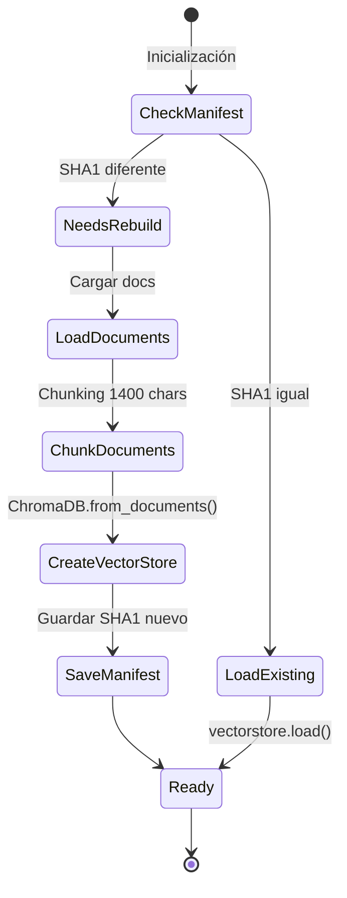

**Ubicación:** `data/chroma_db/`
**Modelo de embedding:** `nomic-embed-text` (via Ollama)
**Forzar rebuild:** `config.json → rag_v2.vector_store.force_rebuild: true`

---

### 4.4 Embedding Cache (`embedding_cache.py`)

Cache LRU en memoria para embeddings de queries repetidas.

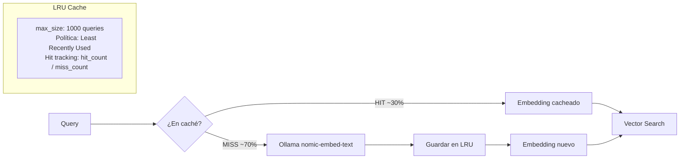

**Estadísticas disponibles:**

```python
cache.get_stats()
# {hit_count, miss_count, hit_rate, current_size, max_size}
```

---

### 4.5 BM25 Retriever (`bm25_retriever.py`)

Implementación del algoritmo BM25 (Best Matching 25) con indexación enriquecida.

#### Fórmula BM25

```
score(q, d) = Σ IDF(tᵢ) × [tf(tᵢ,d) × (k1+1)] / [tf(tᵢ,d) + k1×(1 - b + b×|d|/avgdl)]
```

| Parámetro | Valor | Descripción |
|-----------|-------|-------------|
| `k1` | 1.5 | Saturación de frecuencia de términos |
| `b` | 0.75 | Normalización por longitud de documento |

#### Texto indexable por documento

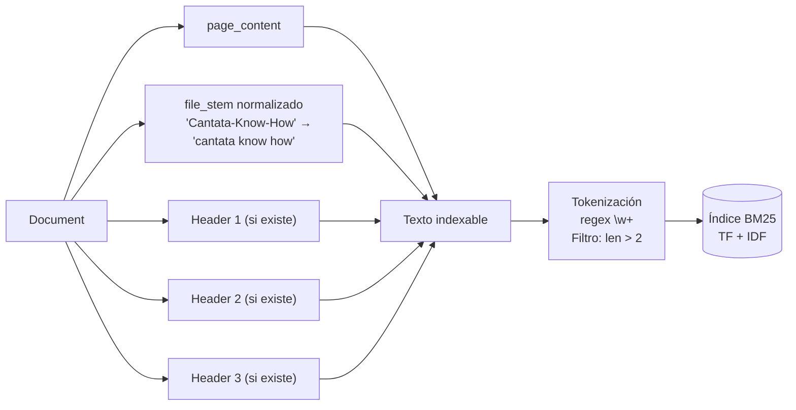

> **Nota de diseño**: Incluir el nombre del archivo en el índice permite que búsquedas por herramienta (`"cantata"`, `"sonarqube"`) encuentren chunks aunque la palabra no aparezca literalmente en el contenido.

---

### 4.6 Hybrid Retriever (`hybrid_retriever.py`)

Combina los scores de búsqueda vectorial y BM25 mediante alpha adaptativo.

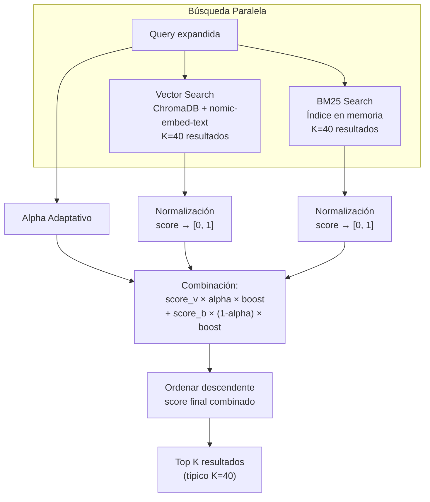

**Cálculo del score final:**

```
score_final = (score_vector × α × boost) + (score_bm25 × (1-α) × boost)

boost = 1.75 si es .md (interno)
boost = 1.00 si es .pdf o .txt
```

---

### 4.7 Query Expander (`query_expander.py`)

Expansión heurística sin LLM con 62 familias de términos bidireccionales.

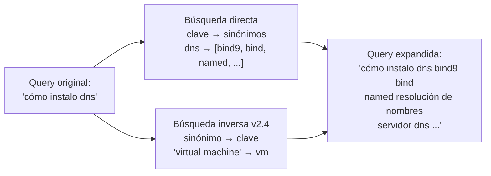

**Categorías de las 62 familias:**

| Categoría | Familias | Ejemplos |
|-----------|----------|---------|
| VMware Básico | 12 | vm, apagar, snapshot, disco, red, cpu |
| Infraestructura | 4 | host, datastore, cluster, vcenter |
| HA/Performance | 4 | ha, drs, vmotion, rendimiento |
| Red/Seguridad | 4 | vlan, vswitch, firewall, ip |
| Almacenamiento | 3 | vmdk, nfs, iscsi |
| Operaciones | 4 | arrancar, detener, backup, monitoreo |
| Administración | 5 | usuario, permiso, licencia, configurar |
| Recursos | 2 | recurso, límite |
| DNS/Infraestructura | 7 | dns, bind, bind9, named, zona, ubuntu |
| Herramientas Proyecto | 6 | gtr, dvd, build_dvds, pruebas, entrega, cantata |
| Herramientas Doc | 5 | doors, midat, sonarqube, sbr, concalnet |
| Logs/Acceso | 4 | log, logs, sta_element_history, sec_element_history |
| Métricas Red | 2 | mbps, ancho de banda |

---

### 4.8 Search Modes (`search_modes.py`)

Detección automática del scope de búsqueda mediante keywords en la query.

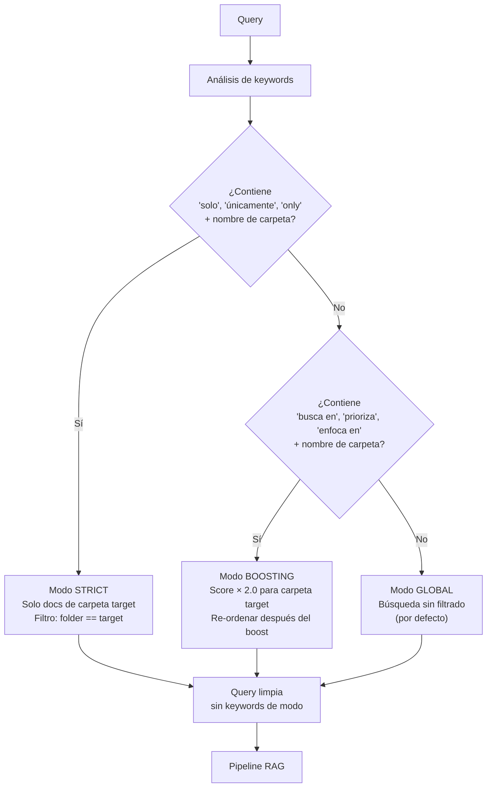

**Carpetas conocidas:** `git, vmware, esxi, vcenter, sonarqube, cantata, doors, header, sbr, ttcf, documentacion, know-how`

**Ejemplos:**

```
"SOLO vcenter configuración de red"   → strict, folder=vcenter
"busca en esxi problemas de memoria"  → boosting, folder=esxi
"cómo configuro una VM"               → global
```

---

### 4.9 Fast Reranker (`reranker.py`)

Reordenamiento heurístico de candidatos sin llamadas adicionales al LLM.

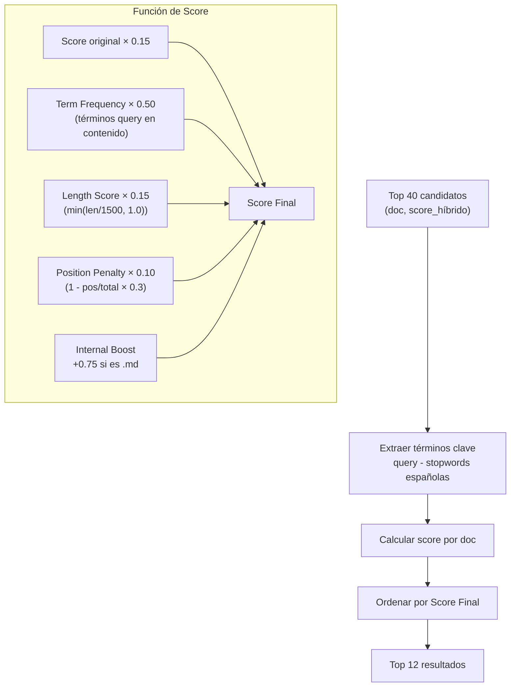

**Pesos del scoring:**

| Factor | Peso | Razón |
|--------|------|-------|
| Term Frequency | 50% | Principal señal de relevancia |
| Score original | 15% | Confirmación híbrida |
| Length | 15% | Preferir chunks completos |
| Position | 10% | Penalizar posiciones bajas |
| Internal Boost | +75% | Docs `.md` = Know-How del proyecto |

**Stop words filtradas en term_freq:**
`como, cómo, qué, que, cuál, hay, un, una, el, la, los, las, es, en, de, del, al, y, o, a, para, con, se, por, lo, más, this, that, the, and, or, is, are, of, to, hago, quiero, puedo, necesito`

---

### 4.10 Retrieval Metrics (`retrieval_metrics.py`)

Logging estructurado en JSONL de cada operación de retrieval.

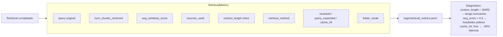

**Formato JSONL:**
```json
{
  "timestamp": "2026-03-12T10:30:00",
  "query": "cómo instalo bind9",
  "num_chunks_retrieved": 8,
  "avg_similarity_score": 0.74,
  "sources_used": ["Documentacion_Entorno_VMware.md"],
  "context_length": 9840,
  "retrieval_method": "semantic+rerank",
  "reranked": true,
  "query_expanded": true,
  "cache_hit": false,
  "folder_mode": "global"
}
```

---

## 5. Alpha Adaptativo

El parámetro alpha controla la proporción entre búsqueda vectorial (semántica) y BM25 (léxica) según la longitud de la query.

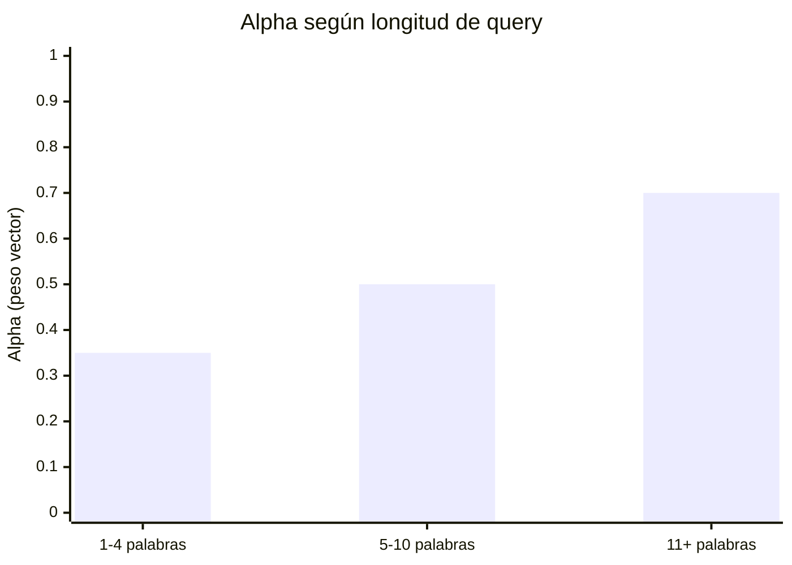

| Longitud | Alpha | Interpretación |
|----------|-------|----------------|
| < 5 palabras | **0.35** | Más peso a BM25 — queries cortas son términos exactos |
| 5–10 palabras | **0.50** | Balance equitativo (valor base) |
| > 10 palabras | **0.70** | Más peso a vector — queries largas tienen intención semántica |

**Fundamento:** Queries cortas como `"cantata licencia"` se benefician de matching exacto. Queries largas como `"cómo configurar el servidor DNS en Ubuntu para el entorno VMware"` se benefician de comprensión semántica.

---

## 6. Modos de Búsqueda por Carpeta

```mermaid
flowchart TD
    subgraph STRICT["Modo STRICT"]
        S1[Results: 40 candidatos] --> S2["Filtrar: solo folder == target"]
        S2 --> S3[Results: N ≤ 40]
        S3 --> S4[Rerank → top 12]
    end

    subgraph BOOST["Modo BOOSTING"]
        B1[Results: 40 candidatos] --> B2["Multiplicar score × 2.0
        para docs de carpeta target"]
        B2 --> B3[Re-ordenar por score]
        B3 --> B4[Rerank → top 12]
    end

    subgraph GLOBAL["Modo GLOBAL (default)"]
        G1[Results: 40 candidatos] --> G2[Sin filtrado]
        G2 --> G3[Rerank → top 12]
    end
```

---

## 7. Sistema de Abstención

El sistema implementa una regla de abstención estricta para evitar alucinaciones.

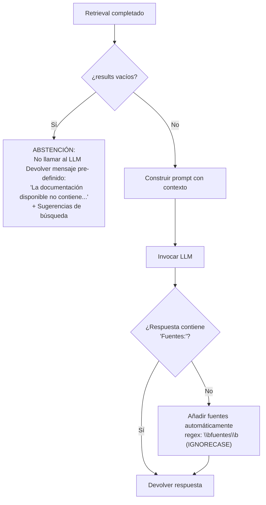

**Mensajes de abstención:**
- Sin resultados: `"La documentación disponible no contiene información sobre: {query normalizada}"`
- Con sugerencia: `"Prueba con términos más generales o usa 'listar documentos'"`
- Error técnico: `"Error al buscar en la documentación. Por favor, intenta de nuevo."`

---

## 8. Flujo Conversacional y Memoria

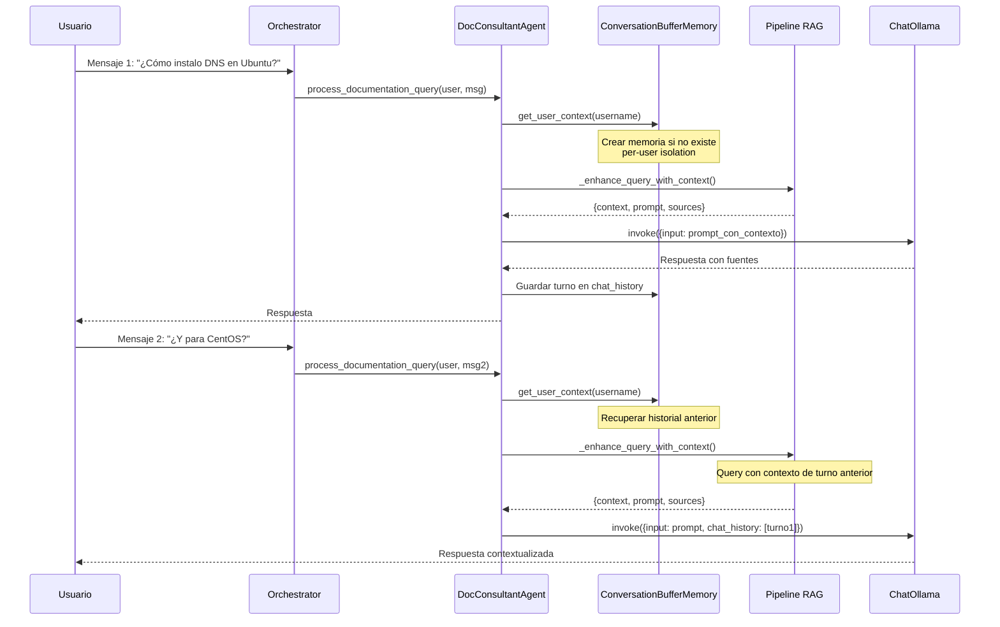

**Aislamiento por usuario:**
- Cada usuario tiene su propia instancia de `ConversationBufferMemory`
- Cada usuario tiene su propio `AgentExecutor`
- Almacenado en `user_memories: Dict[str, ConversationBufferMemory]`

---

## 9. Parámetros de Configuración

### `config/config.json` → sección `rag_v2`

```json
{
  "rag_v2": {
    "enabled": true,
    "features": {
      "query_expansion_v2": true,
      "embedding_cache": true,
      "reranking": true,
      "folder_filtering": true,
      "hybrid_search": true
    },
    "vector_store": {
      "db_path": "data/chroma_db",
      "embedding_model": "nomic-embed-text",
      "chunk_size": 1200,
      "chunk_overlap": 250,
      "force_rebuild": false
    },
    "hybrid_retrieval": {
      "base_alpha": 0.5,
      "initial_k": 40,
      "bm25_k1": 1.5,
      "bm25_b": 0.75,
      "internal_docs_boost": 0.75
    }
  }
}
```

### Parámetros del LLM (hardcoded en `doc_consultant.py`)

```python
self.llm = ChatOllama(
    model="gpt-oss:20b",
    num_ctx=16384,   # Ollama default=4096 → truncación silenciosa con RAG
    temperature=0.1  # Baja creatividad = menos alucinaciones en RAG
)
```

> **CRÍTICO**: `num_ctx=16384` es esencial. Con `rerank_top_k=12` chunks de 1400 chars + system prompt el contexto supera 5500 tokens, superando el default de Ollama (4096) y causando truncación silenciosa.

### Tabla completa de parámetros

| Parámetro | Valor | Ubicación |
|-----------|-------|-----------|
| `chunk_size` | 1400 chars | `doc_tools.py:AdaptiveSemanticChunker` |
| `chunk_overlap` | 350 chars | `doc_tools.py:AdaptiveSemanticChunker` |
| `embedding_model` | `nomic-embed-text` | `doc_tools.py:OllamaEmbeddings` |
| `base_alpha` | 0.5 | `hybrid_retriever.py` |
| `alpha_short` (< 5w) | 0.35 | `hybrid_retriever.py` |
| `alpha_long` (> 10w) | 0.70 | `hybrid_retriever.py` |
| `internal_docs_boost` | 0.75 (+75%) | `hybrid_retriever.py`, `reranker.py` |
| `bm25_k1` | 1.5 | `bm25_retriever.py:search()` |
| `bm25_b` | 0.75 | `bm25_retriever.py:search()` |
| `initial_k` (retrieval) | 40 | `doc_tools.py:search_documents()` |
| `rerank_top_k` | 12 | `config.json → rag_v2.parameters` |
| `embedding_cache_size` | 1000 | `doc_tools.py:EmbeddingCache` |
| `num_ctx` (LLM) | 16384 | `doc_consultant.py` |
| `temperature` | 0.1 | `doc_consultant.py` |
| `folder_boost_factor` | 2.0 | `search_modes.py:BOOST_FACTOR` |

---

## 10. Métricas y Observabilidad

### Archivos de log

| Log | Ruta | Contenido |
|-----|------|-----------|
| Retrieval metrics | `logs/retrieval_metrics.jsonl` | Métricas por búsqueda (JSONL) |
| Sistema | `logs/system.log` | Errores críticos, inicialización |
| Negocio | `logs/business/` | Operaciones de usuario |
| Auditoría | `logs/audit/` | Consultas por usuario |
| Performance | `logs/performance/` | Latencias |

### Diagnóstico rápido

```powershell
# Ver últimas métricas de retrieval
Get-Content logs/retrieval_metrics.jsonl -Tail 5

# Monitorear errores del sistema RAG
Get-Content logs/system.log -Wait -Tail 20 | Select-String "chroma|bm25|rerank|embed"

# Ver estadísticas de cache
Get-Content logs/system.log -Tail 100 | Select-String "Cache stats"
```

### Indicadores de salud

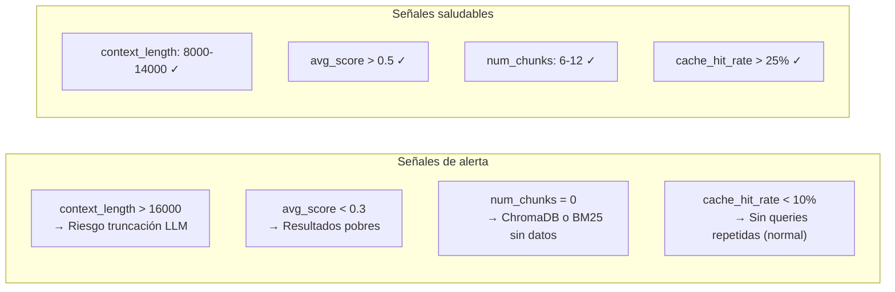

---

## 11. Decisiones de Diseño

### ¿Por qué Híbrido (Vector + BM25)?

```
Vector search solo → Alta precisión semántica, baja precisión léxica
                     Falla en nombres propios: "cantata", "sonarqube", "sbr"

BM25 solo          → Alta precisión léxica, sin comprensión semántica
                     Falla en sinónimos: "apagar" ≠ "shutdown"

Híbrido            → Mejor de ambos mundos
                     Alpha adaptativo ajusta el balance por query
```

### ¿Por qué BM25 indexa metadatos (nombre de archivo + headers)?

Sin esto, una búsqueda por `"cantata"` no encontraría chunks del documento `Cantata-Know-How.md` si la palabra "cantata" no aparece en el texto del chunk. El nombre normalizado del archivo se añade al texto indexable.

### ¿Por qué `num_ctx=16384` y no el default?

Ollama usa 4096 tokens de contexto por defecto aunque el modelo soporte más. Con el pipeline RAG típico:
- System prompt: ~1800 tokens
- 12 chunks × 1400 chars ≈ 4200 tokens (sin contar overhead)
- Query + historial: ~500 tokens
- **Total: ~6500 tokens → truncación silenciosa con default 4096**

Con `num_ctx=16384` el margen es seguro hasta context lengths de ~14000 chars.

### ¿Por qué `temperature=0.1`?

El Agente de Documentación debe ser determinista y fiel al contexto recuperado. `temperature=0.1` reduce la variabilidad y la tendencia a "completar" información no presente en el contexto. El default de Ollama (`temperature=1.0`) es apropiado para tareas creativas, no para RAG estricto.

### ¿Por qué +75% boost para docs `.md`?

Los archivos `.md` en `docs/` son el Know-How del proyecto (documentación interna). Los archivos `.pdf` suelen ser documentación de terceros. El boost asegura que la documentación propia tenga prioridad cuando es igualmente relevante.

---

## 12. Referencia de Archivos

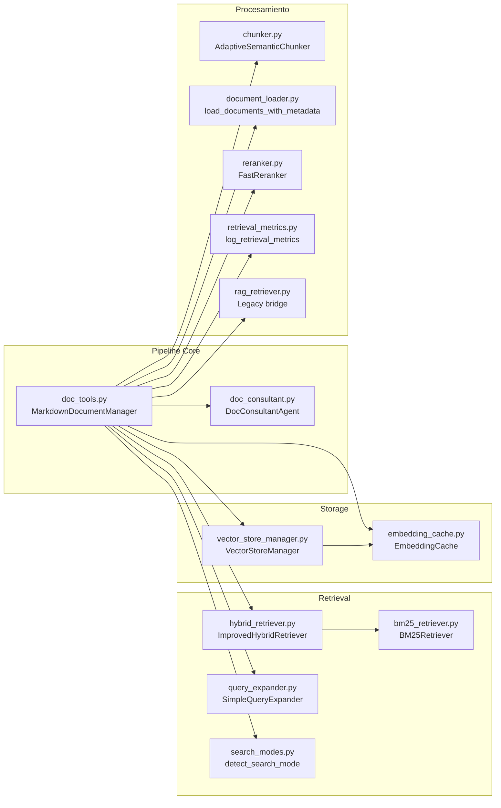

### Tabla completa de archivos

| Archivo | Clase / Función Principal | Propósito |
|---------|---------------------------|-----------|
| `src/core/doc_consultant.py` | `DocConsultantAgent` | Agente principal, RAG estricto, memoria por usuario |
| `src/utils/doc_tools.py` | `MarkdownDocumentManager` | Orquestador del pipeline, formato legacy |
| `src/utils/hybrid_retriever.py` | `ImprovedHybridRetriever` | Combinación Vector+BM25 con alpha adaptativo |
| `src/utils/bm25_retriever.py` | `BM25Retriever` | Algoritmo BM25 con indexación de metadatos |
| `src/utils/query_expander.py` | `SimpleQueryExpander` | 62 familias de expansión bidireccional |
| `src/utils/search_modes.py` | `detect_search_mode()` | Detección strict/boosting/global |
| `src/utils/reranker.py` | `FastReranker` | Reranking heurístico sin LLM |
| `src/utils/embedding_cache.py` | `EmbeddingCache` | LRU cache para embeddings |
| `src/utils/vector_store_manager.py` | `VectorStoreManager` | ChromaDB + manifesto SHA1 |
| `src/utils/chunker.py` | `AdaptiveSemanticChunker` | Chunking MD-aware |
| `src/utils/document_loader.py` | `load_documents_with_metadata()` | Carga PDF/MD/TXT con metadatos |
| `src/utils/retrieval_metrics.py` | `log_retrieval_metrics()` | Logging JSONL de métricas |
| `src/utils/rag_retriever.py` | `get_rag_retriever()` | Bridge legacy + normalize_query |
| `config/config.json` | sección `rag_v2` | Parámetros del sistema RAG |
| `data/chroma_db/` | — | Vector store persistente |
| `logs/retrieval_metrics.jsonl` | — | Métricas de retrieval por consulta |

---

*Documentación generada a partir del código fuente de `vcenter_agent_system/`.*
*Para detalles de migración desde v1.0 ver `RAG_V2_MIGRATION_README.md`.*
*Para detalles del sistema completo ver `HYBRID_SYSTEM_README.md`.*
