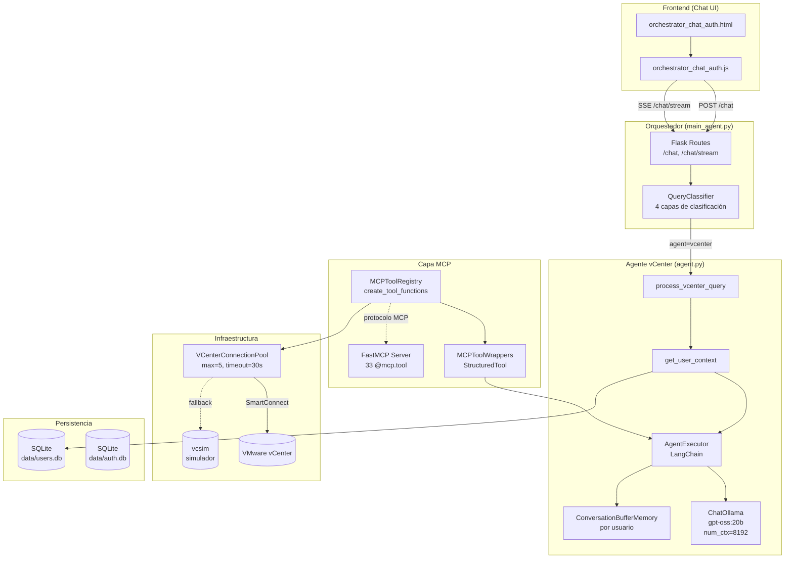
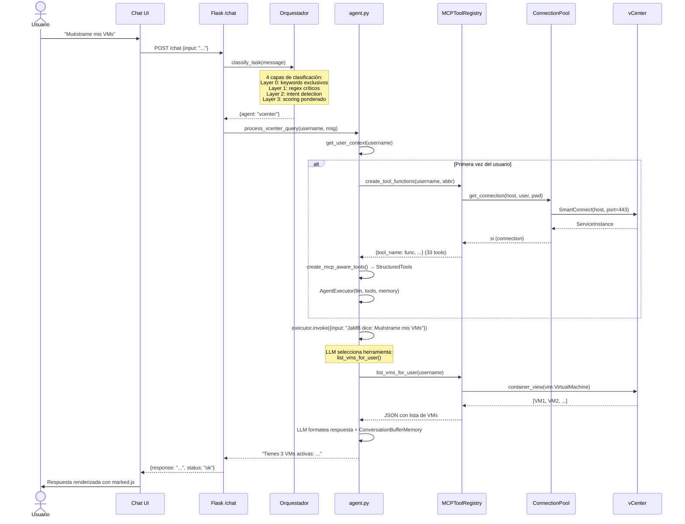
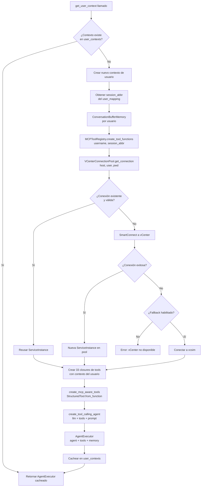
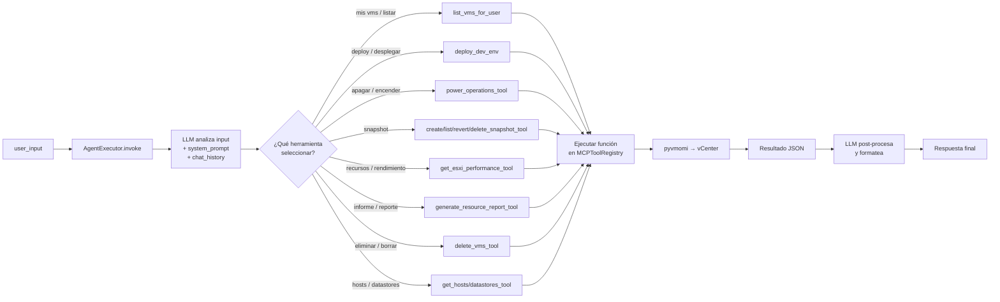
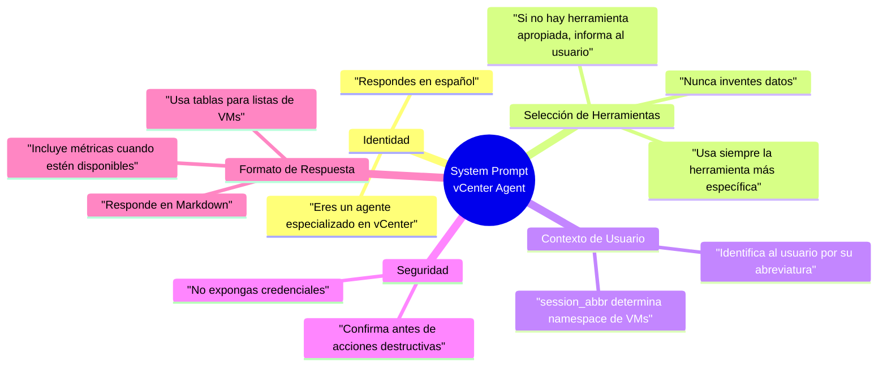

# Arquitectura del Agente vCenter

## Visión General

El agente vCenter forma parte del sistema multi-agente. Recibe consultas en lenguaje natural del Orquestador y las ejecuta sobre infraestructura VMware vCenter a través de una capa MCP de 33 herramientas.

---

## Diagrama de Arquitectura General



---

## Flujo de Procesamiento de una Query



---

## Inicialización del Agente por Usuario



---

## Selección de Herramienta por el LLM



---

## System Prompt del Agente

El system prompt define el comportamiento del agente. Se carga una vez al inicializar `agent.py` y se reutiliza para todos los usuarios.



---

## Estructura de Archivos del Agente

```
vcenter_agent_system/
├── src/
│   └── core/
│       └── agent.py                 ← Entry point, AgentExecutor, sesiones Flask
│
├── server/
│   ├── mcp_tool_registry.py         ← 33 closures MCP por usuario (CRÍTICO)
│   ├── mcp_tool_wrappers.py         ← LangChain StructuredTool adapters
│   └── mcp_vcenter_server.py        ← FastMCP server (protocolo MCP externo)
│
└── src/utils/
    └── vcenter_tools.py             ← pyvmomi wrappers + VCenterConnectionPool
```

---

## Configuración Clave

| Parámetro | Valor | Archivo | Motivo |
|-----------|-------|---------|--------|
| `num_ctx` | 8192 tokens | `agent.py` | Contexto Ollama expandido (default: 4096) |
| `model` | `gpt-oss:20b` | `agent.py` | Modelo principal de razonamiento |
| `max_connections` | 5 | `vcenter_tools.py` | Pool máximo de conexiones vCenter |
| `connection_timeout` | 30s | `vcenter_tools.py` | Timeout para liberar conexiones inactivas |
| `memory_type` | ConversationBufferMemory | `agent.py` | Historial de chat por usuario |
| `verbose` | False | `agent.py` | No expone razonamiento interno al usuario |
