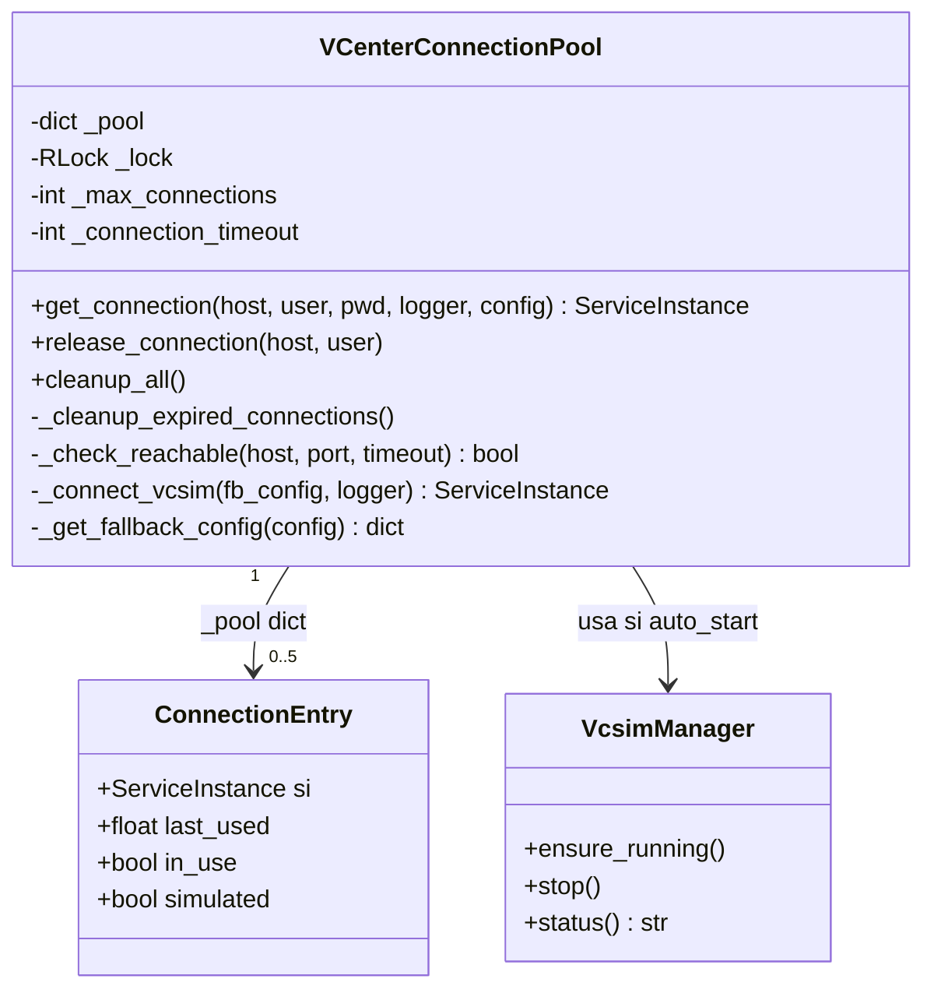
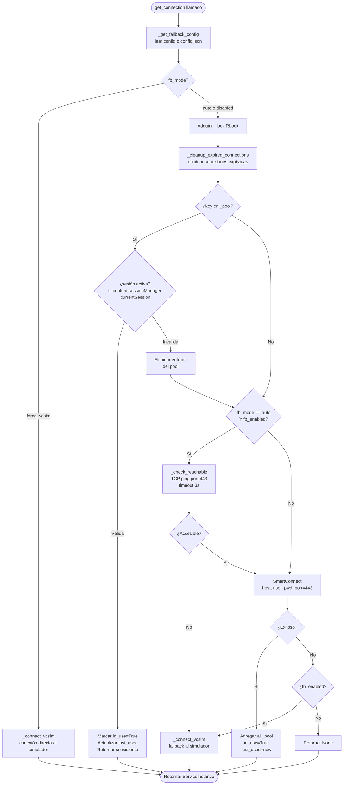
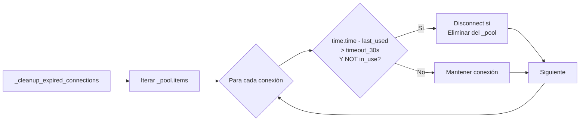
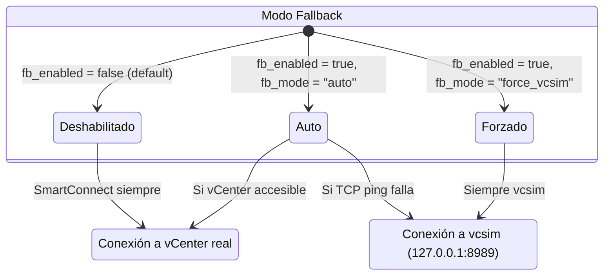
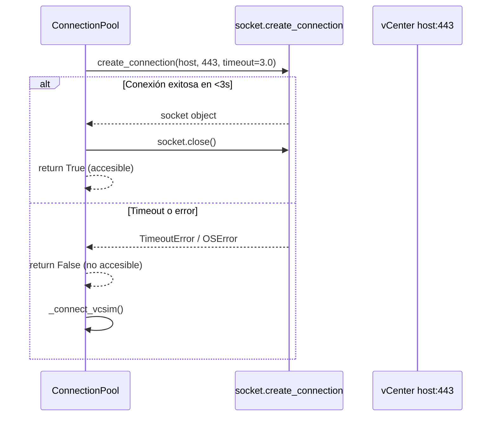
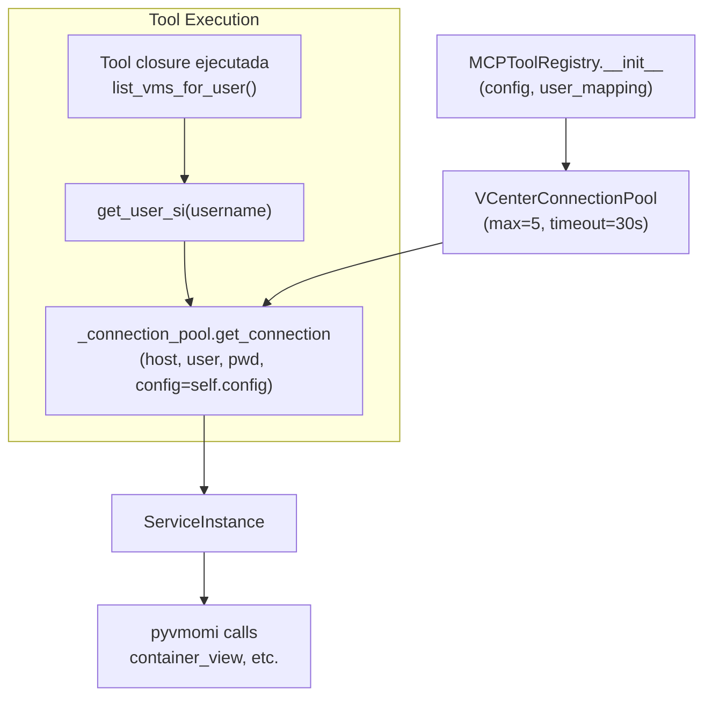

# Sistema de Conexiones vCenter

Documentación técnica del `VCenterConnectionPool` y el sistema de fallback a vcsim.

**Archivo:** `src/utils/vcenter_tools.py`

---

## Arquitectura del Connection Pool



---

## Estructura Interna del Pool

```python
_pool = {
    ("vcenter-host.local", "admin"): {
        "si":        ServiceInstance,  # objeto pyvmomi
        "last_used": 1709123456.789,   # timestamp Unix
        "in_use":    False,            # True = ocupado
        "simulated": False             # True = vcsim
    }
}
```

Clave del pool: tupla `(host, user)` — permite múltiples conexiones a distintos hosts o usuarios vCenter.

---

## Flujo de `get_connection()`



---

## Limpieza de Conexiones Expiradas



**Cuándo se ejecuta:** Al inicio de cada llamada a `get_connection()`, con el lock ya adquirido.

---

## Modos de Fallback a vcsim



### Configuración de fallback en `config.json`

```json
{
  "vcenter_fallback": {
    "enabled": false,
    "mode": "auto",
    "vcsim": {
      "host": "127.0.0.1",
      "port": 8989,
      "user": "user",
      "pwd": "pass",
      "auto_start": true
    }
  }
}
```

---

## Health Check TCP



---

## Ciclo de Vida de una Conexión

```mermaid
gantt
    title Ciclo de Vida de una Conexión en el Pool
    dateFormat X
    axisFormat %ss

    section Conexión A
    SmartConnect           :done, a1, 0, 2
    En uso (query 1)       :active, a2, 2, 5
    Libre (in_use=False)   :a3, 5, 35
    Expirada (>30s libre)  :crit, a4, 35, 36
    Disconnect + Eliminar  :crit, a5, 36, 37

    section Conexión B
    SmartConnect           :done, b1, 10, 12
    En uso (query 2)       :active, b2, 12, 15
    Libre                  :b3, 15, 42
```



---

## `release_connection()` — Liberar Conexión

Después de que una herramienta MCP termina su operación, debe liberar la conexión:

```python
def release_connection(self, host: str, user: str):
    key = (host, user)
    with self._lock:
        if key in self._pool:
            self._pool[key]["in_use"] = False
```

Esto permite que el pool gestione la conexión para futuras consultas sin crear una nueva sesión vCenter.

---

## Comparativa: Conexión Real vs vcsim

| Aspecto | vCenter Real | vcsim (simulador) |
|---------|-------------|-------------------|
| Host | `vcenter-host.local` | `127.0.0.1` |
| Puerto | 443 (HTTPS) | 8989 |
| VMs | Reales, producción | Inventario pre-grabado |
| SSL | Verificación deshabilitada | Sin SSL |
| Uso | Producción | Desarrollo / Testing CI |
| `simulated` flag | `False` | `True` |
| Fuente datos | `get_connection()` directo | `_connect_vcsim()` |

---

## Integración con MCPToolRegistry



La instancia del pool se crea una sola vez en `MCPToolRegistry.__init__` y se comparte entre todas las herramientas del mismo usuario.

---

## Parámetros del Pool

| Parámetro | Valor | Descripción |
|-----------|-------|-------------|
| `max_connections` | 5 | Conexiones máximas simultáneas |
| `connection_timeout` | 30s | Tiempo hasta marcar conexión como expirada |
| `tcp_ping_timeout` | 3.0s | Timeout del health check TCP |
| `tcp_ping_port` | 443 | Puerto HTTPS de vCenter |
| `vcsim_port` | 8989 | Puerto del simulador (configurable) |
| `lock_type` | `threading.RLock` | Re-entrant lock, thread-safe |
