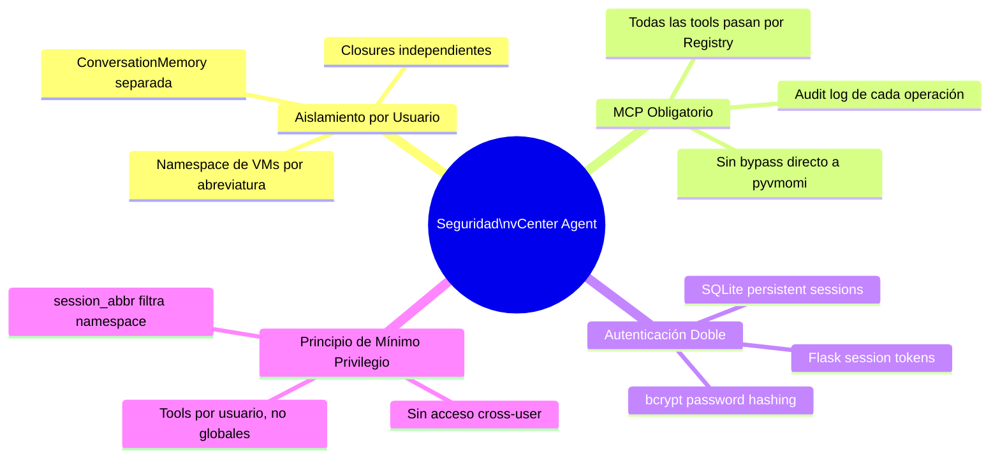
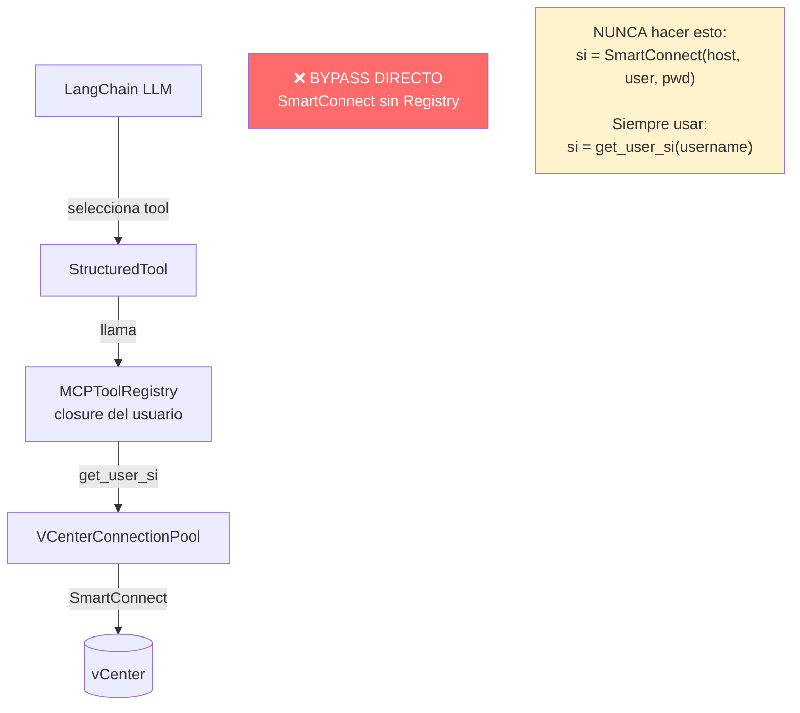
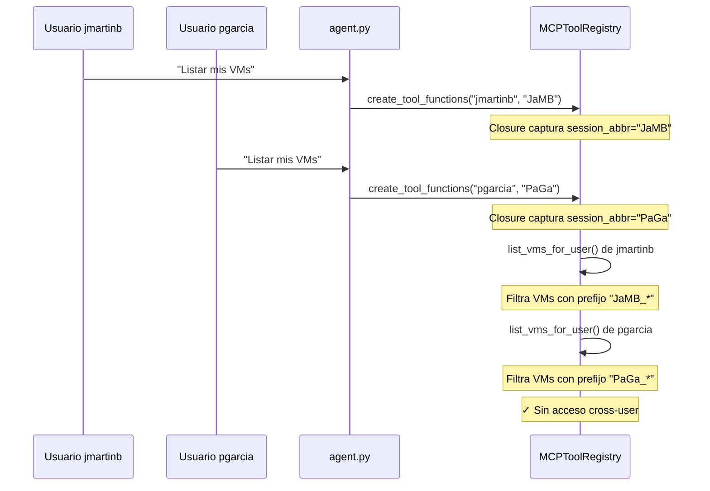
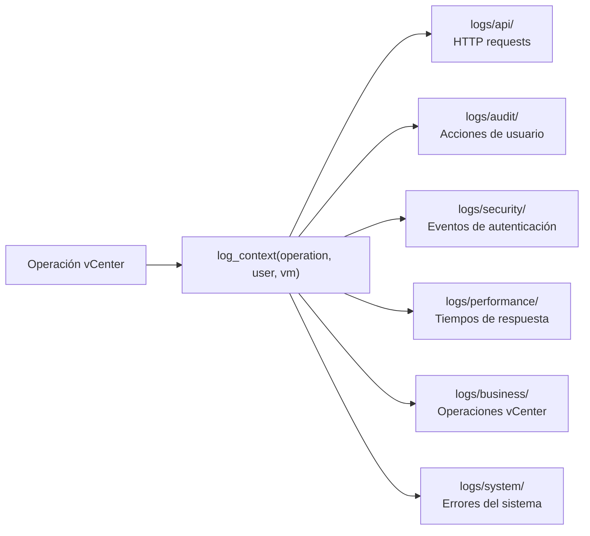
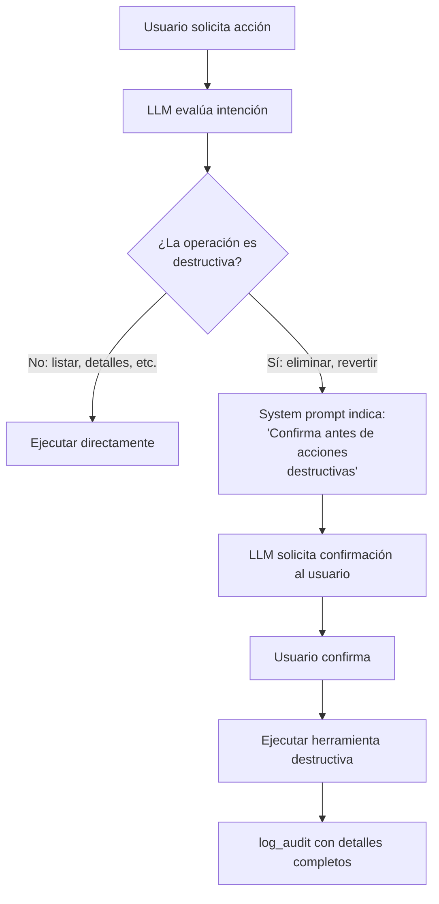
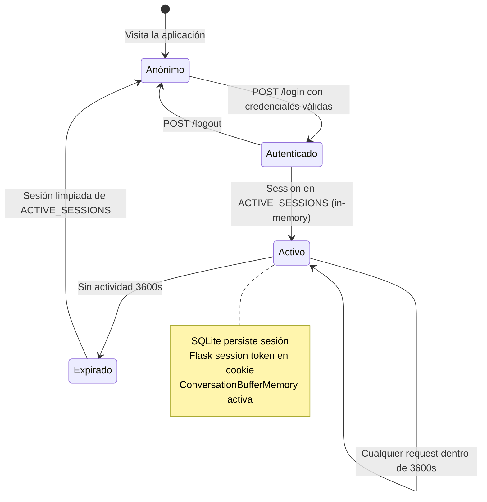
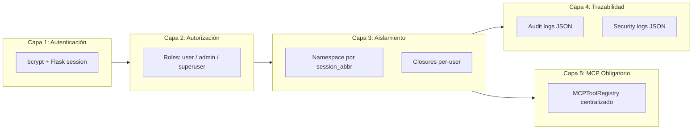

# Modelo de Seguridad del Agente vCenter

Documentación del sistema de aislamiento por usuario, patrón MCP obligatorio y controles de seguridad.

---

## Principios de Seguridad



---

## Patrón MCP Obligatorio



### Por qué es obligatorio

| Riesgo sin MCP Registry | Consecuencia |
|------------------------|--------------|
| LLM invoca SmartConnect con credenciales hardcoded | Exposición de credenciales en logs |
| Tool ejecuta operación en nombre de otro usuario | Violación de aislamiento por usuario |
| Sin audit log | Sin trazabilidad de operaciones |
| Sin filtro de namespace | Un usuario podría ver/modificar VMs de otros |

---

## Aislamiento por Usuario



### Mapeo Usuario → Abreviatura

El archivo `config/user_mapping.json` mapea cada usuario a su abreviatura de namespace:

```json
{
  "jmartinb": "JaMB",
  "pgarcia":  "PaGa",
  "admin":    "ADM"
}
```

Las VMs creadas para un usuario siempre tienen el prefijo de su abreviatura. El filtro se aplica en el closure, no puede ser modificado por el LLM.

---

## Sistema de Autenticación Dual

```mermaid
flowchart TD
    subgraph Entrada["Autenticación de Entrada"]
        LOGIN[POST /login] --> BCRYPT{bcrypt.checkpw\npassword vs hash}
        BCRYPT -->|Válido| FLASK_SESSION[Flask session token\nIn-memory 3600s]
        BCRYPT -->|Inválido| DENY[401 Unauthorized]
        FLASK_SESSION --> SQLITE_SESSION[SQLite session\ndata/users.db\nPersistente]
    end

    subgraph Middleware["Middleware de Protección"]
        ROUTE[Ruta protegida] --> DECORATOR[@authenticated_action]
        DECORATOR --> CHECK{session en\nACTIVE_SESSIONS?}
        CHECK -->|Sí| ALLOW[Continuar]
        CHECK -->|No| REDIRECT[Redirigir a /login]
    end

    subgraph Roles["Control de Roles"]
        ADMIN[@admin_required] --> ROLE_CHECK{role == admin\no superuser?}
        SUPERUSER[@superuser_required] --> SU_CHECK{role == superuser?}
        ROLE_CHECK -->|No| FORBIDDEN[403 Forbidden]
        SU_CHECK -->|No| FORBIDDEN
    end
```

### Decoradores de Seguridad

```python
from src.utils.context_middleware import authenticated_action, security_sensitive
from src.auth.decorators import admin_required, superuser_required

@app.route('/api/sensitive', methods=['POST'])
@authenticated_action      # Verifica sesión activa
@security_sensitive        # Registra en logs/security/
def sensitive_endpoint():
    username = session['username']
    ...

@app.route('/admin/users', methods=['POST'])
@admin_required            # Solo admin o superuser
def admin_endpoint():
    ...
```

---

## Logging de Seguridad y Auditoría



### Ejemplo de log de auditoría

```json
{
  "timestamp": "2026-03-12T10:30:00Z",
  "level": "INFO",
  "category": "audit",
  "operation": "delete_vms",
  "user": "jmartinb",
  "session_abbr": "JaMB",
  "vms_deleted": ["JaMB_MCU_01", "JaMB_EqSIM_01"],
  "duration_ms": 4523
}
```

---

## Herramientas Destructivas — Controles



**Las 8 herramientas destructivas son:**

| Herramienta | Acción irreversible |
|-------------|---------------------|
| `delete_vms_tool` | Elimina VMs permanentemente |
| `revert_snapshot_tool` | Pierde estado actual de la VM |
| `delete_snapshot_tool` | Elimina snapshot permanentemente |
| `reconfigure_vm_tool` | Modifica hardware de la VM |
| `change_vm_network_tool` | Cambia VLAN (puede perder conectividad) |
| `remove_vm_nic_tool` | Elimina adaptador de red |
| `power_operations_tool` | Apagar puede corromper datos sin shutdown |
| `deploy_dev_env` | Consume recursos de vCenter |

---

## Flujo de Sesiones



---

## Anti-Patrones Prohibidos

### ❌ Nunca crear conexiones directas

```python
# MAL — bypasea el pool y los controles de seguridad
from pyVim.connect import SmartConnect
si = SmartConnect(host="vcenter", user="admin", pwd="secret")
```

```python
# BIEN — usa el connection pool con aislamiento
si = self.get_user_si(username)  # En MCPToolRegistry
```

### ❌ Nunca usar print() para logging

```python
# MAL — no queda en logs estructurados
print(f"Eliminando VM {vm_name}")
```

```python
# BIEN — queda en audit log con contexto
logger.log_business_operation("vm_delete", {"vm": vm_name, "user": username})
```

### ❌ Nunca exponer credenciales en respuestas

```python
# MAL — el LLM podría incluir esto en la respuesta
return f"Conectado a {host} con usuario {user} y contraseña {pwd}"
```

```python
# BIEN — solo retornar información operacional
return f"Conectado exitosamente a vCenter ({host})"
```

---

## Resumen del Modelo de Seguridad


