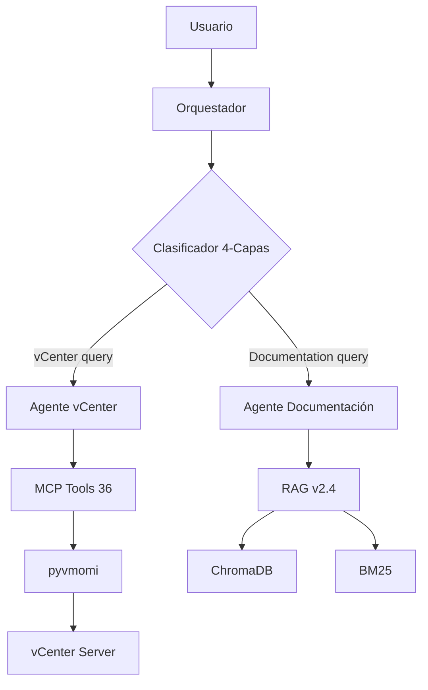
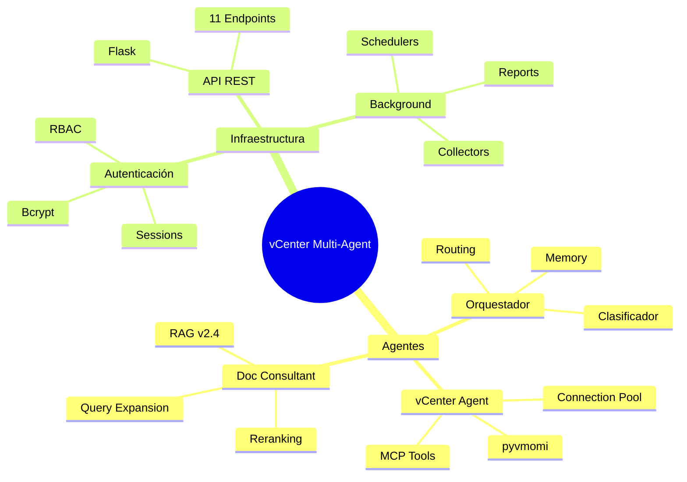

# 🗺️ vCenter Multi-Agent System - Mapa de Contenido Principal

> Bienvenido a la documentación del sistema multi-agente para gestión de infraestructura VMware vCenter. Este MOC (Map of Content) te guía a través de toda la arquitectura, componentes y operación del sistema.

---

## 🎯 Inicio Rápido

**¿Primera vez aquí?** Comienza por:
1. [[Arquitectura-Sistema]] - Visión general del sistema
2. [[Guia-Usuario]] - Cómo usar el sistema
3. [[Glosario]] - Términos clave

**¿Desarrollador?** Ve directo a:
- [[Guia-Implementacion]] - Deploy y testing
- [[API-Reference]] - Endpoints REST completos
- [[Stack-Tecnologico]] - Dependencias

**¿Problema técnico?** Consulta:
- [[Troubleshooting]] - Solución de problemas
- [[Casos-de-Uso]] - Ejemplos end-to-end

---

## 🏗️ Arquitectura

Comprende cómo funciona el sistema multi-agente:

### Visión General
- [[Arquitectura-Sistema]] - Arquitectura completa del sistema
- [[Flujo-Datos]] - Diagramas de flujo entre componentes
- [[Arquitectura-Chat]] - Sistema conversacional con enrutamiento inteligente
- [[Arquitectura-Agente-vCenter]] - Agente especializado en VMware

### Conceptos Clave
- **Sistema Multi-Agente**: 3 agentes especializados (Orquestador, vCenter, Documentación)
- **Enrutamiento 4-Capas**: Clasificación inteligente de consultas
- **RAG v2.4**: Búsqueda híbrida ChromaDB + BM25
- **MCP Tools**: 36 herramientas para operaciones vCenter

---

## ⚙️ Componentes Principales

Documentación detallada de cada módulo:

### Agentes
- [[Orquestador]] - Clasificador 4-capas + routing + memoria conversacional
- [[Agente-vCenter]] - Operaciones VMware vía pyvmomi (VMs, snapshots, datastores)
- [[Agente-Documentacion]] - RAG v2.4 pipeline 8-fases para consulta de docs
- [[Agentes-Background]] - 6 agentes autónomos (reports, SNMP collectors, métricas)

### Infraestructura
- [[Sistema-MCP]] - Model Context Protocol: 36 tools (catálogo) en 9 grupos
- [[Autenticacion]] - Bcrypt + SQLite + RBAC (user/admin/superuser) + rate limiting

### Integración


---

## 🔌 API y Endpoints

Documentación de interfaz REST:

- [[API-Reference]] - 11 endpoints completos (auth, chat, admin, stats, vCenter, MCP, roles)
- [[Endpoint-Chat]] - POST /chat detallado con ejemplos curl/Python/JavaScript

### Endpoints Destacados
| Endpoint | Método | Descripción |
|----------|--------|-------------|
| `/login` | POST | Autenticación bcrypt + session |
| `/chat` | POST | Procesamiento de consultas multi-agente |
| `/vcenter/list_vms` | GET | Listar VMs del inventario |
| `/admin/users` | GET | Gestión de usuarios (admin only) |
| `/stats/performance` | GET | Métricas del sistema |

---

## 📚 Operación y Mantenimiento

Guías prácticas para uso diario:

### Para Usuarios
- [[Guia-Usuario]] - Interfaz web, casos de uso, palabras clave
- [[Casos-de-Uso]] - Ejemplos completos end-to-end

### Para Desarrolladores/Ops
- [[Guia-Implementacion]] - Deploy, testing (unit/integration/E2E), Docker
- [[Troubleshooting]] - Diagnóstico de problemas comunes (7 escenarios)

### Casos de Uso Típicos
1. **Desplegar VM desde plantilla**: `"Despliega una MCU llamada test-vm01 desde plantilla mcu_template"`
2. **Consultar estado**: `"Muéstrame todas las VMs que están apagadas"`
3. **Aprender VMware**: `"¿Qué es DRS y cómo funciona?"`
4. **Snapshots**: `"Crea un snapshot de backup-vm antes del update"`

---

## 🚀 Mejoras y Roadmap

Propuestas de evolución del sistema:

- [[Propuestas-Funcionales]] - Features futuras (UI/UX, funcionalidad)
- [[Propuestas-Informes]] - Extensión de reporting background (retención 7 días, gráficas)
- [[Roadmap-Arnes-Agente-vCenter]] - Plan por fases para endurecer el runtime del agente vCenter
- [[Plan-Migracion-RAG-Escalable]] - Hoja de ruta para sustituir el RAG manual por retrieval híbrido, jerárquico y relacional
- [[Plan-Migracion-LangGraph-Completa]] - Ruta para desacoplar el runtime de LangChain y mover la selección de tools al grafo

### Mejoras Destacadas (Propuestas)
- **Retención histórica**: 24h → 7 días para análisis de tendencias
- **Gráficas matplotlib**: Visualización en PDFs de informes
- **Dashboard Grafana**: Monitorización en tiempo real
- **Multi-tenant**: Aislamiento por equipos/proyectos

---

## 📖 Referencias Técnicas

Documentación de soporte:

- [[Glosario]] - Términos, acrónimos y conceptos (A-Z)
- [[Stack-Tecnologico]] - Flask, LangChain, Ollama, pyvmomi, ChromaDB, versiones
- [[Changelog]] - Histórico de mejoras y cambios

### Stack Tecnológico Resumido
```yaml
Backend:
  - Flask 2.0+
  - LangChain + LangChain-Ollama
  - pyvmomi (VMware SDK)
  
LLM/AI:
  - Ollama (runtime local)
  - gpt-oss:20b (executor)
  - nomic-embed-text (embeddings)
  
Storage:
  - ChromaDB (vectores)
  - SQLite (auth, sessions)
  - BM25 (keyword index)
  
Monitoring:
  - APScheduler (background jobs)
  - SNMP v2c/v3 (collectors)
  - Structured logging (6 categorías)
```

---

## 🗂️ Organización de la Documentación

### Por Tipo de Usuario

#### 👤 Usuario Final
```
Guia-Usuario → Casos-de-Uso → Troubleshooting → Glosario
```

#### 👨‍💻 Desarrollador
```
Arquitectura-Sistema → Componentes → API-Reference → Guia-Implementacion → Stack-Tecnologico
```

#### 🔧 DevOps/SysAdmin
```
Guia-Implementacion → Troubleshooting → Agentes-Background → Autenticacion
```

#### 🏗️ Arquitecto
```
Arquitectura-Sistema → Flujo-Datos → Sistema-MCP → Propuestas-Funcionales
```

---

## 📊 Navegación Visual

### Arquitectura → Componentes → API
```
Arquitectura-Sistema
├── Orquestador
│   ├── Clasificador 4-Capas
│   └── Memoria Conversacional
├── Agente-vCenter
│   ├── Sistema-MCP (36 tools)
│   └── Connection Pool
└── Agente-Documentacion
    └── RAG v2.4 (ChromaDB + BM25)
```

### Componentes Críticos


---

## 🔍 Búsqueda Rápida por Tema

### Por Tecnología
- **VMware**: [[Arquitectura-Agente-vCenter]], [[Sistema-MCP]], [[Casos-de-Uso]]
- **LLM/AI**: [[Orquestador]], [[Agente-Documentacion]], [[Stack-Tecnologico]]
- **RAG**: [[Agente-Documentacion]], [[Glosario#RAG]]
- **Seguridad**: [[Autenticacion]], [[API-Reference#Seguridad]]
- **Background Jobs**: [[Agentes-Background]], [[Propuestas-Informes]]

### Por Operación
- **Deployment**: [[Guia-Implementacion]]
- **Troubleshooting**: [[Troubleshooting]]
- **Testing**: [[Guia-Implementacion#Testing]]
- **Monitoring**: [[Agentes-Background]], [[API-Reference#Stats]]

### Por Concepto
- **Multi-Agent**: [[Arquitectura-Sistema]], [[Orquestador]]
- **Routing**: [[Arquitectura-Chat]], [[Orquestador]]
- **Connection Pool**: [[Sistema-MCP]], [[Arquitectura-Agente-vCenter]]
- **Sticky Routing**: [[Glosario#Sticky-Routing]]

---

## 📝 Convenciones de Documentación

### Sintaxis Obsidian
- `[[Documento]]` - Wikilink a otro documento
- `[[Documento#Sección]]` - Link a sección específica
- `#tag` - Tag para categorización
- Frontmatter YAML con metadatos (tipo, estado, tags, versión)

### Tipos de Documentos
- **arquitectura**: Diseño de alto nivel
- **componente**: Módulo específico
- **api**: Endpoints REST
- **operacional**: Guías de uso
- **referencia**: Specs técnicas, glosarios

### Estados
- **actual**: Documentación vigente
- **legacy**: Versión anterior (referencia histórica)
- **propuesta**: Feature futura

---

## 🎓 Flujos de Aprendizaje

### Path 1: Entender la Arquitectura (30 min)
1. [[Arquitectura-Sistema]] (10 min) - Visión general
2. [[Flujo-Datos]] (5 min) - Diagramas de secuencia
3. [[Orquestador]] (10 min) - Clasificador 4-capas
4. [[Sistema-MCP]] (5 min) - Herramientas vCenter

### Path 2: Empezar a Desarrollar (45 min)
1. [[Stack-Tecnologico]] (5 min) - Dependencias
2. [[Guia-Implementacion]] (15 min) - Setup local
3. [[API-Reference]] (15 min) - Endpoints disponibles
4. [[Casos-de-Uso]] (10 min) - Ejemplos prácticos

### Path 3: Troubleshooting (20 min)
1. [[Troubleshooting]] (10 min) - 7 problemas comunes
2. [[Glosario]] (5 min) - Términos clave
3. [[Agentes-Background]] (5 min) - Logs y monitoring

---

## 📌 Documentos Más Importantes

### Top 5 Imprescindibles
1. 🏆 [[Arquitectura-Sistema]] - **Empieza aquí**
2. ⚙️ [[Orquestador]] - Cerebro del sistema
3. 🔌 [[API-Reference]] - Interfaz REST completa
4. 🛠️ [[Sistema-MCP]] - 36 herramientas vCenter
5. 📘 [[Guia-Usuario]] - Operación diaria

### Documentos de Referencia Frecuente
- [[Glosario]] - Consulta rápida de términos
- [[Troubleshooting]] - Cuando algo falla
- [[Casos-de-Uso]] - Ejemplos prácticos

---

## 📞 Soporte y Contribución

### Reportar Issues
- Consultar primero [[Troubleshooting]]
- Revisar logs en `logs/` (api, business, system, security)
- Verificar [[Stack-Tecnologico]] para versiones compatibles

### Extender el Sistema
- **Nuevos MCP Tools**: Ver [[Sistema-MCP#Agregar-Tools]]
- **Nuevas Keywords Routing**: Editar `config/agents.yaml`, ver [[Orquestador#Routing]]
- **Nuevos Background Agents**: Ver [[Agentes-Background#Arquitectura]]

---

## 🔄 Mantenimiento de Documentación

Esta documentación está viva y evoluciona con el sistema:

- **Actualizar**: Cuando se agreguen features o cambios arquitectónicos
- **Versionar**: Mantener `version` en frontmatter
- **Enlaces**: Verificar wikilinks periódicamente
- **Changelog**: Registrar cambios en [[Changelog]]

---

*Última actualización: 2026-03-24 | vCenter Multi-Agent System v3.0*
