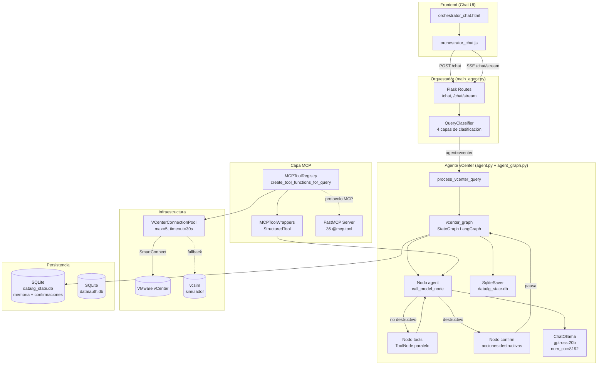
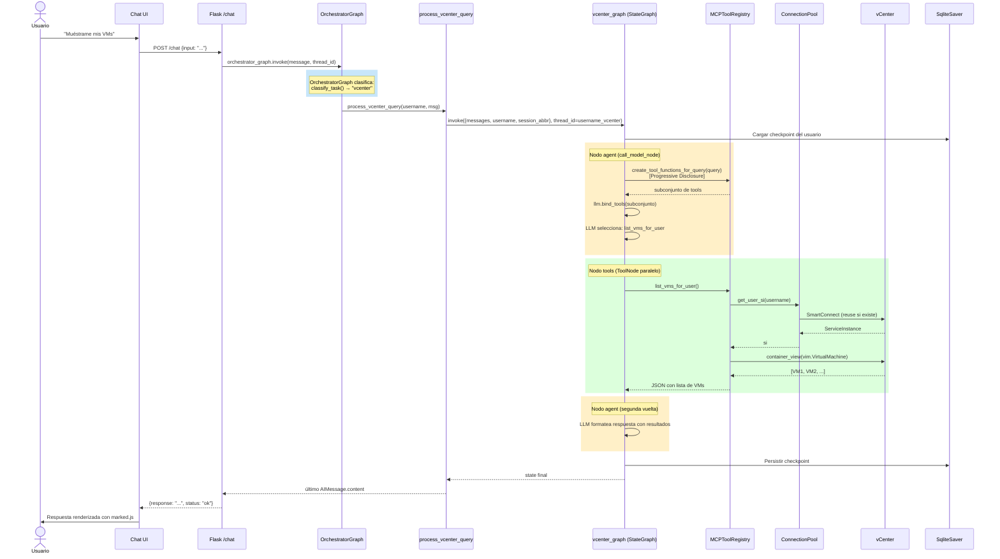
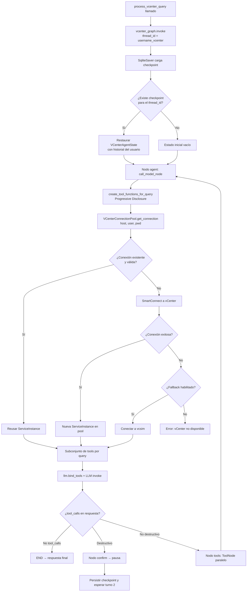
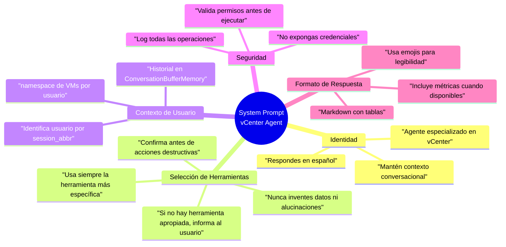
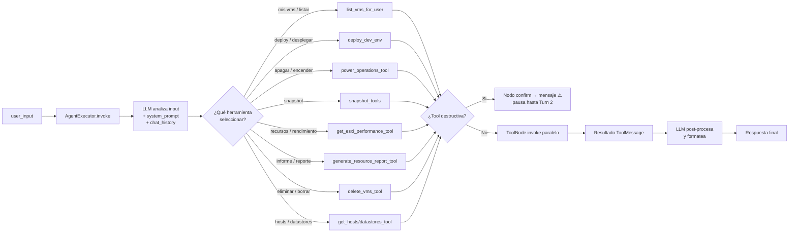

# Arquitectura del Agente vCenter

## Visión General

El **Agente vCenter** es un componente del sistema multi-agente que recibe consultas en lenguaje natural del Orquestador y las ejecuta sobre infraestructura VMware vCenter a través de una **capa MCP de 36 herramientas** basadas en pyvmomi.

**Características clave:**
- Connection pooling (max 5, timeout 30s)
- **LangGraph StateGraph** con checkpointing SQLite (`data/lg_state.db`)
- 36 tools MCP (catálogo): VM lifecycle, snapshots, recursos, deployment + configuración avanzada
- Progressive Disclosure: subconjunto de tools seleccionado por query en cada turno
- Confirmación persistente de acciones destructivas (sobrevive reinicios de Flask)
- Ejecución paralela de tool_calls independientes via `ToolNode`
- LLM selector de herramientas (gpt-oss:20b, num_ctx=8192)
- Logging estructurado de operaciones

---

## Arquitectura General



---

## Flujo de Procesamiento de Query



---

## Inicialización del Grafo por Invocación



**Key Points:**
1. **Sin cache de contextos**: el estado se carga desde `SqliteSaver` en cada invocación
2. **Connection pool**: Reutiliza ServiceInstances válidas (sin cambios)
3. **Closures por usuario**: Cada tool function sigue capturando `username` + `session_abbr`
4. **Memoria conversacional**: `VCenterAgentState.messages` persistido en SQLite por checkpointer

---

## System Prompt del Agente



**Ubicación**: `src/core/agent.py` (líneas ~60-120)

**Ejemplo de instrucción**:
```python
system_prompt = """
Eres un agente especializado en gestionar infraestructura VMware vCenter.

REGLAS:
1. Usa SIEMPRE la herramienta MCP más específica disponible
2. NUNCA inventes datos - si no tienes info, di "No tengo acceso a esa información"
3. Confirma acciones destructivas (delete, power off) antes de ejecutar
4. Responde en español con formato Markdown
5. El usuario actual es identificado por su session_abbr (ej: "JaMB")

HERRAMIENTAS DISPONIBLES:
{tools}

FORMATO DE RESPUESTA:
- Usa tablas para listas de VMs
- Incluye métricas (CPU, RAM, storage) cuando estén disponibles
- Añade emojis para mejorar legibilidad (✅❌⚠️)
"""
```

---

## Selección de Herramienta por LLM



**Proceso de selección**:
1. Progressive Disclosure filtra el subconjunto de tools relevantes para la query (via `create_tool_functions_for_query()`)
2. LLM recibe input + historial + descripción del subconjunto (≤ 36 tools)
3. Decide qué tool(s) usar y genera parámetros
4. Si la tool es destructiva → nodo `confirm` pausa la ejecución y pide confirmación al usuario
5. Si no es destructiva → `ToolNode` ejecuta en paralelo todos los `tool_calls` del turno
6. LLM formatea la respuesta final con los resultados de las herramientas

---

## Connection Pool (VCenterConnectionPool)

**Ubicación**: `src/utils/vcenter_tools.py`

**Configuración**:

| Parámetro | Valor | Propósito |
|-----------|-------|-----------|
| `max_connections` | 5 | Pool máximo de conexiones simultáneas |
| `connection_timeout` | 30s | Tiempo antes de liberar conexión inactiva |
| `enable_fallback` | True | Usa vcsim si vCenter no disponible |
| `fallback_host` | localhost:8989 | Simulador para testing |

**Lógica de pooling**:

```python
class VCenterConnectionPool:
    def __init__(self, max_connections=5, timeout=30):
        self.pool = {}  # {(host, user): ServiceInstance}
        self.last_used = {}  # timestamps
        self.max_connections = max_connections
        self.timeout = timeout
    
    def get_connection(self, host, user, pwd):
        key = (host, user)
        
        # Reusar si existe y válida
        if key in self.pool:
            si = self.pool[key]
            if self._is_valid(si):
                self.last_used[key] = time.time()
                return si
        
        # Limpiar expiradas
        self._cleanup_expired()
        
        # Crear nueva si hay espacio
        if len(self.pool) < self.max_connections:
            si = SmartConnect(host=host, user=user, pwd=pwd)
            self.pool[key] = si
            self.last_used[key] = time.time()
            return si
        
        # Pool lleno: error
        raise PoolExhaustedError()
```

**Ventajas**:
- ✅ Evita overhead de SmartConnect repetido (~2-3s por conexión)
- ✅ Previene session exhaustion en vCenter
- ✅ Cleanup automático de conexiones inactivas
- ✅ Thread-safe con locks

---

## Estructura de Archivos

```
vcenter_agent_system/
├── src/
│   └── core/
│       ├── agent.py                 ← Entry point: process_vcenter_query(), build_vcenter_graph()
│       └── agent_graph.py           ← StateGraph LangGraph: VCenterAgentState, build_vcenter_graph()
│
├── server/
│   ├── mcp_tool_registry.py         ← 36 closures MCP por usuario (CRÍTICO)
│   ├── mcp_tool_wrappers.py         ← LangChain StructuredTool adapters
│   └── mcp_vcenter_server.py        ← FastMCP server (protocolo MCP externo)
│
├── data/
│   └── lg_state.db                  ← SqliteSaver: memoria conversacional + estado confirmaciones
│
└── src/utils/
    └── vcenter_tools.py             ← pyvmomi wrappers + VCenterConnectionPool
```

**Flujo de dependencias**:
```
agent.py
  └─> agent_graph.py (StateGraph, VCenterAgentState, ToolNode)
        └─> mcp_tool_registry.py (create_tool_functions_for_query)
              └─> mcp_tool_wrappers.py (create_mcp_aware_tools)
                    └─> vcenter_tools.py (pyvmomi)
```

---

## Configuración Clave

| Parámetro | Valor | Archivo | Motivo |
|-----------|-------|---------|--------|
| `num_ctx` | 8192 tokens | `agent.py` | Contexto Ollama expandido (default 4096 trunca) |
| `model` | `gpt-oss:20b` | `agent.py` | Modelo principal de razonamiento |
| `temperature` | 0.1 | `agent.py` | Baja creatividad para precisión técnica |
| `max_connections` | 5 | `vcenter_tools.py` | Pool máximo vCenter |
| `connection_timeout` | 30s | `vcenter_tools.py` | Timeout inactividad |
| `checkpointer` | `SqliteSaver` | `agent_graph.py` | Memoria y confirmaciones persistentes |
| `thread_id` | `{username}_vcenter` | `agent.py` | Aislamiento de conversación por usuario |

**Variables de entorno**:
```bash
AGENT_MODEL=gpt-oss:20b
AGENT_NUM_CTX=8192
VCENTER_MAX_POOL=5
VCENTER_TIMEOUT=30
```

---

## 36 Herramientas MCP (catálogo actual)

### Grupos de herramientas

| Categoría | Tools | Descripción |
|-----------|-------|-------------|
| **VM Lifecycle** | list_vms_for_user, power_operations, delete_vms | CRUD básico de VMs |
| **Deployment** | deploy_dev_env, clone_vm | Creación desde plantillas |
| **Snapshots** | create/list/revert/delete_snapshot | Gestión de snapshots |
| **Resources** | get_vm_details, get_esxi_performance, generate_resource_report | Métricas y reporting |
| **Infrastructure** | get_hosts, get_datastores, get_clusters | Info de infraestructura |
| **Network** | get_networks, configure_network | Configuración de red |
| **Advanced** | migrate_vm, configure_ha, set_resource_limits | Operaciones avanzadas |

### Añadir nueva herramienta

**⚠️ SECURITY**: Todas las tools DEBEN ir a través de MCP server

**Patrón (3 pasos)**:

1. **Agregar en `mcp_tool_registry.py`**:
```python
def create_tool_functions(self, username: str, session_abbr: str):
    def my_new_operation(vm_name: str) -> str:
        """Descripción de la operación."""
        try:
            with log_context(operation="my_op", vm=vm_name, user=username):
                si = self.get_user_si(username)
                # ... lógica pyvmomi ...
                logger.log_business_operation("my_op", {"vm": vm_name})
                return f"Operación exitosa en {vm_name}"
        except Exception as e:
            logger.log_system_error("my_op", str(e))
            return f"Error: {str(e)}"
    
    return {
        "my_new_operation": my_new_operation,
        # ... otros tools ...
    }
```

2. **Crear wrapper en `mcp_tool_wrappers.py`**:
```python
@tool
def my_new_operation_tool(vm_name: str) -> str:
    """Descripción para el LLM."""
    return tool_functions["my_new_operation"](vm_name)

tools.append(my_new_operation_tool)
```

3. **Documentar en `agent.py`** (línea ~210, lista de tools)

---

## Entry Point: `process_vcenter_query()`

**Ubicación**: `src/core/agent.py`

```python
def process_vcenter_query(username: str, message: str, thinking_queue=None) -> str:
    """
    Entry point desde el Orquestador.
    Usa el grafo LangGraph con checkpointing SQLite.
    
    Args:
        username:       Usuario autenticado
        message:        Query en lenguaje natural
        thinking_queue: Cola opcional para emitir pasos de progreso vía SSE
    
    Returns:
        Respuesta del agente (último AIMessage.content)
    """
    session_abbr = user_mapping.get(username.lower(), username)
    formatted_msg = f"El usuario {session_abbr} dice: {message}"
    config = {"configurable": {"thread_id": f"{username}_vcenter"}}

    result = vcenter_graph.invoke(
        {"messages": [HumanMessage(content=formatted_msg)], "username": username, "session_abbr": session_abbr},
        config,
    )

    last_ai = next(
        (m for m in reversed(result["messages"]) if isinstance(m, AIMessage)),
        None,
    )
    return last_ai.content if last_ai else "Error: no se obtuvo respuesta del agente."
```

**Flow interno**:
```
process_vcenter_query()
  └─> vcenter_graph.invoke(messages + username + session_abbr, thread_id)
        └─> SqliteSaver.load_checkpoint(thread_id)  [restaura historial]
        └─> Nodo agent: call_model_node()
              └─> MCPToolRegistry.create_tool_functions_for_query()  [Progressive Disclosure]
              └─> llm.bind_tools(subconjunto) + invoke()
        └─> Routing condicional:
              - END si sin tool_calls
              - Nodo confirm si destructivo  [pausa, persiste checkpoint]
              - Nodo tools si no destructivo
                    └─> ToolNode (ejecución paralela)
                    └─> → vuelve a Nodo agent con ToolMessages
        └─> SqliteSaver.save_checkpoint(thread_id)  [persiste estado]
  └─> Extrae último AIMessage.content
```

---

## Logging Estructurado

**Categorías usadas**:
```python
from src.utils.structured_logger import get_structured_logger, log_context

logger = get_structured_logger('vcenter_agent')
```

**Eventos logueados**:
- `log_business_operation()`: Operaciones vCenter exitosas
- `log_system_error()`: Errores técnicos
- `log_security_event()`: Acciones sensibles (delete, power off)
- `log_performance_metric()`: Latencias de tools

**Ejemplo**:
```python
with log_context(operation="list_vms", user="jmartinb"):
    vms = si.content.rootFolder.childEntity
    logger.log_business_operation("list_vms_success", {
        "count": len(vms),
        "duration_ms": 234
    })
```

---

## Relacionado

- [[Sistema-MCP]]
- [[Orquestador]]
- [[Arquitectura-Sistema]]
- [[Arquitectura-Chat]]
- [[Connection-Pool]]
- [[Herramientas-MCP]]
- [[pyvmomi-Wrappers]]
