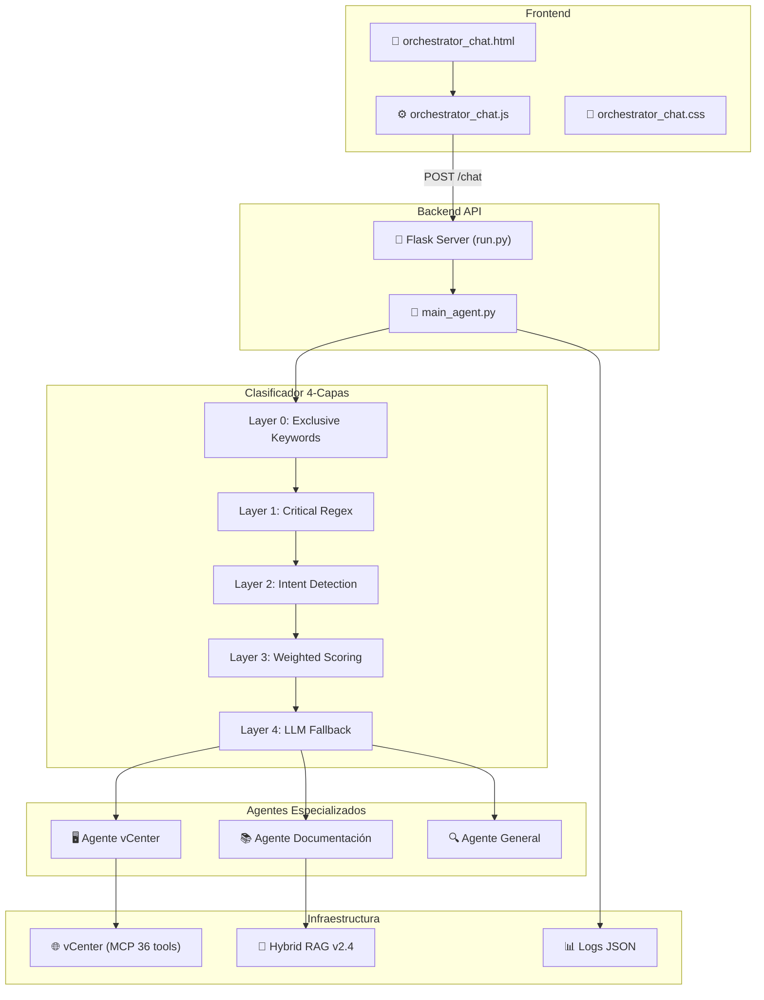
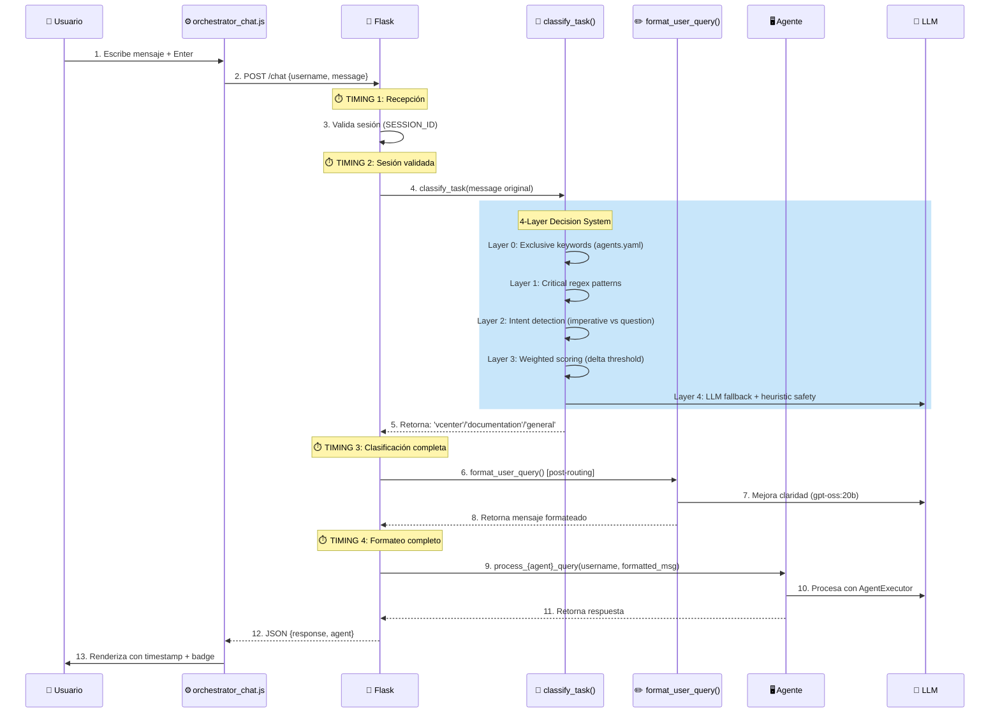

# Arquitectura del Sistema de Chat - Orquestador

## Resumen Ejecutivo

El **Chat del Orquestador** es una interfaz web conversacional que actúa como punto de entrada unificado para múltiples agentes especializados:

- **Agente vCenter**: Operaciones de infraestructura VMware
- **Agente Documentación**: Búsqueda RAG v2.4 con ChromaDB + BM25
- **Agente General**: Respuestas generales con LLM

**Características clave:**
- Enrutamiento inteligente 4-capas con sticky routing (180s)
- Autenticación session-based (3600s timeout)
- Dual-model optimization (formatter + executor)
- Logging estructurado multi-categoría
- Interfaz responsiva con light/dark theme

***
## Arquitectura General



***
## Flujo de Ejecución



***
## Sistema de Enrutamiento 4-Capas

### Función: `classify_task(message: str) -> str`

**Ubicación**: `src/utils/query_classifier.py` + `src/api/main_agent.py`

| Layer | Mecanismo | Ejemplo |
|-------|-----------|---------|
| **0** | Exclusive keyword match (`agents.yaml`) | `"vm"` solo en vCenter → vcenter |
| **1** | Critical regex patterns | `"crea una mcu"` → vcenter<br>`"cómo se configura"` → documentation |
| **2** | Intent detection | Imperativo (`"despliega"`) → vcenter<br>Pregunta (`"qué es"`) → documentation |
| **3** | Weighted keyword scoring | `score_vcenter` vs `score_doc` con delta mínimo |
| **4** | LLM fallback + heurístico | Solo casos ambiguos; fallback a heurístico si LLM falla |

**Agregar keywords**: Editar `config/agents.yaml` (v1.1)

```yaml
vcenter:
  route_keywords:
    - mcu
    - eqsim
    - plantilla
```

**Sticky Routing (Conversational Memory)**:
- Orquestador rastrea último agente usado por usuario (`last_agent`, `last_agent_time`)
- Follow-ups auto-enrutan al mismo agente por 180s
- Permite conversaciones multi-turn naturales sin repetir contexto

***
## Componentes Principales

### 1. Frontend (`templates/chat/orchestrator_chat.html`)

**Estructura HTML**:
```html
<div class="container">
  <h1>Orquestador de Agentes <span id="last-agent">-</span></h1>
  <div id="log" aria-live="polite"></div>
  <form id="chat-form">
    <textarea id="message"></textarea>
    <button type="submit">Enviar</button>
  </form>
</div>
```

**Características**:
- Log de conversación con scroll automático
- Indicador de agente activo
- Toggle tema light/dark
- Timestamps en mensajes

### 2. JavaScript (`static/js/orchestrator_chat.js`)

**Funciones Clave**:

| Función | Propósito |
|---------|----------|
| `appendMessage(role, html, agentName)` | Renderiza mensaje en log |
| `timestamp()` | Genera HH:MM:SS formateado |
| `setLoading(p)` | Muestra/oculta spinner |

**Flujo POST /chat**:
```javascript
1. Valida entrada no vacía
2. Renderiza mensaje usuario
3. Muestra loader "Pensando..."
4. POST a /chat con {username, message}
5. Recibe {response, agent}
6. Renderiza respuesta con timestamp
7. Actualiza badge "last agent"
```

### 3. Backend API (`src/api/main_agent.py`)

**Endpoint**: `POST /chat`

```python
@app.route('/chat', methods=['POST'])
def chat_api():
    # 1. Validar sesión
    validate_session(session.get('session_id'))
    
    # 2. Clasificar con mensaje ORIGINAL
    target = classify_task(message)
    
    # 3. Formatear POST-routing (opcional)
    formatted = format_user_query(message, username)
    
    # 4. Procesar según target
    if target == 'vcenter':
        answer = process_vcenter_query(username, formatted)
    elif target == 'documentation':
        answer = process_documentation_query(username, formatted)
    else:
        answer = general_response(username, formatted)
    
    # 5. Retornar
    return jsonify({'response': answer, 'agent': target})
```

***
## Sistema de Formateo de Consultas

### `format_user_query(message: str, username: str) -> str`

**Propósito**: Mejorar claridad sin modificar intención

**Configuración**:
- Variable: `ENABLE_QUERY_FORMATTING=true` (default)
- Modelo: `gpt-oss:20b` (formateador dedicado)
- Timeout: 5 segundos

**Ejemplo**:
```
Input:  "me listao las vms que estan en el cluster prod sin ningun filtro"
Output: "Listar las máquinas virtuales que están en el clúster de producción sin aplicar filtros"
```

**Validaciones**:
- Rechaza respuestas < 3 caracteres
- Rechaza respuestas > 3x longitud original
- Fallback a original si error

***
## Autenticación y Sesiones

### Sistema Dual

1. **Orchestrator** (`ACTIVE_SESSIONS` dict):
   - In-memory, 3600s timeout
   - Flask session management
   - Sticky routing per-user

2. **Agent SQLite** (`data/users.db`):
   - Persistent, configurable timeout
   - User roles (user/admin/superuser)
   - Credential storage bcrypt

### Middleware

```python
@app.before_request
def session_middleware():
    # Rutas públicas sin auth
    if request.endpoint in ['health', 'login', 'static']:
        return
    
    # Redirect a login si inválida
    if not validate_session(session.get('session_id')):
        return redirect(url_for('ui_login'))
```

***
## Logging Estructurado

### Categorías

```python
logger = get_structured_logger('main_orchestrator')
api_logger = get_structured_logger('api')
audit_logger = get_structured_logger('audit')
security_logger = get_structured_logger('security')
performance_logger = get_structured_logger('performance')
```

### Timeline de Métricas

```
┌─────────────────────────────────────────┐
│ TIMING 1: POST /chat recibido           │
│ TIMING 2: Sesión validada (Δ: 123ms)    │
│ TIMING 3: Mensaje parseado (Δ: 5ms)     │
│ TIMING 4: Formateo completo (Δ: 245ms)  │
│ TOTAL: 373ms                            │
└─────────────────────────────────────────┘
```

### Rutas de Logs

```
logs/
├── api/              # HTTP requests
├── audit/            # User actions
├── performance/      # Latencies
└── security/         # Auth events
```

***
## Modelos LLM

| Modelo | Propósito | Env Var | Timeout |
|--------|-----------|---------|---------|
| **gpt-oss:20b** (Formatter) | Mejora claridad de queries | `ORCH_FORMATTER_MODEL` | 5s |
| **gpt-oss:20b** (Executor) | Razonamiento + generación respuestas | `ORCH_EXECUTOR_MODEL` | - |

**Inicialización**:
```python
formatter_llm = ChatOllama(model=FORMATTER_MODEL, timeout=5)
executor_llm = ChatOllama(model=EXECUTOR_MODEL)
```

***
## Variables de Entorno

```bash
# Modelos
ORCH_FORMATTER_MODEL=gpt-oss:20b
ORCH_EXECUTOR_MODEL=gpt-oss:20b
ENABLE_QUERY_FORMATTING=true
FORMATTER_TIMEOUT=5

# Seguridad
ORCH_SECRET=<random-hex-16>

# Logging
LOG_LEVEL=INFO
BASE_LOG_DIR=./logs
```

***
## Ejemplo Completo: "VMs de producción"

```
1. Usuario: "me list as las vms de producción"
2. JS envía POST /chat
3. TIMING 1: Recibido (0ms)
4. TIMING 2: Sesión validada (123ms)
5. TIMING 3: Mensaje parseado (5ms)
6. classify_task() detecta "vm" → 'vcenter'
7. format_user_query() mejora a:
   "Listar las máquinas virtuales de producción"
8. TIMING 4: Formateado (245ms)
9. process_vcenter_query() consulta vCenter
10. Respuesta: "Hay 12 VMs en producción..."
11. JSON: {response: "...", agent: "vcenter"}
12. UI renderiza burbuja + badge
```

***
## Relacionado

- [[Orquestador]]
- [[Arquitectura-Sistema]]
- [[Arquitectura-Agente-vCenter]]
- [[Agente-Documentacion]]
- [[Sistema-RAG-v2]]
- [[Clasificador-Queries]]
