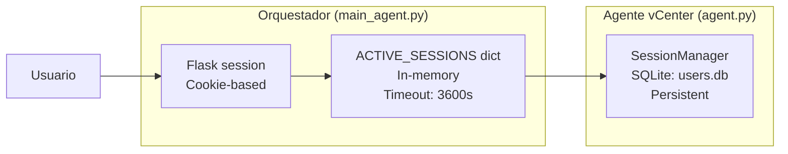
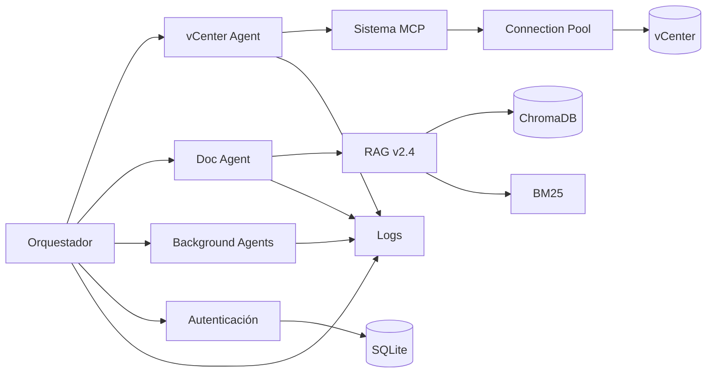

# 🏗️ Arquitectura del Sistema vCenter Multi-Agent

> Documentación arquitectónica del sistema multi-agente para gestión de infraestructura VMware vCenter y consulta de documentación mediante lenguaje natural.

***
## 📋 Resumen Ejecutivo

**vCenter Multi-Agent System** es una plataforma Python Flask que implementa un sistema de agentes especializados para:

1. **Gestionar infraestructura VMware** vía lenguaje natural (VMs, snapshots, datastores, hosts ESXi)
2. **Consultar documentación técnica** con RAG v2.4 (búsqueda híbrida ChromaDB + BM25)
3. **Automatizar reporting** mediante agentes background con colección SNMP y generación de PDFs

### Características Clave

- ✅ **Sistema Multi-Agente**: 3 agentes especializados (Orquestador, vCenter, Documentación)
- ✅ **Enrutamiento Inteligente**: Clasificador 4-capas (keywords, regex, intent, scoring + LLM fallback)
- ✅ **MCP Tools**: 36 herramientas VMware via Model Context Protocol
- ✅ **RAG v2.4**: Pipeline híbrido 8-fases con query expansion (62 términos) y reranking
- ✅ **HTTPS/nginx**: Proxy inverso SSL (puerto 5000) con security headers y cookie flags
- ✅ **Autenticación Dual**: Bcrypt + RBAC + SQLite con rate limiting
- ✅ **Sticky Routing**: Memoria conversacional con enrutamiento automático (180s)
- ✅ **Connection Pooling**: Gestión eficiente de sesiones vCenter (max 5, timeout 30s)
- ✅ **Logging Estructurado**: 6 categorías (api, business, security, audit, performance, system)

***
## 🎯 Arquitectura de Alto Nivel

```mermaid
graph TB
    subgraph "Transport Layer"
        NGINX[🔒 nginx<br/>:5000 HTTPS<br/>SSL Termination<br/>Security Headers]
    end

    subgraph "Frontend Layer"
        UI[🌐 Web Interface<br/>orchestrator_chat_auth.html]
        JS[⚙️ Client Logic<br/>orchestrator_chat_auth.js]
        CSS[🎨 Styles<br/>Temas claro/oscuro]
    end

    subgraph "API Layer - Flask"
        AUTH[🔐 Authentication<br/>/login, /logout]
        CHAT[💬 Chat API<br/>/chat, /chat/stream]
        ADMIN[👑 Admin<br/>/admin/users]
        STATS[📊 Stats<br/>/stats/performance]
        VCAPI[🖥️ vCenter Direct<br/>/vcenter/*]
    end

    subgraph "Orchestrator Agent"
        MAIN[🤖 main_agent.py<br/>Orquestador]
        CLASSIFIER[📌 QueryClassifier<br/>4-Layer Decision]
        FORMATTER[✏️ Query Formatter<br/>Optional: gpt-oss:20b]
        MEMORY[🧠 User Memories<br/>ConversationBufferMemory]
        STICKY[🔄 Sticky Routing<br/>Last agent tracking]
    end

    subgraph "Specialized Agents"
        VCAGENT[🖥️ vCenter Agent<br/>agent.py<br/>VMware Operations]
        DOCAGENT[📚 Doc Consultant<br/>doc_consultant.py<br/>RAG v2.4]
        BGAGENTS[⏰ Background Agents<br/>6 agents<br/>Reports + SNMP]
    end

    subgraph "MCP Layer"
        REGISTRY[🔧 MCPToolRegistry<br/>36 tools<br/>9 grupos (catálogo)]
        POOL[🔌 ConnectionPool<br/>max=5, timeout=30s]
    end

    subgraph "LLM Runtime"
        OLLAMA[🧠 Ollama<br/>localhost:11434]
        EXECUTOR[gpt-oss:20b<br/>Executor Model]
        EMBEDDER[nomic-embed-text<br/>Embedding Model]
    end

    subgraph "Storage & Retrieval"
        CHROMA[(🗄️ ChromaDB<br/>Vector Store)]
        BM25[📑 BM25<br/>Keyword Index]
        SQLITE[(💾 SQLite<br/>auth.db, users.db)]
        LOGS[📋 Structured Logs<br/>6 categories]
    end

    subgraph "Infrastructure"
        VCENTER[(🌐 vCenter Server)]
        ESXI[ESXi Hosts]
        TRUENAS[TrueNAS NAS]
        CISCO[Cisco Catalyst]
    end

    NGINX --> UI
    UI --> JS
    JS --> AUTH
    JS --> CHAT
    AUTH --> SQLITE
    CHAT --> MAIN
    MAIN --> CLASSIFIER
    CLASSIFIER --> FORMATTER
    MAIN --> MEMORY
    MAIN --> STICKY
    
    CLASSIFIER --> |vcenter| VCAGENT
    CLASSIFIER --> |documentation| DOCAGENT
    CLASSIFIER --> |background| BGAGENTS
    
    VCAGENT --> REGISTRY
    REGISTRY --> POOL
    POOL --> VCENTER
    VCENTER --> ESXI
    
    DOCAGENT --> CHROMA
    DOCAGENT --> BM25
    DOCAGENT --> EMBEDDER
    
    VCAGENT --> EXECUTOR
    DOCAGENT --> EXECUTOR
    MAIN --> EXECUTOR
    
    OLLAMA --> EXECUTOR
    OLLAMA --> EMBEDDER
    
    BGAGENTS --> TRUENAS
    BGAGENTS --> CISCO
    BGAGENTS --> ESXI
    
    VCAGENT --> LOGS
    DOCAGENT --> LOGS
    MAIN --> LOGS
```

***
## 🔄 Flujo de Datos Principal

### 1. Usuario Envía Consulta

```
Usuario escribe: "Despliega una MCU llamada test-vm01 desde plantilla mcu_template"
   ↓
Frontend (orchestrator_chat_auth.js)
   ↓
POST /chat {input: "...", username: "user"}
   ↓
Flask Server (run.py)
```

### 2. Autenticación y Sesión

```
Flask @authenticated_action decorator
   ↓
Verifica session['username'] en ACTIVE_SESSIONS
   ↓
Si válido → continúa | Si inválido → 401 Unauthorized
```

### 3. Orquestador - Clasificación 4-Capas

```
main_agent.py → classify_task(message, username)
   ↓
┌─ Layer 0: Exclusive Keywords (agents.yaml)
│  ├─ "mcu" → SOLO vcenter
│  └─ "datastore" → SOLO vcenter
│
┌─ Layer 1: Critical Regex Patterns
│  ├─ r'\b(despliega|crea|borra|apaga|enciende)\b.{0,30}\b(vm|mcu|eqsim)\b' → vcenter (HIGH)
│  └─ r'\b(cómo|qué es|explica)\b.{0,40}\b(funciona|configura)\b' → documentation (HIGH)
│
┌─ Layer 2: Intent Detection
│  ├─ Imperativo ("despliega", "muestra") → vcenter
│  └─ Learning ("¿qué es?", "cómo funciona") → documentation
│
┌─ Layer 3: Weighted Keyword Scoring
│  ├─ score_vcenter = Σ(keyword_weights * occurrences)
│  ├─ score_documentation = Σ(keyword_weights * occurrences)
│  └─ if |score_vcenter - score_doc| > threshold → decide
│
└─ Layer 4: LLM Fallback + Heuristic
   ├─ Si ambiguo → LLM decide
   └─ Si LLM falla → heuristic_fallback()
   
RESULTADO: agent = "vcenter"
```

### 4. Sticky Routing (Memoria Conversacional)

```
if mensaje_actual es follow-up:
    tiempo_desde_último_agente < 180s
    palabras_clave_de_continuidad ("esa", "30 días", "datastore_35")
    →
    Reusar last_agent del usuario en ACTIVE_SESSIONS
```

### 5. Agente vCenter - Ejecución

```
process_vcenter_query(username, message)
   ↓
get_user_context(username)
   ├─ Si primera vez: crear AgentExecutor
   │  ├─ MCPToolRegistry.create_tool_functions(username)
   │  │  └─ VCenterConnectionPool.get_connection()
   │  │     └─ SmartConnect(host, user, pwd)
   │  ├─ create_mcp_aware_tools() → hasta 36 StructuredTools (Progressive Disclosure puede filtrar)
   │  ├─ ChatOllama(model="gpt-oss:20b", num_ctx=8192)
   │  └─ ConversationBufferMemory(username)
   └─ Si existe: reusar AgentExecutor
   ↓
AgentExecutor.invoke({input: message})
   ↓
LLM analiza → selecciona tool: "deploy_dev_env"
   ↓
MCP Tool ejecuta:
   registry['deploy_dev_env'](username_, mcu_template, eqsim_template)
   └─ pyvmomi: CloneVM_Task() (una o varias VMs)
   ↓
vCenter API → ESXi → VMs desplegadas
   ↓
Resultado: "✅ Entorno desplegado (MCU + Eqsim) para el usuario"
```

### 6. Respuesta al Usuario

```
AgentExecutor devuelve resultado
   ↓
main_agent.py → ACTIVE_SESSIONS actualiza last_agent="vcenter"
   ↓
Flask → JSON response {response: "...", agent: "vcenter"}
   ↓
Frontend muestra respuesta con markdown + syntax highlighting
```

***
## 🧩 Componentes Principales

### 1. **Orquestador** (`src/api/main_agent.py`)

**Responsabilidades:**
- Recibir consultas del usuario via `/chat` endpoint
- Clasificar tareas con sistema 4-capas
- Delegar a agente especializado
- Mantener memoria conversacional por usuario
- Implementar sticky routing para follow-ups

**Métodos Clave:**
```python
chat_api(input, username) → {response, agent, timing}
classify_task(message, username) → "vcenter" | "documentation" | "general"
format_user_query(query) → cleaned_query  # Opcional con gpt-oss:20b
```

**Dependencias:**
- `QueryClassifier` (4 capas)
- `ACTIVE_SESSIONS` dict (in-memory)
- `user_memories` dict (ConversationBufferMemory)
- LangChain ChatOllama

***
### 2. **vCenter Agent** (`src/core/agent.py`)

**Responsabilidades:**
- Procesar consultas VMware en lenguaje natural
- Ejecutar operaciones vCenter via MCP tools
- Mantener memoria conversacional por usuario
- Gestionar ciclo de vida de conexiones

**Métodos Clave:**
```python
process_vcenter_query(username, message, stream=False) → response
get_user_context(username) → AgentExecutor
_check_session_validity(username) → bool
```

**MCP Tools Disponibles (36, catálogo total):**
- **Original (15)**: templates/hosts/datastores, deploy, list, delete, power, details, reports
- **Snapshots (4)**
- **Reconfig VM (3)**
- **NICs (3)**
- **ESXi directo (3)**
- **Datastore (2)**
- **Eventos/Alarmas (2)**
- **Fechas de creación (1)**
- **Config VM avanzada (3)**

Ver: [[Sistema-MCP]] / [[Herramientas-MCP]] para catálogo completo y parámetros

***
### 3. **Documentation Consultant** (`src/core/doc_consultant.py`)

**Responsabilidades:**
- Responder consultas sobre documentación
- Ejecutar pipeline RAG v2.4 (8 fases)
- Detectar abstenciones (sin docs relevantes)
- Implementar search modes (strict/boosting/global)

**Pipeline RAG v2.4 (8 Fases):**

```
1. Search Mode Detection
   ├─ "SOLO vcenter" → strict (solo carpeta vcenter)
   ├─ "busca en esxi" → boosting (x2 esxi docs)
   └─ normal → global (todas las carpetas)

2. Query Normalization
   ├─ Eliminar 23 stopwords españolas
   └─ Eliminar 12 filler phrases

3. Query Expansion
   └─ Expandir con 62 term families (VMware + project tools)

4. Hybrid Retrieval (k=40 candidatos)
   ├─ ChromaDB Vector Search (nomic-embed-text)
   ├─ BM25 Keyword Search (k1=1.5, b=0.75)
   ├─ Score Normalization [0,1]
   ├─ Adaptive Alpha (short <5w: α=0.35, long >10w: α=0.70)
   └─ Internal Doc Boost (+75% for .md files)

5. Folder Filtering
   ├─ strict → keep only target folder
   ├─ boosting → x2 target folder scores
   └─ global → no filtering

6. Reranking (top 8)
   └─ 25% original + 40% term_freq + 15% length + 10% position

7. Metrics Logging
   └─ logs/retrieval_metrics.jsonl

8. LLM Response
   └─ gpt-oss:20b con num_ctx=16384
```

Ver: [[Agente-Documentacion]] para detalles completos

***
### 4. **Background Agents** (`server/background_agents/`)

6 agentes autónomos que ejecutan tareas programadas:

| Agente | Archivo | Frecuencia | Función |
|--------|---------|------------|---------|
| **Report Scheduler** | `report_scheduler.py` | Diario 07:00 | Dispara generación de informes |
| **Performance Report** | `performance_report_agent.py` | On-demand | Genera PDF con estado vCenter |
| **TrueNAS Collector** | `truenas_snmp_collector.py` | 10 min | Métricas SNMP v3 de NAS |
| **Cisco Collector** | `cisco_catalyst_snmp_collector.py` | 10 min | Switch SNMP v2c |
| **Historical Collector** | `historical_data_collector.py` | 10 min | Series temporales |
| **ESXi Collector** | `advanced_esxi_collector.py` | 10 min | Métricas avanzadas hosts |

Ver: [[Agentes-Background]] para arquitectura completa

***
## 🔐 Seguridad y Autenticación

### Sistema Dual de Sesiones



### Autenticación

**Componentes:**
- `src/utils/password_manager.py` - Bcrypt hashing (cost=12)
- `src/utils/auth_module.py` - Validación de credenciales
- `data/auth.db` - SQLite con tabla users

**Roles RBAC:**
- `user` - Operaciones básicas
- `admin` - Gestión de usuarios
- `superuser` - Acceso total

**Decoradores:**
```python
@authenticated_action        # Verifica sesión válida
@admin_required             # Solo admin/superuser
@superuser_required         # Solo superuser
@security_sensitive         # Log a security.log
```

**Rate Limiting:**
- 5 intentos fallidos → bloqueo 5 minutos
- Registro en `logs/security/security.log`

Ver: [[Autenticacion]] para detalles completos

***
## 📊 Logging Estructurado

Sistema categorizado en 6 logs (`src/utils/structured_logger.py`):

| Categoría | Archivo | Contenido |
|-----------|---------|-----------|
| **API** | `logs/api/api.log` | HTTP requests, responses, latencia |
| **Business** | `logs/business/business.log` | Operaciones vCenter (deploy, delete, snapshot) |
| **Security** | `logs/security/security.log` | Login, logout, intentos fallidos, rate limiting |
| **Audit** | `logs/audit/audit.log` | Acciones de usuarios (queries, agent routing) |
| **Performance** | `logs/performance/performance.log` | Timing de componentes, bottlenecks |
| **System** | `logs/system/system.log` | Errores, excepciones, warnings |

**Contexto Adicional:**
```python
with log_context(operation="vm_deploy", user=username, vm=vm_name):
    with log_transaction("deployment"):
        logger.log_business_operation("vm_create", {"vm": vm_name})
```

***
## 🔧 Configuración

### Archivos de Configuración

| Archivo | Propósito |
|---------|-----------|
| `config/config.json` | vCenter credentials, ESXi hosts, RAG v2.4 config |
| `config/agents.yaml` | Keywords de routing por agente |
| `config/logging_config.json` | Paths y formatters de logs |

### Variables de Entorno Críticas

```bash
# Modelos LLM (opcional)
ORCH_EXECUTOR_MODEL=gpt-oss:20b
ORCH_FORMATTER_MODEL=gpt-oss:20b

# Ollama endpoint
OLLAMA_BASE_URL=http://localhost:11434

# vCenter (fallback si no está en config.json)
VCENTER_HOST=vcenter.example.com
VCENTER_USER=administrator@vsphere.local
VCENTER_PASSWORD=password

# Seguridad Flask
ORCH_SECRET=<token de 32 bytes>         # Secret para Flask session

# Tests
TEST_BASE_URL=http://localhost:5001      # URL base para tests (default: Flask directo)
                                         # Usar https://localhost:5000 para testear contra nginx
```

***
## 🚀 Stack Tecnológico

### Backend
- **Flask 2.0+** - Web framework
- **LangChain** - Agent framework
- **pyvmomi** - VMware vSphere API SDK

### LLM/AI
- **Ollama** - Runtime local para LLMs
- **gpt-oss:20b** - Modelo executor (Ollama)
- **nomic-embed-text** - Embeddings (768 dim)

### Storage
- **ChromaDB** - Vector database para RAG
- **SQLite** - Autenticación y sesiones
- **BM25** - Keyword search index

### Monitoring
- **APScheduler** - Scheduling de background jobs
- **PySNMP** - Colección SNMP v2c/v3
- **ReportLab** - Generación de PDFs

Ver: [[Stack-Tecnologico]] para versiones completas

***
## 📈 Métricas de Performance

### Tiempos Típicos (P50)

| Operación | Latencia |
|-----------|----------|
| Clasificación 4-capas | 50-150ms |
| Query RAG v2.4 (con cache) | 200-400ms |
| Query RAG v2.4 (sin cache) | 500-800ms |
| Operación vCenter simple | 300-600ms |
| Deploy VM desde template | 8-15s |
| LLM response generation | 2-5s |

### Connection Pool
- **Max connections**: 5 simultáneas
- **Timeout**: 30s inactividad
- **Reuso**: ~70% queries reusan conexión existente

***
## 🔗 Relaciones Entre Componentes



***
## 📚 Documentos Relacionados

### Arquitectura Detallada
- [[Arquitectura-Chat]] - Sistema conversacional y enrutamiento
- [[Arquitectura-Agente-vCenter]] - Agente VMware específico
- [[Flujo-Datos]] - Diagramas de secuencia detallados

### Componentes
- [[Orquestador]] - Clasificador 4-capas + sticky routing
- [[Agente-vCenter]] - Operaciones VMware
- [[Agente-Documentacion]] - RAG v2.4 pipeline
- [[Sistema-MCP]] - 36 tools catálogo
- [[Autenticacion]] - Bcrypt + RBAC + sessions
- [[Agentes-Background]] - 6 agentes + reporting

### Operaciones
- [[Guia-Usuario]] - Uso diario del sistema
- [[API-Reference]] - Endpoints REST completos
- [[Troubleshooting]] - Solución de problemas

***
*Última actualización: 2026-04-20 | vCenter Multi-Agent System v3.2*
