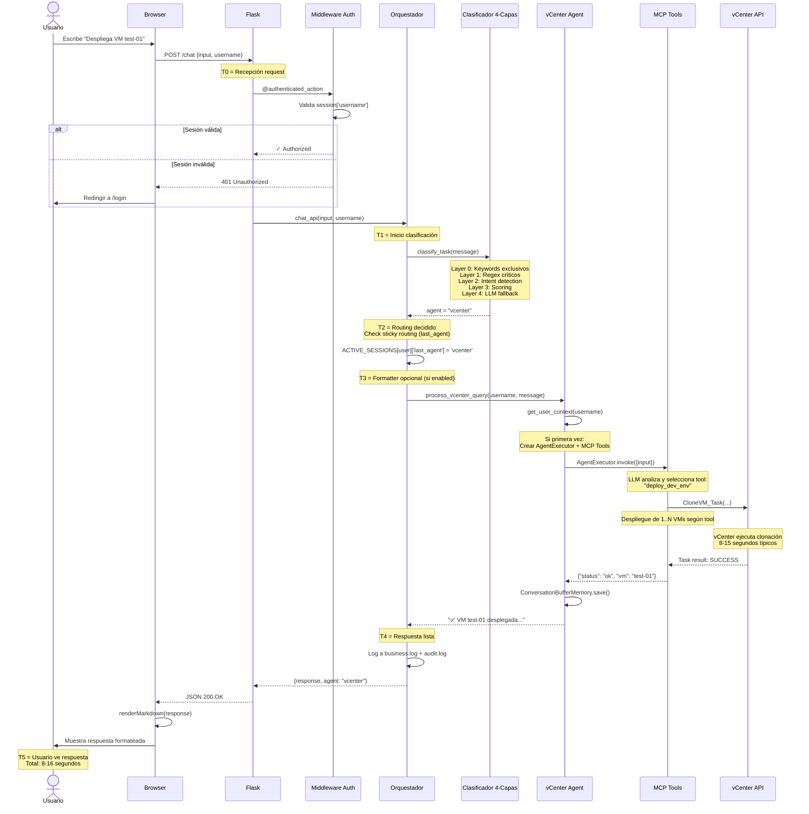
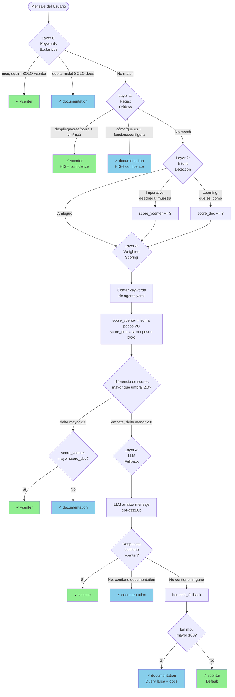
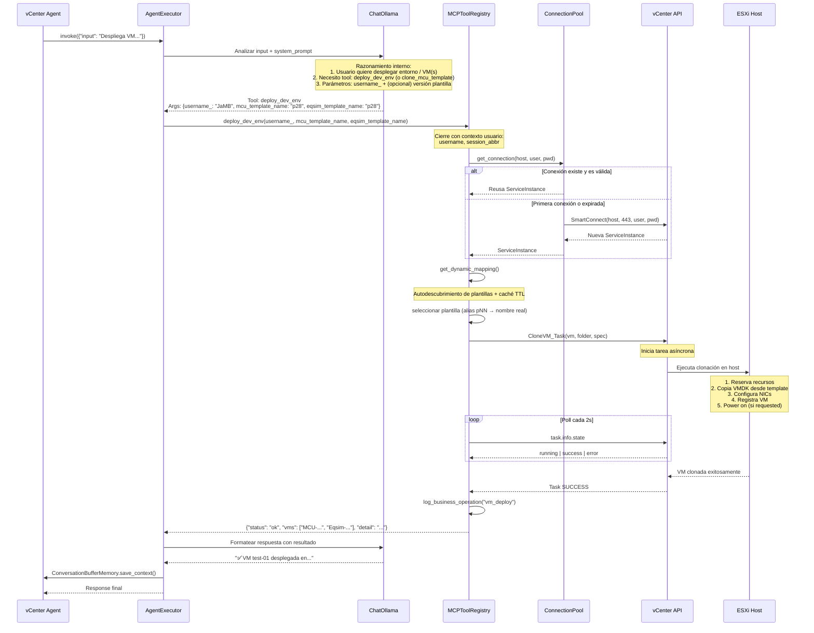
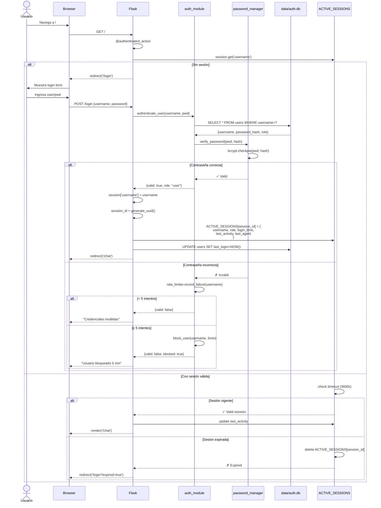
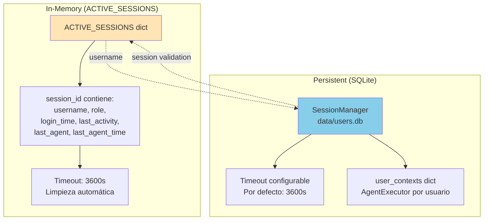

# 🔄 Flujo de Datos - vCenter Multi-Agent System

> Diagramas de secuencia y flujos de datos entre componentes del sistema multi-agente.

---

## 📋 Resumen

Este documento detalla los flujos de datos críticos del sistema:
1. **Query End-to-End**: Desde usuario hasta respuesta
2. **Clasificación 4-Capas**: Decisión de routing
3. **vCenter Operation**: Ejecución de herramienta MCP
4. **RAG v2.4 Pipeline**: Búsqueda de documentación
5. **Autenticación y Sesión**: Login y validación

---

## 1️⃣ Flujo End-to-End: Query de Usuario

### Métricas Típicas

| Fase | Componente | Latencia P50 | Latencia P95 |
|------|-----------|--------------|--------------|
| T0→T1 | Flask middleware | 5-10ms | 15-25ms |
| T1→T2 | Clasificación 4-capas | 50-150ms | 200-400ms |
| T2→T3 | Sticky routing check | <5ms | <10ms |
| T3→T4 | Formatter (opcional) | 200-500ms | 800-1200ms |
| T4→T5 | vCenter operation | 300ms-15s | 1-30s |
| **Total Query** | **End-to-end** | **2-6s** | **5-30s** |

---

## 2️⃣ Clasificador 4-Capas: Decisión de Routing

### Tabla de Decisión por Capa

| Layer | Método | Confianza | Casos de Uso | Exit Rate |
|-------|--------|-----------|--------------|-----------|
| **0** | Exclusive keywords | CRITICAL | Términos proyecto específicos ("mcu", "doors") | ~15% |
| **1** | Regex patterns | HIGH | Frases imperativas + objeto ("despliega una vm") | ~35% |
| **2** | Intent detection | MEDIUM | Detecta imperativo vs learning question | ~25% |
| **3** | Weighted scoring | MEDIUM | Cuenta keywords ponderadas de agents.yaml | ~20% |
| **4** | LLM + Heuristic | LOW-MEDIUM | Análisis semántico completo + fallback | ~5% |

---

## 3️⃣ Operación vCenter: Deploy (entorno / clonación)

---

## 4️⃣ RAG v2.4 Pipeline: Query Documentación

```mermaid
flowchart TB
    Start(["¿Cómo configurar DNS en Ubuntu?"]) --> Phase1[1. Search Mode Detection]

    Phase1 --> CheckMode{Detecta<br/>keywords}
    CheckMode -->|SOLO vcenter| Strict[Strict Mode<br/>Solo carpeta vcenter]
    CheckMode -->|busca en esxi| Boost[Boosting Mode<br/>x2 boost esxi]
    CheckMode -->|Normal| Global[Global Mode<br/>Todas carpetas]

    Strict --> Phase2
    Boost --> Phase2
    Global --> Phase2[2. Query Normalization]

    Phase2 --> RemoveStop[Eliminar 23 stopwords<br/>españolas]
    RemoveStop --> RemoveFiller[Eliminar 12 filler<br/>phrases]
    RemoveFiller --> Phase3[3. Query Expansion]

    Phase3 --> Expand62["Expandir con 62 familias de términos<br/>dns → dns, bind, bind9, named, zona"]
    Expand62 --> Phase4[4. Hybrid Retrieval]

    Phase4 --> Vector[ChromaDB<br/>Vector Search<br/>nomic-embed-text]
    Phase4 --> Keyword[BM25<br/>Keyword Search<br/>k1=1.5, b=0.75]

    Vector --> Cache{Embedding<br/>en cache?}
    Cache -->|Hit 30%| UseCached[Usar cached<br/>embedding]
    Cache -->|Miss 70%| GenNew[Generar nuevo<br/>embedding Ollama]

    UseCached --> VectorResults[Top 20 docs<br/>score 0 a 1]
    GenNew --> VectorResults

    Keyword --> BM25Results[Top 20 docs<br/>score raw]

    VectorResults --> Normalize[Normalización<br/>scores 0 a 1]
    BM25Results --> Normalize

    Normalize --> AlphaCalc{Calcular<br/>alpha adaptativo}
    AlphaCalc -->|Query menos de 5 palabras| Alpha35[alpha = 0.35<br/>Favor keywords]
    AlphaCalc -->|Query más de 10 palabras| Alpha70[alpha = 0.70<br/>Favor semantic]
    AlphaCalc -->|Query media| Alpha50[alpha = 0.50<br/>Balance]

    Alpha35 --> Combine["Combinar scores<br/>alpha x vector + 1-alpha x bm25"]
    Alpha50 --> Combine
    Alpha70 --> Combine

    Combine --> InternalBoost[Internal Docs Boost<br/>+75% si archivo .md]
    InternalBoost --> Top40[Top 40 candidatos]

    Top40 --> Phase5[5. Folder Filtering]

    Phase5 --> ApplyFilter{Aplicar<br/>search mode}
    ApplyFilter -->|Strict| KeepOnly[Mantener solo<br/>carpeta target]
    ApplyFilter -->|Boost| MultiplyScores[x2 scores<br/>carpeta target]
    ApplyFilter -->|Global| NoFilter[Sin filtrado]

    KeepOnly --> Phase6
    MultiplyScores --> Phase6
    NoFilter --> Phase6[6. Reranking]

    Phase6 --> Rerank["Heurístico:<br/>25% original + 40% term_freq<br/>+ 15% length + 10% position"]

    Rerank --> Top8[Top 8 docs<br/>finales]

    Top8 --> Phase7[7. Metrics Logging]
    Phase7 --> LogMetrics[logs/retrieval_metrics.jsonl]

    LogMetrics --> Phase8[8. LLM Response]
    Phase8 --> LLMGen[gpt-oss:20b<br/>num_ctx=16384]

    LLMGen --> Response(["Respuesta con<br/>contexto de docs"])

    style Start fill:#FFE4B5
    style Response fill:#90EE90
    style Phase4 fill:#87CEEB
    style Top8 fill:#FFA07A
```

### Parámetros RAG v2.4

| Parámetro | Valor | Justificación |
|-----------|-------|---------------|
| **chunk_size** | 1400 chars | Balance contexto vs granularidad |
| **chunk_overlap** | 350 chars | Preservar continuidad semántica |
| **initial_k** | 40 | Candidatos pre-reranking |
| **rerank_top_k** | 8 | Contexto final para LLM |
| **base_alpha** | 0.5 | Balance vector/keyword (adaptativo) |
| **bm25_k1** | 1.5 | Saturación term frequency |
| **bm25_b** | 0.75 | Normalización document length |
| **internal_boost** | 0.75 | +75% para docs .md del proyecto |
| **embedding_cache** | 1000 | LRU cache queries frecuentes |
| **num_ctx** | 16384 | Contexto Ollama (vs 8192 vCenter) |

---

## 5️⃣ Autenticación y Sesión

### Dual Session System

**Diferencias clave:**
- **ACTIVE_SESSIONS**: Flask sessions, routing orquestador, in-memory
- **SessionManager**: Agent contexts, vCenter connections, persistent SQLite

---

## 📚 Documentos Relacionados

- [[Arquitectura-Sistema]] - Visión general completa
- [[Arquitectura-Chat]] - Sistema conversacional
- [[Arquitectura-Agente-vCenter]] - Agente VMware
- [[Orquestador]] - Clasificador 4-capas detallado
- [[Sistema-MCP]] - Herramientas vCenter
- [[Agente-Documentacion]] - RAG v2.4 completo
- [[Autenticacion]] - RBAC y sesiones

---

*Última actualización: 2026-03-24 | v1.0*
