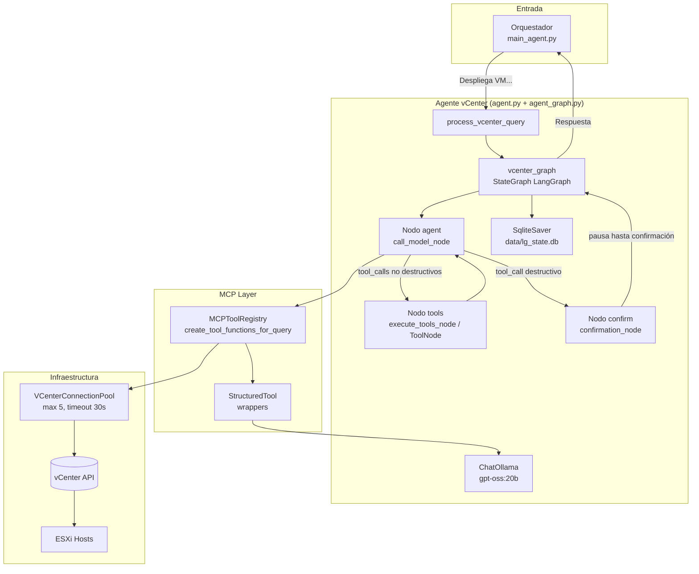
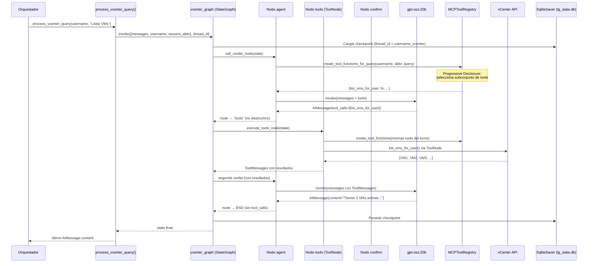

# 🖥️ Agente vCenter

> Agente especializado en operaciones VMware vSphere mediante lenguaje natural. Ejecuta hasta 36 herramientas MCP (catálogo) sobre infraestructura vCenter usando pyvmomi (Progressive Disclosure puede filtrar por query).

---

## 📋 Resumen Ejecutivo

**vCenter Agent** es uno de los 3 agentes especializados del sistema. Su función es traducir consultas en lenguaje natural a operaciones VMware concretas.

| Aspecto | Valor |
|---------|-------|
| **Entry Point** | `src/core/agent.py::process_vcenter_query()` |
| **LLM Model** | gpt-oss:20b (Ollama) |
| **Context Window** | 8192 tokens (vs 4096 default) |
| **Tools Disponibles** | 36 MCP tools (catálogo) en 9 grupos |
| **Memoria** | SqliteSaver checkpointer LangGraph (`data/lg_state.db`) |
| **Connection Pool** | Max 5, timeout 30s |
| **Framework** | LangGraph StateGraph (Fase 3) |

---

## 🏗️ Arquitectura



---

## 🔄 Flujo de Procesamiento

### Query End-to-End



---

## 🧠 System Prompt

El comportamiento del agente está definido por su system prompt:

```python
SYSTEM_PROMPT = """Eres un agente especializado en vCenter VMware.

**Identidad:**
- Respondes en español siempre
- Eres experto en infraestructura VMware (VMs, hosts ESXi, datastores)
- Tienes acceso a 36 herramientas para gestionar vCenter (pueden filtrarse por Progressive Disclosure)

**Selección de Herramientas:**
- Usa SIEMPRE la herramienta más específica para la tarea
- NUNCA inventes datos o simules operaciones
- Si no hay herramienta apropiada, informa al usuario claramente

**Contexto de Usuario:**
- El usuario actual se identifica por su abreviatura (session_abbr)
- Ejemplos: "JaMB" (jmartinb), "PeGo" (perezgomez)
- Las herramientas automáticamente filtran VMs por usuario cuando corresponde

**Seguridad:**
- NO expongas credenciales de vCenter en respuestas
- Confirma antes de ejecutar acciones destructivas (delete, power_off forzado)
- Registra todas las operaciones en logs

**Formato de Respuesta:**
- Usa Markdown para estructurar respuestas
- Tablas para listas de VMs/hosts/datastores
- Bloques de código ```bash para comandos
- Métricas con unidades claras (GB, GHz, %)

**Ejemplos de Uso Correcto:**

Query: "Muéstrame mis VMs"
→ Usar: list_vms_for_user() (filtra por usuario)
→ NO usar: list_all_vms() (devuelve TODAS las VMs del sistema)

Query: "Despliega un entorno de desarrollo para JaMB"
→ Usar: deploy_dev_env(username_="JaMB", mcu_template_name="p28", eqsim_template_name="p28")
→ Nota: si no se indica versión, usa la **más alta disponible** (autodescubrimiento)

Query: "Apaga vm-prod-01"
→ Usar: power_operations_tool(vm_names=["vm-prod-01"], operation="poweroff")
"""
```

---

## 🛠️ Herramientas MCP Disponibles

El agente tiene acceso a **36 herramientas** (catálogo) organizadas en 9 grupos:

### Resumen por Grupo

| Grupo | Herramientas | Descripción |
|-------|--------------|-------------|
| **Grupo 0** | 15 | Operaciones base (inventario, deploy, power, reports, detalles) |
| **Grupo 1** | 4 | Snapshots |
| **Grupo 2** | 3 | Reconfiguración de VM |
| **Grupo 2b** | 2 | Datastores |
| **Grupo 2c** | 3 | NICs |
| **Grupo 3** | 3 | ESXi directo |
| **Grupo 5** | 2 | Eventos y alarmas |
| **Grupo 6** | 1 | Fechas de creación |
| **Grupo 7** | 3 | Configuración detallada de VM (red/recursos/storage) |

Ver [[Sistema-MCP]] para catálogo completo con parámetros.

### Herramientas Típicas (ejemplos)

| Herramienta | Cuándo usar | Descripción |
|-------------|------------|-------------|
| `list_vms_for_user` | "mis VMs" | Lista VMs del usuario (filtra por `session_abbr`) |
| `get_vm_details_tool` | "detalles de vm X" | CPU/RAM/estado/red (resumen) |
| `power_operations_tool` | power on/off/reset/suspend | Operaciones de energía |
| `deploy_dev_env` | entorno estándar | Despliega 1 MCU + 1 Eqsim (plantillas autodetectadas) |
| `deploy_dev_env_2mcu` | entorno GTR | Despliega 2 MCU + 1 Eqsim |
| `clone_mcu_template` | clonar MCU(s) | Clona una o varias MCUs desde plantilla |
| `create_snapshot_tool` | antes de cambios | Crea snapshot |
| `list_snapshots_tool` | auditoría/restauración | Lista snapshots |
| `get_hosts_tool` | capacidad | Lista hosts ESXi |
| `get_datastores_tool` | espacio libre | Lista datastores (resumen) |

---

## 💾 Gestión de Memoria

### SqliteSaver (LangGraph checkpointer)

La memoria conversacional está gestionada por el checkpointer de LangGraph. Cada usuario tiene un `thread_id` independiente (`{username}_vcenter`) en `data/lg_state.db`.

```python
# agent.py — inicialización del grafo con checkpointer SQLite
vcenter_graph = build_vcenter_graph(
    registry=mcp_tool_registry,
    llm=llm,
    system_prompt=system_prompt,
    user_mapping=user_mapping,
    # checkpointer=None → usa SqliteSaver("data/lg_state.db") por defecto
)

# Invocación con thread_id por usuario
config = {"configurable": {"thread_id": f"{username}_vcenter"}}
result = vcenter_graph.invoke(
    {"messages": [HumanMessage(content=message)], "username": username, "session_abbr": session_abbr},
    config,
)
```

**Ventajas:**
- Continuidad en conversación multi-turno
- **Persistente**: sobrevive a reinicios de Flask (SQLite en disco)
- El estado de confirmaciones destructivas también persiste entre turnos y reinicios
- No mezcla contexto entre usuarios (aislamiento por `thread_id`)

**Limpieza de sesión:**
```python
# Cuando el usuario hace /clear o cierra sesión
clear_vcenter_conversation_state(username)
# → elimina el thread del checkpointer
```

**Filtrado de scratchpad histórico**: `_build_messages_for_llm()` elimina `ToolMessage` y `AIMessage` con `tool_calls` de turnos anteriores antes de enviarlo al LLM, evitando que el scratchpad interno de un turno previo contamine el siguiente.

---

## 🔌 Connection Pool

### VCenterConnectionPool

```python
class VCenterConnectionPool:
    def __init__(self, max_connections=5, timeout=30):
        self.max_connections = max_connections
        self.timeout = timeout
        self.connections = {}  # {connection_key: ServiceInstance}
        self.last_used = {}    # {connection_key: timestamp}
    
    def get_connection(self, host, user, pwd):
        key = f"{host}:{user}"
        
        # Limpiar conexiones antiguas (> 30s inactividad)
        self._cleanup_old_connections()
        
        # Reuso si existe y válida
        if key in self.connections:
            if self._is_connection_valid(self.connections[key]):
                self.last_used[key] = time.time()
                return self.connections[key]
            else:
                del self.connections[key]
        
        # Pool lleno
        if len(self.connections) >= self.max_connections:
            # Desconectar la más antigua
            oldest_key = min(self.last_used, key=self.last_used.get)
            Disconnect(self.connections[oldest_key])
            del self.connections[oldest_key]
            del self.last_used[oldest_key]
        
        # Nueva conexión
        si = SmartConnect(host=host, user=user, pwd=pwd, port=443, 
                          sslContext=ssl._create_unverified_context())
        self.connections[key] = si
        self.last_used[key] = time.time()
        return si
```

**Métricas típicas:**
- **Reuso**: ~70% queries reusan conexión existente
- **Latencia nueva conexión**: 200-500ms
- **Latencia reuso**: <5ms

---

## 📊 Entry Points

### process_vcenter_query()

```python
def process_vcenter_query(
    username: str,
    message: str,
    thinking_queue=None
) -> str:
    """
    Invoca el agente vCenter mediante el grafo LangGraph con confirmación persistente.
    
    El estado de confirmación de acciones destructivas sobrevive reinicios del proceso
    gracias al checkpointer SqliteSaver. La memoria conversacional es gestionada por
    el checkpointer (thread_id por usuario), no por ConversationBufferMemory.
    
    Args:
        username:       Nombre de usuario lógico.
        message:        Texto de entrada del usuario.
        thinking_queue: Cola opcional para emitir pasos de razonamiento vía SSE.
    
    Returns:
        str: Contenido del último AIMessage generado por el grafo.
    """
    session_abbr = user_mapping.get(username.lower(), username)
    formatted_msg = f"El usuario {session_abbr} dice: {message}"
    config = {"configurable": {"thread_id": f"{username}_vcenter"}}

    result = vcenter_graph.invoke(
        {"messages": [HumanMessage(content=formatted_msg)], "username": username, "session_abbr": session_abbr},
        config,
    )

    last_ai = next(
        (m for m in reversed(result["messages"]) if isinstance(m, AIMessage)),
        None,
    )
    return last_ai.content if last_ai else "Error: no se obtuvo respuesta del agente."
```

---

## 🔧 Configuración

### Parámetros Clave

| Parámetro | Valor | Ubicación | Motivo |
|-----------|-------|-----------|--------|
| `num_ctx` | 8192 | `agent.py` | Contexto Ollama expandido (vs 4096 default) para system_prompt largo + tools |
| `model` | `gpt-oss:20b` | `agent.py` | Modelo principal razonamiento |
| `temperature` | 0.0 | `agent.py` | Determinista para operaciones infraestructura |
| `max_connections` | 5 | `vcenter_tools.py` | Balance entre rendimiento y límites vCenter |
| `connection_timeout` | 30s | `vcenter_tools.py` | Liberar conexiones inactivas |
| `checkpointer` | `SqliteSaver` | `agent_graph.py` | Persistencia de memoria y estado de confirmación |
| `thread_id` | `{username}_vcenter` | `agent.py` | Aislamiento de conversación por usuario |

### Configuración vCenter (config.json)

```json
{
  "vcenter": {
    "host": "vcenter.example.com",
    "username": "administrator@vsphere.local",
    "password": "SecurePassword123",
    "port": 443,
    "disable_ssl_verification": true
  },
  "esxi_hosts": {
    "host01": {"ip": "192.168.1.10", "user": "root", "pwd": "..."},
    "host02": {"ip": "192.168.1.11", "user": "root", "pwd": "..."}
  }
}
```

---

## 🐛 Troubleshooting

### Problema: "vCenter no disponible"

**Causa:** Connection pool agotado o vCenter down  
**Diagnóstico:**
```python
from src.utils.vcenter_tools import pool
print(f"Conexiones activas: {len(pool.connections)}/{pool.max_connections}")
```

**Solución:**
- Esperar 30s (timeout libera conexiones)
- Reiniciar Flask (limpia pool)
- Aumentar `max_connections` si carga alta

---

### Problema: Respuestas genéricas del LLM

**Causa:** LLM no usa herramientas, inventa respuestas  
**Diagnóstico:** Revisar `logs/system/system.log` por errores de tool execution

**Solución:**
- Verificar que MCP tools estén registradas: `len(user_contexts[user]['executor'].tools)` debe ser **≤ 36** (con Progressive Disclosure puede ser un subconjunto)
- Revisar system_prompt está bien inyectado
- Aumentar `num_ctx` si contexto se trunca

---

### Problema: "Sesión expirada" en queries largas

**Causa:** SQLite SessionManager timeout (30min default)  
**Solución:**
```python
# En src/core/agent.py
session_manager = SessionManager(timeout=3600)  # 1 hora
```

---

## 📚 Documentos Relacionados

- [[Sistema-MCP]] - Catálogo completo 36 herramientas
- [[Arquitectura-Agente-vCenter]] - Arquitectura detallada
- [[Orquestador]] - Cómo llegan queries al agente
- [[Flujo-Datos]] - Diagramas de secuencia
- [[Casos-de-Uso]] - Ejemplos end-to-end

---

## 🚀 Ejemplos de Uso

### Query: Listar VMs del Usuario

**Input:** `"Muéstrame mis VMs"`

**Tool seleccionada:** `list_vms_for_user()`

**Output:**
```markdown
Tienes **3 VMs** activas:

| VM | Estado | CPU | RAM | IP |
|----|--------|-----|-----|-----|
| mcu-jmartinb-01 | powered on | 4 vCPU | 8 GB | 192.168.1.100 |
| eqsim-jmartinb-02 | powered off | 2 vCPU | 4 GB | - |
| test-vm | powered on | 1 vCPU | 2 GB | 192.168.1.101 |
```

---

### Query: Desplegar Entorno de Desarrollo

**Input:** `"Despliega un entorno de desarrollo para JaMB con p28"`

**Tool seleccionada:** `deploy_dev_env(username_="JaMB", mcu_template_name="p28", eqsim_template_name="p28")`

**Output (ejemplo):**
```markdown
✅ **Entorno desplegado exitosamente**

- **Usuario:** JaMB
- **Plantillas:** MCU-P28 + Eqsim-P28 (autodescubiertas desde vCenter)
- **Resultado:** VMs creadas y configuradas según `deployment.hosts` + `vlan_mappings`
```

---

*Última actualización: 2026-04-20 | v3.2*
