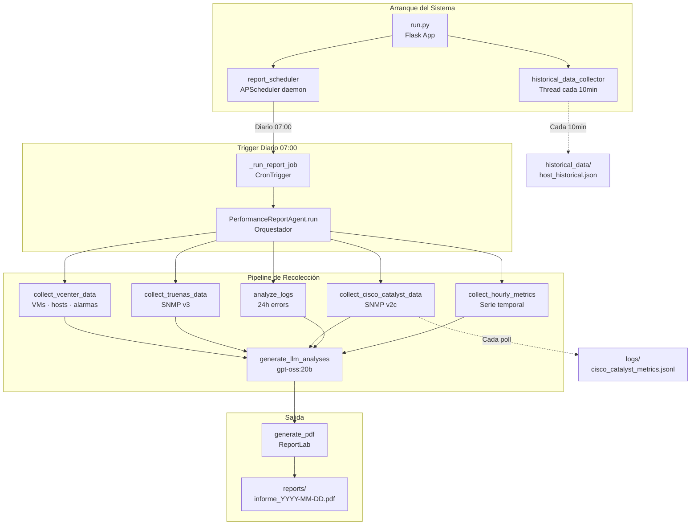
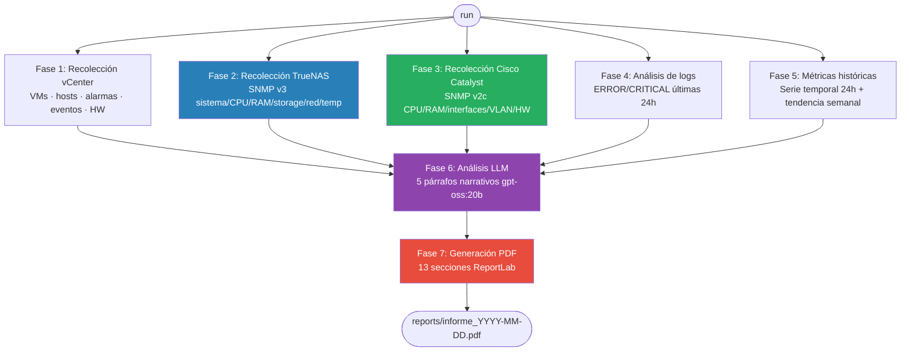
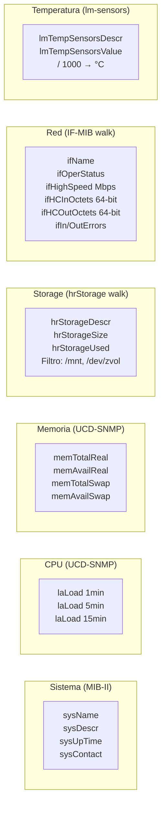
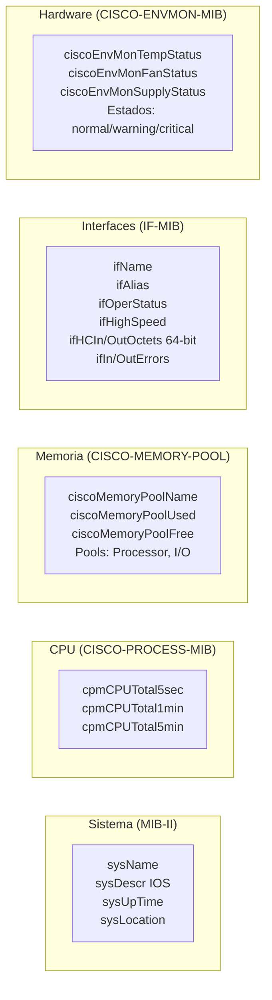
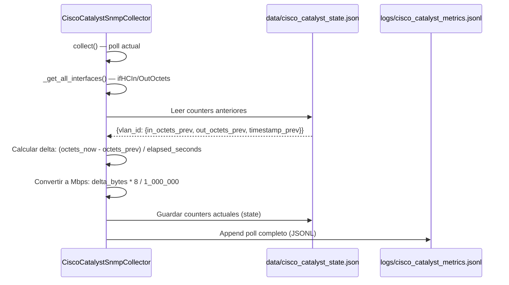
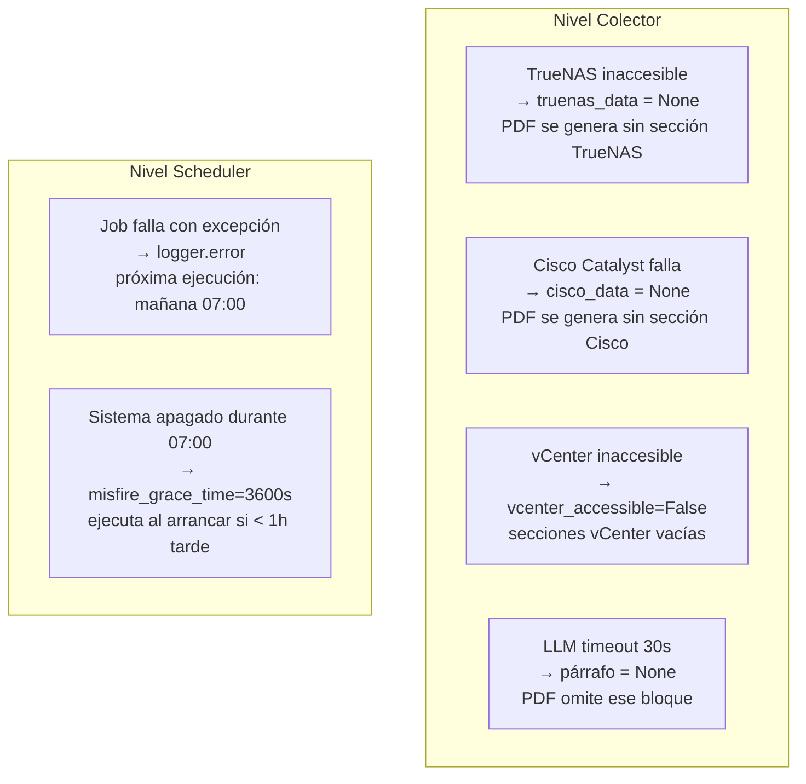

# Agentes de Fondo (Background Agents)

## Descripción General

El **subsistema de Background Agents** ejecuta tareas autónomas de **monitorización y reporting** en segundo plano, recolectando métricas de infraestructura (vCenter, ESXi, TrueNAS, Cisco Catalyst) y generando informes PDF diarios con análisis LLM.

## Arquitectura del Subsistema



***
## Tabla de Agentes/Colectores

| Agente | Archivo | Frecuencia | Función | Protocolo |
|--------|---------|-----------|---------|-----------|
| **Report Scheduler** | `report_scheduler.py` | Diario 07:00 | Dispara informe programado | APScheduler CronTrigger |
| **Performance Report Agent** | `performance_report_agent.py` | On-demand | Orquesta pipeline completo → PDF | ReportLab + LLM |
| **TrueNAS SNMP Collector** | `truenas_snmp_collector.py` | Cada informe | Métricas NAS (CPU/RAM/ZFS/temp) | SNMP v3 (auth+priv) |
| **Cisco Catalyst SNMP Collector** | `cisco_catalyst_snmp_collector.py` | Cada informe | Métricas switch (CPU/RAM/VLAN/HW) | SNMP v2c (community) |
| **Historical Data Collector** | `historical_data_collector.py` | Cada 10 min | Serie temporal ESXi (CPU/RAM) | pyvmomi |
| **Advanced ESXi Collector** | `advanced_esxi_collector.py` | Cada informe | Métricas avanzadas por host ESXi | pyvmomi |

***
## Pipeline de Generación de Informes (7 Fases)



### Fases del Pipeline

1. **Recolección vCenter**: VMs (totales, on/off, zombies), hosts (CPU/RAM/DS), alarmas activas, eventos 24h, snapshots obsoletos (>7 días), hardware, licencias
2. **Recolección TrueNAS**: Sistema (sysName, uptime), CPU load (1/5/15 min), memoria (total/free/swap), pools ZFS, interfaces red, temperatura lm-sensors
3. **Recolección Cisco Catalyst**: Sistema (IOS version, uptime), CPU Cisco (5s/1m/5m), memoria (Processor/I/O pools), interfaces (up/down, tráfico HC), VLAN traffic por usuario, hardware (temp/fans/PSU)
4. **Análisis de logs**: Parseo de `logs/{system,api,audit,security,performance}/*.log` filtrando ERROR/CRITICAL últimas 24h, agrupados por categoría
5. **Métricas históricas**: Lee `historical_data/{host_id}_historical.json` → calcula avg_cpu_24h, peak_cpu_hour, tendencia semanal; actividad horaria de usuarios (`audit.log`)
6. **Análisis LLM**: 5 prompts a `gpt-oss:20b` (timeout 30s/prompt):
   - P1: Estado general del entorno
   - P2: Análisis de hosts ESXi
   - P3: Diagnóstico de errores de logs
   - P4: Análisis de hora pico
   - P5: Eventos vCenter relevantes
7. **Generación PDF**: ReportLab con 13 secciones (cabecera, resumen ejecutivo, hosts, datastores, anomalías, logs, TrueNAS, Cisco, LLM, gráficas tendencia)

***
## APScheduler: Configuración del Scheduler

```python
# report_scheduler.py
from apscheduler.schedulers.background import BackgroundScheduler
from apscheduler.triggers.cron import CronTrigger

scheduler = BackgroundScheduler(daemon=True)

scheduler.add_job(
    func=_run_report_job,
    trigger=CronTrigger(hour=7, minute=0),
    id='daily_performance_report',
    replace_existing=True,
    misfire_grace_time=3600  # Si sistema apagado, ejecuta al arrancar si < 1h tarde
)

scheduler.start()
```

**API Pública**:
- `start_report_scheduler()`: Arranca el scheduler (idempotente)
- `stop_report_scheduler()`: Detiene el scheduler limpiamente
- `generate_report_now()`: Genera informe manual inmediato (botón admin)
- `list_reports(n=30)`: Lista últimos N PDF en `reports/`

***
## Colector: TrueNAS SNMP v3

### Arquitectura

**Tipo**: Stateless, sin dependencias Python para SNMP (usa `snmpget`/`snmpwalk` del SO)

**Autenticación**: SNMPv3 con usuario + SHA auth + AES priv

**Tolerancia a fallos**: Un OID fallido NO detiene la recolección (se añade a `errors[]`)

### Secciones de Recolección



### OIDs Clave (Ejemplos)

| Sección | OID | Descripción |
|---------|-----|-------------|
| **Sistema** | `1.3.6.1.2.1.1.5.0` | sysName |
| | `1.3.6.1.2.1.1.3.0` | sysUpTime |
| **CPU** | `1.3.6.1.4.1.2021.10.1.3.1` | laLoad 1 min |
| | `1.3.6.1.4.1.2021.10.1.3.2` | laLoad 5 min |
| **Memoria** | `1.3.6.1.4.1.2021.4.5.0` | memTotalReal (kB) |
| | `1.3.6.1.4.1.2021.4.6.0` | memAvailReal (kB) |
| **Storage** | `1.3.6.1.2.1.25.2.3.1.3` | hrStorageDescr (walk) |
| **Red** | `1.3.6.1.2.1.31.1.1.1.1` | ifName (walk) |
| **Temp** | `1.3.6.1.4.1.2021.13.16.2.1.3` | lmTempSensorsValue (milli°C) |

### Configuración (`config/config.json`)

```json
{
  "truenas": {
    "enabled": true,
    "host": "192.168.1.X",
    "port": 161,
    "timeout_seconds": 10,
    "retries": 2,
    "snmp_user": "agent",
    "snmp_auth_protocol": "SHA",
    "snmp_auth_password": "YOUR_AUTH_PASS",
    "snmp_priv_protocol": "AES",
    "snmp_priv_password": "YOUR_PRIV_PASS",
    "collect_temperatures": true,
    "collect_network": true,
    "storage_filter_prefixes": ["/mnt", "/dev/zvol"]
  }
}
```

**Requisito**: Instalar binarios SNMP del SO: `sudo apt-get install snmp`

***
## Colector: Cisco Catalyst SNMP v2c

### Arquitectura

**Tipo**: Stateless por poll, pero **persiste contadores VLAN** para deltas

**Autenticación**: SNMPv2c con community string (menos seguro que v3)

**VLAN Traffic**: Calcula tráfico por delta de contadores HC 64-bit entre polls

### Secciones de Recolección



### Cálculo de Tráfico VLAN (Delta de Contadores)



**Correlación VLAN → Usuario**: Mapeo estático en `config.json`:
```json
"vlan_user_mapping": {
  "14": "JaMB",
  "25": "LeMa",
  "36": "PaGo"
}
```

### OIDs Clave (Ejemplos)

| Sección | OID | Descripción |
|---------|-----|-------------|
| **CPU Cisco** | `1.3.6.1.4.1.9.2.1.56.0` | cpmCPUTotal5sec (5s avg) |
| | `1.3.6.1.4.1.9.2.1.57.0` | cpmCPUTotal1min |
| **Memoria Cisco** | `1.3.6.1.4.1.9.9.48.1.1.1.2` | ciscoMemoryPoolName (walk) |
| | `1.3.6.1.4.1.9.9.48.1.1.1.5` | ciscoMemoryPoolUsed |
| **Temperatura** | `1.3.6.1.4.1.9.9.13.1.3.1.3` | ciscoEnvMonTemperatureStatusValue |
| **Fans** | `1.3.6.1.4.1.9.9.13.1.4.1.3` | ciscoEnvMonFanState |

### Configuración (`config/config.json`)

```json
{
  "cisco_catalyst": {
    "enabled": true,
    "host": "192.168.X.X",
    "port": 161,
    "community": "public",
    "timeout_seconds": 10,
    "retries": 2,
    "collect_vlan_traffic": true,
    "collect_hardware_health": true,
    "state_file": "data/cisco_catalyst_state.json",
    "metrics_jsonl": "logs/cisco_catalyst_metrics.jsonl",
    "vlan_user_mapping": {
      "14": "JaMB",
      "25": "LeMa"
    }
  }
}
```

***
## Integración en el Informe PDF

### Sección TrueNAS (PDF Sección 11)

- **CPU Load**: 1min / 5min / 15min (umbral warning: >4.0)
- **Memoria**: Total GB, Free GB, Usage % (warning: >85%)
- **Pools ZFS**: Nombre, tipo (container/filesystem), size GB, used GB, usage % (warning: >80%)
- **Red**: Interfaces, estado operativo, velocidad Mbps, tráfico In/Out, errores
- **Temperatura**: Sensores, °C (warning: >50°C, critical: >60°C)

### Sección Cisco Catalyst (PDF Sección 12)

- **CPU**: 5s / 1min / 5min % (warning: >70%)
- **Memoria**: Pools Processor/I-O, total MB, used MB, usage % (warning: >80%)
- **Interfaces**: Top 10 por tráfico, estado, velocidad, tráfico In/Out Mbps, errores
- **VLAN Traffic**: Por usuario (VLAN → user mapping), In/Out Mbps
- **Hardware**: Temperatura (warning: >50°C), fans (estado), power supplies (estado)

### Formato JSONL Cisco (logs/cisco_catalyst_metrics.jsonl)

```json
{
  "accessible": true,
  "collected_at": "2026-01-15T07:00:05Z",
  "host": "192.168.X.X",
  "system": {"name": "SW-TTCF", "uptime_hours": 2160.5},
  "cpu": {"pct_5sec": 4.0, "pct_1min": 3.0, "pct_5min": 3.0},
  "memory": [{"pool": "Processor", "total_mb": 870.6, "used_mb": 540.1, "usage_percent": 62.0}],
  "vlan_traffic": [
    {"vlan_id": 14, "user": "JaMB", "in_mbps": 2.34, "out_mbps": 0.87}
  ],
  "temperatures": [{"sensor": "Switch 1 - Inlet", "temp_celsius": 28, "status": "normal"}],
  "errors": []
}
```

***
## Tolerancia a Fallos



**Principio**: Ningún fallo individual interrumpe la generación del PDF. El informe puede ser parcial pero **siempre se genera**.

***
## Observabilidad y Logs

### Archivos de Log

| Log | Ruta | Contenido |
|-----|------|-----------|
| **System/Agent Logs** | `logs/system.log` | Errores de agents, scheduler start/stop, job completado |
| **Cisco Métricas Históricas** | `logs/cisco_catalyst_metrics.jsonl` | Una línea JSONL por poll |
| **Cisco State (Counters)** | `data/cisco_catalyst_state.json` | Contadores del último poll (para deltas) |
| **Historical Data ESXi** | `historical_data/{host_id}_historical.json` | Serie temporal CPU/RAM cada 10min |

### Diagnóstico Rápido (PowerShell)

```powershell
# Ver último informe generado
ls reports/ | sort -Property LastWriteTime -Descending | head -1

# Verificar scheduler activo
Get-Content logs/system.log -Tail 50 | Select-String "Scheduler de informes"

# Ver último poll Cisco Catalyst
Get-Content logs/cisco_catalyst_metrics.jsonl -Tail 1 | ConvertFrom-Json

# Errores de colectores SNMP
Get-Content logs/system.log -Tail 100 | Select-String "truenas|cisco_catalyst"

# Forzar generación manual (Python)
# from background_agents.report_scheduler import generate_report_now
# generate_report_now()
```

***
## Estructura de Datos Históricos

### Historical Data ESXi (`historical_data/{host_id}_historical.json`)

```json
{
  "host_id": "host-123",
  "host_name": "esxi01.local",
  "data_points": [
    {
      "timestamp": "2026-01-15T06:50:00Z",
      "cpu_usage_percent": 45.2,
      "memory_usage_percent": 68.5
    },
    {
      "timestamp": "2026-01-15T07:00:00Z",
      "cpu_usage_percent": 48.7,
      "memory_usage_percent": 70.1
    }
  ]
}
```

**Uso**: 
- `collect_hourly_metrics()`: Calcula avg_cpu_24h, peak_cpu_hour
- `collect_weekly_trend()`: Genera tendencia semanal por hora del día (gráfica en PDF)

***
## Parámetros de Configuración

| Parámetro | Archivo | Valor Default | Descripción |
|-----------|---------|---------------|-------------|
| **Scheduler hora** | `report_scheduler.py` | `hour=7, minute=0` | Hora de ejecución diaria |
| **misfire_grace_time** | `report_scheduler.py` | `3600` s | Tolerancia si sistema apagado |
| **threshold_days snapshots** | `performance_report_agent.py` | `7` días | Snapshots obsoletos |
| **LLM timeout** | `performance_report_agent.py` | `30` s/párrafo | Timeout por análisis LLM |
| **TrueNAS timeout** | `config.json → truenas` | `10` s | Timeout global |
| **Cisco timeout** | `config.json → cisco_catalyst` | `10` s | Timeout global |
| **SNMP retries** | Ambos colectores | `2` | Reintentos antes de error |
| **Historical data interval** | `historical_data_collector.py` | `600` s (10min) | Frecuencia de recolección |

***
## Wikilinks Relacionados

- [[Arquitectura-Sistema]] — Arquitectura general del proyecto
- [[Propuestas-Informes]] — Especificación de informes PDF
- [[Orquestador]] — Orquestador de agentes principal
- [[Agente-vCenter]] — Agente de infraestructura vCenter
- [[Configuracion]] — Archivos de configuración del sistema
- [[Logging-Estructurado]] — Sistema de logs del proyecto

***
## Referencia de Archivos

| Archivo | Clase/Función Principal | Propósito |
|---------|------------------------|-----------|
| `background_agents/report_scheduler.py` | `start_report_scheduler()` | Scheduler APScheduler diario 07:00 |
| `background_agents/performance_report_agent.py` | `PerformanceReportAgent` | Orquestación completa + PDF ReportLab |
| `background_agents/truenas_snmp_collector.py` | `TrueNASSnmpCollector` | Métricas TrueNAS via SNMPv3 |
| `background_agents/cisco_catalyst_snmp_collector.py` | `CiscoCatalystSnmpCollector` | Métricas Cisco Catalyst via SNMPv2c |
| `advanced_esxi_collector.py` | `AdvancedESXiCollector` | Métricas avanzadas ESXi via pyvmomi |
| `historical_data_collector.py` | `start_historical_collection()` | Serie temporal CPU/RAM ESXi (10min) |

***
*Última actualización: 2026-01-15*
*Versión: 1.0*
*Documento condensado de 51KB → 15KB manteniendo información esencial*
