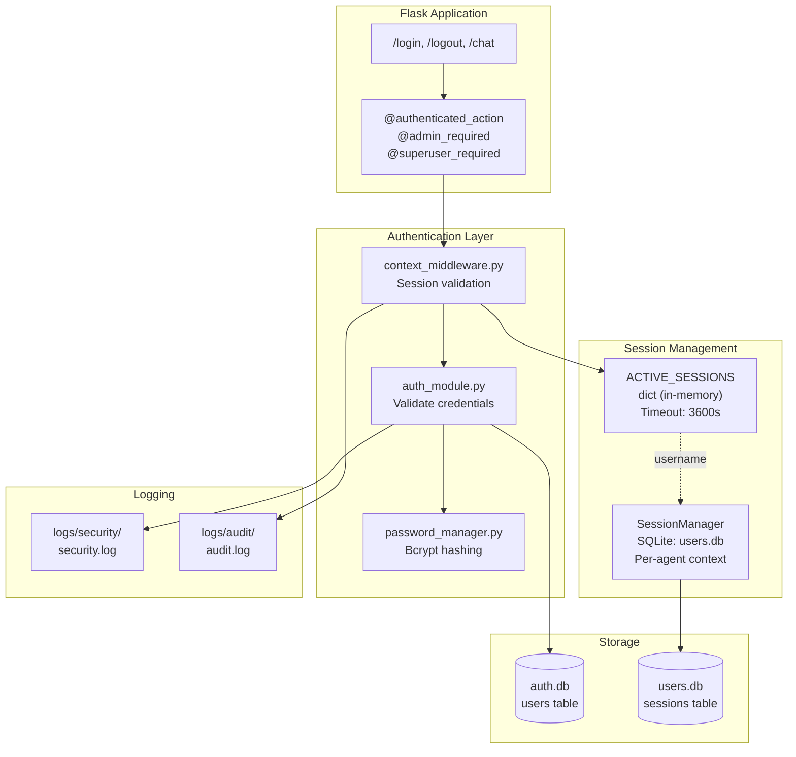
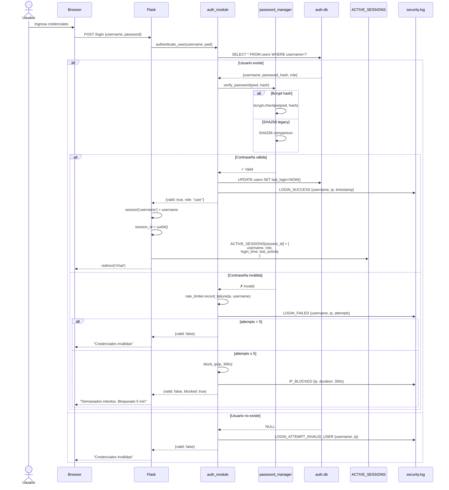

# 🔐 Sistema de Autenticación

> Gestión segura de acceso, sesiones y control basado en roles (RBAC) para vCenter Multi-Agent System.

---

## 📋 Resumen Ejecutivo

Sistema de autenticación modular basado en Flask con:

| Aspecto | Implementación |
|---------|----------------|
| **Hashing** | Bcrypt (cost factor 12) + SHA256 legacy |
| **Sesiones** | Dual system: ACTIVE_SESSIONS (in-memory) + SQLite persistent |
| **Timeout** | 3600s (1 hora) inactividad |
| **Rate Limiting** | 5 intentos → bloqueo 5 minutos |
| **RBAC** | 3 roles: `user`, `admin`, `superuser` |
| **Persistencia** | SQLite: `data/auth.db`, `data/users.db` |
| **Logging** | Security + Audit estructurado |

---

## 🏗️ Arquitectura



---

## 🔄 Flujo de Autenticación

### Login Completo



---

## 🔑 Componentes Principales

### 1. password_manager.py

**Funciones:**
```python
hash_password(password: str) -> str
    # Bcrypt con salt automático, cost factor 12
    
verify_password(password: str, hashed: str) -> bool
    # Verifica contra bcrypt o SHA256 legacy
    
migrate_password(username: str, password: str) -> bool
    # Migra SHA256 → bcrypt si verifica con SHA256
```

**Algoritmos soportados:**
- **Bcrypt** (preferido): `$2b$12$...` (60 chars)
- **SHA256** (legacy): hex string (64 chars)

---

### 2. auth_module.py

**Funciones principales:**
```python
authenticate_user(username: str, password: str) -> dict
    # Returns: {valid: bool, role: str, blocked: bool}
    # Side effects: logs to security.log, updates last_login

create_user(username: str, password: str, role: str) -> bool
    # Crea usuario con bcrypt hash
    
change_password(username: str, old_pwd: str, new_pwd: str) -> bool
    # Valida old, actualiza con nuevo bcrypt hash
    
delete_user(username: str) -> bool
    # Elimina usuario y sus sesiones
```

**Rate Limiting:**
```python
MAX_LOGIN_ATTEMPTS = 5
BLOCK_DURATION = 300  # 5 minutos

# Almacenado en memoria:
failed_attempts = {}  # {ip: [(timestamp, username), ...]}
blocked_ips = {}      # {ip: block_until_timestamp}
```

---

### 3. context_middleware.py

**Decoradores:**

#### @authenticated_action
```python
@authenticated_action
def some_endpoint():
    username = session['username']  # Disponible si pasa validación
    # ...
```

**Validación:**
1. Verifica `session['username']` existe
2. Busca session_id en `ACTIVE_SESSIONS`
3. Verifica timeout (3600s desde last_activity)
4. Actualiza last_activity si válida
5. Si falla → 401 Unauthorized + log audit

#### @admin_required
```python
@admin_required
def admin_endpoint():
    # Solo accesible si role in ['admin', 'superuser']
```

#### @superuser_required
```python
@superuser_required
def superuser_endpoint():
    # Solo accesible si role == 'superuser'
```

#### @security_sensitive
```python
@security_sensitive
def delete_vm_endpoint():
    # Logs a security.log antes y después de ejecución
```

---

## 🗄️ Base de Datos

### Schema: auth.db

```sql
CREATE TABLE users (
    username TEXT PRIMARY KEY,
    password_hash TEXT NOT NULL,
    role TEXT NOT NULL DEFAULT 'user',  -- 'user' | 'admin' | 'superuser'
    created_at DATETIME DEFAULT CURRENT_TIMESTAMP,
    last_login DATETIME,
    is_active INTEGER DEFAULT 1
);

-- Usuarios por defecto
INSERT INTO users (username, password_hash, role) VALUES
  ('admin', '$2b$12$...', 'admin'),
  ('user', '$2b$12$...', 'user');
```

### Dual Session System

```mermaid
graph LR
    subgraph "Orquestador (main_agent.py)"
        AS[ACTIVE_SESSIONS<br/>In-memory dict]
        AS --> |Timeout: 3600s| AS1[session_id → {<br/>  username<br/>  role<br/>  login_time<br/>  last_activity<br/>  last_agent<br/>  last_agent_time<br/>}]
    end
    
    subgraph "Agente vCenter (agent.py)"
        SM[SessionManager<br/>SQLite users.db]
        SM --> |Persistent| SM1[username → {<br/>  session_id<br/>  created_at<br/>  last_activity<br/>  client_ip<br/>}]
    end
    
    AS -.username.-> SM
    
    style AS fill:#FFE4B5
    style SM fill:#87CEEB
```

**¿Por qué dual?**
- **ACTIVE_SESSIONS**: Routing orquestador, sticky routing, in-memory rápido
- **SessionManager**: Contextos de agente (AgentExecutor), persistent para recuperación

---

## 🛡️ Seguridad

### Rate Limiting

**Implementación:**
```python
def is_ip_blocked(ip: str) -> bool:
    if ip in blocked_ips:
        if time.time() < blocked_ips[ip]:
            return True  # Aún bloqueado
        else:
            del blocked_ips[ip]  # Expiró bloqueo
            failed_attempts[ip] = []
    return False

def record_failed_login(ip: str, username: str):
    now = time.time()
    if ip not in failed_attempts:
        failed_attempts[ip] = []
    
    # Limpiar intentos antiguos (>300s)
    failed_attempts[ip] = [(t, u) for t, u in failed_attempts[ip] 
                           if now - t < 300]
    
    failed_attempts[ip].append((now, username))
    
    if len(failed_attempts[ip]) >= MAX_LOGIN_ATTEMPTS:
        blocked_ips[ip] = now + BLOCK_DURATION
        logger.log_security("IP_BLOCKED", {"ip": ip, "duration": 300})
```

### Bcrypt Cost Factor

```python
BCRYPT_COST = 12  # 2^12 = 4096 iteraciones

# Tiempo de hashing:
# Cost 10: ~100ms
# Cost 12: ~400ms (actual)
# Cost 14: ~1.6s
```

**Justificación:** Balance entre seguridad y UX (400ms es aceptable en login).

---

## 📊 Logging Estructurado

### Security Log (logs/security/security.log)

```json
{
  "timestamp": "2026-03-24T11:00:00Z",
  "event": "LOGIN_SUCCESS",
  "username": "admin",
  "ip": "192.168.1.100",
  "user_agent": "Mozilla/5.0..."
}

{
  "timestamp": "2026-03-24T11:05:00Z",
  "event": "LOGIN_FAILED",
  "username": "admin",
  "ip": "192.168.1.200",
  "attempts": 3,
  "reason": "invalid_password"
}

{
  "timestamp": "2026-03-24T11:10:00Z",
  "event": "IP_BLOCKED",
  "ip": "192.168.1.200",
  "duration": 300,
  "reason": "max_attempts_exceeded"
}
```

### Audit Log (logs/audit/audit.log)

```json
{
  "timestamp": "2026-03-24T11:15:00Z",
  "action": "SESSION_VALIDATED",
  "username": "admin",
  "session_id": "abc123...",
  "endpoint": "/chat"
}

{
  "timestamp": "2026-03-24T11:20:00Z",
  "action": "SESSION_EXPIRED",
  "username": "user",
  "session_id": "def456...",
  "reason": "timeout_3600s"
}
```

---

## 🔧 Configuración

### Variables de Entorno

```bash
# Session timeout (segundos)
SESSION_TIMEOUT=3600

# Bcrypt cost factor
BCRYPT_COST=12

# Rate limiting
MAX_LOGIN_ATTEMPTS=5
LOGIN_BLOCK_TIME=300

# Secret key para Flask sessions
SECRET_KEY="your-secret-key-here"
```

### Archivos de Configuración

| Archivo | Propósito |
|---------|-----------|
| `data/auth.db` | Base de datos de usuarios |
| `data/users.db` | SessionManager (per-agent) |
| `config/logging_config.json` | Paths de logs |

---

## 👥 Roles y Permisos (RBAC)

### Matriz de Permisos

| Operación | user | admin | superuser |
|-----------|------|-------|-----------|
| Login | ✅ | ✅ | ✅ |
| Chat con agentes | ✅ | ✅ | ✅ |
| vCenter operations | ✅ | ✅ | ✅ |
| Ver estadísticas | ❌ | ✅ | ✅ |
| Gestionar usuarios | ❌ | ❌ | ✅ |
| Cambiar roles | ❌ | ❌ | ✅ |
| Eliminar usuarios | ❌ | ❌ | ✅ |
| Ver logs security/audit | ❌ | ✅ | ✅ |

### Cambio de Rol

```python
# Solo superuser puede cambiar roles
@app.route('/admin/users/<username>/role', methods=['POST'])
@superuser_required
def change_user_role(username):
    new_role = request.json.get('role')
    if new_role not in ['user', 'admin', 'superuser']:
        return jsonify({'error': 'Invalid role'}), 400
    
    update_user_role(username, new_role)
    logger.log_audit("ROLE_CHANGED", {
        "target_user": username,
        "new_role": new_role,
        "changed_by": session['username']
    })
    return jsonify({'success': True})
```

---

## 🚀 Uso Práctico

### Crear Usuario (Línea de Comandos)

```python
from src.utils.auth_module import create_user

# Crear usuario normal
create_user("john", "password123", role="user")

# Crear admin
create_user("manager", "securepass", role="admin")

# Crear superuser
create_user("root", "strongpassword", role="superuser")
```

### Cambiar Contraseña

```python
from src.utils.auth_module import change_password

result = change_password("john", "password123", "newpassword456")
if result:
    print("✅ Password updated")
else:
    print("❌ Old password incorrect")
```

### Eliminar Usuario

```python
from src.utils.auth_module import delete_user

delete_user("john")  # Elimina usuario y sesiones activas
```

---

## 🐛 Troubleshooting

### Problema: "Sesión expirada" constantemente

**Causa:** ACTIVE_SESSIONS limpiado por reinicio de Flask  
**Solución:** Sesiones in-memory se pierden. Usuario debe re-login.

**Prevención:** Para producción, usar Redis/Memcached para ACTIVE_SESSIONS persistente.

---

### Problema: IP bloqueada erróneamente

**Causa:** Múltiples usuarios detrás de mismo NAT  
**Solución temporal:**
```python
# Limpiar bloqueo manualmente
from src.api.main_agent import blocked_ips
del blocked_ips['192.168.1.100']
```

**Solución permanente:** Implementar rate limiting por usuario en vez de IP.

---

### Problema: Password no coincide después de migración

**Causa:** Password aún en SHA256, no migrado a bcrypt  
**Solución:**
```python
# Forzar migración bcrypt
from src.utils.password_manager import migrate_password
migrate_password("username", "plain_password")
```

---

## 📚 Documentos Relacionados

- [[Arquitectura-Sistema]] - Visión general del sistema
- [[Flujo-Datos]] - Diagrama de autenticación completo
- [[API-Reference]] - Endpoints /login, /logout
- [[Guia-Usuario]] - Instrucciones de login para usuarios
- [[Troubleshooting]] - Problemas comunes

---

## 🔒 Mejores Prácticas

1. **Nunca logear contraseñas** en plaintext (ni siquiera en debug)
2. **Usar HTTPS** en producción (evita sniffing de session cookies)
3. **Rotar SECRET_KEY** periódicamente
4. **Monitorear security.log** por patrones de ataque (intentos repetidos, IPs sospechosas)
5. **Backup regular** de auth.db
6. **Implementar 2FA** para superusers (mejora futura)

---

*Última actualización: 2026-03-24 | v2.0*
