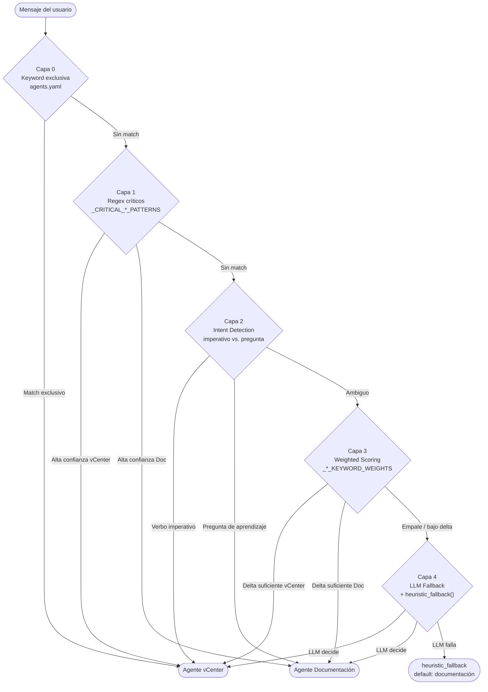

# Clasificador de Queries (4 Capas)

## Descripción General

El clasificador de queries es el módulo que determina el enrutamiento de cada mensaje del usuario hacia el agente correcto: el **agente vCenter** (operaciones VMware) o el **agente de Documentación** (consultas RAG). Es un módulo **stateless**: solo depende del mensaje entrante y del archivo `config/agents.yaml`.

**Ubicación**: `src/utils/query_classifier.py`

La función de entrada principal es `classify_task(message)`, y existe una función de diagnóstico `get_classification_debug(message)` que expone el resultado de cada capa.

---

## Diagrama de Arquitectura



---

## Descripción por Capa

### Capa 0 — Keyword Exclusiva (`agents.yaml`)

Realiza una comparación directa de palabras clave definidas en `config/agents.yaml`. Si la query contiene un término marcado como exclusivo de un agente, se enruta inmediatamente sin pasar por capas superiores.

**Cuándo actúa**: términos de dominio muy específicos que no pueden pertenecer al otro agente (e.g., nombres de tipos de VM del proyecto).

**Archivo a editar**: `config/agents.yaml`

```yaml
vcenter:
  route_keywords:
    - mcu
    - eqsim
    - plantilla
    - datastore_35
```

---

### Capa 1 — Regex Críticos (Alta Confianza)

Aplica patrones de expresiones regulares predefinidos con alta confianza semántica. Hay dos listas:

- `_CRITICAL_VCENTER_PATTERNS`: frases de acción sobre infraestructura VMware
- `_CRITICAL_DOCUMENTATION_PATTERNS`: menciones de herramientas documentadas (GTR, Cantata, etc.)

**Cuándo actúa**: frases estructuradas que indican claramente el dominio, aunque no contengan keywords exclusivas.

**Archivo a editar**: `src/utils/query_classifier.py`

**Ejemplos de patrones vCenter**:

```python
r'\b(?:despliega|desplegar|deploy)\b.{0,30}\b(?:mcu|eqsim|sim|vm|máquina|entorno)\b'
r'\blista(?:r)?\b.{0,30}\b(?:mis\s+)?(?:mcus?|eqsims?|vms?|hosts?|datastores?|plantillas?)\b'
```

**Ejemplos de patrones Documentación**:

```python
r'\b(?:gtr|generic\s+test\s+report)\b'
r'\b(?:cantata|sonarqube|sonar\s+scanner|doors|midat|jacoco|concalnet)\b'
```

---

### Capa 2 — Intent Detection (Imperativo vs. Pregunta)

Analiza la intención gramatical del mensaje:

- **Verbos imperativos** → acción sobre infraestructura → `vcenter`
- **Preguntas de aprendizaje** ("cómo se configura", "qué es", "explícame") → `documentation`

**Cuándo actúa**: mensajes que no tienen keywords exclusivas ni patrones regex, pero cuya estructura gramatical revela claramente si el usuario quiere ejecutar algo o entender algo.

| Tipo de frase | Ejemplo | Resultado |
|---|---|---|
| Imperativo de acción | "despliega un entorno de prueba" | vcenter |
| Pregunta conceptual | "cómo se configura SonarQube" | documentation |
| Pregunta de estado | "qué es un datastore" | documentation |

---

### Capa 3 — Weighted Keyword Scoring

Calcula una puntuación ponderada para cada agente usando los diccionarios:

- `_VCENTER_KEYWORD_WEIGHTS`: términos con peso numérico para el agente vCenter
- `_DOC_KEYWORD_WEIGHTS`: términos con peso numérico para el agente de documentación

Si la diferencia (delta) entre las dos puntuaciones supera el umbral mínimo configurado, se enruta al agente con mayor score.

**Cuándo actúa**: mensajes con vocabulario mixto o ambiguo que no encajaron en capas anteriores.

**Archivo a editar**: `src/utils/query_classifier.py` (modificar pesos en los diccionarios `_VCENTER_KEYWORD_WEIGHTS` / `_DOC_KEYWORD_WEIGHTS`)

---

### Capa 4 — LLM Fallback + Heurística de Seguridad

Solo se invoca cuando los casos son genuinamente ambiguos tras las capas anteriores. El LLM recibe el mensaje y decide el agente. Si el LLM no responde o falla, `heuristic_fallback()` actúa como red de seguridad, enrutando por defecto a documentación.

**Cuándo actúa**: mensajes cortos, sin contexto claro, con vocabulario que no pertenece a ningún dominio de forma dominante.

---

## Tabla de Decisión por Capa

| Capa | Mecanismo | Ejemplo de entrada | Resultado |
|---|---|---|---|
| 0 | Keyword exclusiva en agents.yaml | "lista mis mcus" | vcenter |
| 1 | Regex `_CRITICAL_VCENTER_PATTERNS` | "despliega una mcu en host01" | vcenter |
| 1 | Regex `_CRITICAL_DOCUMENTATION_PATTERNS` | "cómo se usa GTR para informes" | documentation |
| 2 | Verbo imperativo detectado | "reinicia la vm de producción" | vcenter |
| 2 | Pregunta de aprendizaje | "qué es un snapshot en VMware" | documentation |
| 3 | Score vCenter > Score Doc + delta | "estado del datastore nfs-01" | vcenter |
| 3 | Score Doc > Score vCenter + delta | "pasos para integrar jacoco con cantata" | documentation |
| 4 | LLM fallback | "necesito ayuda con el proyecto" | LLM decide |
| 4 | heuristic_fallback (LLM falla) | (cualquier ambiguo sin LLM) | documentation |

---

## Debug: `get_classification_debug()`

Para diagnosticar por qué un mensaje fue enrutado a un agente específico:

```python
from src.utils.query_classifier import get_classification_debug

info = get_classification_debug("despliega una mcu en el host esx01")
print(info)
```

**Salida de ejemplo**:

```python
{
  'layer0_result': None,
  'layer1_result': 'vcenter',
  'layer1_pattern': 'deploy action + resource type',
  'layer2_result': None,
  'layer3_vcenter_score': 7.5,
  'layer3_doc_score': 1.0,
  'final_pre_llm': 'vcenter'
}
```

**Interpretación de campos**:

| Campo | Descripción |
|---|---|
| `layer0_result` | Agente si hubo match por keyword exclusiva, `None` si no |
| `layer1_result` | Agente si un regex crítico hizo match, `None` si no |
| `layer1_pattern` | Descripción del patrón que hizo match en capa 1 |
| `layer2_result` | Agente detectado por intent, `None` si ambiguo |
| `layer3_vcenter_score` | Puntuación ponderada para vCenter |
| `layer3_doc_score` | Puntuación ponderada para documentación |
| `final_pre_llm` | Decisión tomada antes del LLM (si hubo decisión) |

---

## Cómo Extender el Clasificador

### Añadir keywords exclusivas (Capa 0)

Editar `config/agents.yaml`:

```yaml
vcenter:
  route_keywords:
    - mi_nuevo_tipo_vm   # Añadir aquí
```

### Añadir patrones regex (Capa 1)

Editar `src/utils/query_classifier.py`:

```python
# Para enrutar a vCenter:
_CRITICAL_VCENTER_PATTERNS = [
    ...
    (r'\bmi_patron\b.{0,30}\b(?:recurso|vm)\b', 'vcenter', 'descripción del patrón'),
]

# Para enrutar a Documentación:
_CRITICAL_DOCUMENTATION_PATTERNS = [
    ...
    (r'\b(?:mi_herramienta|mi_tool)\b', 'documentation', 'descripción del patrón'),
]
```

### Ajustar pesos de scoring (Capa 3)

Editar los diccionarios en `src/utils/query_classifier.py`:

```python
_VCENTER_KEYWORD_WEIGHTS = {
    "vm": 2.0,
    "host": 1.5,
    "mi_termino_nuevo": 3.0,  # Añadir con peso adecuado
}

_DOC_KEYWORD_WEIGHTS = {
    "configurar": 1.5,
    "mi_doc_term": 2.0,
}
```

### Verificar cambios con tests

```bash
# Tests del clasificador (57 tests)
python -m pytest unitary_test/test_query_classifier.py -v

# Tests de routing end-to-end (39 tests)
python -m pytest unitary_test/test_routing.py -v
```

> Siempre añadir un test de regresión en `unitary_test/test_query_classifier.py` tras modificar el clasificador.

---

## Archivos Relacionados

| Archivo | Rol |
|---|---|
| `src/utils/query_classifier.py` | Implementación de las 4 capas |
| `config/agents.yaml` | Keywords exclusivas por agente (Capa 0) |
| `src/api/main_agent.py` | Invoca `classify_task()` y aplica sticky routing |
| `unitary_test/test_query_classifier.py` | 57 tests unitarios del clasificador |
| `unitary_test/test_routing.py` | 39 tests de routing end-to-end |

---

## Ver También

- [[Arquitectura-Chat]] — flujo completo de una query desde el frontend hasta los agentes
- [[Orquestador]] — cómo el orquestador usa el resultado del clasificador con sticky routing
- [[Agente-vCenter]] — agente de destino para operaciones VMware
- [[Agente-Documentacion]] — agente de destino para consultas RAG
