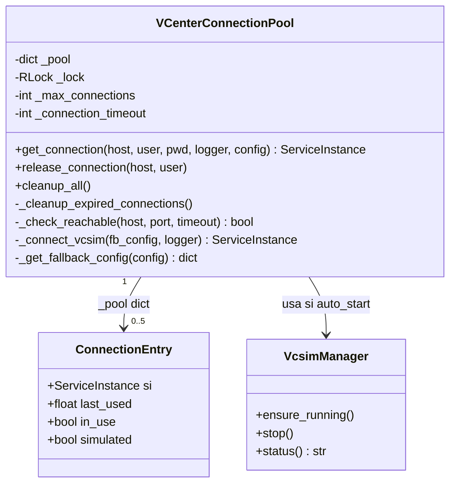
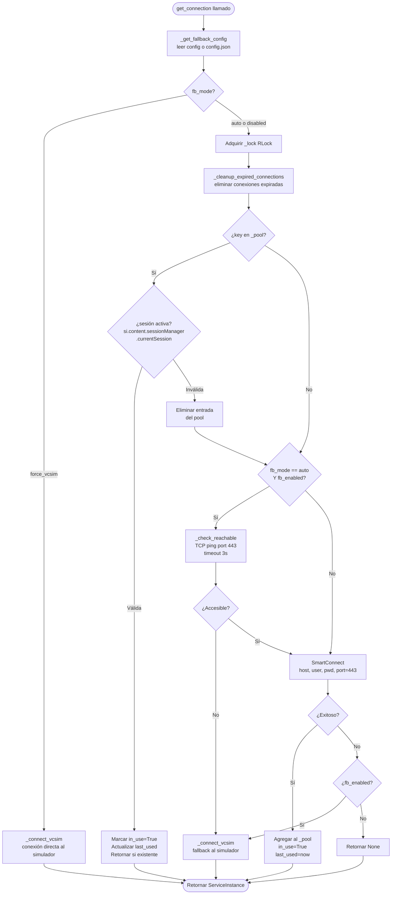
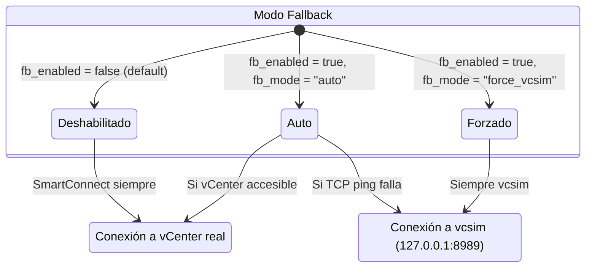
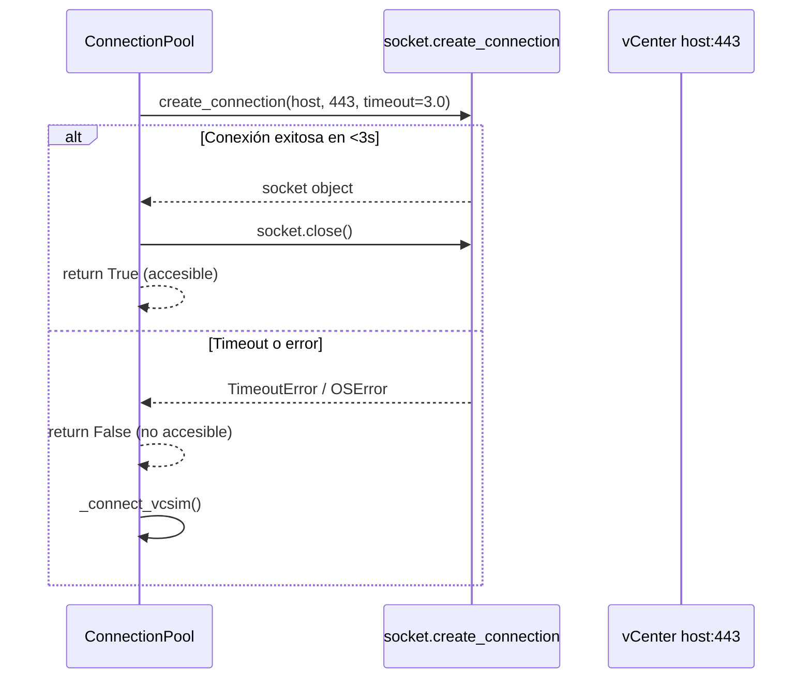
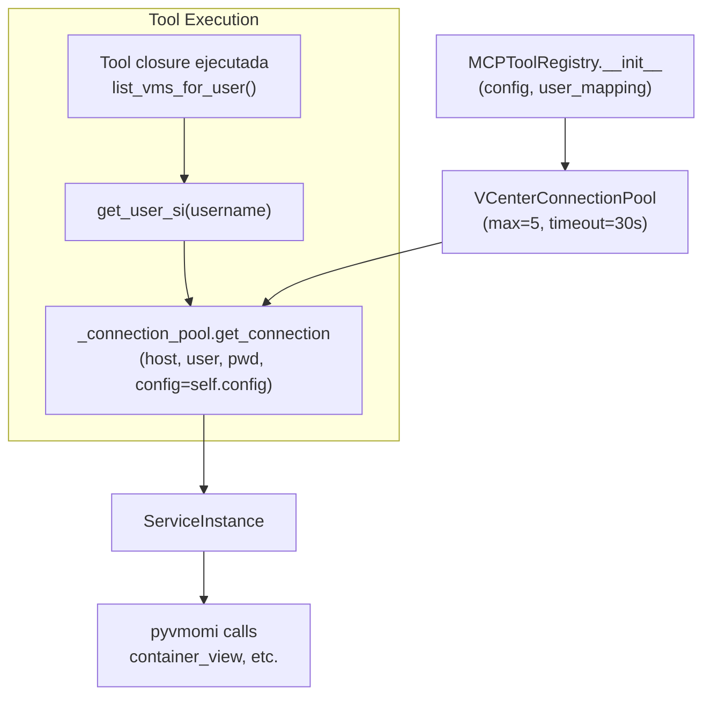

# Connection Pool — Sistema de Conexiones vCenter

Pool de conexiones thread-safe para gestionar sesiones pyvmomi a vCenter con soporte de fallback a vcsim (simulador). Previene la saturación de sesiones y mejora la eficiencia mediante reutilización de conexiones.

## Ubicación

**Archivo:** `src/utils/vcenter_tools.py`  
**Clase:** `VCenterConnectionPool`

## Arquitectura



## Estructura del Pool

```python
_pool = {
    ("vcenter-host.local", "admin"): {
        "si":        ServiceInstance,  # objeto pyvmomi
        "last_used": 1709123456.789,   # timestamp Unix
        "in_use":    False,            # True = ocupado
        "simulated": False             # True = vcsim
    }
}
```

**Clave:** tupla `(host, user)` — permite múltiples conexiones a distintos hosts o usuarios.

## Parámetros de Configuración

| Parámetro | Valor | Descripción |
|-----------|-------|-------------|
| `max_connections` | 5 | Conexiones máximas simultáneas |
| `connection_timeout` | 30s | Tiempo hasta marcar conexión expirada |
| `tcp_ping_timeout` | 3.0s | Timeout del health check TCP |
| `tcp_ping_port` | 443 | Puerto HTTPS de vCenter |
| `vcsim_port` | 8989 | Puerto del simulador (configurable) |
| `lock_type` | `threading.RLock` | Re-entrant lock, thread-safe |

## Flujo de get_connection()



## Ciclo de Vida de Conexión

```mermaid
gantt
    title Ciclo de Vida de una Conexión en el Pool
    dateFormat X
    axisFormat %ss

    section Conexión A
    SmartConnect           :done, a1, 0, 2
    En uso (query 1)       :active, a2, 2, 5
    Libre (in_use=False)   :a3, 5, 35
    Expirada (>30s libre)  :crit, a4, 35, 36
    Disconnect + Eliminar  :crit, a5, 36, 37

    section Conexión B
    SmartConnect           :done, b1, 10, 12
    En uso (query 2)       :active, b2, 12, 15
    Libre                  :b3, 15, 42
```



## Modos de Fallback a vcsim



### Configuración de Fallback

Ver [[Configuracion#vcenter_fallback]] para detalles completos.

```json
{
  "vcenter_fallback": {
    "enabled": false,
    "mode": "auto",
    "vcsim": {
      "host": "127.0.0.1",
      "port": 8989,
      "user": "user",
      "pwd": "pass",
      "auto_start": true
    }
  }
}
```

## Health Check TCP

Antes de intentar conexión real a vCenter (modo `auto`), se hace un health check TCP:



## Limpieza de Conexiones Expiradas

```python
def _cleanup_expired_connections(self):
    """Elimina conexiones que llevan >30s sin usarse y no están in_use"""
    now = time.time()
    keys_to_remove = []
    
    for key, entry in self._pool.items():
        if not entry["in_use"] and (now - entry["last_used"]) > self._connection_timeout:
            try:
                Disconnect(entry["si"])
            except:
                pass
            keys_to_remove.append(key)
    
    for key in keys_to_remove:
        del self._pool[key]
```

**Cuándo se ejecuta:** Al inicio de cada llamada a `get_connection()`, con el lock ya adquirido.

## Integración con MCPToolRegistry



La instancia del pool se crea **una sola vez** en `MCPToolRegistry.__init__` y se comparte entre todas las herramientas del mismo usuario.

## release_connection()

Después de que una herramienta MCP termina su operación, **debe** liberar la conexión:

```python
def release_connection(self, host: str, user: str):
    """Marca conexión como disponible sin cerrarla"""
    key = (host, user)
    with self._lock:
        if key in self._pool:
            self._pool[key]["in_use"] = False
```

Esto permite que el pool gestione la conexión para futuras consultas sin crear una nueva sesión vCenter.

## Comparativa: vCenter Real vs vcsim

| Aspecto | vCenter Real | vcsim (simulador) |
|---------|-------------|-------------------|
| Host | `vcenter-host.local` | `127.0.0.1` |
| Puerto | 443 (HTTPS) | 8989 |
| VMs | Reales, producción | Inventario pre-grabado |
| SSL | Verificación deshabilitada | Sin SSL |
| Uso | Producción | Desarrollo / Testing CI |
| `simulated` flag | `False` | `True` |
| Fuente datos | `get_connection()` directo | `_connect_vcsim()` |

## Casos de Uso

### 1. Pool reutiliza conexión

```python
# Primera llamada (user1)
si = pool.get_connection("vcenter.local", "admin", "pass", logger, config)
# ... operación ...
pool.release_connection("vcenter.local", "admin")

# Segunda llamada (user1, <30s después) → REUTILIZA SI
si = pool.get_connection("vcenter.local", "admin", "pass", logger, config)
# Retorna misma conexión sin nuevo SmartConnect
```

### 2. Pool crea nueva conexión

```python
# Usuario diferente o host diferente
si1 = pool.get_connection("vcenter1.local", "admin", "pass", logger, config)
si2 = pool.get_connection("vcenter2.local", "admin", "pass", logger, config)
# Dos conexiones simultáneas en el pool
```

### 3. Fallback automático a vcsim

```python
# vCenter inaccesible, fb_mode="auto", fb_enabled=true
si = pool.get_connection("vcenter-offline.local", "admin", "pass", logger, config)
# TCP ping falla → _connect_vcsim() → si.simulated=True
```

## Logging

El pool usa [[Structured-Logging]] para todas las operaciones:

```python
logger.log_business_operation("connection_pool_get", {
    "host": host,
    "user": user,
    "reused": True,
    "simulated": False
})

logger.log_system_error("connection_pool_failed", str(e), {
    "host": host,
    "fallback_used": True
})
```

## Enlaces Relacionados

- [[Sistema-MCP]] — Registro de herramientas MCP que usa este pool
- [[Agente-vCenter]] — Agente que consume conexiones del pool
- [[Configuracion]] — Configuración de fallback y parámetros
- [[Structured-Logging]] — Sistema de logging usado

***

**Versión del documento:** 3.0  
**Fuente original:** `vcenter_agent_system/DOCS_proyect/vCenter_Agent/CONNECTION_POOL.md`
