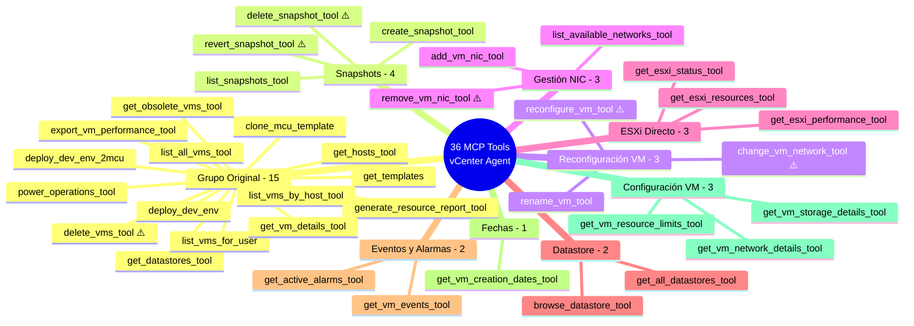
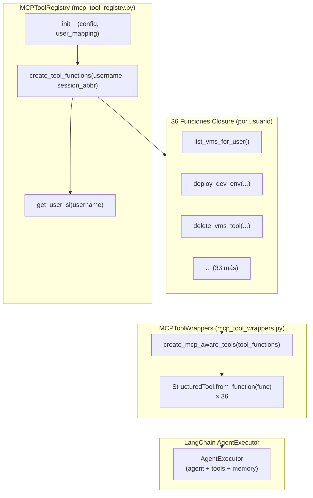
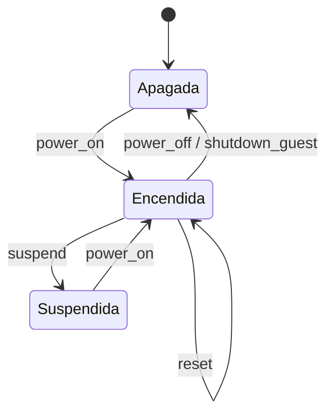
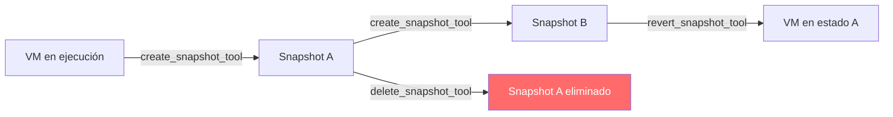
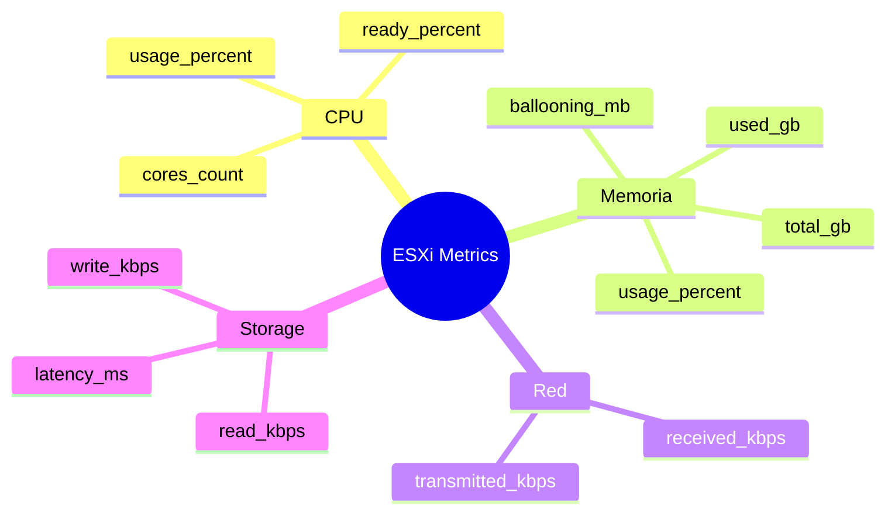
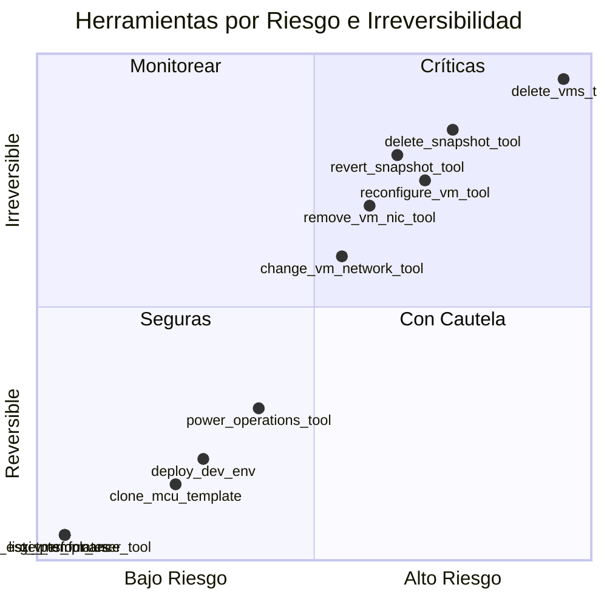
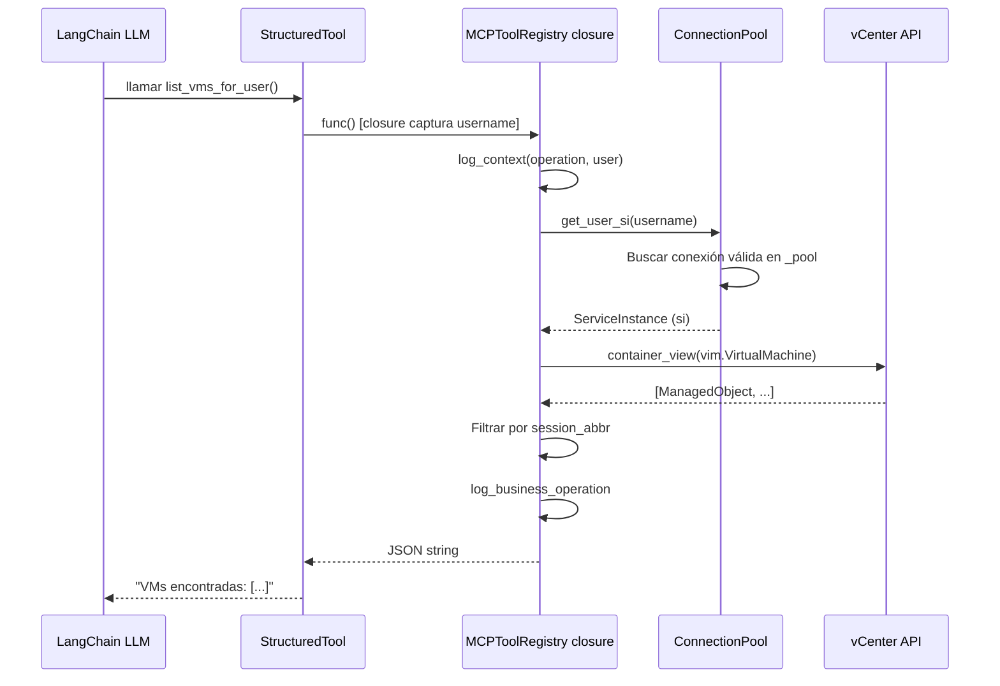

# Herramientas MCP del Agente vCenter

Referencia técnica de las **36 herramientas MCP** registradas en `server/mcp_tool_registry.py`. Cada herramienta es una función closure generada por usuario que encapsula `username` y `session_abbr` para garantizar aislamiento completo entre usuarios.

---

## Mapa Mental — Los 9 Grupos de Herramientas



> [!info] Leyenda
> Las herramientas marcadas con ⚠️ son **de riesgo** (cambian estado o pueden tener impacto irreversible). Algunas implementan confirmación de dos pasos (p. ej. `delete_vms_tool`, `revert_snapshot_tool`, `delete_snapshot_tool`, `remove_vm_nic_tool`).

---

## Arquitectura del Registro MCP



### Por qué se usan closures

Cada llamada a `create_tool_functions(username, session_abbr)` genera **36 funciones** donde `username` y `session_abbr` están **capturados en el closure**. Esto garantiza:

- Cada usuario opera en su propio namespace de VMs
- Las funciones no necesitan recibir `username` como argumento visible al LLM
- Es imposible que el LLM o un usuario inyecte otro `username`

> [!warning] Requisito de Seguridad
> Todas las herramientas vCenter **deben** ir a través del registro MCP. Nunca crear conexiones directas con `SmartConnect()` fuera de `mcp_tool_registry.py`.

---

## Referencia Completa de Herramientas

### Grupo 1 — Original (15 tools)

| # | Nombre | Parámetros | Retorna | Destructiva |
|---|--------|-----------|---------|:-----------:|
| 1 | `get_templates` | — | JSON lista de plantillas | No |
| 2 | `get_hosts_tool` | — | JSON hosts ESXi con CPU/mem | No |
| 3 | `get_datastores_tool` | — | JSON datastores con capacidad | No |
| 4 | `deploy_dev_env` | `username_`, `mcu_template`, `eqsim_template` | String resultado despliegue | No |
| 5 | `deploy_dev_env_2mcu` | `username_`, `mcu_template`, `eqsim_template` | String resultado despliegue | No |
| 6 | `list_vms_for_user` | `username_=None` | JSON VMs del usuario actual | No |
| 7 | `delete_vms_tool` | `vm_names: list[str]` | String confirmación | **Sí** |
| 8 | `clone_mcu_template` | `username_`, `template_name`, `count`, `host_name`, `datastore_name` | String resultado clonado | No |
| 9 | `list_vms_by_host_tool` | `host_name: str` | JSON VMs en el host | No |
| 10 | `list_all_vms_tool` | — | JSON TODAS las VMs del vCenter | No |
| 11 | `generate_resource_report_tool` | `vm_name=None` | Path al ZIP generado | No |
| 12 | `get_obsolete_vms_tool` | `days_threshold=30` | JSON VMs inactivas | No |
| 13 | `export_vm_performance_tool` | `vm_name: str` | Path al CSV generado | No |
| 14 | `power_operations_tool` | `vm_names`, `operation` | String resultado | No |
| 15 | `get_vm_details_tool` | `vm_names` | JSON detalles CPU/RAM/estado/red | No |

#### Diagrama de Estados — `power_operations_tool`

Las operaciones de encendido/apagado siguen este ciclo de estados:



> [!note] Diferencia entre `power_off` y `shutdown_guest`
> - `power_off`: corte de energía inmediato (sin graceful shutdown del SO)
> - `shutdown_guest`: envía señal ACPI al sistema operativo para apagado limpio

---

### Grupo 2 — Snapshots (4 tools)

| # | Nombre | Parámetros | Retorna | Destructiva |
|---|--------|-----------|---------|:-----------:|
| 16 | `create_snapshot_tool` | `vm_name`, `snapshot_name`, `description` | String confirmación | No |
| 17 | `list_snapshots_tool` | `vm_name` | JSON lista con fechas | No |
| 18 | `revert_snapshot_tool` | `vm_name`, `snapshot_name` | String confirmación | **Sí** |
| 19 | `delete_snapshot_tool` | `vm_name`, `snapshot_name` | String confirmación | **Sí** |

#### Ciclo de Vida de Snapshots



> [!warning] Revert es destructivo
> `revert_snapshot_tool` descarta todos los cambios realizados en la VM desde que se creó el snapshot. Los datos no guardados en disco **se pierden**.

---

### Grupo 3 — Reconfiguración VM (3 tools)

| # | Nombre | Parámetros | Retorna | Destructiva |
|---|--------|-----------|---------|:-----------:|
| 20 | `reconfigure_vm_tool` | `vm_name`, `cpu_count`, `memory_mb`, `cores_per_socket` | String confirmación | **Sí** |
| 21 | `rename_vm_tool` | `vm_name`, `new_name` | String confirmación | No |
| 22 | `change_vm_network_tool` | `vm_name`, `interface_index`, `network_name` | String confirmación | **Sí** |

> [!warning] Requisito previo para `reconfigure_vm_tool`
> Esta herramienta requiere que la VM esté **apagada** antes de modificar CPU o RAM. Intentar reconfigurar una VM encendida devuelve error.

---

### Grupo 4 — Gestión NIC (3 tools)

| # | Nombre | Parámetros | Retorna | Destructiva |
|---|--------|-----------|---------|:-----------:|
| 23 | `add_vm_nic_tool` | `vm_name`, `network_name`, `adapter_type="vmxnet3"` | String confirmación | No |
| 24 | `remove_vm_nic_tool` | `vm_name`, `interface_index` | String confirmación | **Sí** |
| 25 | `list_available_networks_tool` | — | JSON VLANs y portgroups | No |

> [!tip] Tipo de adaptador por defecto
> El adaptador `vmxnet3` es el recomendado para VMs modernas en vSphere por su mayor rendimiento respecto a `e1000` o `e1000e`.

---

### Grupo 5 — ESXi Directo (3 tools)

| # | Nombre | Parámetros | Retorna | Destructiva |
|---|--------|-----------|---------|:-----------:|
| 26 | `get_esxi_status_tool` | `host_id` | JSON estado general del host | No |
| 27 | `get_esxi_resources_tool` | `host_id` | JSON CPU/mem/datastores/VMs | No |
| 28 | `get_esxi_performance_tool` | `host_id` | JSON métricas en tiempo real | No |

#### Métricas Disponibles en `get_esxi_performance_tool`



---

### Grupo 6 — Datastore (2 tools)

| # | Nombre | Parámetros | Retorna | Destructiva |
|---|--------|-----------|---------|:-----------:|
| 29 | `browse_datastore_tool` | `datastore_name`, `path="/"` | JSON listado de archivos/carpetas | No |
| 30 | `get_all_datastores_tool` | — | JSON info completa todos los datastores | No |

---

### Grupo 7 — Eventos y Alarmas (2 tools)

| # | Nombre | Parámetros | Retorna | Destructiva |
|---|--------|-----------|---------|:-----------:|
| 31 | `get_vm_events_tool` | `vm_name`, `max_events=20` | JSON historial de eventos | No |
| 32 | `get_active_alarms_tool` | — | JSON alarmas críticas y advertencias | No |

---

### Grupo 8 — Fechas (1 tool)

| # | Nombre | Parámetros | Retorna | Destructiva |
|---|--------|-----------|---------|:-----------:|
| 33 | `get_vm_creation_dates_tool` | `vm_names: str` | JSON fechas de creación | No |

---

### Grupo 9 — Configuración detallada de VM (3 tools)

| # | Nombre | Parámetros | Retorna | Destructiva |
|---|--------|-----------|---------|:-----------:|
| 34 | `get_vm_network_details_tool` | `vm_name: str` | JSON detalles de red (VLAN/MAC/portgroup) | No |
| 35 | `get_vm_resource_limits_tool` | `vm_name: str` | JSON límites/reservas/hot-add/topología CPU | No |
| 36 | `get_vm_storage_details_tool` | `vm_name: str` | JSON detalles de discos/VMDK/provisioning/controladores | No |

---

## Herramientas Destructivas — Cuadrante de Riesgo



### Resumen de herramientas destructivas

| Herramienta | Riesgo | Acción que realiza |
|-------------|--------|-------------------|
| `delete_vms_tool` | Crítico | Elimina VMs permanentemente del inventario vCenter |
| `delete_snapshot_tool` | Alto | Elimina un snapshot y libera el espacio en disco asociado |
| `revert_snapshot_tool` | Alto | Descarta cambios de la VM desde el snapshot seleccionado |
| `reconfigure_vm_tool` | Alto | Modifica CPU/RAM de la VM (requiere apagado previo) |
| `remove_vm_nic_tool` | Medio-Alto | Elimina una interfaz de red de la VM |
| `change_vm_network_tool` | Medio | Reasigna una interfaz de red a otra VLAN/portgroup |

---

## Patrón de Implementación de una Tool

### Código de referencia — `list_vms_for_user`

```python
# En server/mcp_tool_registry.py → create_tool_functions()

def list_vms_for_user(username_: str = None) -> str:
    """
    Lista las VMs pertenecientes al usuario actual en vCenter.
    Filtra por prefijo de abreviatura de usuario (session_abbr).
    Retorna JSON con nombre, estado, CPU, RAM y host de cada VM.
    """
    # username y session_abbr capturados del closure externo
    try:
        with log_context(operation="list_vms_for_user", user=username):
            si = self.get_user_si(username)          # Pool de conexiones
            vms = get_vms_for_user(si, session_abbr) # pyvmomi wrapper
            logger.log_business_operation(
                "vm_list", {"count": len(vms), "user": session_abbr}
            )
            return json.dumps(vms, ensure_ascii=False)
    except Exception as e:
        logger.log_system_error("list_vms_for_user", str(e))
        return f"Error listando VMs: {str(e)}"
```

### Flujo Interno de una Tool — Diagrama de Secuencia



### Patrón obligatorio para nuevas tools

Al implementar una nueva herramienta MCP, se deben seguir estos tres pasos:

1. **Agregar la función** dentro de `create_tool_functions()` en `server/mcp_tool_registry.py`, capturando `username` y `session_abbr` del closure externo
2. **Registrar el wrapper** en `server/mcp_tool_wrappers.py` usando el decorador `@tool` de LangChain
3. **Documentar la tool** en la lista de herramientas de `src/core/agent.py` (línea ~210)

---

## Archivos Relacionados

| Archivo | Propósito |
|---------|-----------|
| `server/mcp_tool_registry.py` | Registro central de las 36 tools (closures por usuario) |
| `server/mcp_tool_wrappers.py` | Adaptación a `StructuredTool` (LangChain) |
| `server/mcp_vcenter_server.py` | Servidor FastMCP con 36 endpoints `@mcp.tool()` |
| `src/utils/vcenter_tools.py` | Wrappers pyvmomi y pool de conexiones (`VCenterConnectionPool`) |
| `src/core/agent.py` | Agente vCenter que consume las tools a través de LangChain |
