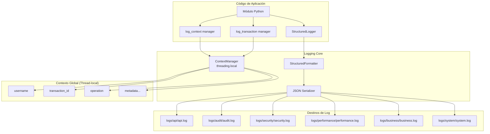

# Logging Estructurado — Sistema de Logging Estructurado

Sistema de logging JSON estructurado con contexto automático, trazabilidad de transacciones y correlación entre servicios. **OBLIGATORIO** en todo el proyecto — nunca usar `print()`.

## Ubicación

**Archivo:** `src/utils/structured_logger.py`
**Clase principal:** `StructuredLogger`

## Propósito

Proporcionar:
- **Logs en formato JSON** para análisis programático
- **Contexto automático** por thread (user, transaction_id, operation)
- **Trazabilidad de transacciones** con IDs únicos
- **Categorización** por tipo de evento (security, audit, performance, business, system, api)
- **Correlación** entre servicios y operaciones

## Arquitectura



## Categorías de Logs

```python
class LogCategory(Enum):
    SECURITY = "security"      # Autenticación, autorización, accesos
    PERFORMANCE = "performance"  # Métricas de rendimiento, tiempos
    AUDIT = "audit"           # Trazabilidad de acciones de usuario
    BUSINESS = "business"     # Lógica de negocio, operaciones vCenter
    SYSTEM = "system"         # Eventos del sistema, conexiones, errores
    API = "api"              # Llamadas HTTP, respuestas, middleware
```

### Enrutamiento por Categoría

| Categoría | Archivo | Propósito |
|-----------|---------|-----------|
| `api` | `logs/api/api.log` | Requests HTTP, respuestas, latencias |
| `audit` | `logs/audit/audit.log` | Acciones de usuario (create_vm, delete_snapshot) |
| `security` | `logs/security/security.log` | Login, logout, intentos fallidos, bloqueos |
| `performance` | `logs/performance/performance.log` | Tiempos de ejecución, cuellos de botella |
| `business` | `logs/business/business.log` | Operaciones vCenter (VM creada, snapshot tomado) |
| `system` | `logs/system/system.log` | Errores técnicos, conexiones, pool exhausted |

## Formato de Log JSON

```json
{
  "timestamp": "2026-03-24T10:15:32.123456Z",
  "level": "INFO",
  "logger": "vcenter_tools",
  "message": "Business: vm_power_on",
  "module": "vcenter_tools",
  "function": "power_on_vm",
  "line": 245,
  "context": {
    "username": "admin",
    "transaction_id": "a1b2c3d4",
    "operation": "vm_operations"
  },
  "category": "business",
  "data": {
    "operation": "vm_power_on",
    "vm": "web-server-01",
    "datacenter": "DC1"
  }
}
```

## Uso Básico

### 1. Crear Logger

```python
from src.utils.structured_logger import get_structured_logger

logger = get_structured_logger('module_name')
```

### 2. Niveles de Log

```python
# DEBUG (desarrollo, información detallada)
logger.debug("Conexión iniciada", host="vcenter.local", port=443)

# INFO (flujo normal)
logger.info("Usuario autenticado correctamente", username="admin")

# WARNING (situaciones potencialmente problemáticas)
logger.warning("Pool de conexiones casi lleno", current=4, max=5)

# ERROR (errores no críticos)
logger.error("Falló operación vCenter", exception=e, vm="test-vm")

# CRITICAL (errores críticos que afectan disponibilidad)
logger.critical("Base de datos inaccesible", exception=e)
```

### 3. Logs Especializados

#### Audit (Trazabilidad)

```python
logger.audit(
    action="vm_create",
    user="admin",
    resource="web-server-01",
    result="success",
    datacenter="DC1",
    template="ubuntu-20.04"
)
```

#### Performance (Métricas)

```python
duration_ms = (time.time() - start) * 1000
logger.performance(
    operation="rag_retrieval",
    duration_ms=duration_ms,
    user="user1",
    docs_retrieved=12,
    cache_hit=True
)
```

#### Security (Eventos de seguridad)

```python
logger.security(
    event="login_failed",
    user="attacker",
    ip="192.168.1.100",
    severity="warning",
    attempts=3
)
```

#### Business (Operaciones de negocio)

```python
logger.log_business_operation(
    operation="vm_snapshot_create",
    metadata={
        "vm": "database-prod",
        "snapshot_name": "pre-upgrade-20260324",
        "description": "Backup before MySQL upgrade"
    }
)
```

## Context Managers

### log_context

Establece contexto temporal para un bloque de código:

```python
from src.utils.structured_logger import log_context, get_structured_logger

logger = get_structured_logger('vcenter_agent')

with log_context(operation="vm_deploy", user=username, vm=vm_name):
    # Todos los logs dentro tendrán este contexto automáticamente
    logger.info("Iniciando despliegue")
    result = deploy_vm(vm_name, template)
    logger.info("Despliegue completado", result=result)
```

### log_transaction

Crea transacción con ID único y logging automático de inicio/fin:

```python
from src.utils.structured_logger import log_transaction

with log_transaction("vm_lifecycle_operation", user=username) as tx_id:
    # Logs automáticos:
    # - "Transaction started: vm_lifecycle_operation"
    # - Al finalizar: "Transaction completed" + performance metrics
    # - Si falla: "Transaction failed" + exception details

    create_vm(name)
    configure_network(name)
    power_on(name)
```

## Decorador de Performance

```python
from src.utils.structured_logger import performance_monitor

@performance_monitor("user_authentication")
def authenticate_user(username: str, password: str):
    # Automáticamente loguea:
    # - Inicio de operación
    # - Duración en ms
    # - Éxito o fallo con exception details
    return check_credentials(username, password)
```

## ContextManager (Thread-local)

Gestión de contexto global por thread:

```python
from src.utils.structured_logger import ContextManager

# Establecer contexto
ContextManager.set_context(
    username="admin",
    operation="vm_operations",
    datacenter="DC1"
)

# Obtener contexto actual
context = ContextManager.get_context()
# {'username': 'admin', 'operation': 'vm_operations', 'datacenter': 'DC1'}

# Nuevo transaction ID
tx_id = ContextManager.new_transaction_id()  # "a1b2c3d4"

# Limpiar contexto
ContextManager.clear_context()
```

## Integración con Flask

### middleware context_middleware.py

```python
from src.utils.context_middleware import authenticated_action, security_sensitive

@app.route('/api/vm/create', methods=['POST'])
@authenticated_action       # Auto-añade username al contexto
@security_sensitive         # Loguea a logs/security/
def create_vm_endpoint():
    username = session['username']  # Disponible automáticamente

    logger = get_structured_logger('api.vm')
    logger.log_business_operation("vm_create_request", {
        "template": request.json.get('template'),
        "datacenter": request.json.get('datacenter')
    })

    # ... lógica ...
```

## Configuración (logging_config.json)

```json
{
  "version": 1,
  "disable_existing_loggers": false,
  "formatters": {
    "structured": {
      "()": "src.utils.structured_logger.StructuredFormatter",
      "include_traceback": true
    }
  },
  "handlers": {
    "api_file": {
      "class": "logging.handlers.RotatingFileHandler",
      "filename": "logs/api/api.log",
      "maxBytes": 10485760,
      "backupCount": 5,
      "formatter": "structured"
    },
    "audit_file": {
      "class": "logging.handlers.RotatingFileHandler",
      "filename": "logs/audit/audit.log",
      "maxBytes": 10485760,
      "backupCount": 10,
      "formatter": "structured"
    }
    // ... otros handlers ...
  },
  "loggers": {
    "api": {"level": "INFO", "handlers": ["api_file"]},
    "audit": {"level": "INFO", "handlers": ["audit_file"]},
    "security": {"level": "INFO", "handlers": ["security_file"]},
    "performance": {"level": "INFO", "handlers": ["performance_file"]},
    "business": {"level": "INFO", "handlers": ["business_file"]},
    "system": {"level": "WARNING", "handlers": ["system_file"]}
  }
}
```

## Patrones Obligatorios del Proyecto

### ❌ NUNCA usar print()

```python
# ❌ INCORRECTO
print(f"Processing VM {vm_name}")
print("Error:", str(e))
```

### ✅ SIEMPRE usar logger

```python
# ✅ CORRECTO
logger = get_structured_logger('module_name')
logger.info("Processing VM", vm=vm_name)
logger.error("Operation failed", exception=e, context={"vm": vm_name})
```

### ✅ Usar contexto para operaciones multi-paso

```python
with log_context(operation="vm_deploy", user=username, vm=vm_name):
    with log_transaction("deployment"):
        logger.info("Step 1: Creating VM")
        create_vm(vm_name)

        logger.info("Step 2: Configuring network")
        configure_network(vm_name)

        logger.log_business_operation("vm_deployed", {"vm": vm_name})
```

### ✅ Registrar errores con contexto

```python
try:
    result = risky_operation()
except Exception as e:
    logger.log_system_error(
        "risky_operation",
        str(e),
        metadata={"context": "additional_info", "retry_count": 3}
    )
    raise
```

## Ejemplos por Componente

### Agente vCenter

```python
logger = get_structured_logger('vcenter_agent')

with log_context(operation="list_vms", user=username):
    logger.log_business_operation("list_vms_start", {"datacenter": "DC1"})

    si = get_user_si(username)
    vms = get_all_vms(si)

    logger.log_business_operation("list_vms_complete", {
        "vm_count": len(vms),
        "datacenter": "DC1"
    })
```

### Orquestador

```python
logger = get_structured_logger('orchestrator')

with log_transaction("query_routing", user=username) as tx_id:
    logger.info("Classifying query", query=user_query, tx_id=tx_id)

    agent = classify_task(user_query)

    logger.audit(
        action="query_routed",
        user=username,
        resource=agent,
        result="success",
        query_length=len(user_query)
    )
```

### Connection Pool

```python
logger = get_structured_logger('connection_pool')

logger.log_business_operation("connection_pool_get", {
    "host": host,
    "user": user,
    "reused": True,
    "simulated": False
})

# Si falla:
logger.log_system_error("connection_pool_failed", str(e), {
    "host": host,
    "fallback_used": True
})
```

## Visualización de Logs

```powershell
# Ver logs en tiempo real con formato JSON legible
Get-Content logs/business/business.log -Wait -Tail 20 | ForEach-Object {
    $_ | ConvertFrom-Json | ConvertTo-Json -Depth 5
}

# Filtrar por usuario específico
Get-Content logs/audit/audit.log | Where-Object { $_ -match '"user":"admin"' }

# Ver solo errores
Get-Content logs/system/system.log | Where-Object { $_ -match '"level":"ERROR"' }

# Análisis de performance
Get-Content logs/performance/performance.log | ConvertFrom-Json |
    Where-Object { $_.performance.duration_ms -gt 1000 } |
    Select-Object message, @{N='Duration';E={$_.performance.duration_ms}}
```

## Ventajas del Sistema

1. **Análisis programático** — JSON permite queries con jq, Python, ELK
2. **Contexto automático** — username, transaction_id, operation sin código extra
3. **Trazabilidad** — Seguir transacción completa con transaction_id único
4. **Categorización** — Logs separados por propósito facilitan debugging
5. **Integración con observability** — Compatible con ELK, Splunk, Datadog
6. **Thread-safe** — threading.local permite contexto por request Flask
7. **Rotación automática** — RotatingFileHandler evita discos llenos

## Enlaces Relacionados

- [[Autenticacion]] — Usa security logging para login/logout
- [[Agente-vCenter]] — Usa business logging para operaciones VMware
- [[Connection-Pool]] — Usa system logging para gestión de conexiones
- [[Orquestador]] — Usa audit logging para routing de queries
- [[Arquitectura-Sistema]] — Visión general del sistema

***

**Versión del documento:** 1.0
**Autor:** Senior Software Engineer - Observability Team
**Fuente:** `vcenter_agent_system/src/utils/structured_logger.py`
