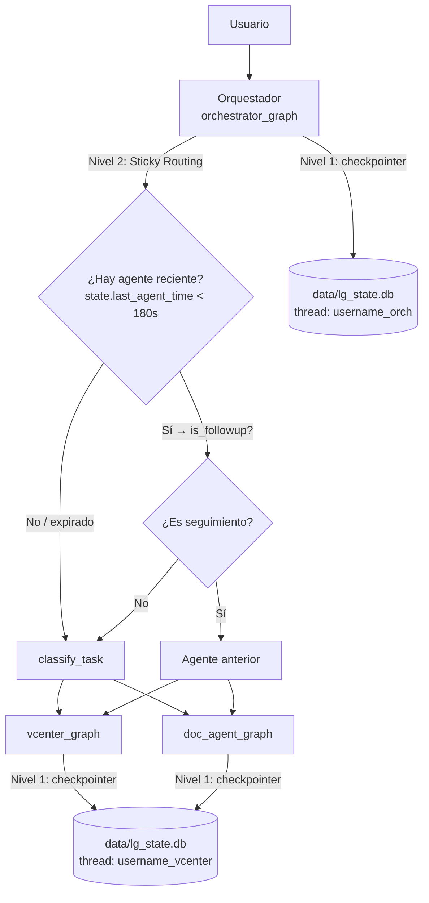
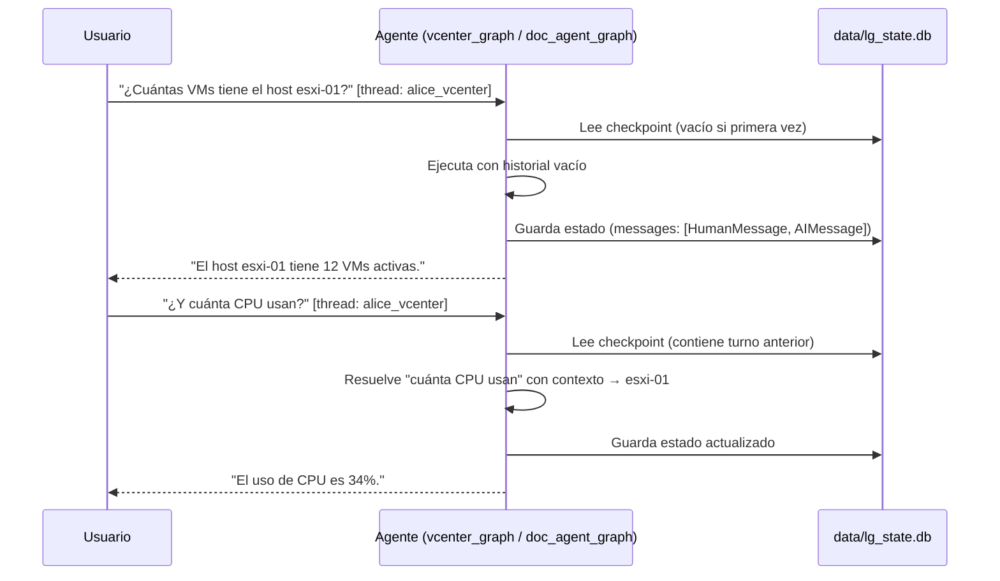

# Memoria Conversacional

El sistema implementa **dos niveles de memoria** para permitir conversaciones naturales y multi-turno sin que el usuario tenga que repetir contexto en cada mensaje. Desde la versión 3.7, toda la persistencia de **estado conversacional** reside en el checkpointer SQLite de LangGraph (`data/lg_state.db`). Los mecanismos en-memoria anteriores (`ACTIVE_SESSIONS` dict, `user_memories` dicts, `ConversationBufferMemory`) han sido eliminados.

---

## 1. Visión General del Sistema Unificado



| Nivel | Componente | Alcance | Almacenamiento | Timeout |
|-------|------------|---------|----------------|---------|
| 1 | Checkpointer LangGraph (`SqliteSaver`) | Historial de mensajes por agente + estado de grafo | `data/lg_state.db` (disco) | 3600s (expiración lógica) |
| 2 | Sticky routing (`OrchestratorState.last_agent`) | Último agente usado por usuario | `data/lg_state.db` — campo `last_agent_time` | 180s |

---

## 2. Nivel 1 — Memoria de Agente (LangGraph Checkpointer)

### Descripción

Cada agente (vCenter y Documentación) mantiene el historial de mensajes como parte del estado del grafo LangGraph. El checkpointer SQLite persiste automáticamente el estado completo del grafo entre invocaciones usando un `thread_id` por usuario.



### Thread IDs por usuario y agente

| Contexto | Thread ID | Módulo |
|---------|-----------|--------|
| Orquestador | `{username}_orch` | `src/api/orchestrator_graph.py` |
| Agente vCenter | `{username}_vcenter` | `src/core/agent_graph.py` |
| Agente Documentación | `{username}_doc` | `src/core/doc_agent_graph.py` |

Los thread IDs son construidos por las funciones en `src/utils/langgraph_session_cleanup.py`:

```python
from src.utils.langgraph_session_cleanup import (
    build_orchestrator_thread_id,   # → "alice_orch"
    build_vcenter_thread_id,        # → "alice_vcenter"
    build_documentation_thread_id,  # → "alice_doc"
)
```

### Características

- Memoria **por usuario** — cada usuario tiene threads independientes
- Memoria **por agente** — vCenter y Documentación tienen threads separados
- El historial **persiste entre reinicios de Flask** — el checkpointer es SQLite en disco
- Permite resolver referencias pronominales: "¿Y ese?" → contexto del turno anterior

---

## 3. Nivel 2 — Sticky Routing del Orquestador

### Descripción

El orquestador implementa enrutamiento pegajoso (*sticky routing*) para evitar que respuestas cortas de seguimiento sean malinterpretadas por el clasificador. Desde v3.4, el estado del sticky routing forma parte del `OrchestratorState` y se persiste automáticamente en el checkpointer.

### Campos en `OrchestratorState` relevantes

```python
class OrchestratorState(TypedDict):
    last_agent: str | None          # "vcenter" | "documentation" | None
    last_agent_time: float          # timestamp del último uso
    session_last_activity: float    # timestamp de la última actividad (para expiración)
    followup_detected: bool         # mensaje detectado como follow-up
    used_sticky_routing: bool       # sticky routing aplicado en este turno
```

### Flujo de decisión

```mermaid
flowchart TD
    MSG[Mensaje entrante] --> CHK{¿state.last_agent_time\n< 180s?}
    CHK -->|No / expirado| CLASSIFY[classify_task → routing normal]
    CHK -->|Sí| FOLLOW{is_followup_message\nmessage}
    FOLLOW -->|False| CLASSIFY
    FOLLOW -->|True| STICKY[Usar state.last_agent\nsticky routing]
    CLASSIFY --> UPDATE[state.last_agent = agente\nstate.last_agent_time = now()]
    STICKY --> UPDATE
    UPDATE --> EXEC[Ejecutar nodo de agente]
```

### Heurísticas de `is_followup_message()`

| Patrón | Ejemplo | ¿Es seguimiento? |
|--------|---------|-----------------|
| Respuesta corta (≤ 4 palabras) | "30 días", "datastore_35" | Sí |
| Valor numérico solo | "30", "172.30.188.135" | Sí |
| Nombre técnico (guiones/puntos) | `datastore_prod`, `esxi-host-01` | Sí |
| Afirmación simple | "sí", "ok", "vale", "claro" | Sí |
| 5–15 palabras sin verbo de acción | "el datastore principal del cluster" | Sí |
| Mensaje con verbo de acción | "crea una VM nueva" | No (nueva query) |

---

## 4. Expiración y Limpieza de Sesión

### Expiración lógica (3600s)

La expiración no borra datos directamente de SQLite, sino que aplica expiración **a nivel de aplicación** usando el campo `session_last_activity` del `OrchestratorState`. En cada petición a `/chat` y `/chat/stream`:

```python
# src/api/main_agent.py
_expire_conversation_threads_if_needed(username)
```

Internamente usa `src/utils/langgraph_session_cleanup.py`:

```python
def expire_user_session_threads_if_needed(
    username, *, orchestrator_graph, timeout_seconds=3600, ...
) -> bool:
    orchestrator_state = get_graph_state_values(orchestrator_graph, f"{username}_orch")
    if not is_session_expired(orchestrator_state, timeout_seconds):
        return False
    clear_user_session_threads(username, orchestrator_graph=..., vcenter_graph=..., documentation_graph=...)
    return True
```

### Limpieza manual (`/chat/clear`)

```python
# src/api/main_agent.py — ruta POST /chat/clear
clear_user_session_threads(
    username,
    orchestrator_graph=orchestrator_graph,
    vcenter_graph=vcenter_graph,
    documentation_graph=_get_documentation_graph(),
)
```

### Separación sesión web / estado conversacional

| Sistema | Archivo | Contenido | ¿Cambia en v3.7? |
|---------|---------|-----------|-----------------|
| Sesiones Flask | `data/users.db` | Token de sesión, rol, último login | No |
| Credenciales | `data/auth.db` | Hash de contraseña, permisos | No |
| Estado conversacional | `data/lg_state.db` | Historial de mensajes, routing, timestamps | Nuevo (v3.4→) |

---

## 5. Ejemplos de Flujo Conversacional

### Caso 1 — Seguimiento numérico al agente vCenter

```
Usuario:  "Busca VMs obsoletas"
Sistema:  → classify → vCenter [state.last_agent="vcenter", state.last_agent_time=T]
Agente:   "¿Cuántos días sin uso consideras obsoleta?"
Usuario:  "30 días"
Sistema:  → is_followup("30 días")=True, T+5s < 180s → sticky → vCenter [mismo thread]
Agente:   [ejecuta búsqueda con umbral 30 días usando contexto del turno anterior]
```

### Caso 2 — Profundización en documentación

```
Usuario:  "¿Cómo se instala DNS en el proyecto?"
Sistema:  → classify → Documentación [state.last_agent="documentation"]
Agente:   "El servicio DNS usa BIND9. Los pasos son..."
Usuario:  "¿Y en Ubuntu específicamente?"
Sistema:  → is_followup=True → sticky → Documentación [mismo thread alice_doc]
Agente:   [profundiza con contexto del turno anterior]
```

### Caso 3 — Expiración del sticky routing (180s)

```
Usuario:  "Lista las plantillas disponibles"
Sistema:  → vCenter [state.last_agent_time = T]

[4 minutos después]

Usuario:  "¿Cuántas hay?"
Sistema:  → T + 240s > 180s → sticky expirado → classify_task → routing normal
```

### Caso 4 — Persistencia entre reinicios de Flask

```
Usuario:  "¿Qué VMs hay en esxi-01?" → respuesta vCenter
[reinicio de Flask]
Usuario:  "¿Y cuánta RAM tienen?"
Sistema:  → checkpointer lee data/lg_state.db, recupera historial → sticky routing activo
Agente:   [resuelve con contexto del turno anterior al reinicio]
```

---

## 6. Logging y Auditoría

Las decisiones de routing y limpieza de sesión quedan registradas:

```python
# Sticky routing activo (OrchestratorState.used_sticky_routing=True)
audit_logger.audit("message_sticky_routing", user=username, target=last_agent)

# Expiración de sesión
logger.log_business_operation("langgraph_session_expired",
    {"user": username, "timeout_seconds": 3600, "last_activity": ...})

# Limpieza manual (/chat/clear)
logger.log_business_operation("langgraph_threads_cleared",
    {"user": username, "thread_ids": ["alice_orch", "alice_vcenter", "alice_doc"]})
```

---

## 7. Consideraciones de Seguridad

| Aspecto | Implementación |
|---------|---------------|
| Aislamiento por usuario | Thread IDs incluyen `username` — usuarios distintos tienen threads distintos y no comparten estado |
| Agentes válidos únicos | Solo se almacenan en `last_agent` los valores `"vcenter"`, `"documentation"` o `"general"` |
| Timeout obligatorio | 180s sticky + 3600s sesión previenen que contexto incorrecto persista indefinidamente |
| Persistencia en disco | `data/lg_state.db` contiene historial de mensajes — debe incluirse en la política de backup y retención |
| Sin datos sensibles en estado | El estado del grafo no almacena credenciales, tokens de sesión ni contraseñas |

---

## 8. Referencias

- [[Orquestador]] — Grafo supervisor, routing y checkpointer
- [[Agente-vCenter]] — Grafo del agente vCenter con `VCenterAgentState`
- [[Agente-Documentacion]] — Grafo RAG con `DocAgentState`
- [[Clasificador-Queries]] — Sistema de 4 capas usado cuando sticky routing no aplica
- `src/utils/langgraph_session_cleanup.py` — Utilidades de thread IDs y expiración
- `src/api/main_agent.py` — `_expire_conversation_threads_if_needed()`, `/chat/clear`
- `unitary_test/test_session_consolidation.py` — Tests de la memoria unificada
