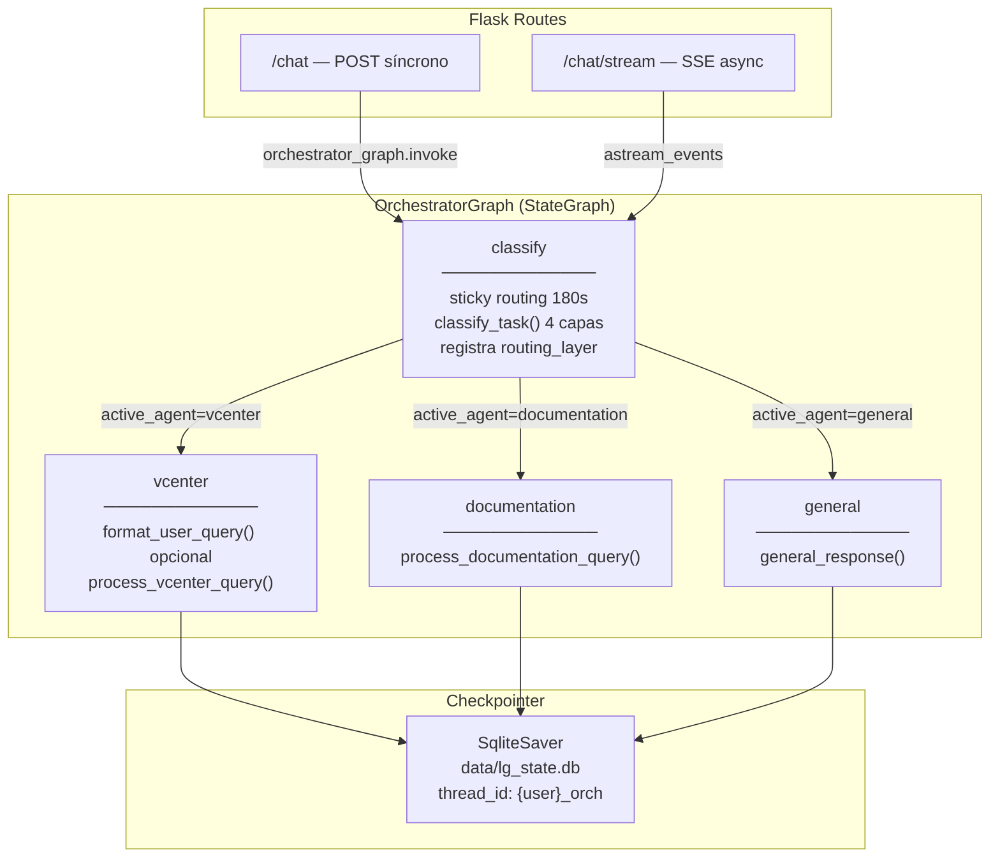

# Orquestador de Agentes

## Descripción General

El **Orquestador** (`main_agent.py` + `orchestrator_graph.py`) es el punto de entrada unificado del sistema multi-agente. Desde la versión 3.4, el routing está implementado como un **LangGraph `StateGraph`** con checkpointing SQLite, sustituyendo la lógica imperativa anterior.

Enruta consultas hacia tres agentes especializados:

- **Agente vCenter**: operaciones de infraestructura VMware (36 herramientas MCP)
- **Agente Documentación**: búsqueda en repositorio documental (RAG v2.4)
- **Agente General**: respuestas conversacionales directas sin herramientas

## Arquitectura del Grafo Supervisor (v3.4)



### Estado del grafo (`OrchestratorState`)

```python
class OrchestratorState(TypedDict):
    messages: Annotated[list, add_messages]  # historial conversacional
    username: str
    active_agent: str | None          # "vcenter" | "documentation" | "general"
    last_agent: str | None            # para sticky routing
    last_agent_time: float            # timestamp del último uso
    session_last_activity: float      # timestamp de actividad para expiración lógica (v3.7)
    routing_layer: str | None         # capa que decidió ("layer0"…"sticky")
    followup_detected: bool           # mensaje detectado como follow-up
    used_sticky_routing: bool         # sticky routing aplicado en este turno
    effective_message: str | None     # mensaje final al subagente (puede ser formateado)
```

### Nodos del grafo

| Nodo | Función | Comportamiento |
|------|---------|----------------|
| `classify` | Routing | Sticky routing (180s) → `classify_task()` 4 capas → actualiza `active_agent` y `routing_layer` |
| `vcenter` | Ejecución | Aplica formateador si `ENABLE_QUERY_FORMATTING=true`; invoca `process_vcenter_query()` |
| `documentation` | Ejecución | Invoca `process_documentation_query()` con mensaje original (sin formatear) |
| `general` | Ejecución | Invoca `general_response()` |

### Aristas condicionales

```
classify → route_to_agent() → {vcenter | documentation | general} → END
```

### Integración en Flask

```python
# Arranque (main_agent.py línea 524)
orchestrator_graph = build_orchestrator_graph(
    classify_task_fn=classify_task,
    get_classification_debug_fn=get_classification_debug,
    is_followup_message_fn=is_followup_message,
    process_vcenter_query_fn=process_vcenter_query,
    process_documentation_query_fn=process_documentation_query,
    general_response_fn=general_response,
    format_user_query_fn=format_user_query,
    agents_registry=AGENTS_REGISTRY,
    enable_formatting=ENABLE_FORMATTING,
    sticky_timeout=STICKY_ROUTING_TIMEOUT,
    checkpointer_path="data/lg_state.db",
)

# Invocación síncrona (/chat)
# last_agent y last_agent_time se recuperan automáticamente del checkpointer (thread_id)
config = {"configurable": {"thread_id": f"{username}_orch"}}
result = orchestrator_graph.invoke(
    {"messages": [HumanMessage(message)], "username": username},
    config
)

# Invocación async SSE (/chat/stream)
async with open_async_orchestrator_graph(**kwargs) as async_graph:
    async for event in async_graph.astream_events(input, config, version="v2"):
        ...
```

---

## Clasificador de 4 Capas (sin cambios en v3.4)

El clasificador `query_classifier.py` no se modifica — el grafo lo invoca como función pura.

### Layer 0: Exclusive Keywords

**Fuente**: `config/agents.yaml`

| Agente | Keywords Exclusivos |
|--------|-------------------|
| **documentation** | `manual`, `documentación`, `procedimiento`, `tutorial`, `cómo`, `instalar`, `configurar`, `explicar` |
| **vcenter** | `vm`, `datastore`, `snapshot`, `host`, `clonar`, `desplegar`, `encender`, `apagar`, `cpu`, `memoria` |

**Exit Rate**: ~40%

---

### Layer 1: Critical Regex Patterns

**Fuente**: `src/utils/query_classifier.py`

| Patrón | Agente | Ejemplo Match |
|--------|--------|---------------|
| `\b(?:despliega\|desplegar)\b.{0,30}\b(?:mcu\|vm)\b` | vcenter | "despliega una MCU en prod" |
| `\b(?:crea\|clona)\b.{0,30}\b(?:mcu\|snapshot)\b` | vcenter | "crea un snapshot de VM_01" |
| `\b(?:apaga\|enciende)\b.{0,50}\b(?:vm\|servidor)\b` | vcenter | "enciende la VM MCU_P04" |
| `\b(?:cómo\|como)\s+(?:se\s+)?(?:hago\|hacer)\b` | documentation | "cómo se configura DNS" |
| `\b(?:gtr\|build_dvds\|cantata)\b` | documentation | "cómo se ejecuta Cantata" |

**Exit Rate**: ~25% adicional (65% acumulado)

---

### Layer 2: Intent Detection

**Imperativo** → vcenter: `^(?:despliega|clona|crea|apaga|enciende|reinicia|lista|muestra)`

**Learning question** → documentation: `\b(?:cómo|como|qué es|por qué|explicame|cuéntame)`

**Exit Rate**: ~15% adicional (80% acumulado)

---

### Layer 3: Weighted Keyword Scoring

```python
score_vcenter = sum(weights[kw] for kw in vcenter_keywords_found)
score_doc = sum(weights[kw] for kw in doc_keywords_found)
if abs(score_vcenter - score_doc) >= MIN_DELTA:   # MIN_DELTA = 1.5
    return agente_con_mayor_score
```

**Exit Rate**: ~12% adicional (92% acumulado)

---

### Layer 4: LLM Fallback + Heuristic Safety Net

LLM (`gpt-oss:20b`, timeout 5s) → si falla → `heuristic_fallback()`.

**Exit Rate**: ~8% (100% total)

---

## Sticky Routing (Memoria Conversacional)

El nodo `classify` aplica sticky routing antes de invocar al clasificador:

```python
if (last_agent in {"vcenter", "documentation"}
        and is_followup_message(message)
        and time.time() - last_agent_time < 180):
    return {**state, "active_agent": last_agent, "routing_layer": "sticky"}
```

**Ventaja v3.4 vs anterior**: el sticky routing ahora es parte del estado del grafo, auditado en `routing_layer` y persistido en SQLite. En la implementación anterior era lógica suelta en un dict `ACTIVE_SESSIONS`.

---

## Mecanismos de Progreso SSE

Dos canales en `config["configurable"]` permiten al grafo emitir eventos en tiempo real sin acoplamiento al frontend:

| Canal | Tipo | Propósito |
|-------|------|-----------|
| `progress_callback` | `Callable[[str, str], None]` | Pasos de routing ("Analizando routing...", "Ruta seleccionada.", "Delegando a agente vCenter...") |
| `thinking_queue` | `queue.Queue` | Eventos de herramientas del subagente vCenter en tiempo real |

---

## Tabla de Decisión por Capa

| Capa | Método | Confianza | Exit Rate | Tiempo Promedio |
|------|--------|-----------|-----------|----------------|
| **Sticky** | Follow-up + last_agent < 180s | 🟢 Alta | Variable | <1ms |
| **L0** | Exclusive keywords (agents.yaml) | 🟢 Alta | ~40% | <1ms |
| **L1** | Critical regex patterns | 🟢 Muy Alta | ~25% | <2ms |
| **L2** | Intent detection | 🟡 Media | ~15% | <1ms |
| **L3** | Weighted scoring | 🟡 Media | ~12% | <2ms |
| **L4** | LLM fallback + heuristic | 🔴 Variable | ~8% | ~200ms |
| **TOTAL** | — | — | **100%** | **Promedio: ~15ms** |

---

## Dual-Model Optimization

### Formateador (Opcional)

**Variable**: `ENABLE_QUERY_FORMATTING=false` (deshabilitado por defecto)

Solo se aplica en el nodo `vcenter` — documentation y general reciben el mensaje original.

### Executor (Siempre Activo)

**Variable**: `ORCH_EXECUTOR_MODEL=gpt-oss:20b`

**num_ctx**: 8192 tokens

---

## Endpoints de Chat

### POST /chat (Síncrono)

```json
// Request
{"username": "jmartinb", "message": "¿Cuántas VMs hay en producción?"}

// Response
{"response": "Hay 12 VMs activas...", "agent": "vcenter"}
```

### POST /chat/stream (SSE)

```
event: routing   data: {"agent": "vcenter", "label": "Consultando agente vCenter..."}
event: heartbeat data: {"ts": 1234.5, "elapsed": 4.2}
event: token     data: {"t": "Hay ", "i": 0}
event: done      data: {"agent": "vcenter", "total_tokens": 47}
```

---

## Wikilinks Relacionados

- [[Arquitectura-Chat]] — Documentación original del chat SSE
- [[Flujo-Datos]] — Pipeline completo de procesamiento
- [[Agente-vCenter]] — Agente de infraestructura con 36 tools MCP
- [[Agente-Documentacion]] — Consultor RAG híbrido v2.4
- [[Clasificador-Queries]] — Detalle técnico del clasificador
- [[STICKY_ROUTING_IMPLEMENTATION]] — Implementación técnica del sticky routing

---

## Referencias de Código

| Archivo | Descripción |
|---------|-------------|
| `src/api/orchestrator_graph.py` | Grafo supervisor LangGraph (Fase 2) |
| `src/api/main_agent.py` línea 524 | Instanciación del grafo al arrancar |
| `src/api/main_agent.py` línea 1553 | Invocación síncrona `/chat` |
| `src/api/main_agent.py` línea 1565 | Invocación async SSE `/chat/stream` |
| `src/utils/query_classifier.py` | Sistema de clasificación 4-capas |
| `config/agents.yaml` | Registro de agentes y keywords |
| `unitary_test/test_orchestrator_graph.py` | 12 tests del grafo supervisor |

---

*Última actualización: 2026-05-11*
*Versión: 2.0*
