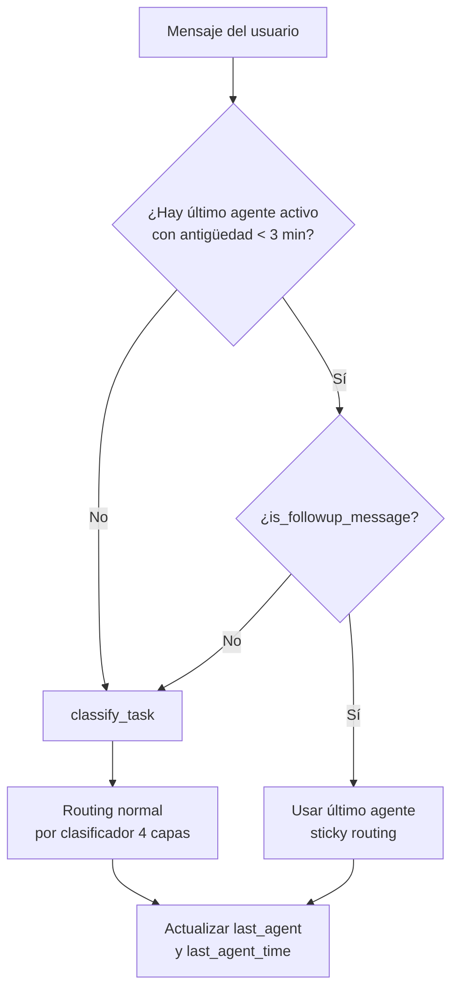

# Sticky Routing — Memoria Conversacional Multi-Nivel

## Problema Resuelto

**Situación anterior (sin sticky routing):**

```
Usuario  → "Busca máquinas obsoletas"
vCenter  → "¿Cuántos días de inactividad?"
Usuario  → "30 días"
Orquestador → Envía a agente "General"  ← ERROR: pierde el contexto
```

**Con sticky routing:**

```
Usuario  → "Busca máquinas obsoletas"
vCenter  → "¿Cuántos días de inactividad?"
Usuario  → "30 días"
Orquestador → Detecta seguimiento → Envía a vCenter  ← CORRECTO
```

---

## Arquitectura de la Solución

El sistema implementa dos niveles de memoria conversacional independientes y complementarios.

### Nivel 1: Memoria del Agente Individual

- Ya estaba implementado (arreglo previo con `{chat_history}`)
- Cada agente (vCenter, Documentación) mantiene su propio historial conversacional
- Funciona mediante `ConversationBufferMemory` de LangChain
- Aislamiento por usuario: cada usuario tiene su propia instancia de memoria

### Nivel 2: Memoria del Orquestador (Sticky Routing)

- Implementado como extensión del sistema de sesiones activas
- El orquestador recuerda qué agente usó el usuario recientemente
- Enruta automáticamente respuestas cortas o ambiguas al mismo agente
- Timeout configurable (actualmente 180 segundos)

---

## Componentes Implementados

### Extensión de `ACTIVE_SESSIONS`

Ubicación: `src/api/main_agent.py`

```python
ACTIVE_SESSIONS = {
    session_id: {
        'username': str,
        'created': float,
        'last_activity': float,
        'last_agent': str,          # 'vcenter' | 'documentation' | None
        'last_agent_time': float    # timestamp del último uso
    }
}

STICKY_ROUTING_TIMEOUT = 180  # 3 minutos para responder
```

Los dos campos nuevos (`last_agent` y `last_agent_time`) se inicializan a `None` y `0.0` respectivamente al crear cada sesión.

### Detector de Mensajes de Seguimiento

**Función:** `is_followup_message(message: str) -> bool`

Aplica heurísticas para detectar si un mensaje es una respuesta de seguimiento a una pregunta anterior del agente, o si es una consulta nueva independiente.

| Patrón | Ejemplo | Resultado |
|--------|---------|-----------|
| Respuestas cortas (4 palabras o menos) | "30 días", "datastore_35" | Seguimiento |
| Valores numéricos puros | "30", "172.30.188.135" | Seguimiento |
| Nombres técnicos con guion bajo o punto | "datastore_prod", "esxi-host-01" | Seguimiento |
| Afirmaciones simples | "sí", "ok", "vale", "claro" | Seguimiento |
| Sin verbo de acción (entre 5 y 15 palabras) | "el datastore principal" | Seguimiento |
| Contiene verbo de acción explícito | "crea una VM" | Nueva consulta |

### Funciones de Sticky Routing

```python
get_sticky_agent(session_id: str) -> str | None
    # Devuelve el último agente si no expiró (< 3 min), None en caso contrario

update_sticky_agent(session_id: str, agent: str) -> None
    # Actualiza last_agent y last_agent_time en ACTIVE_SESSIONS
```

Ambas funciones se aplican en los dos endpoints de chat:
- `/chat/stream` (SSE, endpoint principal)
- `/chat` (fallback legacy)

---

## Flujo de Decisión



---

## Casos de Uso Soportados

### Caso 1: Parámetros Faltantes (vCenter)

```
Usuario  → "Busca máquinas obsoletas"
vCenter  → "¿Cuántos días de inactividad?"
Usuario  → "30 días"   [sticky routing → vCenter]
vCenter  → Ejecuta get_obsolete_vms_tool(threshold=30)
```

### Caso 2: Preguntas de Seguimiento (Documentación)

```
Usuario  → "Cómo se configura DNS?"
Docs     → [Explica configuración DNS genérica]
Usuario  → "y en Ubuntu?"   [sticky routing → Documentación]
Docs     → Busca específicamente en docs de Ubuntu
```

### Caso 3: Valores Técnicos (vCenter)

```
Usuario  → "Crea una VM en el host 172.30.188.135"
vCenter  → "Error: Falta datastore. ¿En cuál?"
Usuario  → "datastore_35"   [sticky routing → vCenter]
vCenter  → Completa la creación con datastore_35
```

### Caso 4: Timeout Expirado (más de 3 minutos)

```
Usuario  → "Lista VMs"   → vCenter responde
[4 minutos de inactividad]
Usuario  → "lista docs"
Sistema  → Sticky expirado → classify_task() → Documentación
```

---

## Logging y Auditoría

### Eventos de Auditoría

```python
# Cuando se aplica sticky routing
audit_logger.audit("message_sticky_routing",
    user=username,
    target=target,
    message=message[:120],
    reason="followup_detected"
)

# Routing normal (sin sticky)
audit_logger.audit("message_routing",
    user=username,
    target=target,
    message=message[:120]
)
```

### Mensajes en Consola

```
[INFO]  Sticky routing aplicado: '30 días' → vcenter (último agente usado)
[DEBUG] Sticky routing actualizado: vcenter para sesión a4f8b1e2...
```

Los logs de auditoría distinguen explícitamente entre routing normal (`message_routing`) y routing por sticky (`message_sticky_routing`), lo que permite medir la frecuencia de uso de esta funcionalidad.

---

## Archivos Modificados

| Archivo | Cambio |
|---------|--------|
| `src/core/agent.py` | Añadido `{chat_history}` en prompt del agente vCenter |
| `src/core/doc_consultant.py` | Añadido `{chat_history}` en prompt del agente de documentación |
| `src/api/main_agent.py` (L112-L116) | Extensión de `ACTIVE_SESSIONS` con campos `last_agent` y `last_agent_time` |
| `src/api/main_agent.py` (L148-L232) | Nuevas funciones `is_followup_message`, `get_sticky_agent`, `update_sticky_agent` |
| `src/api/main_agent.py` (L486-L492) | Inicialización de sesión con los nuevos campos |
| `src/api/main_agent.py` (L1118-L1130) | Aplicación del sticky routing en `/chat/stream` |
| `src/api/main_agent.py` (L1171-L1183) | Aplicación del sticky routing en `/chat` |

---

## Beneficios

| Beneficio | Impacto |
|-----------|---------|
| UX natural | El usuario puede responder directamente sin repetir el contexto de la conversación |
| Menos mensajes | Reduce entre 1 y 2 mensajes por conversación compleja |
| Robustez | Maneja casos donde el clasificador fallaría (por ejemplo, el mensaje "30") |
| Auditable | Los logs distinguen entre routing normal y sticky routing |
| Timeout inteligente | 3 minutos balancea contexto conversacional frente a confusión en cambios de tema |

---

## Consideraciones de Seguridad

- El sticky routing usa el `session_id` de Flask, que es seguro y está firmado criptográficamente
- Solo se rastrean agentes reales (`vcenter`, `documentation`); el agente `general` no se guarda como sticky
- El timeout de 3 minutos evita que un routing incorrecto persista indefinidamente en conversaciones largas
- Los logs de auditoría marcan explícitamente cada vez que se aplica sticky routing, facilitando la detección de anomalías

---

## Pruebas Sugeridas

### Test Manual 1: Completar Parámetros

```
1. Enviar: "Busca en vcenter máquinas obsoletas"
   Esperado: "¿Cuántos días de inactividad?"
2. Enviar: "30"
   Esperado: Ejecuta búsqueda con threshold=30 (no va a agente general)
```

### Test Manual 2: Seguimiento Documentación

```
1. Enviar: "Cómo se instala DNS server?"
   Esperado: Respuesta del agente de documentación
2. Enviar: "pasos detallados"
   Esperado: El agente de documentación profundiza (no redirige a general)
```

### Test Manual 3: Timeout

```
1. Enviar: "Lista VMs"  →  vCenter responde
2. Esperar 4 minutos (supera los 180s de timeout)
3. Enviar: "busca documentación de GTR"
   Esperado: Va a Documentación (sticky expiró correctamente)
```

### Test Unitario Sugerido

```python
# tests/test_sticky_routing.py

def test_is_followup_short_number():
    assert is_followup_message("30") == True
    assert is_followup_message("30 días") == True

def test_is_followup_technical():
    assert is_followup_message("datastore_35") == True
    assert is_followup_message("172.30.188.135") == True

def test_is_not_followup_action():
    assert is_followup_message("crea una VM nueva") == False
    assert is_followup_message("lista las máquinas virtuales") == False

def test_sticky_timeout():
    # Mock de sesión con last_agent_time de hace 200 segundos
    # get_sticky_agent() debe devolver None
    pass
```

---

## Cómo Probar

```powershell
# 1. Reiniciar la aplicación
cd vcenter_agent_system
python run.py

# 2. Hacer login en http://localhost:5000

# 3. Probar el escenario principal:
#    Usuario: "Busca en vcenter máquinas obsoletas"
#    Sistema: [vcenter] "¿Cuántos días de inactividad considerar obsoleto?"
#    Usuario: "30 días"
#    Sistema: [vcenter] "Encontradas 3 VMs obsoletas: ..."

# 4. Verificar logs de auditoría
Get-Content logs/audit/audit.log -Wait -Tail 20
# Buscar eventos: "message_sticky_routing"
```

---

## Próximos Pasos (Opcionales)

1. **Tests automatizados** — Crear `tests/test_sticky_routing.py` con los casos descritos arriba
2. **Métricas** — Añadir contador de sticky routing hits vs. misses en el dashboard de estadísticas
3. **Indicador en UI** — Mostrar en la interfaz cuál fue el último agente usado
4. **Ajuste de timeout** — Experimentar con 120s o 240s según patrones de uso real
5. **Feedback explícito** — Mostrar al usuario "Interpretando como respuesta al agente vCenter..."

---

**Estado:** Implementado y listo para pruebas
**Compatibilidad:** Requiere reinicio de `run.py` tras aplicar los cambios
