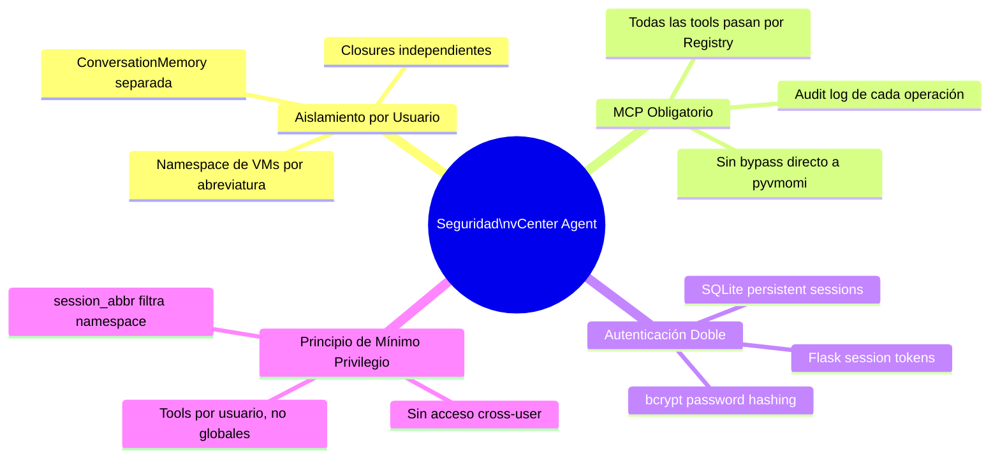
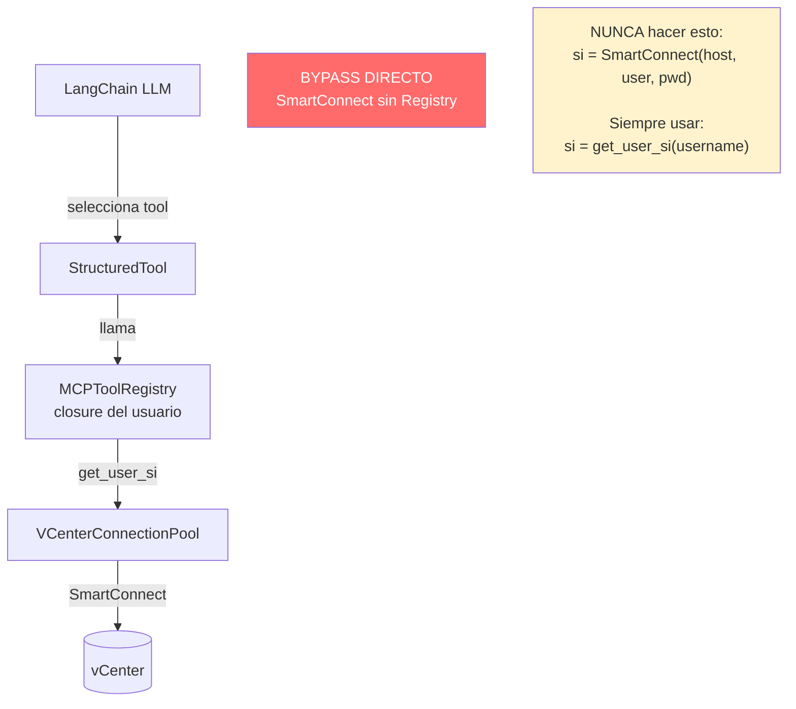
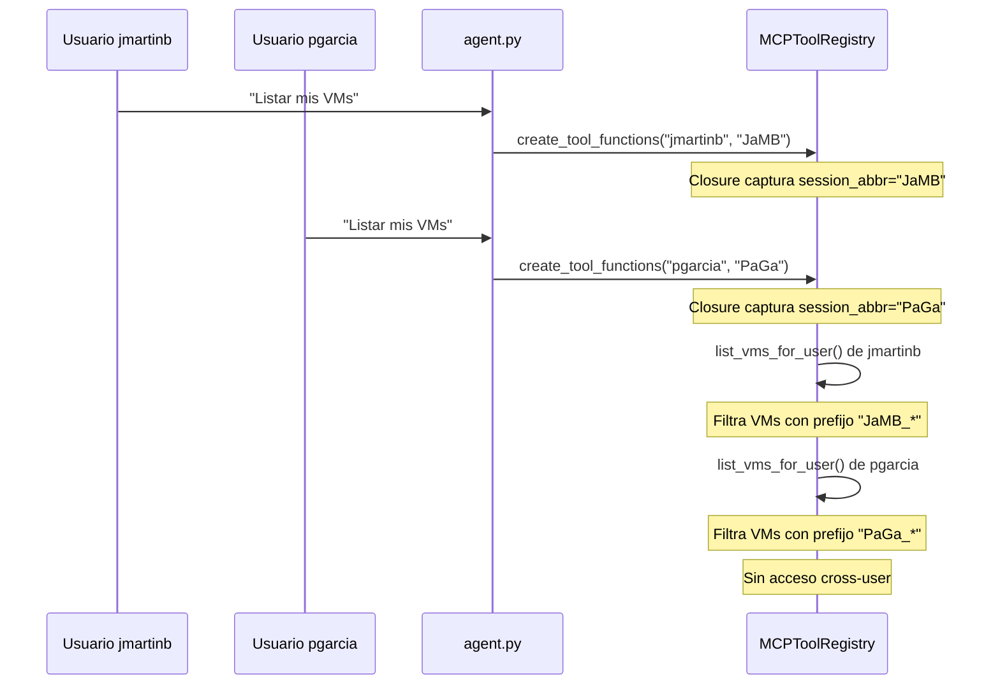
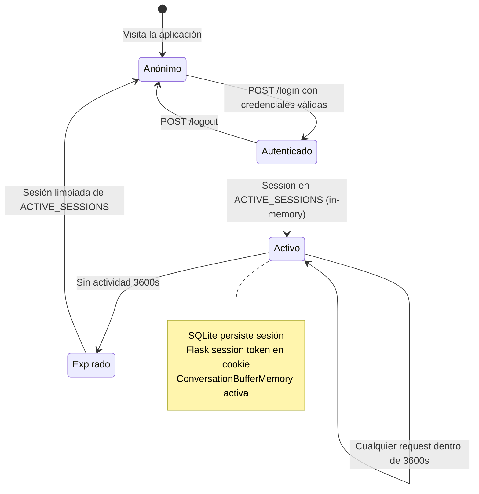
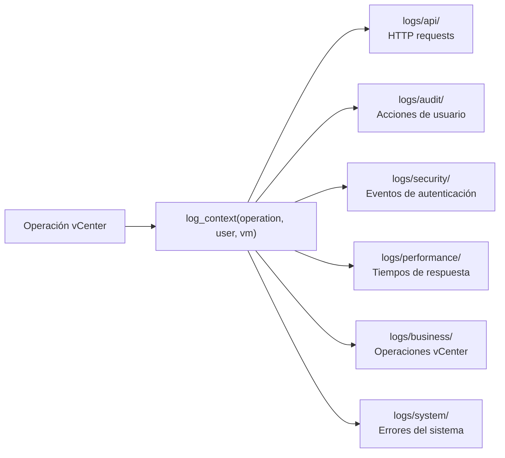
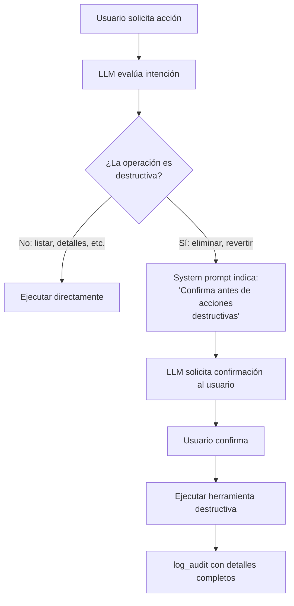
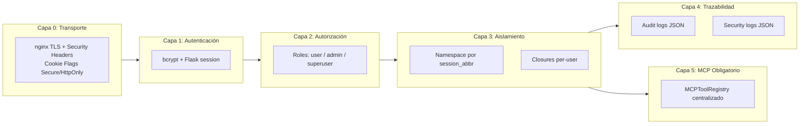

# Modelo de Seguridad del Agente vCenter

Documentación del sistema de aislamiento por usuario, patrón MCP obligatorio y controles de seguridad del sistema multi-agente.

---

## Seguridad de Transporte (HTTPS / nginx)

El sistema utiliza **nginx como proxy inverso SSL** delante de Flask. Flask escucha únicamente en `127.0.0.1:5001` (inaccesible desde la red); nginx gestiona TLS en el puerto 5000.

```
Usuarios ── https://host:5000 ──► nginx:5000 (TLSv1.2+)
                                       │
                              proxy_pass ↓
                                       │
                            Flask:5001 (127.0.0.1 — no expuesto)
```

### Configuraciones nginx

| Plataforma | Archivo |
|------------|---------|
| Windows | `vcenter_agent_system/nginx/nginx_windows.conf` |
| Ubuntu | `vcenter_agent_system/nginx/nginx_ubuntu.conf` |

### Security Headers (`@app.after_request`)

Aplicados en todas las respuestas Flask desde `src/api/main_agent.py`:

| Header | Valor | Propósito |
|--------|-------|-----------|
| `Strict-Transport-Security` | `max-age=31536000; includeSubDomains` | Fuerza HTTPS (HSTS) |
| `X-Content-Type-Options` | `nosniff` | Evita MIME sniffing |
| `X-Frame-Options` | `DENY` | Anti-clickjacking |
| `X-XSS-Protection` | `1; mode=block` | Protección XSS legacy |
| `Content-Security-Policy` | `default-src 'self'; ...` | Restricción de recursos |

### Session Cookie Flags

```python
app.config.update(
    SESSION_COOKIE_SECURE=True,      # Solo por HTTPS
    SESSION_COOKIE_HTTPONLY=True,    # Inaccesible desde JS
    SESSION_COOKIE_SAMESITE='Strict', # Protección CSRF
    PREFERRED_URL_SCHEME='https',
)
```

---

## Principios de Seguridad



---

## Patrón MCP Obligatorio

**Todos los accesos a vCenter deben pasar obligatoriamente por `MCPToolRegistry`.** No existe ninguna excepción a esta regla.



### Por qué es obligatorio

| Riesgo sin MCP Registry | Consecuencia |
|------------------------|--------------|
| LLM invoca SmartConnect con credenciales hardcoded | Exposición de credenciales en logs |
| Tool ejecuta operación en nombre de otro usuario | Violación de aislamiento por usuario |
| Sin audit log | Sin trazabilidad de operaciones |
| Sin filtro de namespace | Un usuario podría ver/modificar VMs de otros |

---

## Aislamiento por Usuario

Cada usuario opera dentro de su propio namespace de VMs, determinado por su `session_abbr`. El filtro se aplica en el closure de `MCPToolRegistry` y no puede ser modificado ni por el LLM ni por el usuario.



### Mapeo Usuario → Abreviatura

El archivo `config/user_mapping.json` mapea cada usuario a su abreviatura de namespace:

```json
{
  "jmartinb": "JaMB",
  "pgarcia":  "PaGa",
  "admin":    "ADM"
}
```

Las VMs creadas para un usuario siempre tienen el prefijo de su abreviatura. El filtro se aplica en el closure, no puede ser modificado por el LLM.

---

## Sistema de Autenticación Dual

El sistema emplea dos mecanismos de sesión complementarios: uno en memoria para velocidad y otro persistente en SQLite para resiliencia ante reinicios.

```mermaid
flowchart TD
    subgraph Entrada["Autenticación de Entrada"]
        LOGIN[POST /login] --> BCRYPT{bcrypt.checkpw\npassword vs hash}
        BCRYPT -->|Válido| FLASK_SESSION[Flask session token\nIn-memory 3600s]
        BCRYPT -->|Inválido| DENY[401 Unauthorized]
        FLASK_SESSION --> SQLITE_SESSION[SQLite session\ndata/users.db\nPersistente]
    end

    subgraph Middleware["Middleware de Protección"]
        ROUTE[Ruta protegida] --> DECORATOR[@authenticated_action]
        DECORATOR --> CHECK{session en\nACTIVE_SESSIONS?}
        CHECK -->|Sí| ALLOW[Continuar]
        CHECK -->|No| REDIRECT[Redirigir a /login]
    end

    subgraph Roles["Control de Roles"]
        ADMIN[@admin_required] --> ROLE_CHECK{role == admin\no superuser?}
        SUPERUSER[@superuser_required] --> SU_CHECK{role == superuser?}
        ROLE_CHECK -->|No| FORBIDDEN[403 Forbidden]
        SU_CHECK -->|No| FORBIDDEN
    end
```

### Roles de usuario

| Rol | Permisos |
|-----|----------|
| `user` | Operaciones sobre sus propias VMs (namespace propio) |
| `admin` | Gestión de usuarios, acceso al panel de administración |
| `superuser` | Acceso completo, incluyendo operaciones cross-user |

### Decoradores de Seguridad

```python
from src.utils.context_middleware import authenticated_action, security_sensitive
from src.auth.decorators import admin_required, superuser_required

@app.route('/api/sensitive', methods=['POST'])
@authenticated_action      # Verifica sesión activa en ACTIVE_SESSIONS
@security_sensitive        # Registra en logs/security/
def sensitive_endpoint():
    username = session['username']
    ...

@app.route('/admin/users', methods=['POST'])
@admin_required            # Solo admin o superuser
def admin_endpoint():
    ...

@app.route('/admin/superuser-action', methods=['POST'])
@superuser_required        # Solo superuser
def superuser_endpoint():
    ...
```

---

## Flujo de Sesiones



---

## Logging de Seguridad y Auditoría

Todas las operaciones de seguridad se registran en logs estructurados JSON categorizados. **Nunca usar `print()`.**



### Ejemplo de log de auditoría

```json
{
  "timestamp": "2026-03-12T10:30:00Z",
  "level": "INFO",
  "category": "audit",
  "operation": "delete_vms",
  "user": "jmartinb",
  "session_abbr": "JaMB",
  "vms_deleted": ["JaMB_MCU_01", "JaMB_EqSIM_01"],
  "duration_ms": 4523
}
```

---

## Herramientas Destructivas — Controles

Existen 8 herramientas cuyas acciones son irreversibles o de alto impacto. El sistema prompt del agente indica al LLM que debe solicitar confirmación explícita antes de ejecutarlas.



### Tabla de herramientas destructivas

| Herramienta | Acción irreversible |
|-------------|---------------------|
| `delete_vms_tool` | Elimina VMs permanentemente |
| `revert_snapshot_tool` | Pierde estado actual de la VM |
| `delete_snapshot_tool` | Elimina snapshot permanentemente |
| `reconfigure_vm_tool` | Modifica hardware de la VM |
| `change_vm_network_tool` | Cambia VLAN (puede perder conectividad) |
| `remove_vm_nic_tool` | Elimina adaptador de red |
| `power_operations_tool` | Apagar puede corromper datos sin shutdown |
| `deploy_dev_env` | Consume recursos de vCenter |

---

## Anti-Patrones Prohibidos

### Nunca crear conexiones directas a vCenter

```python
# MAL: bypasea el pool y los controles de seguridad
from pyVim.connect import SmartConnect
si = SmartConnect(host="vcenter", user="admin", pwd="secret")
```

```python
# BIEN: usa el connection pool con aislamiento por usuario
si = self.get_user_si(username)  # En MCPToolRegistry
```

### Nunca usar print() para logging

```python
# MAL: no queda en logs estructurados
print(f"Eliminando VM {vm_name}")
```

```python
# BIEN: queda en audit log con contexto completo
logger.log_business_operation("vm_delete", {"vm": vm_name, "user": username})
```

### Nunca exponer credenciales en respuestas

```python
# MAL: el LLM podría incluir esto en la respuesta al usuario
return f"Conectado a {host} con usuario {user} y contraseña {pwd}"
```

```python
# BIEN: solo retornar información operacional
return f"Conectado exitosamente a vCenter ({host})"
```

---

## Resumen del Modelo de Seguridad — 6 Capas



| Capa | Mecanismo | Archivo clave |
|------|-----------|---------------|
| 0 - Transporte | nginx TLS (TLSv1.2+), security headers, cookie flags | `nginx/nginx_windows.conf`, `nginx/nginx_ubuntu.conf`, `src/api/main_agent.py` |
| 1 - Autenticación | bcrypt + Flask session (3600s) + SQLite | `src/auth/auth_service.py`, `src/auth/database.py` |
| 2 - Autorización | Roles user/admin/superuser + decoradores | `src/auth/decorators.py`, `src/auth/user_manager.py` |
| 3 - Aislamiento | Namespace `session_abbr`, closures per-user | `server/mcp_tool_registry.py`, `config/user_mapping.json` |
| 4 - Trazabilidad | Logs JSON por categoría (audit, security) | `src/utils/structured_logger.py` |
| 5 - MCP Obligatorio | Todas las tools pasan por MCPToolRegistry | `server/mcp_tool_registry.py`, `server/mcp_tool_wrappers.py` |

---

## Enlaces relacionados

- [[Autenticacion]] — Sistema de autenticación y gestión de sesiones
- [[Sistema-MCP]] — Arquitectura MCP y tool registry centralizado
- [[Herramientas-MCP]] — Catálogo completo de las 36 herramientas vCenter
- [[Connection-Pool]] — Pool de conexiones VCenterConnectionPool
- [[Structured-Logging]] — Framework de logging estructurado JSON
