# Sistema MCP — Model Context Protocol

Capa de seguridad y herramientas para el Agente vCenter. Centraliza las 36 herramientas MCP que actúan como intermediario obligatorio entre el LLM (razonamiento) y pyvmomi (ejecución VMware).

## Arquitectura del Sistema

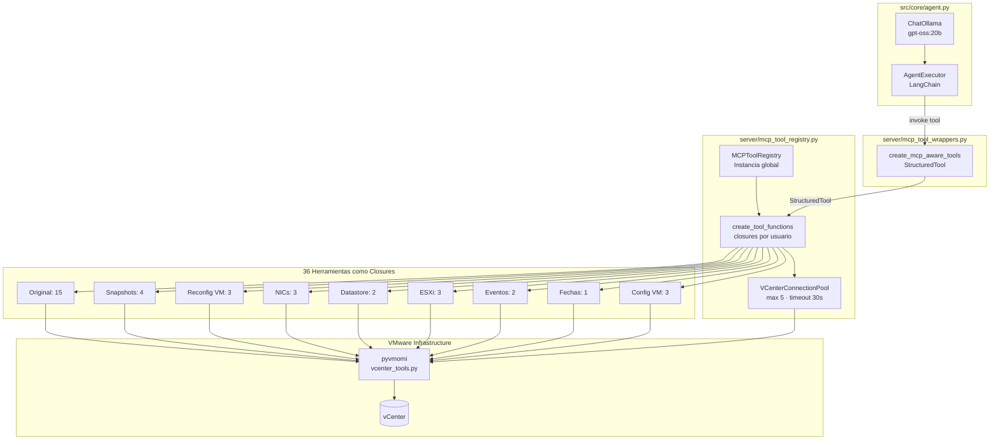

## Flujo de una Petición

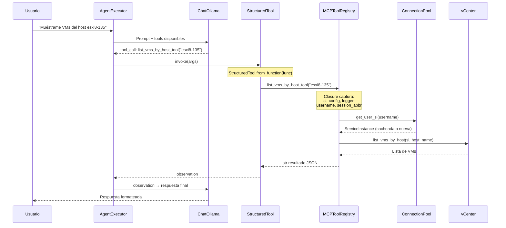

## Catálogo Completo de 36 Herramientas

### Mapa Visual por Grupos

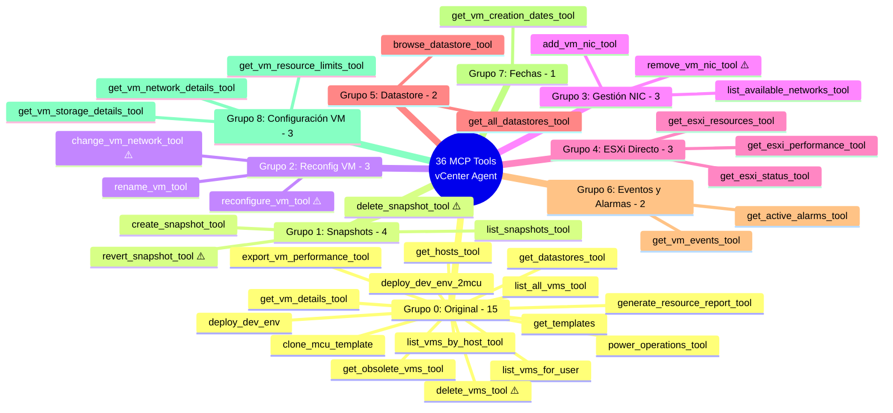

### Tabla Detallada por Grupo

#### Grupo 0 — Original (15 tools)

| # | Nombre | Parámetros | Descripción | Destructiva |
|---|--------|-----------|-------------|:-----------:|
| 1 | `get_templates` | — | Lista plantillas VM disponibles | No |
| 2 | `get_hosts_tool` | — | Hosts ESXi con CPU/memoria | No |
| 3 | `get_datastores_tool` | — | Datastores con capacidad | No |
| 4 | `deploy_dev_env` | `username_`, `mcu_template`, `eqsim_template` | Despliegue entorno desarrollo (1 MCU + 1 EqSim) | No |
| 5 | `deploy_dev_env_2mcu` | `username_`, `mcu_template`, `eqsim_template` | Despliegue entorno desarrollo (2 MCU + 1 EqSim) | No |
| 6 | `list_vms_for_user` | `username_=None` | VMs del usuario actual (filtro por session_abbr) | No |
| 7 | `delete_vms_tool` | `vm_names: list[str]` | **Elimina VMs permanentemente** | **Sí** |
| 8 | `clone_mcu_template` | `username_`, `template_name`, `count`, `host_name`, `datastore_name` | Clona plantilla N veces | No |
| 9 | `list_vms_by_host_tool` | `host_name: str` | VMs en un host específico | No |
| 10 | `list_all_vms_tool` | — | TODAS las VMs del vCenter (admin) | No |
| 11 | `generate_resource_report_tool` | `vm_name=None` | Genera ZIP con reporte recursos | No |
| 12 | `get_obsolete_vms_tool` | `days_threshold=30` | VMs inactivas por N días | No |
| 13 | `export_vm_performance_tool` | `vm_name: str` | Exporta CSV con métricas rendimiento | No |
| 14 | `power_operations_tool` | `vm_names`, `operation` | Operaciones energía (poweron/poweroff/suspend/reset) | No |
| 15 | `get_vm_details_tool` | `vm_names` | Detalles CPU/RAM/estado/red | No |

**Operaciones power_operations_tool:**
- `poweron` / `power_on`: Enciende VM
- `poweroff` / `power_off`: Apaga VM (forzado)
- `shutdown_guest`: Apagado graceful vía VMware Tools
- `suspend`: Suspende VM
- `reset`: Reinicia VM (forzado)

#### Grupo 1 — Snapshots (4 tools)

| # | Nombre | Parámetros | Descripción | Destructiva |
|---|--------|-----------|-------------|:-----------:|
| 16 | `create_snapshot_tool` | `vm_name`, `snapshot_name`, `description` | Crea snapshot de VM | No |
| 17 | `list_snapshots_tool` | `vm_name` | Lista snapshots con fechas | No |
| 18 | `revert_snapshot_tool` | `vm_name`, `snapshot_name` | **Revierte VM a snapshot anterior** | **Sí** |
| 19 | `delete_snapshot_tool` | `vm_name`, `snapshot_name` | **Elimina snapshot permanentemente** | **Sí** |

**Ciclo de vida:**
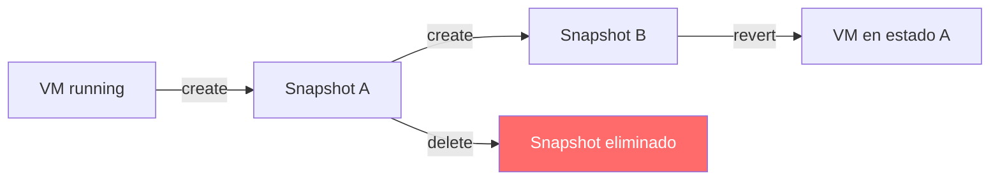

#### Grupo 2 — Reconfiguración VM (3 tools)

| # | Nombre | Parámetros | Descripción | Destructiva |
|---|--------|-----------|-------------|:-----------:|
| 20 | `reconfigure_vm_tool` | `vm_name`, `cpu_count`, `memory_mb`, `cores_per_socket` | **Modifica CPU/RAM (requiere VM apagada)** | **Sí** |
| 21 | `rename_vm_tool` | `vm_name`, `new_name` | Renombra VM | No |
| 22 | `change_vm_network_tool` | `vm_name`, `interface_index`, `network_name` | **Cambia NIC a otra red/VLAN** | **Sí** |

> **Nota:** `reconfigure_vm_tool` requiere VM **apagada** antes de modificar CPU o RAM.

#### Grupo 3 — Gestión NIC (3 tools)

| # | Nombre | Parámetros | Descripción | Destructiva |
|---|--------|-----------|-------------|:-----------:|
| 23 | `add_vm_nic_tool` | `vm_name`, `network_name`, `adapter_type="vmxnet3"` | Añade NIC a VM | No |
| 24 | `remove_vm_nic_tool` | `vm_name`, `interface_index` | **Elimina NIC de VM** | **Sí** |
| 25 | `list_available_networks_tool` | — | VLANs y portgroups disponibles | No |

#### Grupo 4 — ESXi Directo (3 tools)

| # | Nombre | Parámetros | Descripción | Destructiva |
|---|--------|-----------|-------------|:-----------:|
| 26 | `get_esxi_status_tool` | `host_id` | Estado general del host ESXi | No |
| 27 | `get_esxi_resources_tool` | `host_id` | CPU/memoria/datastores/VMs | No |
| 28 | `get_esxi_performance_tool` | `host_id` | Métricas en tiempo real | No |

**Métricas ESXi disponibles:**
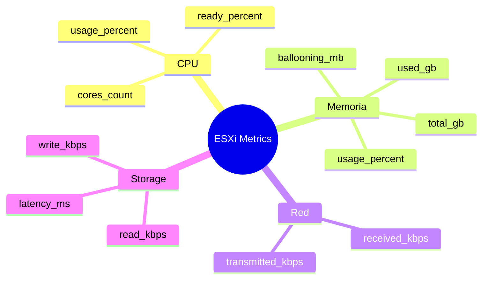

#### Grupo 5 — Datastore (2 tools)

| # | Nombre | Parámetros | Descripción | Destructiva |
|---|--------|-----------|-------------|:-----------:|
| 29 | `browse_datastore_tool` | `datastore_name`, `path="/"` | Lista archivos/carpetas en datastore | No |
| 30 | `get_all_datastores_tool` | — | Info completa todos los datastores | No |

#### Grupo 6 — Eventos y Alarmas (2 tools)

| # | Nombre | Parámetros | Descripción | Destructiva |
|---|--------|-----------|-------------|:-----------:|
| 31 | `get_vm_events_tool` | `vm_name`, `max_events=20` | Historial eventos de VM | No |
| 32 | `get_active_alarms_tool` | — | Alarmas críticas y advertencias | No |

#### Grupo 7 — Fechas (1 tool)

| # | Nombre | Parámetros | Descripción | Destructiva |
|---|--------|-----------|-------------|:-----------:|
| 33 | `get_vm_creation_dates_tool` | `vm_names: str` (CSV) | Fechas de creación VMs | No |

#### Grupo 8 — Configuración detallada de VM (3 tools)

| # | Nombre | Parámetros | Descripción | Destructiva |
|---|--------|-----------|-------------|:-----------:|
| 34 | `get_vm_network_details_tool` | `vm_name` | VLAN/MAC/portgroup/vSwitch/DVS de la VM | No |
| 35 | `get_vm_resource_limits_tool` | `vm_name` | Reservas/límites/shares/hot-add/topología CPU | No |
| 36 | `get_vm_storage_details_tool` | `vm_name` | VMDKs, provisioning (thin/thick) y controladores | No |

### Herramientas de riesgo (selección)

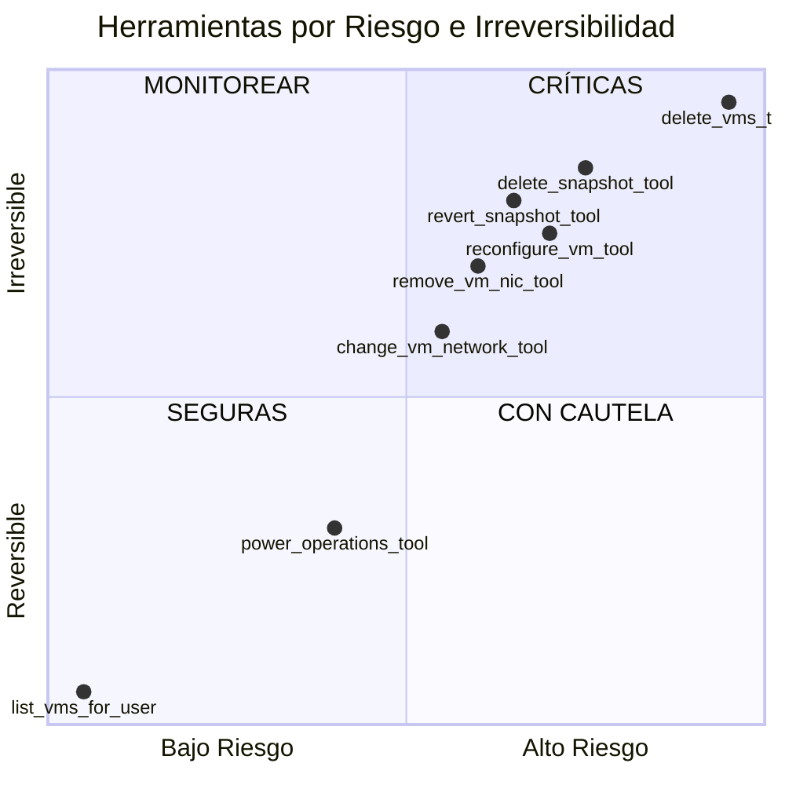

**Operaciones de riesgo (deben advertir al usuario y/o pedir confirmación según aplique):**
1. `delete_vms_tool` — Eliminación permanente de VMs
2. `delete_snapshot_tool` — Eliminación permanente de snapshots
3. `revert_snapshot_tool` — Pérdida de cambios posteriores
4. `reconfigure_vm_tool` — Cambios hardware permanentes
5. `remove_vm_nic_tool` — Pérdida de conectividad
6. `change_vm_network_tool` — Cambio de red/VLAN

## Connection Pool y Aislamiento por Usuario

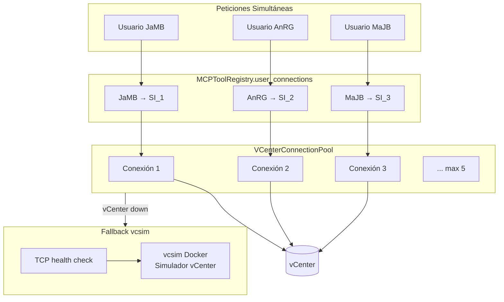

**Reglas del pool:**
- **Max conexiones:** 5 simultáneas
- **Timeout:** 30 segundos
- **Caché por usuario:** Una `ServiceInstance` por usuario, reutilizada
- **Fallback:** vcsim Docker si vCenter inaccesible

### Por qué Closures

Cada llamada a `create_tool_functions(username, session_abbr)` genera 36 funciones donde `username` y `session_abbr` están **capturados en el closure**:

```python
def create_tool_functions(self, username: str, session_abbr: str):
    si = self.get_user_si(username)  # Conexión del usuario
    config = self.config

    def list_vms_for_user(username_: str = None) -> str:
        """Lista VMs del usuario actual."""
        # username y session_abbr capturados del scope externo
        return get_vms_for_user(si, session_abbr)  # si viene del closure
    
    return {'list_vms_for_user': list_vms_for_user, ...}
```

**Garantiza:**
- Cada usuario opera en su propio namespace de VMs
- Imposible inyectar otro `username` desde el LLM
- Conexiones aisladas por usuario

## Patrón de Seguridad MCP-Only

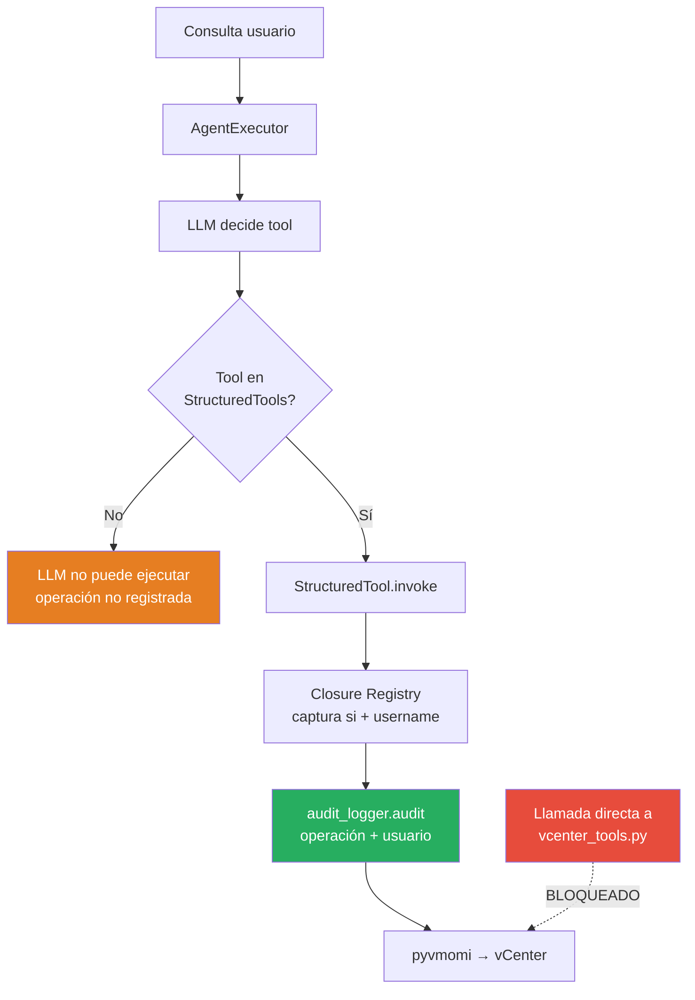

### ¿Por qué no llamar directamente a vcenter_tools.py?

**Sin MCP Registry:**
- ❌ Sin trazabilidad de quién ejecutó qué
- ❌ Conexiones `si` reutilizadas entre usuarios sin control
- ❌ Sin normalización de usuario (`normalize_to_abbr`)
- ❌ Operaciones críticas sin auditoría

**Con MCP Registry:**
- ✅ Toda operación lleva `username` en logging
- ✅ Conexiones del pool centralizado con límite
- ✅ Operaciones críticas en `audit.log`
- ✅ Imposible ejecutar sin closure controlado

## Añadir Nueva Herramienta (Patrón 3 Pasos)

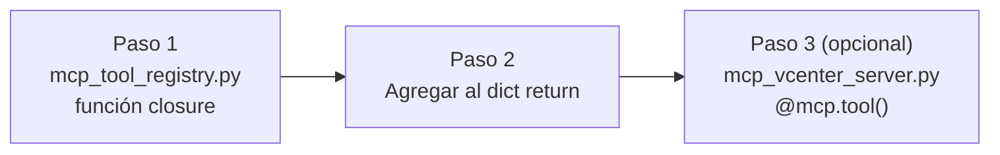

### Paso 1 — Función closure en Registry

```python
# Dentro de MCPToolRegistry.create_tool_functions(username, session_abbr):

def mi_nueva_herramienta(vm_name: str, parametro: int = 10) -> str:
    """
    Descripción clara para el LLM — se usa como doc de la herramienta.
    
    USA esta herramienta cuando el usuario pida [casos de uso específicos].
    
    Parámetros:
    - vm_name: Nombre de la VM
    - parametro: Descripción del parámetro (default: 10)
    """
    try:
        with log_context(operation="mi_nueva_herramienta", user=username, vm=vm_name):
            # si, config, logger, username capturados del closure
            result = mi_funcion_vcenter(si, vm_name, parametro, config)
            logger.log_business_operation(
                "nueva_herramienta_ejecutada",
                {"vm": vm_name, "param": parametro}
            )
            return f"Operación exitosa: {result}"
    except Exception as e:
        logger.log_system_error("mi_nueva_herramienta", str(e))
        return f"Error: {str(e)}"
```

**Reglas:**
- `si`, `config`, `logger`, `username`, `session_abbr` vienen del closure
- `__doc__` debe ser explícita con casos de uso → LLM la usa para decidir
- **Type hints obligatorios** → StructuredTool infiere JSON Schema
- Usar `log_context` y `log_business_operation` para auditoría

### Paso 2 — Registrar en dict de retorno

```python
# Al final de create_tool_functions():
return {
    # ... herramientas existentes ...
    'mi_nueva_herramienta': mi_nueva_herramienta,  # ← añadir aquí
}
```

### Paso 3 — Servidor FastMCP (opcional)

Solo si necesitas exponer la herramienta a clientes MCP externos (Claude Desktop, etc.):

```python
# En server/mcp_vcenter_server.py:
@mcp.tool()
def mi_nueva_herramienta(username: str, vm_name: str, parametro: int = 10) -> str:
    """Descripción para servidor MCP externo."""
    si = get_user_si(username)
    return str(mi_funcion_vcenter(si, vm_name, parametro, config, logger, username))
```

### Flujo interno de una tool

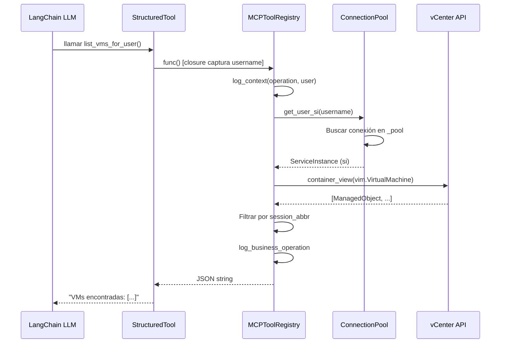

## Código Ejemplo: create_snapshot_tool

```python
# En MCPToolRegistry.create_tool_functions():

def create_snapshot_tool(vm_name: str, snapshot_name: str, description: str = "") -> str:
    """
    Crea un snapshot de una máquina virtual.
    
    USA esta herramienta cuando el usuario quiera:
    - Crear un punto de restauración antes de cambios
    - Guardar el estado actual de una VM
    - Hacer backup temporal antes de pruebas
    
    Parámetros:
    - vm_name: Nombre de la VM
    - snapshot_name: Nombre descriptivo del snapshot
    - description: Descripción opcional del snapshot
    """
    try:
        with log_context(operation="create_snapshot", user=username, vm=vm_name):
            si = self.get_user_si(username)  # Del pool
            
            # Buscar VM
            vm = find_vm_by_name(si, vm_name)
            if not vm:
                return f"Error: VM '{vm_name}' no encontrada"
            
            # Crear snapshot (pyvmomi)
            task = vm.CreateSnapshot_Task(
                name=snapshot_name,
                description=description,
                memory=False,
                quiesce=False
            )
            wait_for_task(task)
            
            logger.log_business_operation(
                "snapshot_created",
                {"vm": vm_name, "snapshot": snapshot_name}
            )
            return f"Snapshot '{snapshot_name}' creado exitosamente en VM '{vm_name}'"
            
    except Exception as e:
        logger.log_system_error("create_snapshot_tool", str(e), {"vm": vm_name})
        return f"Error creando snapshot: {str(e)}"
```

## Componentes del Sistema

| Archivo | Responsabilidad |
|---------|----------------|
| `server/mcp_tool_registry.py` | **Core:** Registro central, 36 closures por usuario |
| `server/mcp_tool_wrappers.py` | Convierte dict → `List[StructuredTool]` LangChain |
| `server/mcp_vcenter_server.py` | Servidor FastMCP para clientes externos (36 tools) |
| `server/mcp_client.py` | **INACTIVO:** Cliente JSON-RPC para uso futuro |
| `src/core/agent.py` | Integración: instancia global `mcp_tool_registry` |
| `src/utils/vcenter_tools.py` | Implementación pyvmomi de operaciones vCenter |
| `src/utils/vcenter_tools.py` | `VCenterConnectionPool` (max 5, timeout 30s) |
| `src/utils/vcenter_health_check.py` | TCP check para fallback vcsim |
| `src/utils/vcsim_manager.py` | Gestión simulador Docker vcsim |
| `config/config.json` | Credenciales vCenter, hosts ESXi |
| `config/user_mapping.json` | Mapeo `username → abreviatura` (ej. `jamb → JaMB`) |

## Integración con Agente vCenter

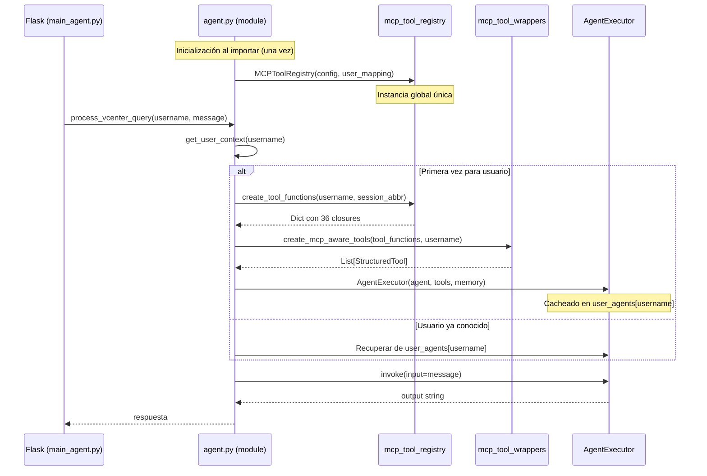

### Ciclo de Vida de Objetos

| Objeto | Creación | Vida Útil |
|--------|----------|-----------|
| `MCPToolRegistry` | Al importar `agent.py` | Toda la vida del proceso Flask |
| `VCenterConnectionPool` | Al importar | Toda la vida del proceso Flask |
| Closures (dict funciones) | Primera petición usuario | Hasta crear `AgentExecutor` |
| `StructuredTool` | Primera petición usuario | Toda la sesión del usuario |
| `AgentExecutor` | Primera petición usuario | Hasta limpieza `user_agents[username]` |
| `ConversationBufferMemory` | Primera petición usuario | Hasta expiración sesión (3600s) |

## Relacionado

- [[Arquitectura-Agente-vCenter]] — Arquitectura completa del agente vCenter
- [[Agente-vCenter]] — Documentación funcional del agente
- [[Connection-Pool]] — Detalles del pool de conexiones VMware
- [[Seguridad]] — Controles de seguridad y auditoría
- [[Structured-Logging]] — Sistema de logs estructurados
- [[Glosario]] — Términos técnicos del proyecto
