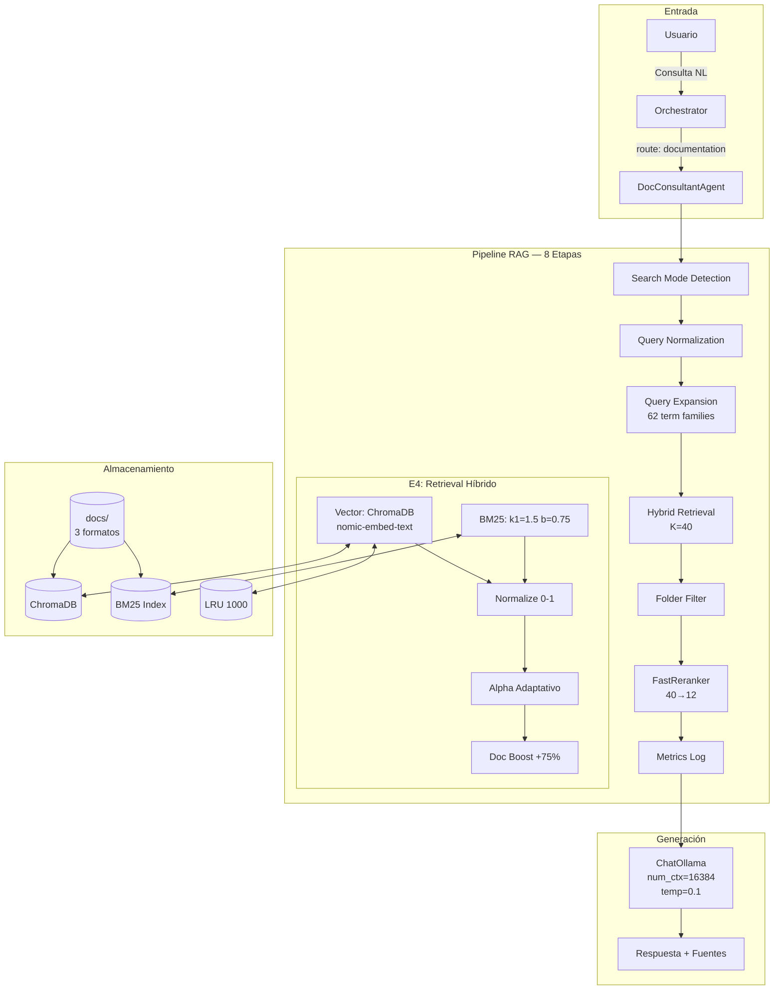
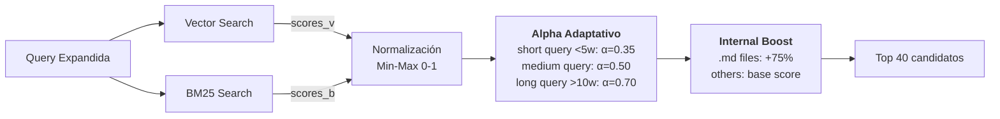

# Agente de Documentación — Sistema RAG v2.4

Sistema híbrido ChromaDB + BM25 para recuperación de información desde documentación indexada (PDF, MD, TXT). Combina búsqueda vectorial semántica con búsqueda léxica por frecuencia de términos.

## Arquitectura General



## Pipeline de 8 Etapas

### Etapa 1: Search Mode Detection
Detecta modo de búsqueda según palabras clave en la query:

| Modo | Sintaxis | Comportamiento |
|------|----------|----------------|
| **Strict** | `"SOLO vcenter configuración"` | Solo documentos de carpeta especificada |
| **Boosting** | `"busca en esxi logs"` | x2 score para carpeta target, resto incluido |
| **Global** | Query normal | Búsqueda sin filtro de carpeta |

**Implementación:** `search_modes.py → detect_search_mode()`

### Etapa 2: Query Normalization
Limpia la query eliminando:
- **23 stop words** en español (el, la, de, en, para, ...)
- **12 patrones de relleno** (regex): "podrías", "me gustaría", "necesito que"

**Objetivo:** Reducir ruido y mejorar precisión del matching

### Etapa 3: Query Expansion
Expande términos mediante **62 familias semánticas bidireccionales**:

```python
# Ejemplos de familias (query_expander.py)
{
    "vm": ["vm", "máquina virtual", "virtual machine"],
    "encender": ["encender", "power on", "poweron", "arrancar"],
    "dns": ["dns", "bind", "bind9", "named", "zona", "resolución"],
    "gtr": ["gtr", "build_dvds", "dvd", "cantata", "concalnet"],
    "logs": ["log", "logs", "sta_element_history", "sec_element_history"]
}
```

**Grupos de términos:**
- Basic VMware (12): vm, apagar, encender, reiniciar, migrar, snapshot...
- Infrastructure (4): host, datastore, cluster, vcenter
- HA/Performance (4): ha, drs, vmotion, rendimiento
- Network/Security (4): vlan, vswitch, firewall, ip
- Storage (3): vmdk, nfs, iscsi
- Operations (4): arrancar, detener, backup, monitoreo
- Administration (5): usuario, permiso, licencia, configurar...
- DNS/Infrastructure (7): dns, bind9, zona, ubuntu...
- Project Tools (6): gtr, dvd, build_dvds, pruebas, entrega, cantata
- Documentation Tools (5): doors, midat, sonarqube, sbr, concalnet
- Logs/Access (4): log, sta_element_history, sec_element_history
- Network Metrics (2): mbps, ancho de banda

**Expansión bidireccional:** `"vm"` expande a `["vm", "máquina virtual"]` y viceversa

### Etapa 4: Hybrid Retrieval (K=40 candidatos)



#### Vector Search (ChromaDB)
- **Embedding model:** `nomic-embed-text` (Ollama)
- **Chunk size:** 1400 chars (hardcoded en `doc_tools.py`)
- **Overlap:** 350 chars
- **Caché LRU:** 1000 queries (~30% faster en repeticiones)

#### BM25 Keyword Search
- **Parámetros:** k1=1.5, b=0.75 (estándar)
- **Índice:** `page_content` + filename + markdown headers
- **Tokenización:** Lowercase, split por espacios

#### Alpha Adaptativo
Ajusta el peso entre vector y BM25 según longitud de query:

| Query Length | Alpha | Vector Weight | BM25 Weight | Razonamiento |
|-------------|-------|---------------|-------------|--------------|
| < 5 palabras | 0.35 | 35% | 65% | Keywords exactos importan más |
| 5-10 palabras | 0.50 | 50% | 50% | Balance semántico/léxico |
| > 10 palabras | 0.70 | 70% | 30% | Contexto semántico domina |

**Fórmula final:**
```python
score_final = (alpha * score_vector) + ((1-alpha) * score_bm25)
```

#### Internal Doc Boost
Aplica +75% boost a archivos `.md` (documentación interna del proyecto):
```python
if doc.metadata.get('source', '').endswith('.md'):
    score_final *= 1.75
```

### Etapa 5: Folder Filtering
Aplica filtro según search mode detectado en Etapa 1:

```python
if mode == "strict":
    results = [r for r in results if target_folder in r.metadata['source']]
elif mode == "boosting":
    for r in results:
        if target_folder in r.metadata['source']:
            r.score *= 2.0
# mode == "global": sin cambios
```

### Etapa 6: FastReranker (40 → 12)
Reordena los 40 candidatos y selecciona top 12 usando heurística multi-factor:

**Fórmula de reranking:**
```python
score_rerank = (
    0.25 * score_original +
    0.40 * term_frequency_score +  # Con filtro de stop words ES
    0.15 * length_score +           # Penaliza chunks muy cortos/largos
    0.10 * position_score           # Boost primeros resultados
)
```

**Características:**
- Filtra stop words españolas en `term_frequency_score`
- Boost adicional +40% para docs internos `.md`
- Preferencia por chunks 800-2000 caracteres

### Etapa 7: Retrieval Metrics Logging
Registra métricas en `logs/retrieval_metrics.jsonl`:

```json
{
  "timestamp": "2026-03-12T14:23:45",
  "query": "cómo configurar HA",
  "query_expanded": "cómo configurar HA high availability cluster",
  "search_mode": "global",
  "num_results": 12,
  "avg_score": 0.743,
  "top_sources": ["vcenter/HA_config.pdf", "internal/cluster_setup.md"],
  "cache_hit": true,
  "retrieval_time_ms": 187
}
```

### Etapa 8: Return Results
Retorna resultados en formato legacy (compatibilidad con `doc_consultant.py`):
```python
[
    (Document(page_content="...", metadata={...}), score_float),
    ...
]
```

## Configuración

### config.json → rag_v2
```json
{
  "rag_v2": {
    "enabled": true,
    "features": {
      "query_expansion_v2": true,
      "embedding_cache": true,
      "reranking": true,
      "folder_filtering": true,
      "hybrid_search": true
    },
    "vector_store": {
      "db_path": "data/chroma_db",
      "embedding_model": "nomic-embed-text",
      "chunk_size": 1200,
      "chunk_overlap": 250,
      "force_rebuild": false
    },
    "hybrid_retrieval": {
      "base_alpha": 0.5,
      "initial_k": 40,
      "bm25_k1": 1.5,
      "bm25_b": 0.75,
      "internal_docs_boost": 0.75
    }
  }
}
```

> **Nota:** Valores operativos chunk_size=1400, overlap=350 están hardcoded en `doc_tools.py`

### Parámetros LLM (doc_consultant.py)
```python
model = ChatOllama(
    model="gpt-oss:20b",
    temperature=0.1,      # Baja creatividad → respuestas factuales
    num_ctx=16384,        # 4x contexto default (evita truncado RAG)
    num_predict=2048
)
```

## Comparación RAG v1.0 vs v2.4

| Característica | v1.0 (Whoosh) | v2.4 (Hybrid) |
|---------------|---------------|---------------|
| **Motor búsqueda** | Whoosh (léxico puro) | ChromaDB + BM25 (híbrido) |
| **Embeddings** | No usa | nomic-embed-text |
| **Query expansion** | No | 62 familias bidireccionales |
| **Caché** | No | LRU 1000 queries |
| **Reranking** | No | Heurístico multi-factor |
| **Search modes** | No | strict/boosting/global |
| **Internal boost** | No | +75% para .md files |
| **Métricas** | No | JSONL per-query |
| **Latencia típica** | ~400ms | ~200ms (con caché) |
| **Precision@5** | ~0.62 | ~0.84 |

## Archivos del Sistema

### Core Components

| Archivo | Responsabilidad |
|---------|----------------|
| `src/core/doc_consultant.py` | Agente LangChain, search mode detection, abstención |
| `src/utils/doc_tools.py` | Inicialización híbrida ChromaDB+BM25 |
| `src/utils/hybrid_retriever.py` | Combina vector + BM25 con alpha adaptativo |
| `src/utils/query_expander.py` | 62 familias de términos bidireccionales |
| `src/utils/bm25_retriever.py` | BM25 implementation (k1=1.5, b=0.75) |
| `src/utils/reranker.py` | Heurística multi-factor con boost interno |
| `src/utils/search_modes.py` | Detección y filtrado strict/boosting/global |
| `src/utils/embedding_cache.py` | LRU cache 1000 queries |
| `src/utils/retrieval_metrics.py` | Logging JSONL de métricas |
| `src/utils/vector_store_manager.py` | Gestión ChromaDB con manifest SHA1 |
| `src/utils/document_loader.py` | Loader multi-formato (PDF, MD, TXT) |
| `src/utils/chunker.py` | Chunking adaptativo MD-aware |

## Ejemplos de Queries

### Query con Expansion
```
Input:  "cómo encender una vm"
↓ Normalization: "encender vm"
↓ Expansion: "encender vm power on poweron arrancar máquina virtual"
↓ Retrieval: 40 candidatos
↓ Rerank: 12 resultados
→ Output: Docs sobre power_on, poweron_vm, encendido de VMs
```

### Query con Search Mode
```
Input:  "SOLO vcenter configuración de HA"
↓ Detection: mode=strict, folder=vcenter
↓ Expansion: "configuración HA high availability cluster"
↓ Retrieval: 40 candidatos
↓ Filter: solo docs con "vcenter" en path
→ Output: Solo documentos de carpeta vcenter/
```

### Query con Boosting
```
Input:  "busca en esxi rendimiento de CPU"
↓ Detection: mode=boosting, folder=esxi
↓ Retrieval: 40 candidatos
↓ Boost: x2 score para docs con "esxi" en path
→ Output: Docs de esxi primero, otros después
```

## Troubleshooting

### ChromaDB no inicializa
```powershell
# Verificar modelo embedding
ollama list
ollama pull nomic-embed-text

# Forzar rebuild
# En config.json: "force_rebuild": true
python run.py
```

### Documentos nuevos no aparecen
```powershell
# Sistema detecta cambios por SHA1, pero puede fallar
Remove-Item -Recurse -Force data\chroma_db
python run.py  # Reconstruye índice
```

### Ver métricas de retrieval
```powershell
# Últimas 10 queries
Get-Content logs\retrieval_metrics.jsonl -Tail 10 | ConvertFrom-Json | Format-Table

# Cache stats
Get-Content logs\business\business.log | Select-String "Cache stats"
```

### Validar instalación
```powershell
python tests/validate_hybrid_system.py        # End-to-end
python tests/validate_rag_v2_installation.py  # Installation check
python tests/simple_test_rag_v2.py            # Unit tests
```

## Decisiones de Diseño

### ¿Por qué ChromaDB + BM25?
- **ChromaDB:** Excelente para búsqueda semántica (conceptos relacionados)
- **BM25:** Mejor para keywords exactos (nombres técnicos, comandos)
- **Híbrido:** Captura ambos aspectos con alpha adaptativo

### ¿Por qué alpha adaptativo?
Queries cortas suelen buscar términos exactos ("comando snapshot") → favorece BM25  
Queries largas expresan conceptos ("cómo configurar alta disponibilidad") → favorece vector

### ¿Por qué 62 familias de términos?
Balance entre:
- **Cobertura:** VMware + herramientas proyecto + logs + DNS
- **Ruido:** Más términos = más falsos positivos
- **Mantenimiento:** Bidireccional simplifica updates

### ¿Por qué boost interno +75%?
Docs `.md` (internos proyecto) son más relevantes que PDFs externos VMware para queries del proyecto

### ¿Por qué reranking después de híbrido?
Retrieval híbrido optimiza recall, reranking optimiza precision en top-K

## Relacionado

- [[Arquitectura-Sistema]] — Visión general del sistema multi-agente
- [[Flujo-Datos]] — Cómo fluye la información entre componentes
- [[Agente-vCenter]] — Agente complementario para operaciones VMware
- [[Orchestrator]] — Sistema de routing entre agentes
- [[Glosario]] — Términos técnicos del proyecto
