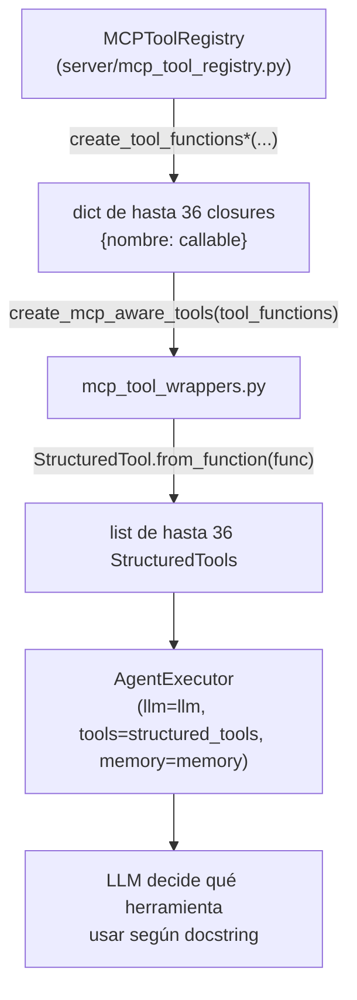

# pyvmomi Wrappers — Adaptador LangChain para Herramientas MCP

## Propósito y Ubicación

**Archivo**: `server/mcp_tool_wrappers.py`
**Función principal**: `create_mcp_aware_tools(tool_functions: dict) -> list[StructuredTool]`

Este módulo es la capa de adaptación delgada entre el `MCPToolRegistry` (lógica de negocio y seguridad) y el `AgentExecutor` de LangChain. Su única responsabilidad es convertir los callables del registro MCP (catálogo total: 36; puede ser un subconjunto por Progressive Disclosure) en objetos `StructuredTool` que el agente pueda descubrir y ejecutar.

## Posición en la Arquitectura



El wrapper no contiene lógica de negocio ni accede directamente a vCenter. Solo realiza la transformación de tipos necesaria para que LangChain pueda introspeccionar y ejecutar las herramientas.

## Cómo Funciona `StructuredTool.from_function`

`StructuredTool.from_function` inspecciona la función proporcionada y extrae tres elementos clave:

| Elemento | Origen | Uso |
|----------|--------|-----|
| `name` | Nombre de la función o parámetro explícito | Identificador que el LLM menciona al invocar la herramienta |
| `description` | **Docstring de la función** | Texto que el LLM lee para decidir si usar esta herramienta |
| `args_schema` | Type hints de los parámetros | Valida y estructura los argumentos antes de ejecutar |

> **Crítico**: El docstring de cada función en `MCPToolRegistry` es la descripción que el LLM recibe. Un docstring vago o incorrecto lleva al LLM a elegir la herramienta equivocada o a no usarla cuando debería.

## Patrón de Implementación

```python
# server/mcp_tool_wrappers.py

from langchain.tools import StructuredTool

def create_mcp_aware_tools(tool_functions: dict) -> list:
    """
    Convierte el dict de funciones del MCPToolRegistry en StructuredTools
    listos para AgentExecutor.

    Args:
        tool_functions: dict {nombre: callable} de MCPToolRegistry.create_tool_functions()

    Returns:
        list de StructuredTool listos para AgentExecutor
    """
    tools = []
    for name, func in tool_functions.items():
        tool = StructuredTool.from_function(
            func=func,
            name=name,
            description=func.__doc__ or name  # docstring → descripción para el LLM
        )
        tools.append(tool)
    return tools
```

Ejemplo de docstring en `MCPToolRegistry` que se convierte en descripción:

```python
# En server/mcp_tool_registry.py — dentro de create_tool_functions()
def list_vms_for_user(username_target: str) -> str:
    """Lista todas las VMs del usuario especificado con su estado de energía,
    host asignado y recursos consumidos. Usar cuando el usuario pida ver sus VMs."""
    # ... lógica pyvmomi ...
```

El LLM recibe exactamente ese texto y lo usa para decidir si invocar `list_vms_for_user` ante una consulta como "muéstrame mis máquinas virtuales".

## Separación de Responsabilidades

La división en dos archivos responde a principios distintos:

| Archivo | Responsabilidad | Preocupación |
|---------|----------------|--------------|
| `mcp_tool_registry.py` | Lógica de negocio, seguridad, aislamiento por usuario, pool de conexiones | **Seguridad y dominio** |
| `mcp_tool_wrappers.py` | Conversión de callables a StructuredTools | **Adaptación a LangChain** |

Esta separación garantiza que los cambios en la API de LangChain (por ejemplo, si `StructuredTool` cambia su interfaz) no afecten la lógica de acceso a vCenter, y viceversa. El registry puede evolucionar sin conocer detalles de LangChain.

## Flujo de Invocación Completo

Cuando el agente ejecuta una herramienta:

1. El LLM emite una acción con `tool_name` y `tool_input` en JSON.
2. `AgentExecutor` busca el `StructuredTool` cuyo `name` coincide.
3. LangChain valida `tool_input` contra el `args_schema` (type hints).
4. Se llama al closure original del `MCPToolRegistry`, que ya tiene capturados `username` y `session_abbr`.
5. El closure ejecuta la operación pyvmomi a través del pool de conexiones.
6. El resultado (string) vuelve al `AgentExecutor` como observación.

## Archivos Relacionados

- `server/mcp_tool_registry.py` — Fuente de las funciones que este módulo adapta (catálogo total: 36)
- `server/mcp_vcenter_server.py` — Servidor FastMCP (exposición alternativa de las herramientas vía MCP)
- `src/core/agent.py` — Consumidor final: construye el `AgentExecutor` con las herramientas envueltas
- `src/utils/vcenter_tools.py` — Wrappers pyvmomi de bajo nivel usados por el registry
