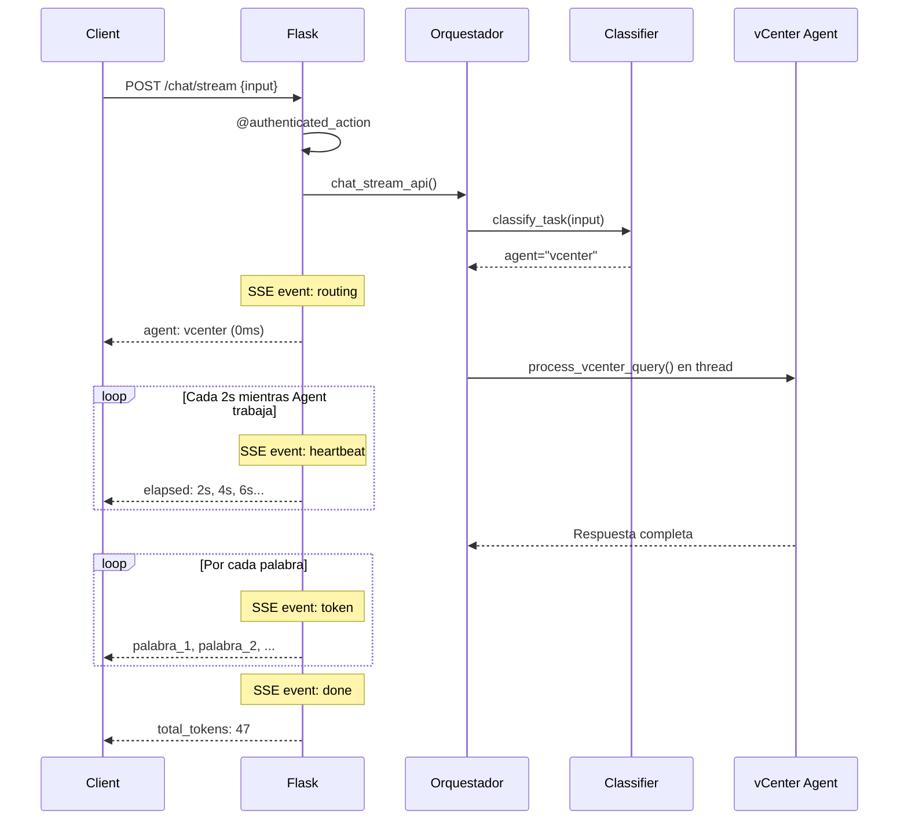

# 💬 Endpoint /chat

> Documentación detallada del endpoint principal de chat con streaming SSE.

---

## 📋 Resumen

El endpoint `/chat` y su versión streaming `/chat/stream` son los puntos de entrada principales para interactuar con el sistema multi-agente.

| Aspecto | `/chat` | `/chat/stream` |
|---------|---------|----------------|
| **Método** | POST | POST |
| **Autenticación** | Sesión requerida | Sesión requerida |
| **Response** | JSON | Server-Sent Events (SSE) |
| **Timeout** | 60s | Sin timeout |
| **Uso** | Fallback legacy | Principal (recomendado) |

---

## 🔌 POST /chat (Legacy)

### Request

```http
POST /chat HTTP/1.1
Content-Type: application/json
Cookie: session=...

{
  "input": "Muéstrame mis VMs",
  "username": "jmartinb"
}
```

### Response Success (200)

```json
{
  "response": "Tienes **3 VMs** activas:\n\n| VM | Estado | CPU | RAM |\n|----|----|-----|-----|\n| mcu-01 | running | 4 | 8GB |",
  "agent": "vcenter",
  "timing": {
    "total_ms": 3245,
    "classification_ms": 120,
    "execution_ms": 3100
  }
}
```

### Response Error (401)

```json
{
  "error": "Sesión expirada",
  "code": 401
}
```

---

## 🌊 POST /chat/stream (SSE - Recomendado)

### Request

```http
POST /chat/stream HTTP/1.1
Content-Type: application/json
Cookie: session=...

{
  "input": "Despliega una MCU llamada test-01",
  "username": "jmartinb"
}
```

### Response Stream

```
event: routing
data: {"agent": "vcenter", "label": "Consultando agente vCenter..."}

event: heartbeat
data: {"ts": 1234.5, "elapsed": 2.1}

event: heartbeat
data: {"ts": 1236.5, "elapsed": 4.1}

event: token
data: {"t": "✅ ", "i": 0}

event: token
data: {"t": "VM ", "i": 1}

event: token
data: {"t": "test-01 ", "i": 2}

event: token
data: {"t": "desplegada ", "i": 3}

event: done
data: {"agent": "vcenter", "total_tokens": 47, "attachments": []}
```

### Eventos SSE

| Evento | Data | Propósito |
|--------|------|-----------|
| `routing` | `{agent, label}` | Indica agente seleccionado (~0ms) |
| `heartbeat` | `{ts, elapsed}` | Progreso cada 2s durante ejecución |
| `token` | `{t, i}` | Token de texto (palabra a palabra) |
| `done` | `{agent, total_tokens, attachments}` | Fin de respuesta |
| `error` | `{error, code}` | Error durante procesamiento |

---

## 📊 Ejemplo Completo: Deploy VM

### Curl

```bash
curl -X POST http://localhost:5000/chat \
  -H "Content-Type: application/json" \
  -b "session=abc123..." \
  -d '{
    "input": "Despliega una MCU llamada prod-01",
    "username": "jmartinb"
  }'
```

### Python

```python
import requests

session = requests.Session()
session.post('http://localhost:5000/login', json={
    'username': 'jmartinb',
    'password': 'password'
})

response = session.post('http://localhost:5000/chat', json={
    'input': 'Despliega una MCU llamada prod-01',
    'username': 'jmartinb'
})

print(response.json()['response'])
```

### JavaScript (SSE)

```javascript
async function sendMessage(message) {
    const response = await fetch('/chat/stream', {
        method: 'POST',
        headers: {'Content-Type': 'application/json'},
        body: JSON.stringify({
            input: message,
            username: sessionStorage.getItem('username')
        })
    });

    const reader = response.body.getReader();
    const decoder = new TextDecoder();

    while (true) {
        const {done, value} = await reader.read();
        if (done) break;

        const chunk = decoder.decode(value);
        const events = chunk.split('\n\n');

        for (const event of events) {
            if (!event.trim()) continue;

            const [eventLine, dataLine] = event.split('\n');
            const eventType = eventLine.replace('event: ', '');
            const data = JSON.parse(dataLine.replace('data: ', ''));

            if (eventType === 'token') {
                appendText(data.t);
            } else if (eventType === 'done') {
                finishResponse();
            }
        }
    }
}
```

---

## 🔄 Flujo de Procesamiento



---

## ⏱️ Timeline Típico

```
T0 = 0ms      → Cliente envía POST /chat/stream
T1 = 5ms      → Autenticación validada
T2 = 10ms     → event: routing emitido (usuario ve agente)
T3 = 150ms    → Clasificación completa (4-capas)
T4 = 200ms    → Thread agente lanzado
T5 = 2000ms   → event: heartbeat #1
T6 = 4000ms   → event: heartbeat #2
T7 = 6000ms   → Agente completa respuesta
T8 = 6050ms   → event: token (inicio streaming palabras)
T9 = 6500ms   → event: done (fin)

Total: 6.5 segundos
```

---

## 🛡️ Seguridad

### Autenticación Requerida

```python
@app.route('/chat', methods=['POST'])
@authenticated_action
def chat_api():
    username = session['username']  # Validado por decorator
    # ...
```

### Rate Limiting (Futuro)

Planeado:
- 60 requests por minuto por usuario
- 1000 requests por hora por usuario

---

## 🐛 Troubleshooting

### Problema: SSE no funciona

**Síntoma:** Frontend recibe 200 pero no eventos  
**Causa:** Browser cache o proxy intercepta stream  
**Solución:**
```javascript
fetch('/chat/stream', {
    method: 'POST',
    headers: {
        'Content-Type': 'application/json',
        'Cache-Control': 'no-cache'
    },
    // ...
})
```

### Problema: "Sesión expirada" en medio de query

**Síntoma:** event: error con code 401  
**Causa:** Timeout 3600s expiró  
**Solución:** Implementar refresh de sesión automático en frontend

---

## 📚 Documentos Relacionados

- [[API-Reference]] - Todos los endpoints
- [[Arquitectura-Chat]] - Sistema conversacional
- [[Orquestador]] - Clasificación de queries
- [[Guia-Usuario]] - Uso del chat

---

*Última actualización: 2026-03-24 | v1.0*
