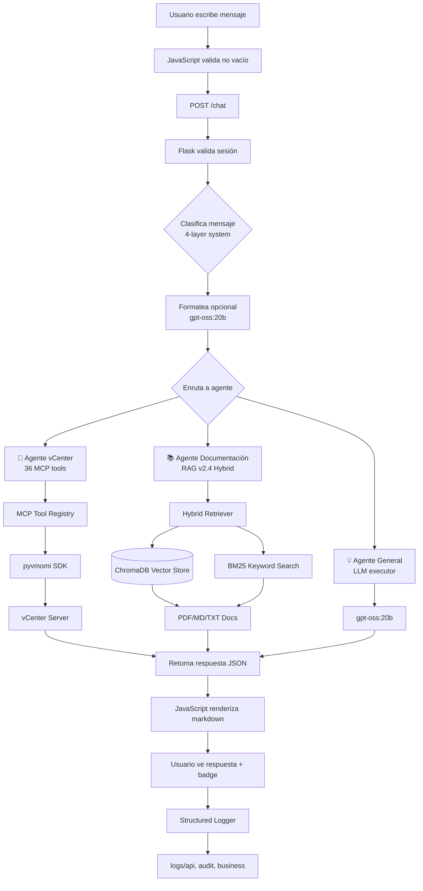

# Casos de Uso del Sistema Multi-Agente

## 📋 Descripción

Este documento proporciona ejemplos prácticos y casos de uso reales del sistema multi-agente de vCenter. Está diseñado para:

- **Usuarios finales**: Aprender cómo formular consultas efectivas
- **Operadores**: Entender flujos de trabajo y troubleshooting
- **Desarrolladores**: Comprender comportamiento esperado del sistema

## 🔄 Flujo de Procesamiento End-to-End



## 📊 Casos de Uso Típicos

### Caso 1: Consulta sobre VMs en vCenter

> [!example] Consulta de información de VMs

**Input del usuario**:
```
¿Cuántas VMs hay en el cluster de producción?
```

**Proceso interno**:
1. **Detección**: Sistema detecta keywords `"VMs"`, `"cluster"`, `"producción"`
2. **Clasificación (Layer 0)**: Coincide con `agents.yaml` → keywords exclusivos de vCenter
3. **Formateado opcional**: Si está habilitado, `formatter_llm` limpia el mensaje
4. **Enrutamiento**: Invoca **Agente vCenter** (`src/core/agent.py`)
5. **Ejecución MCP**: Usa tool `list_vms_in_cluster` → pyvmomi consulta vCenter Server
6. **Logging**: Registra operación en `logs/business/business.log`
7. **Respuesta**: Retorna JSON con lista de VMs

**Output esperado**:
```markdown
Hay 12 máquinas virtuales activas en el clúster de producción:

| VM Name       | vCPU | RAM (GB) | Estado   | Host ESXi      |
|---------------|------|----------|----------|----------------|
| vm-prod-01    | 4    | 16       | Powered On | esxi8-135    |
| vm-prod-02    | 8    | 32       | Powered On | esxi8-136    |
| vm-prod-03    | 2    | 8        | Powered Off | esxi8-135   |
| vm-backup-01  | 4    | 16       | Powered On | esxi8-137    |
...

Total recursos asignados: 48 vCPU, 192 GB RAM
```

**Badge mostrado**: `vcenter`

**Comandos MCP relevantes**: `list_vms_in_cluster`, `get_vm_info`

---

### Caso 2: Consulta sobre Documentación

> [!example] Búsqueda en documentación técnica

**Input del usuario**:
```
¿Cómo instalo el DNS según la documentación?
```

**Proceso interno**:
1. **Detección**: Keywords `"instalar"`, `"DNS"`, `"documentación"`
2. **Clasificación (Layer 1)**: Regex crítico detecta frase de aprendizaje → **documentation**
3. **Enrutamiento**: Invoca **Agente Documentación** (`src/core/doc_consultant.py`)
4. **RAG v2.4 Pipeline**:
   - Query expansion: "dns" → ["dns", "bind", "bind9", "named", "zona", "ubuntu dns"] (62 familias)
   - Hybrid retrieval: ChromaDB (vector) + BM25 (keyword) con α adaptativo
   - Reranking: Top 8 chunks con boost interno (.md files +75%)
5. **Generación**: LLM sintetiza respuesta con contexto recuperado
6. **Métricas**: Log a `logs/retrieval_metrics.jsonl`

**Output esperado**:
```markdown
Según la documentación (Configuracion_templates.md, sección 3.2):

**Procedimiento de Instalación DNS en ESXi**

1. **Acceder a la consola del host ESXi**
   ```bash
   ssh root@esxi-host-ip
   ```

2. **Editar archivo de configuración de red**
   ```bash
   vi /etc/resolv.conf
   ```

3. **Agregar nameservers**
   ```
   nameserver 10.0.0.53
   nameserver 8.8.8.8
   ```

4. **Reiniciar servicio de red**
   ```bash
   /etc/init.d/network restart
   ```

5. **Verificar resolución**
   ```bash
   nslookup google.com
   ```

📄 Fuente: `docs/Configuracion_templates.md` (Chunk 12, score 0.92)
```

**Badge mostrado**: `documentation`

**Comandos relevantes**: Ninguno (búsqueda RAG, no ejecuta comandos)

---

### Caso 3: Consulta General sin Clasificación

> [!note] Preguntas conceptuales que no requieren vCenter ni docs

**Input del usuario**:
```
¿Qué es un snapshot?
```

**Proceso interno**:
1. **Detección**: No coincide con keywords exclusivos de vCenter ni documentation
2. **Clasificación (Layer 2-3)**: Intent detection detecta pregunta conceptual
3. **LLM Fallback (Layer 4)**: Si es ambiguo, `classifier_llm` decide → **general**
4. **Enrutamiento**: Invoca **Agente General** (executor_llm directo)
5. **Generación**: LLM sintetiza respuesta sin herramientas externas
6. **No logging business**: Solo se registra en `logs/api/`

**Output esperado**:
```markdown
Un **snapshot** es una fotografía puntual del estado de una máquina virtual 
en un momento específico, incluyendo:

- **Estado de la memoria RAM**: Variables y procesos activos
- **Discos virtuales**: Contenido completo de los VMDK
- **Configuración de hardware virtual**: vCPU, vNIC, adaptadores

**Casos de uso comunes**:
- ✅ Respaldo antes de actualizaciones críticas
- ✅ Testing de configuraciones sin riesgo
- ✅ Recuperación rápida ante fallos (rollback)

**Limitaciones**:
- ❌ No es un backup completo (depende del datastore)
- ❌ Impacto en performance si se mantienen muchos snapshots
- ❌ Consumo incremental de almacenamiento

Recomendación: No mantener snapshots más de 72 horas en producción.
```

**Badge mostrado**: `general`

**Comandos relevantes**: Ninguno (respuesta LLM puro)

---

### Caso 4: Operación con Snapshots (vCenter)

> [!success] Gestión completa de snapshots

**Input del usuario**:
```
Crear snapshot de vm-backup-01 con nombre "pre-update-2026-01" 
y descripción "Backup antes de actualizar kernel"
```

**Proceso interno**:
1. **Detección**: Keywords `"crear"`, `"snapshot"`, nombre de VM
2. **Clasificación (Layer 0)**: `"snapshot"` es keyword exclusivo vCenter en `agents.yaml`
3. **Enrutamiento**: Agente vCenter invoca tool `create_vm_snapshot`
4. **Ejecución MCP**:
   ```python
   create_vm_snapshot(
       vm_name="vm-backup-01",
       snapshot_name="pre-update-2026-01",
       description="Backup antes de actualizar kernel"
   )
   ```
5. **Logging**: `logs/business/business.log` + `logs/audit/audit.log` (operación crítica)
6. **Validación**: Comprueba que snapshot se creó correctamente

**Output esperado**:
```markdown
✅ Snapshot creado exitosamente

**Detalles de la operación**:
- VM: `vm-backup-01`
- Snapshot Name: `pre-update-2026-01`
- Descripción: "Backup antes de actualizar kernel"
- Timestamp: 2026-01-15 14:32:18 UTC
- Snapshot ID: snapshot-12345
- Espacio usado: 4.2 GB (incremental)

**Snapshots existentes en esta VM**:
1. pre-update-2026-01 (Hoy 14:32) ← ACTUAL
2. weekly-backup (hace 3 días)

⚠️ Recuerda eliminar snapshots antiguos para liberar espacio.

Comando para eliminar: "Eliminar snapshot weekly-backup de vm-backup-01"
```

**Badge mostrado**: `vcenter`

**Comandos MCP relevantes**: `create_vm_snapshot`, `list_vm_snapshots`, `delete_vm_snapshot`

---

### Caso 5: Métricas de Performance de Host ESXi

> [!example] Monitoreo de recursos de infraestructura

**Input del usuario**:
```
Dame métricas de CPU y memoria para esxi8-135 en las últimas 24 horas
```

**Proceso interno**:
1. **Detección**: Keywords `"métricas"`, `"CPU"`, `"memoria"`, nombre de host ESXi
2. **Clasificación (Layer 0)**: `"esxi"` + `"métricas"` → vCenter exclusivo
3. **Enrutamiento**: Agente vCenter invoca tools `get_host_cpu_metrics` + `get_host_memory_metrics`
4. **Ejecución MCP**: pyvmomi consulta PerfManager de vCenter (24h de datos)
5. **Procesamiento**: Calcula promedios, picos, tendencias
6. **Logging**: `logs/performance/` + `logs/business/`

**Output esperado**:
```markdown
📊 **Métricas de Performance - esxi8-135** (últimas 24h)

**CPU**:
- Uso promedio: 42.3%
- Pico máximo: 78.1% (Hoy 03:15 AM)
- Uso mínimo: 18.5% (Hoy 11:45 AM)
- Cores totales: 16 (32 threads)
- MHz asignados: 51,200 MHz

**Memoria**:
- Uso promedio: 68.7% (110 GB / 160 GB)
- Pico máximo: 89.2% (142 GB) (Hoy 09:30 AM)
- Memoria disponible: 50 GB
- Estado de ballooning: Inactivo ✅

**Tendencia**:
📈 Incremento de 12% en uso de CPU respecto a ayer
📉 Reducción de 5% en uso de memoria

⚠️ **Recomendación**: El pico de CPU del 78% es aceptable, pero considera 
añadir más hosts si supera el 80% de forma sostenida.

**VMs más consumidoras en este host**:
1. vm-prod-02: 8 vCPU, 32 GB RAM
2. vm-database-01: 6 vCPU, 24 GB RAM
3. vm-web-cluster-03: 4 vCPU, 16 GB RAM
```

**Badge mostrado**: `vcenter`

**Comandos MCP relevantes**: `get_host_cpu_metrics`, `get_host_memory_metrics`, `list_vms_on_host`

---

### Caso 6: Descarga de Reporte (Attachment)

> [!success] Generación de reportes descargables

**Input del usuario**:
```
Genera reporte CSV con todas las VMs y su consumo de recursos
```

**Proceso interno**:
1. **Detección**: Keywords `"reporte"`, `"CSV"`, `"VMs"`, `"recursos"`
2. **Clasificación (Layer 0)**: vCenter agent (operación de consulta masiva)
3. **Enrutamiento**: Agente vCenter recopila datos de todas las VMs
4. **Generación CSV**:
   - Itera todas las VMs con `list_all_vms`
   - Extrae CPU, RAM, storage, estado por cada una
   - Genera archivo CSV temporal
5. **Attachment**: Retorna JSON con campo `attachment` (base64 o path)
6. **Frontend**: JavaScript detecta attachment y muestra botón de descarga

**Output esperado**:
```markdown
✅ Reporte generado correctamente

📄 **reporte_vms_recursos_2026-01-15.csv** (42 KB)

**Contenido del reporte**:
- Total de VMs: 47
- Columnas: VM Name, vCPU, RAM (GB), Storage (GB), Estado, Host ESXi, Cluster
- Formato: CSV (UTF-8)

[⬇️ Descargar Reporte] (botón interactivo en frontend)

**Resumen estadístico**:
- Total vCPU asignados: 184
- Total RAM asignada: 768 GB
- Total storage consumido: 12.4 TB
- VMs powered on: 38 (80.85%)
- VMs powered off: 9 (19.15%)
```

**Badge mostrado**: `vcenter`

**Comandos MCP relevantes**: `list_all_vms`, `get_vm_info` (batch)

**Nota técnica**: El frontend (`static/js/main.js`) detecta el campo `attachment` en la respuesta JSON y renderiza un botón de descarga.

---

### Caso 7: Búsqueda de Procedimiento en Documentación (.docx)

> [!note] Consulta avanzada con filtrado de carpetas

**Input del usuario**:
```
Busca en la carpeta TrueNAS los pasos para configurar replicación de datos
```

**Proceso interno**:
1. **Detección**: Keywords `"busca"`, `"carpeta TrueNAS"`, `"pasos"`, `"configurar"`, `"replicación"`
2. **Clasificación (Layer 1)**: Regex detecta `"busca en"` + nombre de carpeta → documentation
3. **Search Mode Detection**: `search_modes.py` identifica **BOOSTING mode** (carpeta TrueNAS x2 score)
4. **RAG v2.4 Pipeline**:
   - Query expansion: "replicación" no tiene familia directa → mantiene término original
   - Hybrid retrieval: ChromaDB + BM25
   - Folder boosting: Chunks de `docs/TrueNAS/` reciben x2 score
   - Reranking: Top 8, prioriza por score final
5. **Document Loader**: Extrae contenido de archivos `.docx` en carpeta TrueNAS
6. **Síntesis LLM**: Genera respuesta estructurada con pasos numerados

**Output esperado**:
```markdown
📂 Búsqueda en carpeta: **TrueNAS**

**Procedimiento de Configuración de Replicación de Datos**

Según `TrueNAS_Replication_Guide.docx` (sección 4.1):

**Requisitos previos**:
- Dos sistemas TrueNAS configurados (origen y destino)
- Conectividad SSH entre ambos sistemas
- Snapshots configurados en el pool de origen

**Pasos de configuración**:

1. **Crear tarea de snapshot automático**
   - Ir a `Tasks > Periodic Snapshot Tasks`
   - Configurar frecuencia (ej: cada 1 hora)
   - Aplicar al dataset que se replicará

2. **Configurar SSH entre sistemas**
   ```bash
   # En sistema origen:
   ssh-keygen -t rsa
   ssh-copy-id root@truenas-destino-ip
   ```

3. **Crear tarea de replicación**
   - Ir a `Tasks > Replication Tasks`
   - Seleccionar dataset origen
   - Configurar destino: SSH+NETCAT
   - Establecer frecuencia de sincronización
   - Activar "Replicate Snapshots"

4. **Verificar primera ejecución**
   - Ejecutar manualmente la tarea
   - Revisar logs en `System > Advanced > Show Logs`
   - Confirmar que snapshots se transfieren correctamente

5. **Monitoreo continuo**
   - Configurar alertas de fallos de replicación
   - Revisar dashboard de replication status

⚠️ **Advertencias**:
- La replicación inicial puede tardar horas dependiendo del tamaño del dataset
- Asegúrate de tener espacio suficiente en el sistema destino
- No elimines snapshots manualmente si hay tareas de replicación activas

📄 Fuentes consultadas:
- `TrueNAS_Replication_Guide.docx` (score: 0.89, carpeta TrueNAS)
- `TrueNAS_Best_Practices.md` (score: 0.76, carpeta TrueNAS)
```

**Badge mostrado**: `documentation`

**Comandos relevantes**: Ninguno (RAG search, no ejecuta comandos)

**Nota de configuración**: El modo BOOSTING se activa con palabras clave como `"busca en {carpeta}"`, `"SOLO {carpeta}"`, detectado por `src/utils/search_modes.py`.

---

## 🛠️ Troubleshooting por Caso

| Tipo de Caso | Problema Común | Solución Rápida | Archivo de Log Relevante |
|--------------|----------------|-----------------|--------------------------|
| **vCenter Consultas** | "Error consultando vCenter" | 1. Verificar `config/config.json` (credenciales)<br>2. Comprobar conectividad: `ping vcenter-ip`<br>3. Validar sesión con `tests/check_system_status.py` | `logs/system/system.log`<br>`logs/business/business.log` |
| **vCenter Operaciones** | "No se pudo crear snapshot" | 1. Verificar permisos del usuario en vCenter<br>2. Comprobar espacio en datastore<br>3. Revisar que VM no tenga snapshots huérfanos | `logs/business/business.log`<br>`logs/audit/audit.log` |
| **Documentación** | "No encontré información relevante" | 1. Reindexar base de datos: `python rebuild_index.py`<br>2. Verificar que carpeta `docs/` tiene archivos<br>3. Revisar métricas de retrieval: `logs/retrieval_metrics.jsonl`<br>4. Ajustar query (más específica) | `logs/retrieval_metrics.jsonl`<br>`logs/system/system.log` |
| **Documentación** | "Resultados irrelevantes (baja precisión)" | 1. Usar modo STRICT: `"SOLO busca en {carpeta}"`<br>2. Añadir keywords más específicos<br>3. Verificar expansión de query en logs<br>4. Revisar parámetros RAG v2.4 en `config/config.json` | `logs/retrieval_metrics.jsonl` |
| **General** | "Respuesta genérica sin contexto" | 1. Reformular pregunta con keywords específicos (vCenter o docs)<br>2. Verificar que no hay conflicto en routing<br>3. Revisar clasificación en `logs/api/api.log` | `logs/api/api.log`<br>`logs/system/system.log` |
| **Descarga Reportes** | "Botón de descarga no aparece" | 1. Verificar que backend retorna campo `attachment` en JSON<br>2. Revisar consola del navegador (JavaScript errors)<br>3. Comprobar permisos de escritura en carpeta temporal | `logs/api/api.log` (navegador console) |
| **Autenticación** | "Sesión expirada constantemente" | 1. Ajustar timeout en `ACTIVE_SESSIONS` (main_agent.py, línea ~50)<br>2. Verificar SQLite `data/users.db` integridad<br>3. Comprobar que cookies no están siendo bloqueadas | `logs/security/security.log`<br>`logs/audit/audit.log` |
| **Performance** | "Respuestas muy lentas (>10s)" | 1. Revisar logs de performance: `logs/performance/`<br>2. Verificar latencia de vCenter: `tests/test_chat_latency_simple.ps1`<br>3. Activar embedding cache si no está habilitado<br>4. Comprobar uso de CPU/RAM del servidor Ollama | `logs/performance/performance.log`<br>`logs/retrieval_metrics.jsonl` |

## ✅ Ejemplos de Queries Efectivas vs Inefectivas

### vCenter Agent

| ✅ Efectivas (específicas, con contexto) | ❌ Inefectivas (vagas, sin contexto) |
|------------------------------------------|--------------------------------------|
| `"Listar todas las VMs del cluster producción"` | `"dame vm"` (muy vago) |
| `"Dame métricas de CPU para esxi8-135"` | `"¿CPU?"` (sin especificar host) |
| `"Crear snapshot de vm-backup-01 llamado pre-update"` | `"hacer snapshot"` (falta VM name) |
| `"¿Cuál es el almacenamiento disponible en datastore-prod?"` | `"storage?"` (sin especificar datastore) |
| `"Clonar vm-template-ubuntu a vm-web-server-03"` | `"clonar VM"` (faltan nombres) |
| `"Encender vm-database-01"` | `"encender"` (falta VM) |
| `"Migrar vm-prod-02 a esxi8-136"` | `"migrar VM"` (falta origen/destino) |

**Patrón efectivo**: `[Acción] + [Recurso específico] + [Parámetros opcionales]`

### Documentation Agent

| ✅ Efectivas | ❌ Inefectivas |
|-------------|----------------|
| `"¿Cómo instalo DNS en ESXi según la documentación?"` | `"DNS"` (demasiado genérico) |
| `"Busca en TrueNAS el procedimiento de backup"` | `"backup"` (sin contexto de carpeta) |
| `"SOLO busca en vcenter los pasos de configuración de HA"` | `"HA config"` (sin operador SOLO si necesita strict mode) |
| `"Cuéntame sobre la arquitectura del proyecto según docs"` | `"arquitectura"` (puede confundir con consulta general) |
| `"¿Dónde está la guía de disaster recovery?"` | `"disaster"` (palabra incompleta) |
| `"¿Cuál es el procedimiento de actualización de vCenter 8.0?"` | `"update vcenter"` (inglés cuando sistema espera español) |

**Patrón efectivo**: `[Operador de modo opcional] + [Pregunta clara] + [Mención de "documentación" o carpeta]`

### General Agent

| ✅ Efectivas | ❌ Inefectivas |
|-------------|----------------|
| `"¿Qué es un snapshot de VM?"` | `"snapshot?"` (demasiado corto, se ruta a vCenter) |
| `"Explícame la diferencia entre template y clone"` | `"template vs clone"` (formato telegráfico) |
| `"¿Cuáles son las mejores prácticas para clustering?"` | `"clustering"` (palabra sola, sin pregunta) |
| `"¿Cómo funciona la alta disponibilidad (HA) en VMware?"` | `"HA"` (acrónimo solo, sin contexto) |

**Patrón efectivo**: `[Pregunta conceptual completa] + [Sin mencionar recursos específicos de vCenter ni docs]`

## 🎯 Tips para Usuarios

> [!tip] Optimiza tus consultas
> 
> 1. **Sé específico**: Incluye nombres de VMs, hosts, datastores
> 2. **Usa operadores de modo**: `SOLO vcenter`, `busca en {carpeta}`
> 3. **Menciona "documentación"**: Ayuda al clasificador a entender tu intención
> 4. **Queries en español**: El sistema está optimizado para español (expansión de términos)
> 5. **Contexto conversacional**: Las respuestas de seguimiento se enrutan automáticamente al mismo agente (180s)

> [!warning] Evita errores comunes
> 
> - ❌ No uses queries de una sola palabra
> - ❌ No mezcles idiomas (español/inglés) en la misma consulta
> - ❌ No asumas que el sistema "recuerda" toda la conversación (memoria limitada)
> - ❌ No uses nombres de recursos inventados (VM names, hosts inexistentes)

## 📚 Ver También

- [[Agente-vCenter]] - Detalles técnicos del agente de vCenter (36 MCP tools)
- [[Sistema-MCP]] - Arquitectura del Model Context Protocol
- [[Guia-Usuario]] - Manual de usuario del sistema de chat
- [[Orquestador]] - Lógica de clasificación y enrutamiento (4-layer system)
- [[API-Reference]] - Endpoints REST disponibles (`/chat`, `/login`, `/logout`)
- [[RAG-v2.4]] - Documentación del sistema RAG híbrido (ChromaDB + BM25)
- [[Troubleshooting]] - Guía completa de resolución de problemas
- [[Configuracion]] - Archivos de configuración (`config.json`, `agents.yaml`)

---

**Última actualización**: Enero 2026  
**Versión**: 1.0  
**Mantenedor**: Equipo vCenter Multi-Agent System
