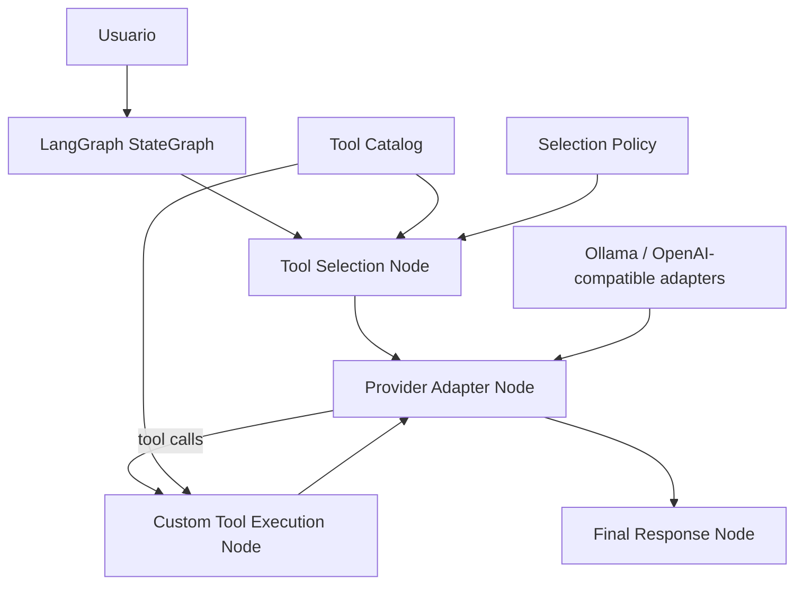

# Plan de migración a LangGraph completo y selección nativa de herramientas

> [!success]
> Migración completada. El runtime productivo ya usa adapters propios, selección nativa de herramientas en LangGraph y ejecución de tools sin `StructuredTool`, `ToolNode` ni `bind_tools`.

---

## 1. Resumen ejecutivo

La migración a LangGraph quedó **completa tanto en la capa de orquestación como en el runtime de integración**:

- el orquestador principal ya usa grafo
- el agente vCenter ya usa grafo con confirmaciones persistentes
- el agente documental ya usa grafo con checkpointing
- el runtime productivo ya no usa `langchain_ollama` ni `langchain_openai`
- el agente vCenter ya no usa `StructuredTool`, `ToolNode` ni `bind_tools`
- la selección progresiva de herramientas ya vive en el estado LangGraph del agente vCenter

El trabajo implementado siguió la línea propuesta en este documento:

1. `src\utils\llm_factory.py` fue migrado a adapters propios.
2. `server\mcp_tool_wrappers.py` dejó de depender de `StructuredTool` y quedó solo como compatibilidad interna.
3. La política de selección pasó al estado LangGraph y dejó de depender de `_user_group_cache` en el flujo productivo.

Se mantuvo el criterio arquitectónico principal: **no mover el catálogo MCP dentro del grafo**. El catálogo siguió siendo infraestructura, mientras que el grafo absorbió:

- la **política de selección**
- la **persistencia de contexto de tools**
- la **resolución dinámica por turno**
- la **ejecución de tools**
- y el **tool-calling del modelo**

---

## 2. Diagnóstico del estado actual

## 2.1. Qué está ya en LangGraph

- `src\api\orchestrator_graph.py`
- `src\core\agent_graph.py`
- `src\core\doc_agent_graph.py`

Esto significa que el routing, el estado conversacional y el checkpointing ya están resueltos con grafos.

## 2.2. Qué sigue acoplado a LangChain

### A. Adaptadores de LLM

`src\utils\llm_factory.py` crea instancias de:

- `ChatOllama`
- `ChatOpenAI`
- `OllamaEmbeddings`
- `OpenAIEmbeddings`

Eso no reintroduce agentes clásicos de LangChain, pero sí mantiene el runtime atado a wrappers de proveedor del ecosistema LangChain.

### B. Formato de herramientas

`server\mcp_tool_wrappers.py` convierte callables en `StructuredTool`, y `src\core\agent_graph.py` usa:

- `llm.bind_tools(...)`
- `ToolNode(...)`

Según la documentación pública y los ejemplos disponibles de LangGraph, este camino sigue esperando herramientas con interfaz compatible con LangChain. Por tanto:

- **ToolNode no elimina la dependencia de wrappers**
- **bind_tools no trabaja con funciones Python desnudas**
- para salir de ahí hay que introducir **nodos personalizados**

### C. Selección progresiva de herramientas

Hoy la lógica de selección se apoya en:

- `TOOL_GROUPS`
- `GROUP_KEYWORDS`
- `semantic_group_router.py`
- `_user_group_cache`

El problema no es el catálogo en sí, sino que mezcla tres cosas distintas:

1. definición del inventario de tools
2. política de selección
3. persistencia temporal del contexto de selección

Esa tercera parte debería vivir en el estado LangGraph y no en variables globales de módulo.

---

## 3. Aclaración importante: qué significa "pasar todo a LangGraph"

Hay dos niveles posibles de objetivo:

| Objetivo | Qué elimina | Qué conserva | Viabilidad |
|----------|-------------|--------------|------------|
| **Nivel A - LangGraph-first** | agentes clásicos de LangChain | `langchain_core`, `ToolNode`, `bind_tools`, wrappers de proveedor | Ya logrado en gran parte |
| **Nivel B - Runtime casi puro LangGraph** | `langchain_ollama`, `langchain_openai`, `StructuredTool`, `ToolNode`, `bind_tools` | LangGraph + catálogo propio + adaptadores propios | Viable y recomendable si se quiere desacoplamiento real |

La propuesta de este documento apunta al **Nivel B**.

---

## 4. Principios de diseño

1. **LangGraph debe orquestar, no registrar herramientas**.
2. **El catálogo MCP debe seguir siendo la fuente de verdad funcional**.
3. **La selección de tools debe ser parte del estado conversacional**.
4. **La ejecución de herramientas debe operar sobre contratos tipados propios**.
5. **El proveedor LLM debe abstraerse con una interfaz mínima y estable**.
6. **El runtime no debe depender de cachés globales por proceso para mantener contexto**.
7. **La salida de tools debe ser estructurada para runtime y frontend**.

---

## 5. Arquitectura objetivo



## 5.1. Separación propuesta

### Capa 1 - Tool Catalog

Responsable de definir el inventario estático:

- nombre
- descripción
- esquema JSON de argumentos
- grupo funcional
- flags de seguridad
- callable real

Esta capa **no** decide qué tool exponer en cada turno.

### Capa 2 - Tool Selection Policy

Responsable de decidir qué tools quedan activas para una query concreta usando:

- keywords
- router semántico
- herencia conversacional
- reglas de seguridad

Esta política debe ejecutarse dentro del grafo y escribir su resultado en el estado.

### Capa 3 - Provider Adapter

Responsable de traducir entre:

- mensajes del runtime
- schemas de tool-calling
- respuesta del proveedor

Debe soportar Ollama y endpoints OpenAI-compatible sin depender de wrappers LangChain.

### Capa 4 - Tool Execution Runtime

Responsable de:

- validar argumentos
- buscar la tool por nombre
- invocarla
- devolver resultados estructurados
- registrar auditoría

---

## 6. Contratos propuestos

## 6.1. ToolSpec

Se recomienda introducir un contrato interno, por ejemplo:

```python
@dataclass
class ToolSpec:
    name: str
    description: str
    group: str
    args_schema: dict
    safety_level: Literal["read", "write", "destructive"]
    supports_followup_context: bool
    handler: Callable[..., Any]
```

Beneficios:

- elimina la necesidad de `StructuredTool` como formato interno
- permite generar schemas para cualquier proveedor
- permite separar metadata de ejecución

## 6.2. ModelAdapter

```python
class ModelAdapter(Protocol):
    def invoke(self, messages: list[dict], tools: list[dict] | None = None) -> ModelResponse: ...
```

Donde `ModelResponse` pueda expresar:

- texto final
- una o varias tool calls
- finish reason
- metadatos de uso y latencia

## 6.3. ToolSelectionState

Campos recomendados en `VCenterAgentState`:

| Campo | Propósito |
|------|-----------|
| `active_groups` | grupos activos del turno |
| `active_tool_names` | tools visibles para el modelo |
| `selection_reason` | `keyword`, `semantic`, `followup`, `fallback` |
| `selection_confidence` | confianza o score agregado |
| `selection_turn_ts` | timestamp de última selección relevante |
| `selection_scope` | `strict`, `merged`, `fallback_all` |

Esto reemplaza a `_user_group_cache` como mecanismo de persistencia contextual.

---

## 7. ¿Se puede migrar el autodescubrimiento a LangGraph?

**Sí, pero hay que precisar qué parte migrar.**

## 7.1. Lo que sí debe migrarse

Debe migrarse al grafo:

- la **selección dinámica** de grupos
- la **persistencia por conversación**
- la **herencia entre follow-ups**
- la **trazabilidad de por qué una tool fue expuesta**

Eso encaja muy bien en un nodo del grafo.

## 7.2. Lo que no debe migrarse

No debe migrarse a LangGraph:

- el registro físico de funciones Python
- la lógica de negocio vCenter
- el catálogo MCP como inventario

Eso debe permanecer como infraestructura reutilizable fuera del grafo.

## 7.3. Conclusión práctica

La respuesta correcta no es "mover `MCPToolRegistry` dentro del grafo", sino:

1. mantener `MCPToolRegistry` o su sucesor como **ToolCatalog**
2. extraer la política de selección a un **Tool Selection Node**
3. persistir el contexto de selección en el **state**
4. hacer que el **Tool Execution Node** consuma `ToolSpec`, no `StructuredTool`

---

## 8. Diseño detallado del flujo LangGraph nativo

## 8.1. Flujo propuesto

1. **Normalize Query Node**
   - normaliza el mensaje
   - detecta follow-up
   - decide si hay herencia parcial

2. **Select Tools Node**
   - toma `ToolCatalog`
   - aplica keywords
   - aplica router semántico si hace falta
   - decide `active_groups` y `active_tool_names`
   - persiste el motivo

3. **Call Model Node**
   - construye mensajes del turno
   - convierte `ToolSpec` activos a schemas provider-native
   - invoca el `ModelAdapter`

4. **Execute Tool Node**
   - recibe tool name + args
   - valida contra schema
   - ejecuta handler real
   - devuelve `ToolResult`

5. **Safety Confirmation Node**
   - intercepta `safety_level == destructive`
   - pide confirmación
   - reanuda o cancela

6. **Finalize Response Node**
   - convierte resultados a salida final
   - expone adjuntos y metadatos estructurados

## 8.2. Ventaja sobre el diseño actual

- la selección deja de depender de estado global
- el catálogo deja de estar acoplado al formato de ejecución
- el proveedor LLM deja de estar atado a wrappers LangChain
- la política de tools queda observable como parte del estado LangGraph

---

## 9. Estrategia de migración por fases

| Fase | Foco | Resultado esperado |
|------|------|--------------------|
| 0 | Línea base | Inventario de dependencias y métricas actuales |
| 1 | Tool catalog | `ToolSpec` como contrato interno único |
| 2 | Selección en state | eliminación de `_user_group_cache` |
| 3 | Adapter LLM | salida de `langchain_ollama` y `langchain_openai` |
| 4 | Tool execution custom | salida de `StructuredTool`, `ToolNode` y `bind_tools` |
| 5 | Limpieza final | runtime vCenter y orquestador desacoplados |

## 9.1. Fase 0 - Línea base

- Inventariar dependencias LangChain reales en runtime.
- Registrar latencia por turno, número de tools expuestas y frecuencia de fallback.
- Separar claramente runtime productivo frente a tests/demos.

## 9.2. Fase 1 - Introducir `ToolSpec`

- Extraer metadata de cada tool del `MCPToolRegistry`.
- Construir `ToolCatalog` con inventario completo.
- Mantener compatibilidad temporal generando `StructuredTool` solo como adapter transitorio.

## 9.3. Fase 2 - Mover la selección al grafo

- Crear `select_tools_node`.
- Reemplazar `_user_group_cache` por campos de `VCenterAgentState`.
- Mantener `semantic_group_router.py` como dependencia de la política, no del registro.

## 9.4. Fase 3 - Sustituir `llm_factory.py`

- Crear `src\utils\model_adapters.py`.
- Implementar:
  - `OllamaAdapter`
  - `OpenAICompatibleAdapter`
- Exponer una interfaz estable para:
  - mensajes
  - tool schemas
  - tool calls
  - usage

## 9.5. Fase 4 - Sustituir `ToolNode`

- Crear `execute_tool_node` propio.
- Validar args contra `args_schema`.
- Ejecutar handlers reales desde `ToolCatalog`.
- Devolver resultados estructurados y trazables.

## 9.6. Fase 5 - Limpieza final

- Eliminar `server\mcp_tool_wrappers.py` del runtime productivo.
- Eliminar `bind_tools` del agente vCenter.
- Dejar `langchain_core` solo si sigue siendo requerido por LangGraph o por compatibilidad residual; si no, planificar su salida por separado.

---

## 10. Impacto en dependencias

## 10.1. Dependencias candidatas a salir del runtime

- `langchain_ollama`
- `langchain_openai`
- `langchain` monolítico donde ya no sea necesario

## 10.2. Dependencias que probablemente seguirán un tiempo

- `langgraph`
- posiblemente `langchain_core` mientras la representación de mensajes siga basada en esos tipos o mientras algún nodo auxiliar lo requiera

## 10.3. Importante

Si el objetivo fuese eliminar **también** `langchain_core.messages`, eso ya no es solo una migración de wrappers: sería una migración de representación interna de mensajes y probablemente requeriría una fase adicional. No es necesario para resolver los dos puntos detectados ahora.

---

## 11. Riesgos y trade-offs

### Riesgo A - Reimplementar demasiado

Pasar de `ToolNode` a nodos propios da control, pero obliga a mantener:

- validación
- serialización
- retry policy
- normalización de tool calls por proveedor

### Riesgo B - Divergencia entre proveedores

Ollama y endpoints OpenAI-compatible no siempre devuelven tool calls con el mismo shape. El adapter debe normalizar esto antes de que llegue al grafo.

### Riesgo C - Migración big bang

No es recomendable. Debe existir compatibilidad transitoria mientras se comparan:

- respuestas
- tool selection
- latencia
- seguridad

### Riesgo D - Confundir catálogo con política

Si el catálogo vuelve a absorber la política de selección, reaparecerá el acoplamiento actual con otro nombre.

---

## 12. Criterios de aceptación

Estado final: **cumplido**.

1. `el runtime productivo no usa langchain_ollama ni langchain_openai` -> cumplido
2. `el runtime productivo no necesita StructuredTool` -> cumplido
3. `la selección progresiva de tools vive en el estado LangGraph` -> cumplido
4. `no existe caché global por usuario fuera del thread_id` -> cumplido en el flujo productivo del agente vCenter
5. `el agente vCenter puede seleccionar, ejecutar y confirmar tools con nodos propios` -> cumplido
6. `los adjuntos y resultados de tools salen con contrato estructurado` -> cumplido

---

## 13. Recomendación final

La ruta recomendada es:

1. **No migrar el catálogo MCP a LangGraph**.
2. **Sí migrar la política de selección al state del grafo**.
3. **Sí sustituir wrappers de proveedor por adapters propios**.
4. **Sí sustituir `StructuredTool` y `ToolNode` por nodos personalizados** si el objetivo es desacoplamiento real.

En otras palabras:

- **LangGraph** debe quedarse con la orquestación y el estado.
- **MCP** debe quedarse con el inventario y la lógica de negocio.
- **Los adapters propios** deben hacerse cargo del provider calling y del tool calling.

Ese reparto deja una arquitectura más limpia, más trazable y realmente menos dependiente del runtime de LangChain.

---

## 14. Referencias externas

- LangGraph ToolNode y patrones de ejecución de tools: documentación y ejemplos públicos de LangGraph
- Integración de tools en el ecosistema LangChain: documentación pública de herramientas personalizadas
- Observación práctica: para selección dinámica fuera de `ToolNode`, la vía habitual es implementar nodos personalizados dentro del `StateGraph`

