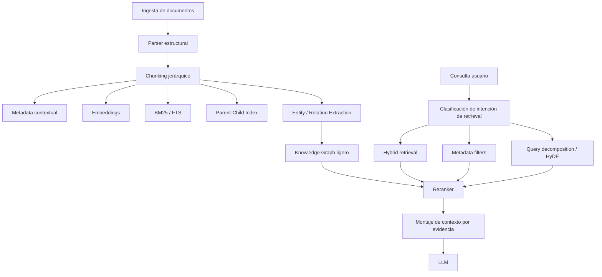

# Plan de mejora y migración a un RAG escalable, agnóstico al corpus y mantenible

> [!abstract]
> Este documento define la salida del RAG actual basado en reglas manuales y `topics`, y propone una migración progresiva hacia un sistema de recuperación híbrida, jerárquica, contextual y enriquecida con entidades/relaciones. El objetivo es que el sistema funcione con corpus pequeños, medianos y grandes sin depender de taxonomías mantenidas a mano.

---

## 1. Resumen ejecutivo

El RAG actual ha servido para validar el agente de documentación, pero presenta un límite estructural: para resolver consultas ambiguas o de vocabulario pobre se ha tenido que introducir conocimiento manual en la capa de retrieval, especialmente en `src/utils/doc_topics.py`. Eso mejora precisión a corto plazo, pero no escala con crecimiento del corpus, incorporación de nuevas tipologías de documentos ni cambios de vocabulario de los usuarios.

La dirección recomendada es:

1. **Reducir drásticamente la lógica manual por documento**.
2. **Mover inteligencia a la ingesta**: estructura, metadata, entidades, relaciones y resúmenes.
3. **Pasar a retrieval multietapa**: sparse + dense + reranking.
4. **Introducir retrieval jerárquico**: child chunks para recall, parent sections para contexto.
5. **Reservar grafo y retrieval avanzado para consultas multi-hop**, no para todas.
6. **Evaluar el RAG como sistema de recuperación**, no solo por calidad final de la respuesta.

La migración no debe hacerse como un “big bang”. Debe plantearse en fases, con compatibilidad transitoria, métricas offline y cutover progresivo.

---

## 2. Diagnóstico del sistema actual

## 2.1. Estado actual

La implementación actual del agente de documentación combina:

- **ChromaDB + embeddings**
- **BM25**
- **Query expansion manual**
- **Reranking heurístico**
- **Búsqueda por chunks**
- **Recorte de contexto**
- **Sesgo temático manual** mediante `doc_topics.py`

Puntos observados en el código y en las pruebas:

- `src/utils/doc_tools.py` aplica un flujo híbrido razonable, pero sigue dependiendo de `infer_query_topic()` para desambiguar consultas globales.
- `src/utils/doc_topics.py` codifica a mano temas, aliases y boosts. Esto resuelve casos concretos, pero convierte el RAG en un sistema parcialmente acoplado al corpus actual.
- El sistema recupera mejor que antes, pero cuando la consulta usa vocabulario lateral o implícito, el matching sigue dependiendo demasiado de heurísticas manuales.
- Las métricas de retrieval (`logs/retrieval_metrics.jsonl`) ayudan, pero todavía no hay una evaluación sistemática de **recall@k**, **nDCG**, **faithfulness** ni hit-rate de fuente correcta.

## 2.2. Problemas estructurales

### Problema A — Dependencia de `topics`

Si cada documento o familia documental necesita aliases, boosts y reglas compuestas, el coste de mantenimiento crece de forma lineal con el corpus y exponencial con la variedad de preguntas.

### Problema B — Chunking insuficientemente semántico

Aunque ya existe chunking adaptativo, el sistema aún opera sobre una representación centrada en texto partido, no en **unidades estructurales enriquecidas** (sección, procedimiento, comando, artefacto, entidad, relación).

### Problema C — Retrieval sin política por tipo de consulta

No todas las consultas necesitan la misma estrategia:

- una consulta exacta sobre un fichero o comando necesita fuerte señal lexical
- una consulta procedimental necesita secciones completas
- una consulta compleja necesita varios puntos de evidencia
- una consulta de síntesis necesita resumen jerárquico o expansión por relaciones

Hoy gran parte de estas diferencias se resuelve con reglas y no con una política de retrieval explícita.

### Problema D — Reranking todavía limitado

El reranker heurístico mejora precisión, pero en corpus medianos/grandes es preferible un reranking con mejor capacidad semántica y matching fino.

### Problema E — Ausencia de capa relacional

Muchos documentos técnicos expresan relaciones reutilizables:

- `pre-commit -> va en -> .git/hooks`
- `post-commit -> genera -> informeCommits`
- `bind9 -> se instala con -> apt install`
- `merge --squash -> se usa en -> PR/PCI`

Sin esa capa relacional, el sistema depende demasiado de coincidencias textuales o embeddings.

---

## 3. Objetivos de la migración

## 3.1. Objetivo principal

Construir un RAG que:

- sea **agnóstico al número de documentos**
- no requiera **mantener topics manuales**
- escale desde un corpus pequeño hasta uno grande
- combine **retrieval textual, semántico, jerárquico y relacional**
- permita **explicabilidad**, **observabilidad** y **evaluación continua**

## 3.2. Objetivos secundarios

- Reducir falsos negativos en consultas con vocabulario indirecto.
- Reducir mezcla de chunks irrelevantes.
- Mejorar grounding y citas.
- Mantener costes y latencia bajo control.
- Permitir crecimiento del corpus sin rediseñar el retrieval cada vez.

---

## 4. Principios de diseño

1. **El conocimiento se extrae en ingesta, no en hardcode**.
2. **El retrieval debe ser multietapa y especializado por consulta**.
3. **El chunk es una unidad de búsqueda; la sección es una unidad de contexto**.
4. **Las entidades y relaciones se modelan con procedencia**.
5. **La capa generativa no debe compensar un retrieval pobre**.
6. **El sistema debe medirse con métricas de IR y no solo con impresiones subjetivas**.

---

## 5. Estrategia por tamaño de corpus

## 5.1. Corpus pequeño

**Rango orientativo:** hasta ~200k tokens totales o colección muy pequeña y estable.

### Estrategia recomendada

- Si cabe en contexto y el coste es aceptable, considerar **full-context** o **prompt caching**.
- Si no cabe completo, usar:
  - BM25 + vectores
  - parent-child retrieval
  - reranking ligero
  - metadata contextual automática

### Qué no merece la pena aún

- GraphRAG completo
- infraestructura distribuida
- knowledge graph complejo
- routing documental manual masivo

### Aplicación al proyecto

El corpus actual todavía está cerca de la zona en la que una arquitectura más simple puede funcionar muy bien si se mejora la ingesta y el reranking.

## 5.2. Corpus mediano

**Rango orientativo:** decenas o cientos de documentos técnicos heterogéneos.

### Estrategia recomendada

- retrieval híbrido fuerte
- contextual embeddings y contextual BM25
- parent-child retrieval
- metadata y resumen contextual por chunk/sección
- extractor de entidades/artefactos/relaciones
- reranker semántico fuerte
- query decomposition para consultas complejas

### Aplicación al proyecto

Esta es la zona objetivo inmediata para el siguiente salto de calidad.

## 5.3. Corpus grande

**Rango orientativo:** cientos o miles de documentos, múltiples dominios, crecimiento continuo.

### Estrategia recomendada

- índices separados por granularidad
- vector DB escalable
- índices invertidos/FTS
- knowledge graph ligero o GraphRAG selectivo
- ingestión incremental
- observabilidad detallada
- evaluación offline y shadow testing

### Aplicación al proyecto

Debe diseñarse desde ahora para no volver a rehacer el RAG cuando el corpus crezca.

---

## 6. Arquitectura objetivo



## 6.1. Capas

### A. Ingesta estructural

Cada documento debe convertirse en una jerarquía:

- documento
- sección
- subsección
- chunk hijo
- artefactos detectados

### B. Enriquecimiento automático

No se define “topic” a mano por documento. En su lugar, se extrae automáticamente:

- resumen contextual breve
- tipo de contenido
- entidades
- relaciones
- comandos
- scripts
- rutas
- IPs
- nombres de ficheros
- productos/herramientas

### C. Índices múltiples

No debe existir un único índice.

Índices recomendados:

1. **Sparse / BM25 / FTS**
2. **Dense vectors**
3. **Parent-child**
4. **Entity index**
5. **Relation index / grafo**

### D. Query planner

La consulta no debe entrar siempre por el mismo camino.

Políticas mínimas:

- **Exact match lookup** → lexical first
- **How-to / procedimiento** → parent-child + rerank por secciones
- **Consulta ambigua** → hybrid + contextual retrieval
- **Consulta multi-hop** → decomposition + grafo
- **Consulta pobre o paraphraseada** → HyDE o expansion contextual

---

## 7. Ingesta y preparación del corpus

## 7.1. Parsing estructural

El parser debe reconocer:

- headings
- listas numeradas
- callouts
- tablas
- bloques de código
- comandos shell
- rutas de filesystem
- identificadores
- imágenes o referencias relevantes

## 7.2. Chunking jerárquico

Se recomienda abandonar el chunking puramente lineal como mecanismo dominante.

Modelo propuesto:

- **Parent node:** sección o subsección completa
- **Child node:** fragmentos de 200-500 tokens
- **Window metadata:** contexto local del chunk (encabezado, sección, vecinos)

### Objetivo

- recuperar con alta precisión a nivel fino
- entregar al LLM contexto coherente a nivel de sección

## 7.3. Metadata contextual automática

Cada chunk debería almacenar campos como:

| Campo | Finalidad |
|---|---|
| `doc_id` | Identidad del documento |
| `section_path` | Ruta jerárquica de headings |
| `chunk_summary` | Resumen de 1-2 frases |
| `content_type` | procedimiento, troubleshooting, referencia, tabla, comando |
| `entities` | herramientas, productos, conceptos, scripts |
| `relations` | triples extraídos |
| `commands` | comandos shell detectados |
| `paths` | rutas relevantes |
| `artifacts` | ficheros, hooks, scripts, reports |
| `source_authority` | señal opcional de confiabilidad |

## 7.4. Extracción de entidades

### Entidades útiles en este proyecto

- herramientas: Git, SourceTree, TortoiseGit, SonarQube, Cantata
- artefactos: `pre-commit`, `post-commit`, `informeCommits`
- rutas: `.git/hooks`, `opt/mc_ttcf/bin/log/EVENTS`
- scripts: `build_DVDs.sh`, `pipeline_update_sonar.sh`
- comandos: `git merge --squash`, `ssh -o ...`
- infraestructura: IPs, hostnames, VLANs, VMs

### Estrategia recomendada

1. **Regex/rules** para artefactos técnicos de alta precisión.
2. **NER/modelos ligeros** para entidades generales.
3. **LLM extraction offline** para entidades semánticas más abstractas.

## 7.5. Extracción de relaciones

Las relaciones deben almacenarse como triples con procedencia:

```text
pre-commit -> se_ubica_en -> .git/hooks
post-commit -> genera -> informeCommits
build_DVDs.sh -> se_ejecuta_desde -> Development_TTCF/ttcf/utils/dvds
merge --squash -> se_usa_en -> PR/PCI
```

### Reglas de diseño

- cada relación debe tener `source_chunk_id`
- evitar relaciones inventadas: extracción conservadora
- empezar por taxonomía corta de relaciones, no por ontología enorme

---

## 8. Técnicas recomendadas

## 8.1. Hybrid retrieval

Debe mantenerse como base:

- **BM25/FTS** para términos exactos
- **dense embeddings** para semántica

No se recomienda abandonar ninguno de los dos.

## 8.2. Contextual Retrieval

Recomendado como mejora prioritaria.

Consiste en enriquecer cada chunk con contexto adicional en el momento de embed/index:

- resumen local
- contexto de sección
- información de documento padre

Beneficio: reduce fallos cuando el chunk aislado pierde semántica.

## 8.3. Parent-child retrieval

Recuperar hijos, responder con padres.

Es probablemente la mejora de más impacto/coste razonable para el proyecto actual.

## 8.4. Reranking fuerte

Evolución recomendada del reranker actual:

- **cross-encoder** si el corpus sigue siendo medio
- **ColBERT** o late interaction si crece mucho y hace falta precisión a gran escala

## 8.5. HyDE

Útil para:

- consultas mal formuladas
- preguntas con gran distancia léxica respecto al manual
- entornos con pocos labels

No debe ser el camino por defecto para todas las queries.

## 8.6. Query decomposition

Recomendado para consultas que combinan varios requisitos:

- “qué archivo copiar”
- “dónde configurarlo”
- “cómo automatizar”

El sistema puede descomponer y reunir evidencia.

## 8.7. RAPTOR / resúmenes jerárquicos

Adecuado cuando:

- los documentos son muy largos
- se piden respuestas de síntesis
- hace falta recuperar el “big picture” y no solo el fragmento

## 8.8. GraphRAG / knowledge graph

Recomendado de forma **selectiva**, no universal.

Usarlo cuando:

- la pregunta requiere conectar entidades dispersas
- hay necesidad de trazabilidad o explicabilidad relacional
- la recuperación plana falla sistemáticamente en consultas multi-hop

---

## 9. Qué debemos retirar o degradar a fallback

## 9.1. `doc_topics.py` como mecanismo principal

Debe pasar de:

- **motor principal de sesgo**

a:

- **fallback temporal para edge cases**

## 9.2. Boosts manuales por documento

Deben sustituirse por:

- metadata contextual automática
- entity/relation retrieval
- reranking fuerte

## 9.3. Asumir que el documento es la unidad semántica principal

La unidad principal debe pasar a ser:

- **evidencia estructurada y enriquecida**

---

## 10. Roadmap de migración

## Fase 0 — Congelación del baseline y observabilidad

### Objetivo

Medir bien antes de tocar arquitectura.

### Acciones

- mantener `tests/test_doc_eval.py` y expandirlo
- añadir dataset de queries etiquetadas
- registrar:
  - recall@k
  - precision@k
  - nDCG@k
  - hit de documento correcto
  - hit de sección correcta
  - faithfulness
  - latencia por etapa

### Entregables

- benchmark offline reproducible
- dashboard de retrieval

## Fase 1 — Ingesta estructural y metadata contextual

### Objetivo

Hacer que el corpus se describa a sí mismo.

### Acciones

- rediseñar parser/chunker
- generar `section_path`
- generar `chunk_summary`
- extraer `commands`, `paths`, `artifacts`, `entities`
- persistir metadata en índice y/o SQLite

### Resultado esperado

Reducción fuerte de dependencia de topics manuales.

## Fase 2 — Parent-child + reranker fuerte

### Objetivo

Mejorar recall fino y contexto final.

### Acciones

- indexar child chunks
- devolver parent sections
- introducir cross-encoder o late interaction reranker
- reducir mezcla de chunks irrelevantes

### Resultado esperado

Mejora clara en preguntas procedimentales y de troubleshooting.

## Fase 3 — Auto-retrieval y políticas de consulta

### Objetivo

Elegir estrategia de retrieval según el tipo de pregunta.

### Acciones

- clasificador de política de retrieval
- lexical-first para identificadores exactos
- decomposition para consultas compuestas
- HyDE como fallback controlado

### Resultado esperado

Menos queries “perdidas” y menos necesidad de parches manuales.

## Fase 4 — Entidades y relaciones

### Objetivo

Incorporar capa relacional sin sobredimensionar la solución.

### Acciones

- tabla/índice de entidades
- tabla/índice de relaciones
- expansión de vecinos en query time
- provenance por chunk

### Resultado esperado

Mejora en preguntas implícitas, ambiguas o multi-hop.

## Fase 5 — GraphRAG selectivo

### Objetivo

Usar grafo solo donde aporta.

### Acciones

- community summaries o subgrafos temáticos
- activación por tipo de consulta
- comparar contra retrieval plano

### Resultado esperado

Capacidad de síntesis y conexión entre documentos sin disparar coste global.

## Fase 6 — Cutover y retirada de lógica obsoleta

### Objetivo

Retirar el RAG manual sin perder precisión.

### Acciones

- pasar `doc_topics.py` a compatibilidad transitoria
- eliminar boosts manuales que queden cubiertos por metadata y reranker
- mantener solo reglas explícitas para casos de negocio realmente especiales

---

## 10.7. Criterios de éxito por fase

Cada fase debe tener criterios de salida explícitos. No se debe promover una fase a producción solo porque “parece mejor”.

| Fase | Criterio de éxito mínimo | Criterio operativo |
|---|---|---|
| **Fase 0** | Dataset de evaluación estable, con queries etiquetadas por documento y sección correcta | Dashboard con latencia, retrieval y calidad |
| **Fase 1** | Mejora o no regresión en **Top-1 document hit** y **Top-1 section hit** respecto al baseline | Tiempo de indexación asumible y metadata sin explosión de ruido |
| **Fase 2** | Mejora medible en **Recall@k**, **nDCG@k** y reducción de abstenciones falsas | Latencia del reranker dentro del presupuesto |
| **Fase 3** | Menor tasa de queries perdidas y menor dependencia de parches manuales | Clasificación de política de retrieval explicable en logs |
| **Fase 4** | Mejora en queries implícitas y multi-hop frente al baseline plano | Índice de entidades/relaciones con provenance verificable |
| **Fase 5** | GraphRAG solo se conserva si supera retrieval plano en casos complejos con coste aceptable | Activación selectiva por query, no global |
| **Fase 6** | `doc_topics.py` deja de ser pieza central sin degradación material de calidad | Operación estable tras reindexado y rollback probado |

### Umbrales recomendados

- **Recall@5**: no menor que el baseline; objetivo inicial +10% en queries problemáticas.
- **nDCG@5**: mejora sostenida en consultas procedimentales y de troubleshooting.
- **Top-1 document hit**: objetivo >= 80% en dataset de regresión.
- **Top-1 section hit**: objetivo >= 70% en consultas how-to o rutas/comandos.
- **Faithfulness**: no introducir incremento de alucinaciones; objetivo >= baseline + auditoría manual.
- **Latencia total**: no superar el presupuesto de UX ya aceptado para el chat.
- **Coste de ingesta**: compatible con reindexados completos nocturnos o incrementales durante ventana operativa.

## 10.8. Esquema de datos objetivo

El sistema debe dejar de depender de metadata pobre embebida solo en memoria y pasar a un esquema explícito, versionable y auditable.

### Tablas mínimas recomendadas

```sql
CREATE TABLE rag_documents (
    id TEXT PRIMARY KEY,
    source_path TEXT NOT NULL UNIQUE,
    file_name TEXT NOT NULL,
    doc_hash TEXT NOT NULL,
    doc_type TEXT,
    language TEXT,
    title TEXT,
    last_indexed_at DATETIME,
    index_version TEXT NOT NULL,
    status TEXT NOT NULL DEFAULT 'active'
);

CREATE TABLE rag_sections (
    id TEXT PRIMARY KEY,
    document_id TEXT NOT NULL,
    parent_section_id TEXT,
    level INTEGER NOT NULL,
    heading TEXT,
    section_path TEXT NOT NULL,
    section_summary TEXT,
    ordinal INTEGER NOT NULL,
    FOREIGN KEY (document_id) REFERENCES rag_documents(id)
);

CREATE TABLE rag_chunks (
    id TEXT PRIMARY KEY,
    document_id TEXT NOT NULL,
    section_id TEXT,
    parent_chunk_id TEXT,
    chunk_kind TEXT NOT NULL,
    chunk_text TEXT NOT NULL,
    chunk_summary TEXT,
    token_count INTEGER,
    ordinal INTEGER NOT NULL,
    source_start_line INTEGER,
    source_end_line INTEGER,
    embedding_model TEXT,
    embedding_hash TEXT,
    index_version TEXT NOT NULL,
    FOREIGN KEY (document_id) REFERENCES rag_documents(id),
    FOREIGN KEY (section_id) REFERENCES rag_sections(id)
);

CREATE TABLE rag_chunk_artifacts (
    id INTEGER PRIMARY KEY AUTOINCREMENT,
    chunk_id TEXT NOT NULL,
    artifact_type TEXT NOT NULL,
    artifact_value TEXT NOT NULL,
    normalized_value TEXT,
    confidence REAL,
    FOREIGN KEY (chunk_id) REFERENCES rag_chunks(id)
);

CREATE TABLE rag_entities (
    id TEXT PRIMARY KEY,
    canonical_name TEXT NOT NULL,
    entity_type TEXT NOT NULL,
    normalized_name TEXT NOT NULL,
    aliases_json TEXT,
    first_seen_at DATETIME,
    last_seen_at DATETIME
);

CREATE TABLE rag_chunk_entities (
    chunk_id TEXT NOT NULL,
    entity_id TEXT NOT NULL,
    mention_text TEXT NOT NULL,
    confidence REAL,
    PRIMARY KEY (chunk_id, entity_id, mention_text),
    FOREIGN KEY (chunk_id) REFERENCES rag_chunks(id),
    FOREIGN KEY (entity_id) REFERENCES rag_entities(id)
);

CREATE TABLE rag_relations (
    id TEXT PRIMARY KEY,
    subject_entity_id TEXT NOT NULL,
    relation_type TEXT NOT NULL,
    object_entity_id TEXT,
    object_literal TEXT,
    source_chunk_id TEXT NOT NULL,
    confidence REAL,
    extraction_method TEXT NOT NULL,
    FOREIGN KEY (subject_entity_id) REFERENCES rag_entities(id),
    FOREIGN KEY (source_chunk_id) REFERENCES rag_chunks(id)
);

CREATE TABLE rag_index_runs (
    id TEXT PRIMARY KEY,
    started_at DATETIME NOT NULL,
    completed_at DATETIME,
    mode TEXT NOT NULL,
    index_version TEXT NOT NULL,
    documents_seen INTEGER DEFAULT 0,
    documents_reindexed INTEGER DEFAULT 0,
    chunks_written INTEGER DEFAULT 0,
    status TEXT NOT NULL,
    notes TEXT
);
```

### Campos esenciales por objetivo

| Campo | Para qué sirve |
|---|---|
| `section_path` | retrieval jerárquico y contexto padre |
| `chunk_summary` | contextual retrieval |
| `chunk_kind` | política de retrieval por tipo de evidencia |
| `artifact_type` / `artifact_value` | búsqueda exacta de comandos, rutas, scripts, IPs |
| `entity_type` | filtrado y expansión relacional |
| `source_chunk_id` | provenance y auditoría |
| `index_version` | rollback y convivencia de índices versionados |

## 10.9. Política operativa de desactivación y rollback

Durante la implementación, el RAG actual se considera **desactivado para usuarios**. No se planifica convivencia visible entre la versión vieja y la nueva en runtime. Se notificará a los usuarios cuando el agente de documentación esté en mantenimiento o degradado.

### Reglas operativas

1. **No exponer fases incompletas** a usuarios finales.
2. **Anunciar ventana de mantenimiento** antes de cambios de índice o pipeline.
3. **Congelar el baseline** antes de cada salto de fase para poder comparar.
4. **Mantener rollback técnico**, aunque no haya convivencia funcional.

### Rollback mínimo exigible

- conservar el índice estable anterior durante cada reindexado importante
- versionar embeddings, metadata y esquema de extracción
- poder volver al índice previo con un cambio de puntero/configuración
- documentar el procedimiento de rollback antes del primer corte

### Casos que obligan a rollback

- caída material de recall o nDCG respecto al baseline
- incremento de abstenciones falsas
- degradación severa de latencia
- rotura de provenance/citas
- reindexado inconsistente o incompleto

## 10.10. Política de extracción

La extracción debe ser **conservadora, incremental y trazable**. No todo debe extraerse con el mismo mecanismo.

### Qué extraer con reglas/regex

Adecuado para elementos de alta precisión y formato reconocible:

- rutas (`.git/hooks`, `/opt/...`)
- comandos shell
- IPs, puertos, VLANs
- nombres de script (`build_DVDs.sh`)
- ficheros y artefactos técnicos (`pre-commit`, `post-commit`, `informeCommits`)

### Qué extraer con modelos ligeros o NER

Adecuado para:

- herramientas y productos
- conceptos técnicos recurrentes
- tipos de infraestructura
- entidades con cierta variabilidad léxica

### Qué extraer con LLM offline

Reservado para:

- resúmenes de sección/chunk
- relaciones semánticas no triviales
- clasificación de tipo de contenido
- normalización de evidencias difíciles de capturar por reglas

### Qué no debe extraerse automáticamente sin validación

- conclusiones interpretativas largas
- relaciones de negocio ambiguas
- metadata que no pueda trazarse a un chunk concreto
- taxonomías abiertas que añadan más ruido que señal

### Regla de calidad

> [!warning]
> Es preferible extraer menos y con alta precisión que llenar el índice de metadata dudosa que degrade retrieval y reranking.

## 10.11. Plan operativo de reindexado

La migración exige asumir que el índice y la metadata van a evolucionar. Por tanto, el reindexado debe diseñarse como operación de primera clase.

### Tipos de reindexado

#### Reindexado completo

Usarlo cuando cambien:

- estrategia de chunking
- embedding model
- schema de metadata
- extractor de entidades/relaciones
- versión mayor del índice

#### Reindexado incremental

Usarlo cuando cambien:

- documentos individuales
- pequeños lotes
- correcciones puntuales de parsing o metadata

### Reglas recomendadas

1. **Versionar el índice** (`index_version`).
2. **Mantener manifests/hash por documento** para detectar cambios reales.
3. **Invalidar cachés** cuando cambie embedding model, parser o metadata crítica.
4. **No borrar el índice previo** hasta validar el nuevo.
5. **Registrar cada ejecución** en `rag_index_runs`.

### Flujo de operación recomendado

1. generar nueva versión de índice
2. indexar en ubicación aislada
3. ejecutar benchmark offline
4. validar métricas y consistencia
5. notificar mantenimiento
6. cambiar puntero al nuevo índice
7. monitorizar
8. retirar índice previo solo cuando se estabilice

### Decisiones operativas pendientes

- si ChromaDB actual sigue siendo suficiente o conviene un almacén vectorial más preparado para crecimiento
- si SQLite sigue siendo el mejor backend para metadata relacional o si se separa el almacenamiento
- si el grafo se modela primero en SQLite o se externaliza más adelante

---

## 11. Mapeo del sistema actual al sistema objetivo

| Componente actual | Problema | Evolución recomendada |
|---|---|---|
| `doc_topics.py` | conocimiento hardcodeado | metadata/entidades automáticas + fallback temporal |
| `document_loader.py` | metadata limitada | parser estructural + metadata contextual |
| `chunker.py` | granularidad todavía centrada en texto | parent-child + structural chunking |
| `hybrid_retriever.py` | base buena pero insuficiente sola | hybrid + contextual retrieval + policy routing |
| `reranker.py` | heurístico | cross-encoder o ColBERT |
| `search_modes.py` | útil para filtros explícitos | mantener para filtros explícitos, no como sustituto de retrieval inteligente |
| `retrieval_metrics.py` | observabilidad parcial | suite completa de métricas IR + answer quality |

---

## 12. Evaluación recomendada

## 12.1. Métricas de retrieval

- **Recall@k**
- **Precision@k**
- **MRR**
- **nDCG@k**
- **Top-1 section hit**
- **Top-1 document hit**

## 12.2. Métricas de respuesta

- **Faithfulness**
- **Citation correctness**
- **Answer completeness**
- **Abstention correctness**

## 12.3. Métricas operativas

- latencia por etapa
- coste de embeddings
- coste de reranking
- tamaño del índice
- tiempo de reindexado
- tasa de cache hit

## 12.4. Evaluación continua

- dataset fijo de regresión
- shadow eval con tráfico real anonimizado
- muestreo manual periódico
- alertas por caída de recall o aumento de abstenciones falsas

---

## 13. Riesgos y mitigaciones

| Riesgo | Impacto | Mitigación |
|---|---|---|
| Extraer demasiada metadata ruidosa | baja precisión | pipeline conservador + whitelist de artefactos |
| Grafo sobredimensionado demasiado pronto | complejidad innecesaria | introducirlo en fase 4 y de forma selectiva |
| Latencia del reranker | experiencia peor | top-k pequeño + reranking solo en candidatos |
| Reindexados costosos | operativa compleja | indexación incremental y manifests |
| Regresiones ocultas | pérdida de calidad | benchmark fijo + shadow testing |

---

## 14. Recomendación final para este proyecto

La secuencia recomendada no es “pasar directamente a GraphRAG”, sino esta:

1. **Ingesta estructural + metadata contextual automática**
2. **Parent-child retrieval**
3. **Reranker fuerte**
4. **Política de retrieval por tipo de consulta**
5. **Entidades y relaciones**
6. **GraphRAG selectivo solo si sigue siendo necesario**

### Decisión explícita

> [!success]
> La mejora estructural correcta no es crear más `topics`, sino construir un corpus auto-descrito y recuperar por evidencia estructural, semántica y relacional.

---

## 15. Acciones concretas para el próximo ciclo

- [ ] Congelar benchmark actual y ampliar dataset de evaluación.
- [ ] Diseñar nuevo esquema de metadata por chunk y sección.
- [ ] Implementar parent-child retrieval en la nueva rama/pipeline de mantenimiento con el RAG actual desactivado para usuarios.
- [ ] Evaluar un reranker más fuerte sobre top-k pequeños.
- [ ] Definir extractor de artefactos técnicos (scripts, rutas, comandos, IPs, hooks).
- [ ] Diseñar tablas SQLite o índice auxiliar para entidades y relaciones.
- [ ] Convertir `doc_topics.py` en fallback temporal y documentar su retirada.

---

## 16. Fuentes consultadas

## 16.1. Fuentes externas

1. **Anthropic — Contextual Retrieval**  
   <https://www.anthropic.com/news/contextual-retrieval>  
   Idea clave: contextual embeddings + contextual BM25 para reducir fallos de retrieval.

2. **Microsoft GraphRAG**  
   <https://microsoft.github.io/graphrag/>  
   Idea clave: extracción de entidades, relaciones, comunidades y resúmenes jerárquicos para consultas complejas.

3. **GraphRAG paper / Microsoft Research**  
   <https://arxiv.org/pdf/2404.16130>  
   Idea clave: el grafo supera al RAG plano en preguntas que requieren “connect the dots”.

4. **HyDE: Hypothetical Document Embeddings**  
   <https://arxiv.org/abs/2212.10496>  
   Idea clave: generar un pseudo-documento intermedio para mejorar retrieval zero-shot o queries pobres.

5. **RAPTOR: Recursive Abstractive Processing for Tree-Organized Retrieval**  
   <https://arxiv.org/abs/2401.18059>  
   Idea clave: retrieval jerárquico mediante clustering y resúmenes recursivos.

6. **ColBERT: Efficient and Effective Passage Search via Contextualized Late Interaction over BERT**  
   <https://arxiv.org/abs/2004.12832>  
   Idea clave: late interaction para reranking/retrieval con alta precisión y buena escalabilidad.

7. **OpenAI — Evaluating RAG**  
   <https://platform.openai.com/docs/guides/rag/evaluating-rag>  
   Idea clave: evaluación separada de retrieval y generación.

8. **Haystack — Advanced Evaluation Metrics for RAG**  
   <https://haystack.deepset.ai/blog/advanced-evaluation-metrics-for-retrieval-augmented-generation-rag>  
   Idea clave: recall, precision, ranking quality y calidad final de respuesta.

## 16.2. Fuentes internas del proyecto

- `src/utils/doc_tools.py`
- `src/utils/doc_topics.py`
- `src/utils/document_loader.py`
- `src/utils/hybrid_retriever.py`
- `src/utils/reranker.py`
- `src/utils/retrieval_metrics.py`
- `tests/test_doc_eval.py`
- `logs/retrieval_metrics.jsonl`
- [[Sistema-RAG-v2]]
- [[Agente-Documentacion]]

---

## 17. Estado de adopción recomendado

| Horizonte | Decisión |
|---|---|
| Inmediato | dejar de ampliar `topics` salvo como contención temporal |
| Corto plazo | metadata contextual + parent-child + reranker fuerte |
| Medio plazo | entidades/relaciones + query policies |
| Largo plazo | GraphRAG selectivo, no universal |

---

## 18. Conclusión

El RAG actual ya no debe evolucionar añadiendo más conocimiento manual por documento. Eso solo desplaza el problema. La salida correcta es migrar a un sistema donde el corpus se enriquece automáticamente, el retrieval selecciona estrategia según el tipo de consulta y la capa relacional se usa cuando realmente aporta valor.

Si esta migración se ejecuta por fases y con evaluación estricta, el agente de documentación puede pasar de un RAG artesanal y manual a una plataforma de retrieval mantenible, explicable y preparada para crecer con el corpus.
