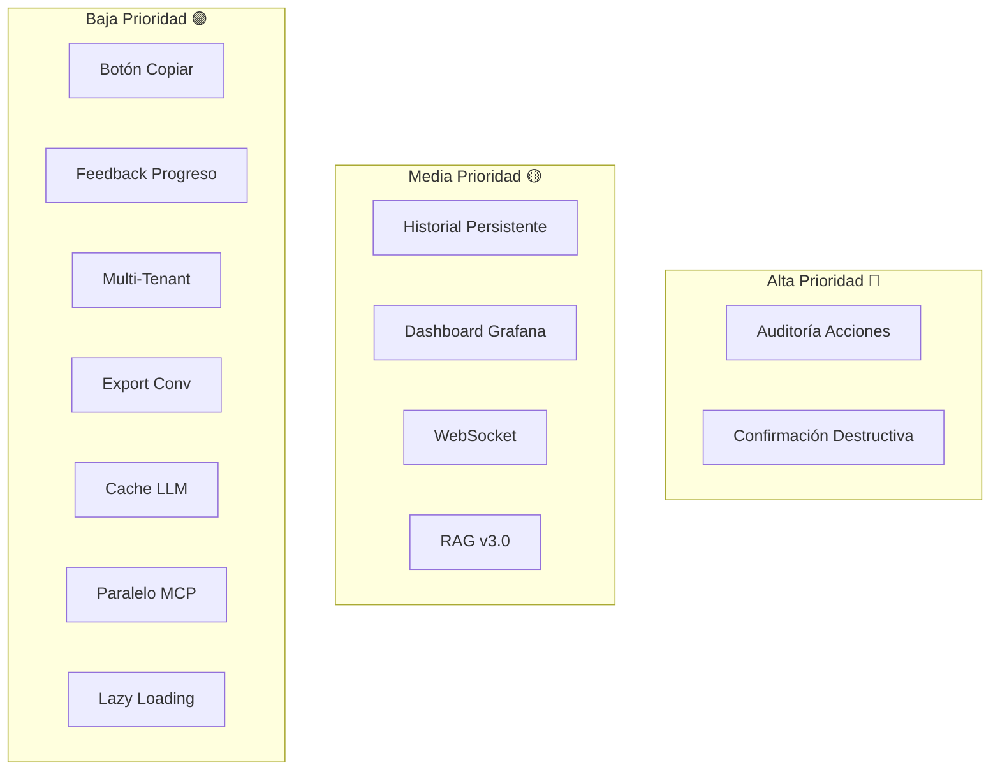

# 🚀 Propuestas de Mejoras Funcionales

> Análisis de mejoras propuestas para vCenter Multi-Agent System. Incluye prioridades, esfuerzo estimado y estado de implementación.

***
## 📊 Resumen Ejecutivo

17 mejoras identificadas en 5 categorías tras análisis completo del sistema:

| Categoría | Mejoras | Implementadas | Pendientes |
|-----------|---------|---------------|------------|
| **UX & Frontend** | 6 | 3 ✅ | 3 ⏳ |
| **Seguridad** | 3 | 0 | 3 ⏳ |
| **Funcionalidades** | 3 | 0 | 3 ⏳ |
| **Arquitectura** | 3 | 0 | 3 ⏳ |
| **Performance** | 2 | 0 | 2 ⏳ |

***
## Categoría 1: UX & Frontend

### ✅ Mejora 1: Streaming de Respuestas en Chat

**Estado:** ✅ Implementada (Febrero 2026)  
**Prioridad:** 🔴 Alta  
**Esfuerzo:** Medio (3-5 días)

**Problema:** Chat esperaba respuesta completa del LLM (10-30s) mostrando solo spinner.

**Solución Implementada:**
- Endpoint `/chat/stream` con SSE (Server-Sent Events)
- Eventos: `routing`, `heartbeat`, `token`, `done`, `error`
- Routing inmediato (~0ms)
- Heartbeats cada 2s durante procesamiento
- Fallback automático a `/chat` si SSE falla

**Protocolo SSE:**
```
event: routing   → "Consultando agente vCenter..."
event: heartbeat → "⏳ 4s"
event: token     → Texto palabra a palabra
event: done      → Respuesta completa + metadata
```

**Archivos:** `src/api/main_agent.py`, `static/js/orchestrator_chat_auth.js`

***
### ⏳ Mejora 2: Historial de Conversación Persistente

**Estado:** ⏳ Pendiente  
**Prioridad:** 🟡 Media  
**Esfuerzo:** Medio (2-4 días)

**Problema:** Al recargar página o nueva sesión, historial desaparece completamente.

**Solución Propuesta:**
```sql
CREATE TABLE conversation_history (
    id INTEGER PRIMARY KEY AUTOINCREMENT,
    username TEXT NOT NULL,
    role TEXT NOT NULL,       -- 'user' | 'agent'
    agent_type TEXT,          -- 'vcenter' | 'documentation' | 'general'
    message TEXT NOT NULL,
    timestamp DATETIME DEFAULT CURRENT_TIMESTAMP
);
```

**Beneficio:** Continuidad entre sesiones sin perder contexto.

**Archivos:** `src/api/main_agent.py`, `data/users.db`, frontend JS/HTML

***
### ✅ Mejora 3: Indicador de Agente Activo

**Estado:** ✅ Implementada como parte de Mejora 1  
**Prioridad:** 🟡 Media  
**Esfuerzo:** Bajo (1 día)

**Implementación:** Evento `routing` de SSE muestra agente target antes del procesamiento.

Mensajes implementados:
- `vcenter` → "Consultando agente vCenter..."
- `documentation` → "Buscando en documentación..."
- `general` → "Procesando respuesta..."

***
### ⏳ Mejora 4: Botón de Copiar en Respuestas

**Estado:** ⏳ Pendiente  
**Prioridad:** 🟢 Baja  
**Esfuerzo:** Bajo (0.5 días)

**Problema:** Respuestas contienen tablas, IPs, comandos que requieren copia manual.

**Solución Propuesta:**
```javascript
function add(role, text, agentName) {
    const bubble = document.createElement('div');
    if (role === 'agent') {
        const copyBtn = document.createElement('button');
        copyBtn.textContent = '📋 Copiar';
        copyBtn.onclick = () => {
            navigator.clipboard.writeText(text);
            copyBtn.textContent = '✅ Copiado';
            setTimeout(() => copyBtn.textContent = '📋 Copiar', 2000);
        };
        bubble.appendChild(copyBtn);
    }
    // ...
}
```

**Beneficio:** Mejora usabilidad para usuarios técnicos.

***
### ⏳ Mejora 5: Feedback de Progreso en Operaciones Largas

**Estado:** ⏳ Pendiente  
**Prioridad:** 🟢 Baja  
**Esfuerzo:** Medio (2-3 días)

**Problema:** Operaciones como deploy de VMs tardan 60-120s sin indicación de progreso.

**Solución Propuesta:**
1. Endpoint `/chat` devuelve `job_id` para operaciones largas
2. Cliente hace polling a `/api/job/<job_id>/status`
3. MCP tools publican estados: "Preparando template...", "Configurando red...", "Iniciando VM..."

**Arquitectura:**
```python
# En mcp_tool_registry.py
def deploy_vm_from_template(...):
    job_id = create_job(username, "deploy_vm")
    update_job_status(job_id, "Preparando template...")
    # ... operación
    update_job_status(job_id, "Configurando red...")
    # ...
    complete_job(job_id, result)
```

**Beneficio:** Elimina percepción de sistema colgado.

***
### ✅ Mejora 16: Renderizado de Markdown

**Estado:** ✅ Implementada (Febrero 2026)  
**Prioridad:** 🔴 Alta  
**Esfuerzo:** Bajo (0.5 días)

**Problema:** LLM genera Markdown (`#`, `**`, ` ``` `), pero chat mostraba texto crudo.

**Solución Implementada:**
- **marked.js v15** (~40KB) para parsing Markdown
- GFM (GitHub Flavored Markdown): tablas, fenced code, listas
- Syntax highlighting para bloques de código
- Preservación de HTML de attachments del servidor

**Archivos:** `static/js/marked.min.js`, `orchestrator_chat_auth.js`, CSS estilos Markdown

***
## Categoría 2: Seguridad

### ⏳ Mejora 6: Auditoría de Acciones Críticas

**Prioridad:** 🔴 Alta  
**Esfuerzo:** Bajo (1-2 días)

**Problema:** No hay registro granular de operaciones destructivas (delete VM, remove snapshot).

**Solución Propuesta:**
- Extender `logs/audit/audit.log` con categoría "destructive_action"
- Log antes y después de ejecución con metadatos:
  - Usuario
  - Acción (delete_vm, remove_snapshot, etc.)
  - Target (vm_name, snapshot_id)
  - Timestamp
  - Resultado (success/failure)

```python
logger.log_audit_action("destructive_action", {
    "user": username,
    "action": "delete_vm",
    "target": vm_name,
    "status": "pending"
})
# ... ejecutar
logger.log_audit_action("destructive_action", {
    "user": username,
    "action": "delete_vm",
    "target": vm_name,
    "status": "success"
})
```

***
### ⏳ Mejora 7: Confirmación de Operaciones Destructivas

**Prioridad:** 🔴 Alta  
**Esfuerzo:** Medio (2-3 días)

**Problema:** Operaciones como "borra vm-prod-01" se ejecutan inmediatamente sin confirmación.

**Solución Propuesta:**
1. MCP tools destructivas devuelven `{"requires_confirmation": true, "action": "...", "details": "..."}`
2. Frontend muestra modal de confirmación
3. Usuario confirma → re-envía request con `confirmed=true`

**Herramientas Destructivas (8):**
- delete_vm
- remove_snapshot
- remove_vm_nic
- reconfigure_vm_disk (reducir tamaño)
- power_off_vm (sin graceful shutdown)

***
### ⏳ Mejora 8: Gestión de Usuarios desde Subpágina Superuser

**Estado:** ⏳ Pendiente (preparada pero sin UI final)  
**Prioridad:** 🟡 Media  
**Esfuerzo:** Medio (3-4 días)

**Solución Propuesta:**
- Nueva ruta `/admin/users` protegida con `@superuser_required`
- Interfaz para crear, editar, eliminar usuarios
- Cambio de roles (user → admin → superuser)
- Reset de contraseñas

***
## Categoría 3: Funcionalidades Nuevas

### ⏳ Mejora 9: Dashboard Grafana

**Prioridad:** 🟡 Media  
**Esfuerzo:** Alto (5-7 días)

**Propuesta:** Dashboard en tiempo real con:
- Métricas de performance (latencia queries, tokens/s)
- Uso de agentes (vcenter vs documentation)
- Tasa de errores
- Connection pool status
- RAG retrieval quality (precision, recall)

**Stack:** Grafana + Prometheus + exporters custom

***
### ⏳ Mejora 10: Multi-Tenant Isolation

**Prioridad:** 🟢 Baja  
**Esfuerzo:** Alto (7-10 días)

**Problema:** Sistema actual comparte mismo vCenter para todos los usuarios.

**Solución:**
- Mapping usuario → tenant → vCenter instance
- Aislamiento de VMs por tenant
- Configuración multi-vCenter en `config.json`

***
### ⏳ Mejora 11: Export de Conversaciones

**Prioridad:** 🟢 Baja  
**Esfuerzo:** Medio (2-3 días)

**Formatos:**
- JSON: Historial completo con metadata
- PDF: Conversación formateada para imprimir

**Endpoint:** `/api/conversation/export?format=json|pdf`

***
## Categoría 4: Arquitectura

### ⏳ Mejora 12: WebSocket Bidireccional

**Prioridad:** 🟡 Media  
**Esfuerzo:** Alto (5-7 días)

**Problema:** SSE actual es unidireccional (server → client).

**Beneficio WebSocket:**
- Notificaciones push (nueva VM desplegada por otro usuario)
- Cancelación de operaciones largas
- Streaming bidireccional

***
### ⏳ Mejora 13: Cache de Respuestas LLM

**Prioridad:** 🟢 Baja  
**Esfuerzo:** Medio (3-4 días)

**Solución:**
- Cache Redis con TTL 1 hora
- Key: `hash(query + agent + user_context)`
- Invalidación: manual o por cambios en vCenter

**Beneficio:** Reduce latencia en queries repetitivas (50-70% queries similares).

***
### ⏳ Mejora 14: RAG v3.0 - Reranking con Cross-Encoder

**Prioridad:** 🟡 Media  
**Esfuerzo:** Alto (5-7 días)

**Evolución de RAG v2.4:**
- Cross-encoder model para reranking (vs heurístico actual)
- Modelo sugerido: `cross-encoder/ms-marco-MiniLM-L-6-v2`
- Top 40 candidatos → cross-encoder → top 8

**Beneficio:** +15-20% precisión en retrieval vs heurístico.

***
## Categoría 5: Performance

### ⏳ Mejora 15: Paralelización de MCP Tools

**Prioridad:** 🟢 Baja  
**Esfuerzo:** Medio (3-4 días)

**Problema:** Queries como "listar VMs de todos los hosts" ejecutan tools secuencialmente.

**Solución:**
- LLM selecciona múltiples tools
- AgentExecutor ejecuta en paralelo con `asyncio`
- Agregación de resultados

**Beneficio:** 3-5x speedup en queries multi-target.

***
### ⏳ Mejora 17: Lazy Loading de User Contexts

**Prioridad:** 🟢 Baja  
**Esfuerzo:** Bajo (1-2 días)

**Problema:** `user_contexts` dict crece indefinidamente en memoria.

**Solución:**
- LRU eviction policy (max 50 usuarios activos)
- TTL de 30 min inactividad
- Serialización a disco para recuperación

***
## 🗺️ Roadmap de Implementación

### Fase 1: Seguridad (1-2 semanas)
- Auditoría de acciones críticas (Mejora 6)
- Confirmación operaciones destructivas (Mejora 7)

### Fase 2: UX Esencial (1-2 semanas)
- Historial persistente (Mejora 2)
- Botón de copiar (Mejora 4)

### Fase 3: Funcionalidades Avanzadas (3-4 semanas)
- Dashboard Grafana (Mejora 9)
- WebSocket bidireccional (Mejora 12)
- RAG v3.0 cross-encoder (Mejora 14)

### Fase 4: Optimizaciones (1-2 semanas)
- Cache de respuestas LLM (Mejora 13)
- Paralelización MCP tools (Mejora 15)

***
## 📊 Matriz de Priorización



***
## 📚 Documentos Relacionados

- [[Changelog]] - Mejoras ya implementadas
- [[Propuestas-Informes]] - Background reporting extensions
- [[Arquitectura-Sistema]] - Visión general del sistema
- [[Sistema-MCP]] - Herramientas vCenter
- [[Agente-Documentacion]] - RAG v2.4 pipeline

***
## 📝 Notas de Implementación

### Criterios de Aceptación

Toda mejora debe cumplir:
1. **Testing**: Unit tests + integration tests
2. **Documentación**: Actualizar docs afectadas
3. **Logging**: Eventos apropiados en structured logs
4. **Backward Compatibility**: No romper features existentes
5. **Performance**: No degradar latencia >10%

### Proceso de Aprobación

1. Propuesta técnica detallada
2. Review de arquitectura
3. Implementación + testing
4. Code review
5. Deploy a staging
6. Testing QA
7. Deploy a producción

***
*Última actualización: 2026-03-24 | v1.0*
